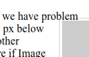
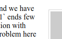
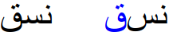
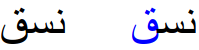
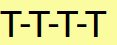
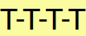
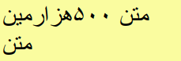

<style>
  .w-figures-2-up {
    display: flex;
    justify-content: space-around;
    align-items: flex-start;
    display: grid;
    gap: 1rem;
    grid-template-columns: repeat(auto-fit, minmax(20ch, 1fr));
  }
</style>

Scheduled to be released in Chrome 76, LayoutNG's multi-year efforts begin rolling out to the public from beta. While this article intends to cover the list of immediate effects, longer term goals exist which bring additional performance gains and advanced layout features.

#### LayoutNG
1. Provides **improved performance** isolation
1. **Better support** for scripts other than Latin
1. **Fixes** many issues around floats and margins
1. **Fixes** a large number of web compatibility issues


  Please note that LayoutNG will be **launched in stages**. In Chrome 76, LayoutNG is used for inline and block layout. Other layout primitives (such as table, flexbox, grid, and block fragmentation) will be replaced in subsequent releases.


<br>

## Developer Visible Changes
Although the user visible impact should be minimal, LayoutNG changes some behavior in very subtle ways, fixes hundreds of tests, and improves compatibility with other browsers. Despite our best efforts, it is likely that this will cause some sites and applications to render or behave slightly differently.

The performance characteristics are also quite different; although performance on a whole is similar or slightly better than before, certain use cases are likely to see performance improvements, while others are expected to regress somewhat, at least short-term.

<br>

### Floats
LayoutNG reimplements support for floating elements (`float: left;` and `float: right;`) fixing a number of correctness issues around placement of floats in relation to other content.

#### Superimposed Content
The legacy float implementation didn’t correctly account for margins when placing content around a floating element, resulting in the content partially or fully overlapping the float itself. The most common manifestation of this bug is when positioning images besides paragraphs of text where the avoidance logic fails to account for the height of a line ([#861540](https://crbug.com/861540)).

<div class="w-figures-2-up">
  <figure class="w-figure w-figure--center">
    
    <figcaption class="w-figcaption w-figcaption--center">
      <small>Fig 1a, Legacy Layout</small><br>
      Text overlaps the floating image to the right
    </figcaption>
  </figure>

  <figure class="w-figure w-figure--center">
    
    <figcaption class="w-figcaption w-figcaption--center">
      <small>Fig 1b, LayoutNG</small><br>
      Text is positioned beside the floating image to the right
    </figcaption>
  </figure>
</div>

The same problem may occur within a single line. The example below shows a block element with a negative margin following a floating element ([#895962](https://crbug.com/895962)). The text should not overlap with the float.

<div class="w-figures-2-up">
  <figure class="w-figure w-figure--center">
    
    <figcaption class="w-figcaption w-figcaption--center">
      <small>Fig 2a, Legacy Layout</small><br>
      Text overlaps the floating orange element
    </figcaption>
  </figure>

  <figure class="w-figure w-figure--center">
    
    <figcaption class="w-figcaption w-figcaption--center">
      <small>Fig 2b, LayoutNG</small><br>
      Text is positioned beside the floating orange element
    </figcaption>
  </figure>
</div>

#### Formatting Context Positioning
When an element forming a block formatting context is sized next to floats, Chromium would try size the block a fixed number of times before giving up. This resulted in unpredictable and unstable behavior and didn't match other implementations. In LayoutNG all floats are taken into account when sizing the block ([#548033](https://crbug.com/548033)).

Absolute/fixed positioning has been reimplemented and is more spec compliant than the old implementation. It also better matches the behavior in other browsers. The differences between the two are most visible in the areas where the old implementation did not follow the spec:

- **Multi-line Inline Containing Blocks** <br>If an abspos containing block spanned multiple lines, the legacy engine might incorrectly use only a subset of the lines to compute the containing block bounds.
- **Writing Modes** <br>The legacy engine had many problems placing out of flow elements to default position in vertical writing modes. See the next section for more details around improved writing mode support.

<br>

### RTL & Writing Modes
LayoutNG was designed from the ground up to support vertical writing modes and bi-directional content. This fixes numerous issues around both writing modes, right-to-left inlines, and orthogonal flows.

#### Bidirectional Text
LayoutNG supports the most up-to-date Unicode bidirectional algorithm defined by [The Unicode Standard](https://unicode.org/standard/standard.html). Not only does it fix various cases where rendering was not correct, it also includes missing features in the old engine such as paired bracket support ([#302469](https://crbug.com/302469)).

#### Orthogonal Flows
LayoutNG improves vertical flow layout correctness, for more correct positioning of absolute positioned objects, sizing of orthogonal flow boxes especially when percent is used, and so forth. Among the 1,258 tests in W3C test suites, **103 tests that failed in the old engine pass in LayoutNG.**

#### Intrinsic Sizing
Intrinsic sizes are now calculated correctly when a LayoutNG block contains children in an orthogonal writing mode.

<br>

### Text Layout & Line Breaking
The old layout engine in Chromium does text layout element by element and line by line. This has historically worked well but requires a lot of extra complexity to support complex scripts and to get good performance. It's also prone to inconsistencies in measurements which tend to manifest themselves as subtle differences in sizing of size-to-content containers and their content or unnecessary line breaks.

In LayoutNG, text layout is done on a paragraph level and is then split into lines. This allows for better performance, higher quality text rendering, and more consistent line breaking. The most notable differences here from a developer and user standpoint are detailed below.

#### Joining across Element Boundaries
In some scripts graphemes join with adjacent ones and changes presentation. In LayoutNG this works even if the graphemes are in different elements, allowing the joins to be preserved even if different styling is applied ([#6122](https://crbug.com/6122)).

The example below shows the rendering of the following HTML in legacy layout and LayoutNG respectively:

```html
<div>&#1606;&#1587;&#1602;</div>
<div>&#1606;&#1587;<span>&#1602;</span></div>
```

<div class="w-figures-2-up">
  <figure class="w-figure w-figure--center">
    
    <figcaption class="w-figcaption w-figcaption--center">
      <small>Fig 3a, Legacy Layout</small><br>
      Note how the form of the second letter changes
    </figcaption>
  </figure>

  <figure class="w-figure w-figure--center">
    
    <figcaption class="w-figcaption w-figcaption--center">
      <small>Fig 3b, LayoutNG</small><br>
      Note they're now identical
    </figcaption>
  </figure>
</div>

#### CJK Ligatures
Although Chromium already supports ligatures and enable them by default, there are some limitations. Ligatures involving multiple CJK codepoints are not supported in the legacy engine due to a rendering optimization. LayoutNG removes these restrictions and supports ligatures regardless of script.

The example below shows the rendering of three discretionary ligatures using the Adobe SourceHanSansJP font:

<div class="w-figures-2-up">
  <figure class="w-figure w-figure--center">
    
    <figcaption class="w-figcaption w-figcaption--center">
      <small>Fig 4a, Legacy layout</small><br>
      MHz correctly forms a ligature<br>
      but マンション and 10点 does not
    </figcaption>
  </figure>

  <figure class="w-figure w-figure--center">
    
    <figcaption class="w-figcaption w-figcaption--center">
      <small>Fig 4b, LayoutNG</small><br>
      All three groups form ligatures as expected
    </figcaption>
  </figure>
</div>

#### Size to Content
For elements that size to content (such as inline blocks) the current layout engine computes the size of the block first and then performs layout on the content. In some cases, such as when a font kerns aggressively, this may result in a mismatch between the size of the content and the block. In LayoutNG this failure mode has been eliminated as the block is sized based on the actual content.

The example below shows a yellow block sized to content. It uses the Lato font which uses kerning to adjust the spacing between T and -. The bounds of the yellow box should match the bounds of the text.

<div class="w-figures-2-up">
  <figure class="w-figure w-figure--center">
    
    <figcaption class="w-figcaption w-figcaption--center">
      <small>Fig 5a, Legacy Layout</small><br>
      Note the trailing whitespace after the last T
    </figcaption>
  </figure>

  <figure class="w-figure w-figure--center">
    
    <figcaption class="w-figcaption w-figcaption--center">
      <small>Fig 5b, LayoutNG</small><br>
      Note how the left and right edges of the box match the bounds of the text
    </figcaption>
  </figure>
</div>

#### Line Wrapping
Similar to the problem described above, if the content of a size-to-content block is larger (wider) than the block, this can cause the content to wrap unnecessarily. This is quite rare but sometimes happens for mixed directionality content.

<div class="w-figures-2-up">
  <figure class="w-figure w-figure--center">
    
    <figcaption class="w-figcaption w-figcaption--center">
      <small>Fig 6a, Legacy layout</small><br>
      Note the unnecessary line break and extra space on the right
    </figcaption>
  </figure>

  <figure class="w-figure w-figure--center">
    
    <figcaption class="w-figcaption w-figcaption--center">
      <small>Fig 6b, LayoutNG</small><br>
      Note how the left and right edges of the box match the bounds of the text
    </figcaption>
  </figure>
</div>

<br>

## Further Information
- [Documentation](https://chromium.googlesource.com/chromium/src/+/master/third_party/blink/renderer/core/layout/ng/README.md)
- [Design Document](https://docs.google.com/document/d/1uxbDh4uONFQOiGuiumlJBLGgO4KDWB8ZEkp7Rd47fw4/)
- [Master tracking bug](https://crbug.com/591099)

For more detailed information about the specific compatibility issues and bugs fixed by LayoutNG, please see the issues linked above or search the Chromium bug database for bugs marked [Fixed-In-LayoutNG](https://bugs.chromium.org/p/chromium/issues/list?can=1&q=label%3AFixed-In-LayoutNG).


  If you suspect that LayoutNG may have caused a web site to break, please [file a bug report](https://bugs.chromium.org/p/chromium/issues/entry?summary=%5BLayoutNG%5D+Enter+one-line+summary&labels=LayoutNG&components=Blink%3ELayout) and we'll investigate.

