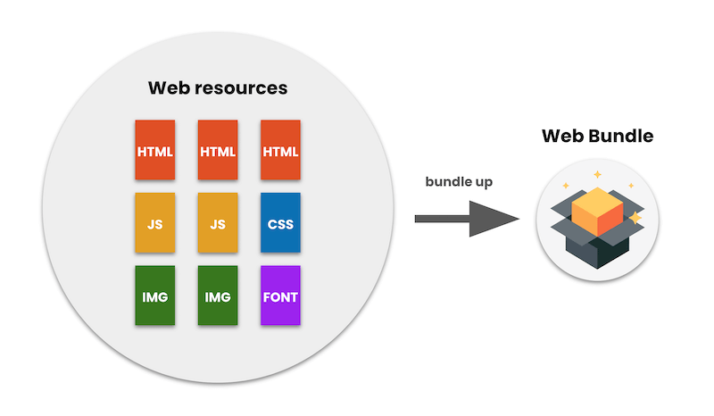
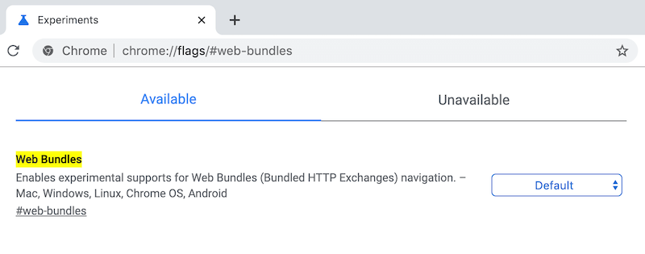

Bundling a website, and I mean a full website, in a file and making it shareable
opens up new use cases to the web. Imagine a world where you can create your own
content and distribute it in all sorts of ways without being restricted to the
network. Imagine sharing a web app or piece of web content with your friends via
Bluetooth or WiFi direct. Imagine carrying it in your own USB or even hosting it
in your own local network. The Web Bundles API is a bleeding edge proposal that
lets you do that.

## Introducing the Web Bundles API

A web bundle is a file format for encapsulating one or more HTTP resources in a
single file, and can include one or more of HTML files, JavaScript files,
images, and style sheets.

 Web bundles, more formally known as [Bundled HTTP
 Exchanges](https://wicg.github.io/webpackage/draft-yasskin-wpack-bundled-exchanges.html),
 are part of the [Web Packaging](https://goto.google.com/webpackaging-one-pager)
 proposal.

<figure class="w-figure  w-figure--center">
  
  <figcaption class="w-figcaption">
    A figure showing how web bundle bundle web resources.
  </figcaption>
</figure>

HTTP resources in a web bundle are indexed by request URLs, and can optionally
come with signatures that vouch for the resources. Signatures allow browsers to
understand and verify where each resource came from, and treats each as coming
from its true origin. This is similar to how Signed HTTP Exchanges are handled
by browsers. ([Signed HTTP
Exchanges](https://developers.google.com/web/updates/2018/11/signed-exchanges)
is a feature to sign a single HTTP resource.)


In this article I will walk through what a web bundle is and how you can use it
today. Let’s begin the bundle tour.


## Explaining web bundles

To be more precise than my earlier definition, a web bundle is a [CBOR
file](https://cbor.io/) with a `.wbn` extension (by convention) which packages
HTTP resources in to a binary format, and is served with the
`application/webbundle` MIME type. You can read more about this in the
[Top-level
structure](https://wicg.github.io/webpackage/draft-yasskin-wpack-bundled-exchanges.html#top-level)
section of the draft.

Some of its unique features are:

* Encapsulates multiple pages, enabling bundling of a complete website into a single file.
* JavaScript is executable (unlike MHTML).
* Uses [HTTP
  Variants](https://tools.ietf.org/id/draft-ietf-httpbis-variants-00.html) to do
  content negotiation. In other words, internationalization can be done by using
  the Accept-Language header even the bundle is used offline.
* Can be cryptographically signed by the publisher’s origin which allows the
  browser to load the bundle’s contents in the context of its origin.
* Loads nearly instantly when it’s served locally by the device.

These features open multiple scenarios. One common scenario is the ability to
build a self-contained web app that's easy to share and usable without an
internet connection.

Let’s say you are on an airplane from Tokyo to San Francisco with your friend.
You need to kill time for the nine hour flight but you don't like the in-flight
entertainment. Your friend is playing an interesting web game called
[Proxx](https://proxx.app/), and tells you that she downloaded the game as a web
bundle before boarding the plane. It works flawlessly offline. Before web
bundles, the story would end there and you would either have to take turns
playing the game on your friend’s device, or find something else to pass the
time. But with web bundles, here is what you could do.

1. Ask your friend to share the `.wbn` file of the game. For example the file
   could easily be shared peer to peer using a file sharing app. If
2. Open the `.wbn` file in a browser that supports web bundles.
3. Start playing the game on your own device and try to beat your friend’s high
   score.

Here is a video that explains this scenario.

<figure class="w-figure w-figure--fullbleed">
  <video controls autoplay loop muted class="w-screenshot">
    <source src="https://youtu.be/xAujz66la3Y">
  </video>
 <figcaption class="w-figcaption w-figcaption--fullbleed">
    A short movie of how web bundles work. Web Bundles - user-to-user sharing demo. Created by Kinuko Yasuda.
  </figcaption>
</figure>

As you can see, a web bundle can contain every resource, making it work offline
and load instantly.


  Currently Chrome 80 only supports unsigned bundles (i.e. web bundles without
  origin signatures), and simply bundling Proxx without signatures doesn't work
  well due to web worker cross-origin issues. We are working on fixing this. In
  the meantime, check out [Dealing with Common Problems in Unsigned
  Bundles](https://chromium.googlesource.com/chromium/src/+/refs/heads/master/content/browser/web_package/using_web_bundles.md#Dealing-with-Common-Problems-in-Unsigned-Bundles)
  for information on avoiding cross-origin issues.



## Building web bundles

The easiest way of bundling a website is using the [go/bundle CLI
](https://github.com/WICG/webpackage/tree/master/go/bundle)which is a reference
implementation of the web bundles specification. Since it's built with
[Golang](https://golang.org/) install it via `go get`.


```bash
$ go get -u github.com/WICG/webpackage/go/bundle/cmd/...
```


For this example, I'll bundleTodoMVC. I'll use [preact-todomvc](https://github.com/developit/preact-todomvc) to walk through the steps.


1. Clone the repository and build the web app to get ready to bundle the resources.

    ```bash
    $ git clone https://github.com/developit/preact-todomvc.git
    $ cd preact-todomvc
    $ npm i
    $ npm run build
    ```

2. Then use the `gen-bundle` command to build a `.wbn` file.

    ```bash
    $ gen-bundle -dir build -baseURL https://preact-todom.vc -primaryURL https://preact-todom.vc -o todomvc.wbn
    ```

Congratulations! TodoMVC is now a web bundle.

There are other options for bundling and more are coming. The go/bundle CLI
let’s you build a web bundle using a HAR file or from a custom list of resource
URLs. Visit the [GitHub
repo](https://github.com/WICG/webpackage/tree/master/go/bundle) to learn more
about go/bundle. We are also building a Node.js module for  your existing build
pipeline. It's still in a very early stage but you can [try it out
here](https://www.npmjs.com/package/wbn).


## Playing around with web bundles

You can open a web bundle using [Chrome
Canary](https://www.google.com/chrome/canary/) (version 80 or later) by flipping
on the `chrome://flags/#web-bundles` flag.

<figure class="w-figure  w-figure--center">
  
  <figcaption class="w-figcaption">
    A screenshot of the chrome flags settings
  </figcaption>
</figure>


Flip the flag to “Enabled”, relaunch Chrome, and then drag-and-drop the
`.wbn**`** file into Chrome on Desktop, or tap it in a file management app on
Android. Everything magically works.

alt="A movie of preact todomvc working offline using web bundles”



  Currently you can only navigate into a web bundle stored in a local file, but
  that's only a temporary restriction.



## Send us feedback

The Web Bundle API implementation in Chrome is experimental and incomplete. We
know that not everything is working and that it might fail or crash. That's why
it's behind an experimental flag. We believe the API is ready for your
explorations in Chrome. Feedback from web developers is crucial to the design of
new APIs, so please try it out and tell us what you think.


* Please send general feedback to
  [webpackage-dev@chromium.org](mailto:webpackage-dev@chromium.org).
* If you have feedback on the spec visit
  [https://github.com/WICG/webpackage/issues/new](https://github.com/WICG/webpackage/issues/new)
  to file a new spec issue, or email [wpack@ietf.org](mailto:wpack@ietf.org).
* If you find any issues in Chrome's behavior visit
  [https://crbug.com/new](https://crbug.com/new) to file a chromium bug.
* Any contributions to the spec discussion and tooling are also more than
  welcome.
  [https://github.com/WICG/webpackage](https://github.com/WICG/webpackage)

**Acknowledgements**

We would like to give a big shout-out to the wonderful Chrome engineering team,
[Kunihiko Sakamoto](https://github.com/irori), [Tsuyoshi
Horo](https://twitter.com/horo), [Takashi
Toyoshima](https://twitter.com/toyoshim), [Kinuko
Yasuda](https://twitter.com/kinu) and [Jeffrey
Yasskin](https://twitter.com/jyasskin) that worked hard contributing to the
spec, building the feature on Canary and reviewing this article. During the
standardization process [Dan York](http://danyork.me/) has helped navigate the
IETF discussion and also [Dave Cramer](https://twitter.com/dauwhe) has been a
great resource on what publishers actually need. We also want to thank [Jason
Miller](https://twitter.com/_developit) for the amazing preact-todomvc and his
restless effort on making the framework better.
