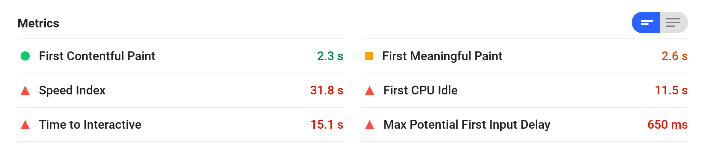
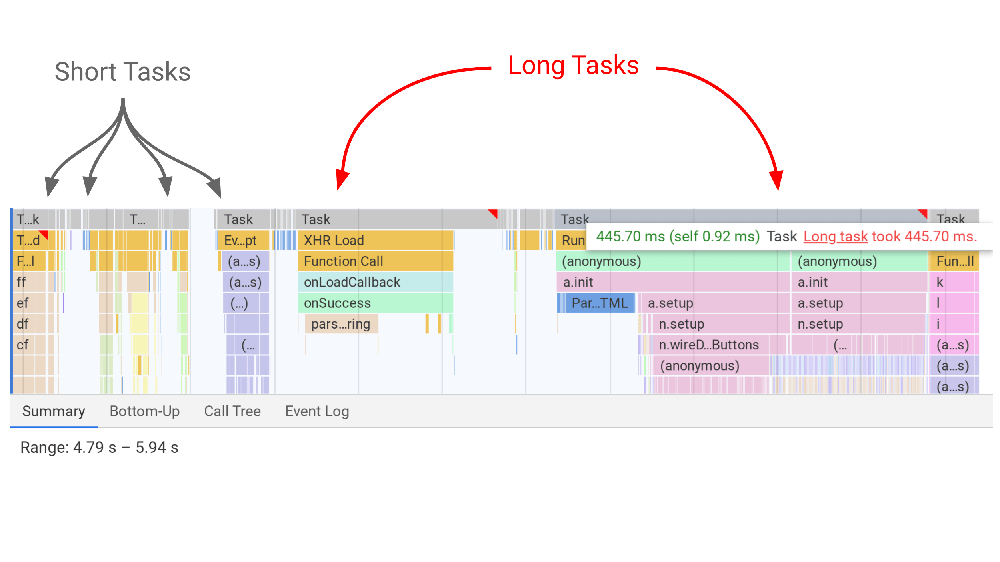

**tl;dr: Long Tasks can keep the main thread busy, delaying user interaction. Chrome DevTools can now visualize Long Tasks, making it easier to see tasks to optimize.**

If you use Lighthouse to audit your pages, you may be familiar with [Time to Interactive](/interactive), a metric representing when users can interact with your page and get a response. But did you know Long (JavaScript) Tasks can contribute heavily to a poor TTI?

## What are Long Tasks?

A [Long Task](https://developer.mozilla.org/en-US/docs/Web/API/Long_Tasks_API) is JavaScript code that monopolizes the main thread for extended periods of time, causing the UI to "freeze".

While a web page is loading, Long Tasks can tie up the main thread and make the page unresponsive to user input even if it looks ready. Clicks and taps often don't work because event listeners, click handlers etc have not yet been attached.

CPU-heavy Long Tasks occur due to complex work that takes longer than 50ms. Why 50ms? [The RAIL model](https://developers.google.com/web/fundamentals/performance/rail) suggests you process user input events in [50ms](https://developers.google.com/web/fundamentals/performance/rail#response) to ensure a visible response within 100ms. If you don't, the connection between action and reaction is broken.

## Are there Long Tasks in my page that could delay interactivity?

Until now, you've needed to manually look for "long yellow blocks" of script over 50ms long in [Chrome DevTools](https://developers.google.com/web/tools/chrome-devtools/) or use the [Long Tasks API](https://calendar.perfplanet.com/2017/tracking-cpu-with-long-tasks-api/) to figure out what tasks were delaying interactivity. This could be a little cumbersome.

To help ease your performance auditing workflow, [DevTools now visualizes Long Tasks](https://developers.google.com/web/updates/2019/03/devtools#longtasks). Tasks (shown in gray) have red flags if they are Long Tasks.

* Record a trace in the [Performance panel](https://developers.google.com/web/tools/chrome-devtools/evaluate-performance/) of loading up a web page.
* Look for a red flag in the main thread view. You should see tasks are now gray ("Task").
*  Hovering over a bar will let you know the duration of the task and if it was considered "long".

## What is causing my Long Tasks?

To discover what is causing a long task, select the gray **Task** bar. In the drawer beneath, select **Bottom-Up** and **Group by Activity**. This allows you to see what activities contributed the most (in total) to the task taking so long to complete. Below, it appears to be a costly set of DOM queries.

## What are common ways to optimize Long Tasks?

Large scripts are often a major cause of Long Tasks so consider [splitting them up](/reduce-javascript-payloads-with-code-splitting). Also keep an eye on third-party scripts; their Long Tasks can delay primary content from getting interactive.

Break all your work into small chunks (that run in < 50ms) and run these chunks at the right place and time; the right place may even be off the main thread, in a worker. Phil Walton's [Idle Until Urgent](https://philipwalton.com/articles/idle-until-urgent/) is a good read on this topic.

Keep your pages responsive. Minimizing Long Tasks is a great way to ensure your users have a delightful experience when they visit your site. For more on Long Tasks, check out [User-centric Performance Metrics](https://developers.google.com/web/fundamentals/performance/user-centric-performance-metrics#tracking_long_tasks).
