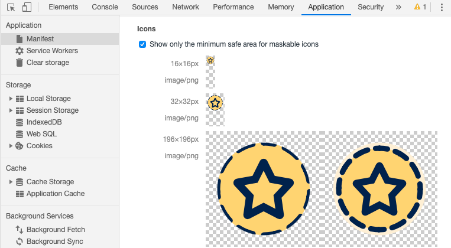
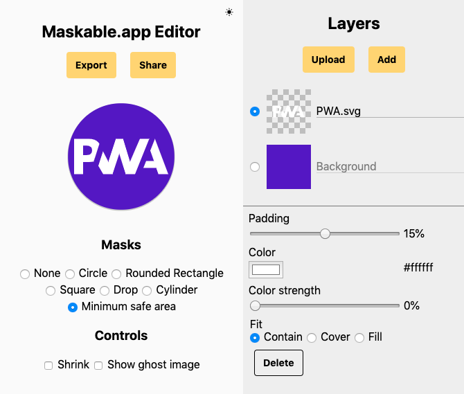

## What are maskable icons? {: #what }

<figure class="w-figure w-figure--inline-right">
  <video class="w-screenshot" autoplay loop muted playsinline aria-label="Different masks applied to a maskable icon">
    <source src="fugu-mask.webm" type="video/webm; codecs=vp8">
    <source src="fugu-mask.mp4" type="video/mp4; codecs=h264">
  </video>
</figure>

If you've installed a Progressive Web App on a recent Android phone, you might notice the icon shows up with a white background. Android Oreo introduced adaptive icons, which display app icons in a variety of shapes across different device models. Icons that don't follow this new format are given white backgrounds.

Maskable icons are a new icon format that let your Progressive Web App use adaptive icons. If you supply a maskable icon, your icon can fill up the entire shape and look great on all Android devices. Firefox and Chrome have recently added support for this new format, and you can adopt it in your apps.

## Are my current icons ready?

Since maskable icons need to support a variety of shapes, you supply an opaque image with some padding that the browser can later crop into the desired shape and size. It's best not to rely on any particular shape, since it can vary by browser and per platform.

Luckily, there's a well-defined and [standardized](https://w3c.github.io/manifest/#icon-masks) "minimum safe zone" that all platforms respect. The important parts of your icon, such as your logo, should be within a circular area in the center of the icon with a radius equal to 40% of the icon width. The outer 10% edge may be cropped.

You can check which parts of your icons land within the safe zone with Chrome DevTools. With your Progressive Web App open, launch DevTools and navigate to the "Application" panel. In the "Icons" section, you can choose to "Show only the minimum safe area for maskable icons". Your icons will be trimmed so that only the safe area is visible. If your logo is visible within this area, you're good to go.

<figure class="w-figure">
  
  <figcaption class="w-figcaption">
    The Applications panel
  </figcaption>
</figure>

If you want to preview your maskable icon in other shapes it may appear in on Android, I've created a tool called [Maskable.app](https://maskable.app/). Open an icon and Maskable.app will let you try out various shapes and sizes, and you can share the preview with others on your team.


## How do I adopt maskable icons?

If you want to create a maskable icon based off your existing icon, you can use the [Maskable.app Editor](https://maskable.app/editor). Upload your icon, adjust the color and size, then export the image.

<figure class="w-figure">
  
  <figcaption class="w-figcaption">
    Creating icons in Maskable.app Editor
  </figcaption>
</figure>

Once you've created a maskable icon image and tested it out in DevTools, you'll need to update your [Web App Manifest](https://developers.google.com/web/fundamentals/web-app-manifest) to point to the new assets. The Web App Manifest provides information about your web app in a JSON file, and includes an [`icons` array](https://developers.google.com/web/fundamentals/web-app-manifest#icons).

With the inclusion of maskable icons, a new property value has been added for image resources listed in a Web App Manifest. The `purpose` field tells the browser how your icon should be used. By default, icons will have a purpose of `"any"`. These icons will be resized on top of a white background on Android.

Maskable icons should use a different purpose: `"maskable"`. This indicates that an image is meant to be used with icon masks, giving you more control over the result. This way, your icons will not have a white background. You can also specify multiple space-separated purposes (for example, `"any maskable"`), if you want your maskable icon to be used without a mask on other devices.

```json
{
  ...
  "icons": [
    ...
    {
      "src": "path/to/maskable_icon.png",
      "sizes": "196x196",
      "type": "image/png",
      "purpose": "any maskable" // <-- New property value `"maskable"`
    }
  ]
  ...
}
```

With this, you can go forth and create your own maskable icons, making sure you app looks great edge-to-edge (and for what it's worth, circle to circle, oval to oval 😄).
