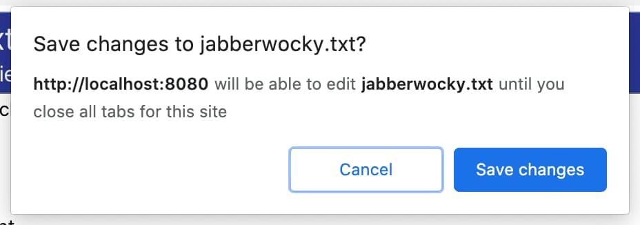


  The Native File System API is available as an origin trial in Chrome, and is
  part of [capabilities project](/fugu-status/). This post will be updated as
  the implementation progresses. See the [what's new](#whats-new) section for
  the latest updates.


## What is the Native File System API? {: #what-is-it }

The [Native File System API][spec]  (formerly known as the Writeable Files API)
enables developers to build powerful web apps
that interact with files on the user's local device, like IDEs, photo and video
editors, text editors, and more. After a user grants a web app access, this
API allows web apps to read or save changes directly to files and folders
on the user's device. Beyond reading and writing files, the Native File System
API provides the ability to open a directory and enumerate its contents.

If you've worked with reading and writing files before, much of what I'm about
to share will be familliar to you. I encourage you to read anyway because not
all systems are alike.


  We've put a lot of thought into the design and implementation of the Native
  File System API to ensure that people can easily manage their files. See the
  [security and permissions](#security-considerations) section
  for more information.


## Current status {: #status }

<div class="w-table-wrapper">

| Step                                       | Status                       |
| ------------------------------------------ | ---------------------------- |
| 1. Create explainer                        | [Complete][explainer]        |
| 2. Create initial draft of specification   | [In progress][spec]          |
| 3. Gather feedback & iterate on design     | [In progress][spec]          |
| 4. Origin trial                            | [In progress](#origin-trial)<br>First: Chrome 78-82<br>Second: Chrome 83-85 |
| 5. Launch                                  | Not started                  |

</div>

## Using the Native File System API {: #how-to-use }

To show off the true power and usefulness of the Native File System APIs,
I wrote a single file [text editor][text-editor]. It lets you open a text
file, edit it, save the changes back to disk, or start a new file and save
the changes to disk. It's nothing fancy, but provides enough to help you
understand the concepts.

### Try it

See the Native File System API in action in the
[text editor](https://googlechromelabs.github.io/text-editor/) demo.

### Enabling via chrome://flags

If you want to experiment with the Native File System API locally, enable
the `#native-file-system-api` flag in `chrome://flags`.

### Enabling support during the origin trial phase {: #origin-trial }

Starting in Chrome 83, a **new** origin trial has started for the Native File
System API for all desktop platforms.


If you had an origin trial token for the [first origin trial](https://developers.chrome.com/origintrials/#/view_trial/3868592079911256065)
(that ran from Chrome 78 to Chrome 82), you will need to obtain a new origin
trial token.






### Read a file from the local file system {: #read-file }

The first use case I wanted to tackle was to ask the user to choose a file,
then open and read that file from disk.

#### Ask the user to pick a file to read

The entry point to the Native File System API is
[`window.chooseFileSystemEntries()`][choose-fs-entries]. When called, it shows
a file picker dialog box, and prompts the user to select a file. After selecting
a file, the API returns a handle to the file. An optional options parameter
lets you influence the behavior of the file picker, for example, by allowing the
user to select multiple files, or directories, or different file types.
Without any options specified, the file picker allows the user to select a
single file. This is perfect for our text editor.

Like many other powerful APIs, calling `chooseFileSystemEntries()` must be
done in a [secure context][secure-contexts], and must be called from within
a user gesture.

```js/2
let fileHandle;
butOpenFile.addEventListener('click', async (e) => {
  fileHandle = await window.chooseFileSystemEntries();
  // Do something with the file handle
});
```

Once the user selects a file, `chooseFileSystemEntries()` returns a handle,
in this case a [`FileSystemFileHandle`][fs-file-handle] that contains the
properties and methods needed to interact with the file.

It's helpful to keep a reference to the file handle around so that it can be
used later. It'll be needed to save changes back to the file, or to perform any
other file operations.

#### Read a file from the file system

Now that you have a handle to a file, you can get the file's properties, or
access the file itself. For now, let's simply read its contents. Calling
`handle.getFile()` returns a [`File`][file-api-spec] object, which contains
a blob. To get the data from the blob, call one of [its
methods][blob-methods] (`slice()`, `stream()`, `text()`, `arrayBuffer()`).

```js
const file = await fileHandle.getFile();
const contents = await file.text();
```

The `File` object returned by `FileSystemFileHandle.getFile()` is only
readable as long as the underlying file on disk hasn't changed. If the file
on disk is modified the `File` object becomes unreadable, and you'll need to
call `getFile()` again to get a new `File` object to read the changed data.

#### Putting it all together

When users click the Open button, the browser
shows a file picker. Once they've selected a file, the app reads the
contents and puts them into a `<textarea>`.

```js/3-4
let fileHandle;
butOpenFile.addEventListener('click', async (e) => {
  fileHandle = await window.chooseFileSystemEntries();
  const file = await fileHandle.getFile();
  const contents = await file.text();
  textArea.value = contents;
});
```

### Write the file to the local file system {: #write-file }

In the text editor, there are two ways to save a file: Save, and Save As.
Save simply writes the changes back to the original file using the file
handle we got earlier. But Save As creates a new file, and thus requires a
new file handle.

#### Create a new file

Passing `{type: 'save-file'}` to `chooseFileSystemEntries()` will show the
file picker in "save" mode, allowing the user to pick a new file they want
to use for saving. For the text editor, I also wanted it to automatically
add a `.txt` extension, so I provided some additional parameters.

```js
async function getNewFileHandle() {
  const opts = {
    type: 'save-file',
    accepts: [{
      description: 'Text file',
      extensions: ['txt'],
      mimeTypes: ['text/plain'],
    }],
  };
  const handle = await window.chooseFileSystemEntries(opts);
  return handle;
}
```

#### Save changes to disk {: #save-to-disk }

You can find all the code for saving changes to a file in my [text
editor][text-editor] demo on [GitHub][text-editor-source]. The core file system
interactions are in [`fs-helpers.js`][text-editor-fs-helper]. At its simpliest,
the process looks like the code below. I'll walk through each step and explain
it.

```js
async function writeFile(fileHandle, contents) {
  // Create a FileSystemWritableFileStream to write to.
  const writable = await fileHandle.createWritable();
  // Write the contents of the file to the stream.
  await writable.write(contents);
  // Close the file and write the contents to disk.
  await writable.close();
}
```

Writing data to disk uses a [`FileSystemWritableFileStream`][fs-writablestream],
essentially a [`WritableStream`][writable-stream]. Create the stream by calling
`createWritable()` on the file handle object. When `createWritable()` is
called, Chrome first checks if the user has granted write permission to the
file. If permission to write hasn't been granted, the browser will prompt
the user for permission. If permission isn't granted, `createWritable()`
will throw a `DOMException`, and the app will not be able to write to the
file. In the text editor, these `DOMException`s are handled in the
[`saveFile()`][text-editor-app-js] method.

The `write()` method takes a string, which is what we want for a text editor.
But it can also take a [BufferSource][buffersource], or a [Blob][blob]. For
example, you can pipe a stream directly to it:

```js/4,6
async function writeURLToFile(fileHandle, url) {
  // Create a FileSystemWritableFileStream to write to.
  const writable = await fileHandle.createWritable();
  // Make an HTTP request for the contents.
  const response = await fetch(url);
  // Stream the response into the file.
  await response.body.pipeTo(writable);
  // pipeTo() closes the destination pipe by default, no need to close it.
}
```

You can also [`seek()`][spec-seek], or [`truncate()`][spec-truncate] within the
stream to update the file at a specific position, or resize the file.


Changes are **not** written to disk until the stream is closed, either by
calling `close()` or if the stream is automatically closed by the pipe.





Saving changes to disk in Chrome 82 and earlier

Support for writable streams was added in Chrome 83, and the previous
method for writing to disk was removed. It is temporarily documented
below until Chrome 83 is available in stable.



Support for writable streams was added in Chrome 83, and the previous
method for writing to disk was removed. It is temporarily documented
below until Chrome 83 is available in stable.

```js
async function writeFile(fileHandle, contents) {
  // Create a writer (request permission if necessary).
  const writer = await fileHandle.createWriter();
  // Write the full length of the contents
  await writer.write(0, contents);
  // Close the file and write the contents to disk
  await writer.close();
}
```

To write data to disk, I needed a [`FileSystemWriter`][fs-writer]. Create one by
calling `createWriter()` on the file handle object. When `createWriter()` is
called, Chrome first checks if the user has granted write permission to the file.
If permission to write hasn't been granted, the browser will prompt the user for
permission. If permission isn't granted, `createWriter()` will throw a
`DOMException`, and the app will not be able to write to the file. In the text
editor, these `DOMException`s are handled in the [`saveFile()`][text-editor-app-js]
method.

Call `FileSystemWriter.write()` to write your contents.  The `write()` method
takes a string, which is what we want for a text editor. But it can also take a
[BufferSource][buffersource], or a [Blob][blob]. Finally, finish writing by
calling `FileSystemWriter.close()`.



### Storing file handles in IndexedDB

Starting in Chrome 83, file handles are serializable, which means that you
can save a file handle to IndexedDB, or `postMessage` them between the same
top-level origin.

Saving file handles to IndexedDB means that you can store state, or remember
which files a user was working on. This makes it possible to keep a list of
recently opened or edited files, offer to re-open the last file when the app
is opened, et cetera. In the text editor, I store a list of the 5 most recent
files the user has opened, making it easy to access those files again.

Since permissions are not persisted between sessions, you should verify
whether the user has granted permission to the file using
`queryPermission()`. If they haven't, use `requestPermission()` to
request permission.

In the text editor, I created a `verifyPermission()` method that checks
if the user has already granted permission, and if required makes the request.

```js/6,10
async function verifyPermission(fileHandle, withWrite) {
  const opts = {};
  if (withWrite) {
    opts.writable = true;
  }
  // Check if we already have permission, if so, return true.
  if (await fileHandle.queryPermission(opts) === 'granted') {
    return true;
  }
  // Request permission, if the user grants permission, return true.
  if (await fileHandle.requestPermission(opts) === 'granted') {
    return true;
  }
  // The user did nt grant permission, return false.
  return false;
}
```

By requesting write permission with the read request, I reduced
the number of permission prompts, the user sees one prompt when opening
the file, and grants permission to both read and write to it.

### Open a directory and enumerate its contents

To enumerate all files in a directory, call `chooseFileSystemEntries()`
with the `type` option set to `'open-directory'`. The user selects a directory
in a picker, after which a [`FileSystemDirectoryHandle`][fs-dir-handle]
is returned, which lets you enumerate and access the directory's files.

```js
const butDir = document.getElementById('butDirectory');
butDir.addEventListener('click', async (e) => {
  const opts = {type: 'open-directory'};
  const handle = await window.chooseFileSystemEntries(opts);
  const entries = await handle.getEntries();
  for await (const entry of entries) {
    const kind = entry.isFile ? 'File' : 'Directory';
    console.log(kind, entry.name);
  }
});
```

## What's new/changed? {: #whats-new }

Chrome 83

* Adds support for [writable streams](#save-to-disk), and removes the previous
  method for writing to disk (`FileSystemWriter`).
* Allows serlializing and storing file handles in IndexedDB, or sending via
  `postMessage()` to other windows or workers within the same origin. Note that
  permissions are not retained between browser sessions. For example, when a
  browser tab is re-opened, and a file handle is obtained from IndexedDB, the
  user will need to grant permission to read and write to the file again.
* Adds support for [`isSameEntry()`][spec-issameentry], which returns `true`
  if two entries represent the same file or directory.
* Updates usage indicators to indicate whether the user has granted the domain
  permission to files, including a new read-only indicator.
* Adds support for [`resolve()`][spec-resolve], which will return the
  relative path from one entry to another. This is especially helpful for multi-file
  editors where you might want to highlight the parent directory of the file
  being edited.
* When permission to read or write to a file is granted, the permission is
  shared among all same-origin tabs, aligning with other web platform APIs.
* Changes the `type` passed to `chooseFileSystemEntries` to be dash-separated as
  opposed to camelCase.


  Since the API is not compatible with all browsers yet,
  we provide a library called
  [browser-nativefs](https://github.com/GoogleChromeLabs/browser-nativefs)
  that uses the new API wherever it is available, but falls back to legacy
  approaches when it is not.


## Security and permissions {: #security-considerations }

The Chrome team has designed and implemented the Native File System API using
the core principles defined in
[Controlling Access to Powerful Web Platform Features][powerful-apis],
including user control and transparency, and user ergonomics.

### Opening a file or saving a new file

<figure class="w-figure w-figure--inline-right">
  <a href="fs-open.jpg">
    
  </a>
  <figcaption class="w-figcaption">
    A file picker used to open an existing file for reading.
  </figcaption>
</figure>

When opening a file, the user provides permission to read a file or
directory via the file picker. The open file picker can only be shown via
a user gesture when served from a [secure context][secure-contexts]. If
users change their minds, they can cancel the selection in the file
picker and the site does not get access to anything. This is the same
behavior as that of the `<input type="file">` element.

<div class="w-clearfix"></div>

<figure class="w-figure w-figure--inline-left">
  <a href="fs-save.jpg">
    
  </a>
  <figcaption class="w-figcaption">
    A file picker used to save a file to disk.
  </figcaption>
</figure>

Similarly, when a web app wants to save a new file, the browser will show
the save file picker, allowing the user to specify the name and location
of the new file. Since they are saving a new file to the device (versus
overwriting an existing file), the file picker grants the app permission
to write to the file.

<div class="w-clearfix"></div>

#### Restricted folders

To help protect users and their data, the browser may limit the user's
ability to  save to certain folders, for example, core operating system
folders like Windows, the macOS Library folders, etc. When this happens,
the browser will show a modal prompt and ask the user to choose a
different folder.

### Modifying an existing file or directory

A web app cannot modify a file on disk without getting explicit permission
from the user.

#### Permission prompt

<figure class="w-figure w-figure--inline-right">
  <a href="fs-save-permission.jpg">
    
  </a>
  <figcaption class="w-figcaption">
    Prompt shown to users before the browser is granted write
    permission on an existing file.
  </figcaption>
</figure>

If a person wants to save changes to a file that they previously granted
read access to, the browser will show a modal permission prompt, requesting
permission for the site to write changes to disk. The permission request
can only be triggered by a user gesture, for example, by clicking a "Save"
button.

Alternatively, a web app that edits multiple files, like an IDE, can
also ask for permission to save changes at the time of opening.

If the user chooses *Cancel*, and does not grant write access, the web
app cannot save changes to the local file. It should provide an alternative
method to allow the user to save their data, for example by providing a way to
["download" the file][download-file], saving data to the cloud, etc.

<div class="w-clearfix"></div>

### Transparency

<figure class="w-figure w-figure--inline-right">
  <a href="fs-save-icon.jpg">
    
  </a>
  <figcaption class="w-figcaption">
    Omnibox icon indicating the user has granted the website permission to
    save to a local file.
  </figcaption>
</figure>

Once a user has granted permission to a web app to save a local file,
Chrome will show an icon in the omnibox. Clicking on the omnibox icon
opens a popover showing the list of files the user has given access to.
The user can easily revoke that access if they choose.

<div class="w-clearfix"></div>

### Permission persistence

The web app can continue to save changes to the file without prompting until
all tabs for that origin are closed. Once a tab is closed, the site loses all
access. The next time the user uses the web app, they will be re-prompted
for access to the files.

## Feedback {: #feedback }

We want to hear about your experiences with the Native File System API.

### Tell us about the API design {: .hide-from-toc }

Is there something about the API that doesn't work like you expected? Or
are there missing methods or properties that you need to implement your
idea? Have a question or comment on the security model?

* File a spec issue on the [WICG Native File System GitHub repo][spec-issues],
  or add your thoughts to an existing issue.

### Problem with the implementation? {: .hide-from-toc }

Did you find a bug with Chrome's implementation? Or is the implementation
different from the spec?

* File a bug at [https://new.crbug.com][new-bug]. Be sure to include as
  much detail as you can, simple instructions for reproducing, and set
  *Components* to `Blink>Storage>FileSystem`. [Glitch](https://glitch.com)
  works great for sharing quick and easy repros.

### Planning to use the API? {: .hide-from-toc }

Planning to use the Native File System API on your site? Your public support
helps us to prioritize features, and shows other browser vendors how
critical it is to support them.

* Share how you plan to use it on the [WICG Discourse thread][wicg-discourse]
* Send a Tweet to [@ChromiumDev][cr-dev-twitter] with `#nativefs` and
  let us know where and how you're using it.

## Helpful links {: #helpful }

* [Public explainer][explainer]
* [Native File System specification][spec] & [File specification][file-api-spec]
* [Tracking bug][cr-bug]
* [ChromeStatus.com entry][cr-status]
* Request an [origin trial token]({{origin_trial.url}})
* [Native File System API - Chromium Security Model][nfs-cr-sec-model]
* Blink Component: `Blink>Storage>FileSystem`

[spec]: https://wicg.github.io/native-file-system/
[cr-bug]: https://crbug.com/853326
[cr-status]: https://www.chromestatus.com/feature/6284708426022912
[explainer]: https://github.com/WICG/native-file-system/blob/master/EXPLAINER.md
[spec-security]: https://wicg.github.io/native-file-system/#privacy-considerations
[new-bug]: https://bugs.chromium.org/p/chromium/issues/entry?components=Blink%3EStorage%3EFileSystem
[nfs-cr-sec-model]: https://docs.google.com/document/d/1NJFd-EWdUlQ7wVzjqcgXewqC5nzv_qII4OvlDtK6SE8/edit
[wicg-discourse]: https://discourse.wicg.io/t/writable-file-api/1433
[file-api-spec]: https://w3c.github.io/FileAPI/
[blob-methods]: https://developer.mozilla.org/en-US/docs/Web/API/Blob
[choose-fs-entries]: https://wicg.github.io/native-file-system/#api-choosefilesystementries
[fs-writer]: https://wicg.github.io/native-file-system/#filesystemwriter
[blob]: https://developer.mozilla.org/en-US/docs/Web/API/Blob
[buffersource]: https://developer.mozilla.org/en-US/docs/Web/API/BufferSource
[fs-file-handle]: https://wicg.github.io/native-file-system/#api-filesystemfilehandle
[fs-dir-handle]: https://wicg.github.io/native-file-system/#api-filesystemdirectoryhandle
[powerful-apis]: https://chromium.googlesource.com/chromium/src/+/lkgr/docs/security/permissions-for-powerful-web-platform-features.md
[ot-guide]: https://github.com/GoogleChrome/OriginTrials/blob/gh-pages/developer-guide.md
[spec-issues]: https://github.com/wicg/native-file-system/issues/
[api-surface]: https://docs.google.com/document/d/11rcS0FdwM8w-s2esacEQxFfp3g2AAI9uD7drH8ARKPA/edit#
[secure-contexts]: https://w3c.github.io/webappsec-secure-contexts/
[writablestream]: https://streams.spec.whatwg.org/#ws-class
[text-editor]: https://googlechromelabs.github.io/text-editor/
[text-editor-source]: https://github.com/GoogleChromeLabs/text-editor/
[text-editor-fs-helper]: https://github.com/GoogleChromeLabs/text-editor/blob/master/src/inline-scripts/fs-helpers.js
[text-editor-app-js]: https://github.com/GoogleChromeLabs/text-editor/blob/master/src/inline-scripts/app.js
[download-file]: https://developers.google.com/web/updates/2011/08/Downloading-resources-in-HTML5-a-download
[cr-dev-twitter]: https://twitter.com/chromiumdev
[fs-writablestream]: https://wicg.github.io/native-file-system/#api-filesystemwritablefilestream
[writable-stream]: https://developer.mozilla.org/en-US/docs/Web/API/WritableStream
[spec-resolve]: https://wicg.github.io/native-file-system/#api-filesystemdirectoryhandle-resolve
[spec-issameentry]: https://wicg.github.io/native-file-system/#api-filesystemhandle-issameentry
[spec-seek]: https://wicg.github.io/native-file-system/#api-filesystemwritablefilestream-seek
[spec-truncate]: https://wicg.github.io/native-file-system/#api-filesystemwritablefilestream-truncate
