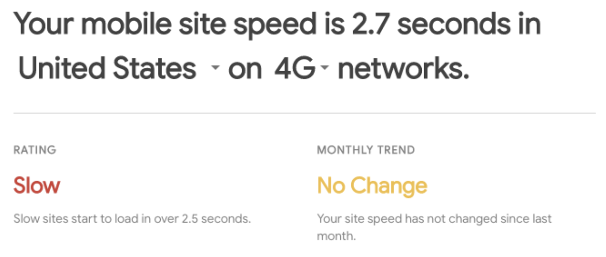
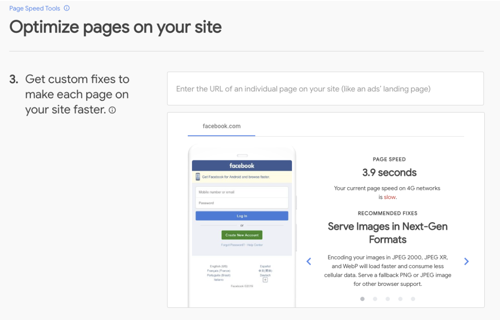
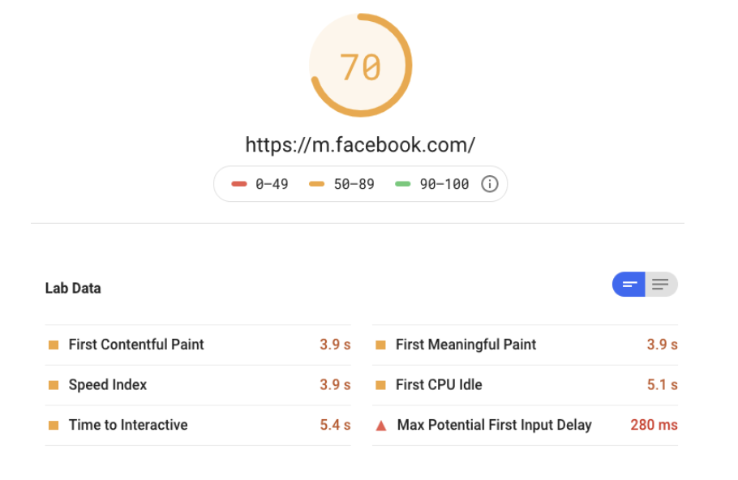
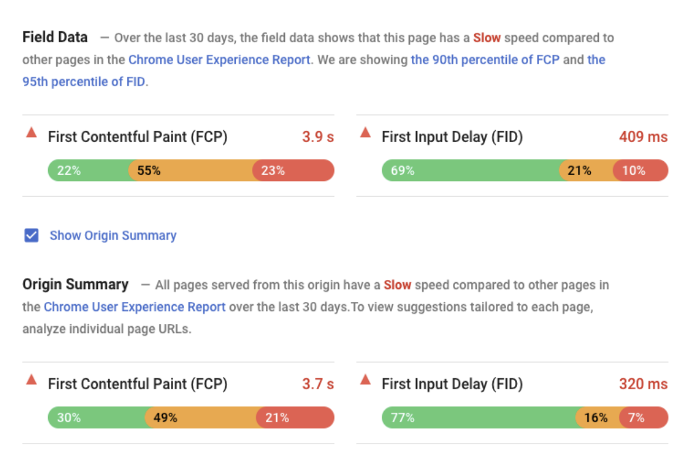
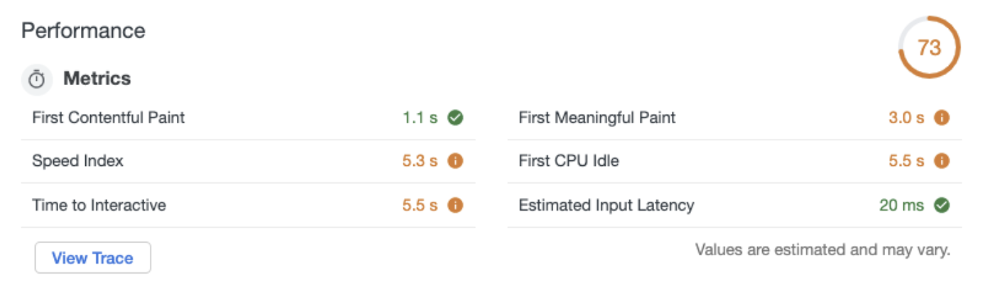

[Load is not a single moment in time](https://developers.google.com/web/fundamentals/performance/user-centric-performance-metrics) — it's an experience that no one metric can fully capture. There are multiple moments during the load experience that can affect whether a user perceives it as "fast", and if you just focus on one you might miss bad experiences that happen during the rest of the time. **This is why we generally use multiple metrics blended together to create our performance scores;** but different tools use different metrics and different weighted blends. This can be frustrating when you're looking for a source of truth about how fast your website is.

This post serves to explain the reasons that there are differences in performance scores between three Google tools: [Test My Site (TMS)](https://www.thinkwithgoogle.com/intl/en-gb/feature/testmysite), [PageSpeed Insights (PSI)](https://developers.google.com/speed/pagespeed/insights/), and [Lighthouse](https://developers.google.com/web/tools/lighthouse/). This document does **not** detail other differences in the tools, such as server run locations, network throttling presets, score variance between runs, etc.

### Terminology

Various terms about speed/performance are referenced in our tools. We want to start off with some clarification of how these terms are used.

- **Page speed** refers to the speed of an individual page on your site (URL level).
- **Site speed** refers to the speed of all of the pages on your site (origin level).

It is important to note that "performance" or "speed" is not to be defined by a single metric (i.e. [First Contentful Paint (FCP)](/first-contentful-paint/), [Time to Interactive (TTI)](/interactive/), etc.). This is motivated by several considerations, including:
- As mentioned in the introduction, 'page load is not a single moment in time—it's an experience that no one metric can fully capture' [source](https://developers.google.com/web/fundamentals/performance/user-centric-performance-metrics)
- Similarly, no single metric in isolation is able to give a meaningful indication of the health of the web (critical for benchmarking).
- Depending on which metric is chosen, a very different picture of page speed is presented (each requiring different optimizations to improve).

### Performance Scores within Tools

The performance score (top level gauge, 1-100 score) in PSI and Lighthouse is calculated from a weighted blend of multiple metrics to summarize a website's/web app's speed. This [weighted blend](https://docs.google.com/spreadsheets/d/1sH_T4G_RZAg4CpcV1bT-tmUegBdBpCOOwsdzqtWnO4U/edit#gid=0) of metrics that together constitute the performance score in both PSI and LH (as of May 2019, [LH v5.0](https://github.com/GoogleChrome/lighthouse/releases)) is as follows:
- 3X - First Contentful Paint (FCP)
- 1X - First Meaningful Paint (FMP)
- 2X - First CPU Idle (FCPUI)
- 5X - Time to Interactive (TTI)
- 4X - Speed index (SI)
- 0X - Max Potential First Input Delay (MPFID)


To learn more see the _[Lighthouse variance 1-pager.](https://developers.google.com/web/fundamentals/performance/user-centric-performance-metrics)_


TMS uses only FCP (from both Lighthouse and from the CrUX) to provide both site and page speed scores.

  <table>
    <thead>
      <tr>
        <th>Tool Name</th>
        <th>Lab / Field Tool</th>
        <th>Lab Metrics*</th>
        <th>Field Metrics*</th>
      </tr>
    </thead>
    <tbody>
      <tr>
        <td><a href="https://www.thinkwithgoogle.com/intl/en-gb/feature/testmysite">Test My Site</a></td>
        <td>Lab & Field</td>
        <td>FCP**</td>
        <td>FCP**</td>
      </tr>
      <tr>
        <td><a href="https://developers.google.com/speed/pagespeed/insights/">PageSpeed Insights</a></td>
        <td>Lab & Field</td>
        <td>FCP, FMP, FCPUI, TTI, SI</td>
        <td>FCP, FID</td>
      </tr>
      <tr>
        <td><a href="https://developers.google.com/web/tools/lighthouse/">Lighthouse</a></td>
        <td>Lab</td>
        <td>FCP, FMP, FCPUI, TTI, SI</td>
        <td>---</td>
      </tr>
    </tbody>
    <caption>Performance metrics considered in score (by tool).</caption>
  </table>
   
  <small>* other metrics might be measured by the tools, but they aren’t included in performance/speed score calculations **TMS uses FID as a tiebreaker in cases where FCP between compared sites is the same (but FCP is the lead metric)</small>

## Tool Sections: Breakdown

### Test My Site (TMS)
TMS is a ‘Think with Google’ tool that allows you to compare your FCP to that of your competitors and estimate the monetary value of improving your site’s performance.

#### Mobile Site Speed: Field Data, FCP Only, Site Level
The first part of the report, the mobile site speed seconds figure === First Contentful Paint (FCP) of the origin from CrUX.

Site speed is the speed of **all the pages** that make up your site.

<figure class="w-figure w-figure--fullbleed">
  
  <figcaption class="w-figcaption w-figcaption--fullbleed">
    Mobile Site Speed (Field Data, FCP Only, Site Level)
  </figcaption>
</figure>

#### Site Speed Tools: Field Data, FCP Only, Site Level
In the second part of the report, the mobile site speed seconds figure === First Contentful Paint (FCP) of the origin from CrUX. 

<figure class="w-figure w-figure--fullbleed">
  
  <figcaption class="w-figcaption w-figcaption--fullbleed">
    Site Speed Tools (Field Data, FCP Only, Site Level)
  </figcaption>
</figure>

#### Page Speed Tools: Lab Data, FCP Only, URL Level
The third part of the report, the page speed seconds figure === First Contentful Paint (FCP) of the page (not the site) from Lighthouse. 

The page speed tool calculates the speed of <b>individual pages</b> on your site.

<figure class="w-figure w-figure--fullbleed">
  
  <figcaption class="w-figcaption w-figcaption--fullbleed">
    Page Speed Tools (Lab Data, FCP Only, URL Level)
  </figcaption>
</figure>

FAQs for TMS can be found [here](https://www.thinkwithgoogle.com/feature/testmysite/faq).

### PageSpeed Insights (PSI)

PSI is powered by Lighthouse and includes data from the Chrome User Experience Report (CrUX). It runs on Google Servers, and the high level performance score is === the Lighthouse performance score. The tool allows for in-depth performance analysis of a page during load.

#### PSI Performance Score: Lab Data, Blended Score (5 metrics), URL Level

Here we see the top level performance gauge shown in PSI. This score is 0-100 and it is a weighted blend of the lab metrics that are measured by Lighthouse. 

The high level performance score is the same as it is in Lighthouse, calculated from a weighted blend of 6 lab performance metrics. Information about thresholds can be found [here](https://developers.google.com/web/tools/lighthouse/v3/scoring).

<figure class="w-figure w-figure--fullbleed">
  
  <figcaption class="w-figcaption w-figcaption--fullbleed">
    PSI Performance Score (Lab Data, Blended Metrics, URL Level)
  </figcaption>
</figure>

#### PSI Field Data: Field Data, FCP & FID, URL & Origin Level

The field data shown in PSI is taken from the [Chrome User Experience Report (CrUX)](https://developers.google.com/web/tools/chrome-user-experience-report/), with FCP and FID being shown for the page that was run, and - if available - for the origin as well. By focusing on 90th and 95th percentile values for our metrics, this ensures that pages meet a minimum standard of performance under the most difficult device and network conditions.

<figure class="w-figure w-figure--fullbleed">
  
  <figcaption class="w-figcaption w-figcaption--fullbleed">
    PSI Field Data (Field Data, FCP & FID, URL & Origin Level)
  </figcaption>
</figure>

### Lighthouse

Lighthouse is an open-source, automated tool for improving the quality of web pages. It is available in Chrome DevTools (Audits Panel), among other product surfaces (like PSI and the v5 PSI API). 

#### Lighthouse Performance Score: Lab Data, Blended Score (5 metrics), URL Level
The high level performance score in Lighthouse is a blend of 5 weighted lab metrics.

<figure class="w-figure w-figure--fullbleed">
  
  <figcaption class="w-figcaption w-figcaption--fullbleed">
    Lighthouse Lab Data (Lab Data, Blended Metrics, URL Level)
  </figcaption>
</figure>


In Lighthouse v5 (launched May 2019), Estimated Input Latency was replaced by
Max Potential First Input Delay (FID), but it doesn't change scoring (both
metrics had/have a weight of 0).


To learn more about the components of Lighthouse's performance score, check out
the [Lighthouse Performance](/lighthouse-performance) guides.

## Conclusion
It's important that performance scores aren't fetishized; they are meant to be
signals for the general health of your page/site, and to help you isolate where
to optimize and to diagnose issues. 

For more information about performance check out the [Fast load times](/fast)
collection.
