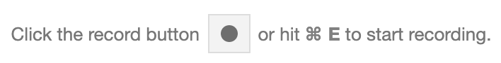
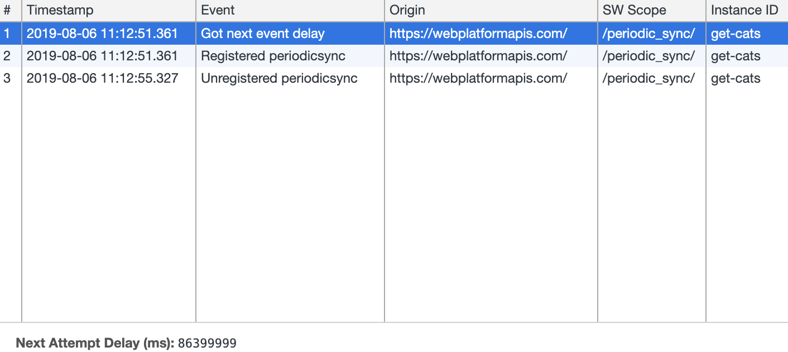
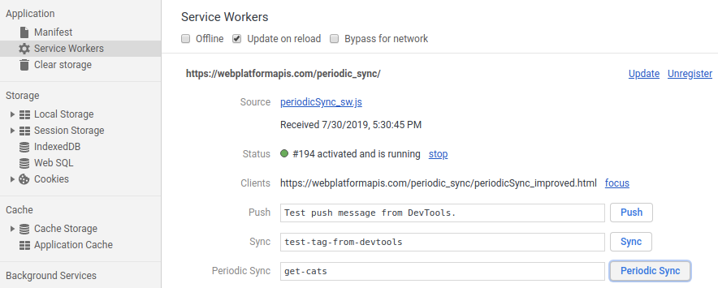
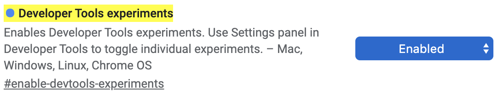
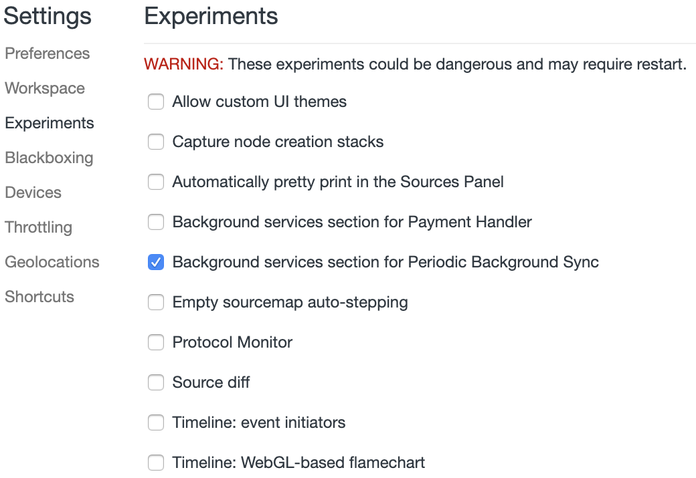
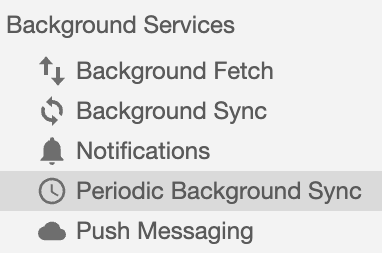


  The Periodic Background Sync API is available as an [**origin trial**](#ot) in Chrome 77 and
  later. It is part of the [Capabilities project](https://developers.google.com/web/updates/capabilities).
  This post will be updated as the implementation progresses.


Have you ever been in any of the following situations?

* Riding a train or subway with flaky or no connectivity
* Being throttled by your carrier after watching too many videos
* Living in a country where bandwidth struggles to keep up with the demand

If you have, then you've surely felt the frustration of getting
certain things done on the web, and wondered why native apps so often do better
in these scenarios. Native apps can fetch fresh content such as news articles or weather
information ahead of time. Even if there's no network in the subway, you can still read the
news.

Periodic Background Sync enables web applications to periodically synchronize
data in the background, bringing web apps closer to the behavior of a native
app.

## Current status

The table below explains the current status of the Periodic Background Sync API.

<table>
<tr>
<th markdown="block">
Step
</th>
<th markdown="block">
Status
</th>
</tr>
<tr>
<td markdown="block">
1. Create explainer
</td>
<td markdown="block">
<a href="https://github.com/WICG/BackgroundSync/tree/master/explainers" >Complete</a>
</td>
</tr>
<tr>
<td markdown="block">
2. Create initial draft of specification
</td>
<td markdown="block">
In Progress
</td>
</tr>
<tr>
<td markdown="block">
3. Gather feedback and iterate on design
</td>
<td markdown="block">
In Progress
</td>
</tr>
<tr>
<td markdown="block">
<strong>4. Origin trial</strong>
</td>
<td markdown="block">
<strong><a href="https://developers.chrome.com/origintrials/#/view_trial/4048736065006075905">Started in Chrome 77</a></strong><br/>
Expected to run through Chrome 80
</td>
</tr>
<tr>
<td markdown="block">
5. Launch
</td>
<td markdown="block">
Not started
</td>
</tr>
</table>

## Try it

You can try periodic background sync with the [live demo
app](https://webplatformapis.com/periodic_sync/periodicSync_improved.html).
Before using it, make sure that:

* You're using Chrome 77 or later.
* You
  [install](https://developers.google.com/web/fundamentals/app-install-banners/)
  the web app before enabling periodic background sync. (The demo app's
  author already took the step of signing up for the origin trial.)

### Register for the origin trial {: #ot }





## Concepts and usage

Periodic background sync lets you show fresh content when a progessive web app
or service worker-backed page is launched. It does this by downloading data in
the background when the app or page is not being used. This prevents the app's
content from refreshing after launch while it's being viewed. Better yet, it
prevents the app from showing a content spinner before refreshing.

Without periodic background sync, web apps must use alternative methods to
download data. A common example is using a push notification to wake a service
worker. The user is interrupted by a message such as 'new data available'.
Updating the data is essentially a side effect. You still have the option of
using push notifications for truly important updates, such as significant
breaking news.

Periodic background sync is easily confused with background sync. Though they
have similar names, their use cases are different. Among other things,
background sync is most commonly used for resending data to a server when a
previous request has failed.

### Getting this right

Chrome is putting periodic background sync through a trial period so that you can
help the Chrome team make sure that they get it right. This section explains some of the design
decisions Chrome took to make this feature as helpful as possible.

The first design decision Chrome made is that a web app can only use periodic
background sync after a person has installed it on their device, and has
launched it as a distinct application. Periodic background sync is not available
in the context of a regular tab in Chrome.

Furthermore, since Chrome doesn't want unused or seldom used web apps to gratuitously
consume battery or data, Chrome designed periodic background sync such that
developers will have to earn it by providing value to their users. Concretely,
Chrome is using a [site engagement score](https://www.chromium.org/developers/design-documents/site-engagement)
(`chrome://site-engagement/`) to determine if and how often periodic background syncs can happen
for a given web app. In other words, a `periodicsync` event won't be fired at all unless the engagement
score is greater than zero, and its value affects the frequency at which the
`periodicsync` event fires. This ensures that the only apps syncing in the
background are the ones you are actively using.

Periodic background sync shares some similarities with existing APIs and
practices on popular platforms. For instance, one-off background sync as well as
push notifications allow a web app's logic to live a little longer (via its
service worker) after a person has closed the page. On most platforms, it's
common for people to have installed apps that periodically access the network in
the background to provide a better user experience for critical updates,
prefetching content, syncing data, and so on. Similarly, periodic background sync also
extends the lifetime of a web app's logic to run at regular periods for what
might be a few minutes at a time.

If the browser allowed this to occur frequently and without restrictions, it
could result in some privacy concerns. Here's how Chrome has addressed this
risk for periodic background sync:

* The background sync activity only occurs on a network that the device has
  previously connected to. Chrome recommends to only connect to networks operated by
  trustworthy parties.
* As with all internet communications, periodic background sync reveals the IP
  addresses of the client, the server it's talking to, and the name of the
  server. To reduce this exposure to roughly what it would be if the app only
  synced when it was in the foreground, the browser limits the frequency of an
  app's background syncs to align with how often the person uses that app. If
  the person stops frequently interacting with the app, periodic background sync
  will stop triggering. This is a net improvement over the status quo in native
  apps.

### When can it be used?

Rules for use vary by browser. To summarize from above, Chrome puts the
following requirements on periodic background sync:

* A particular user engagement score.
* Presence of a previously used network.

The timing of synchronizations are not controlled by developers. The
synchronization frequency will align with how often the app is used. (Note that
native apps currently don't do this.) It also takes into the device's power and
connectivity state.

### When should it be used?

When your service worker wakes up to handle a `periodicsync` event, you have the
_opportunity_ to request data, but not the _obligation_ to do so. When handling
the event you should take network conditions and available storage into
consideration and download different amounts of data in response. You can use
the following resources to help:

* [Network Information API](https://developer.mozilla.org/en-US/docs/Web/API/Network_Information_API)
* [Detecting data saver mode](https://developers.google.com/web/fundamentals/performance/optimizing-content-efficiency/save-data/#detecting_the_save-data_setting)
* [Estimating available storage](https://developers.google.com/web/updates/2017/08/estimating-available-storage-space)

### Permissions

After the service worker is installed, use the [Permissions
API](https://developer.mozilla.org/en-US/docs/Web/API/Permissions_API) to query
for `periodic-background-sync`. You can do this from either a window or a
service worker context.

```js
const status = await navigator.permissions.query({
  name: 'periodic-background-sync',
});
if (status.state === 'granted') {
  // Periodic background sync can be used.
} else {
  // Periodic background sync cannot be used.
}
```

### Registering a periodic sync

As already stated, periodic background sync requires a service worker. Retrieve
a `PeriodicSyncManager` using `ServiceWorkerRegistration.periodicSync` and call
`register()` on it. Registering requires both a tag and a minimum
synchronization interval (`minInterval`). The tag identifies the registered sync
so that multiple syncs can be registered. In the example below, the tag name is
`'content-sync'` and the `minInterval` is one day.

```js/3-5
const registration = await navigator.serviceWorker.ready;
if ('periodicSync' in registration) {
  try {
    registration.periodicSync.register('content-sync', {
      // An interval of one day.
      minInterval: 24 * 60 * 60 * 1000,
    });
  } catch (error) {
    // Periodic background sync cannot be used.
  }
}
```

### Verifying a registration

Call `periodicSync.getTags()` to retrieve an array of registration tags. The
example below uses tag names to confirm that cache updating is active to avoid
updating again.

```js/2,4
const registration = await navigator.serviceWorker.ready;
if ('periodicSync' in registration) {
  const tags = await registration.periodicSync.getTags();
  // Only update content if sync isn't set up.
  if (!tags.includes('content-sync')) {
    updateContentOnPageLoad();
  }
} else {
  // If periodic background sync isn't supported, always update.
  updateContentOnPageLoad();
}
```

You can also use `getTags()` to show a list of active registrations in your web
app's settings page so that users can enable or disable specific types of
updates.

### Responding to a periodic background sync event

To respond to a periodic background sync event add a `periodicsync` event
handler to your service worker. The `event` object passed to it will contain a
`tag` parameter matching the value used during registration. For example if a
periodic background sync was registered with the name `'content-sync'`, then
`event.tag` will be `'content-sync'`.

```js
self.addEventListener('periodicsync', (event) => {
  if (event.tag === 'content-sync') {
    // See the "Think before you sync" section for
    // checks you could perform before syncing.
    event.waitUntil(syncContent());
  }
  // Other logic for different tags as needed.
});
```

### Unregistering a sync

To end a registered sync, call `periodicSync.unregister()` with the name of the
sync you want to unregister.

```js
const registration = await navigator.serviceWorker.ready;
if ('periodicSync' in registration) {
  registration.periodicSync.unregister('content-sync');
}
```

## Interfaces

Here's a quick run down of the interfaces provided by the Periodic Background
Sync API.

* `PeriodicSyncEvent`. Passed to the `ServiceWorkerGlobalScope.onperiodicsync` event handler at a
  time of the browser's choosing.
* `PeriodicSyncManager`. Registers and unregisters periodic syncs and provides tags for registered
  syncs. Retrieve an instance of this class from the ServiceWorkerRegistration.periodicSync`
  property.
* `ServiceWorkerGlobalScope.onperiodicsync`. Registers a handler to receive the `PeriodicSyncEvent`.
* `ServiceWorkerRegistration.periodicSync`. Returns a reference to the `PeriodicSyncManager`.

## Example

### Updating content

The following example uses periodic background sync to download and cache up-to-date articles for a news site or blog. Notice the tag name, which indicates the kind of sync this is (`'update-articles'`). The call to `updatearticles()` is wrapped in `event.waitUntil()` so that the service worker won't terminate before the articles are downloaded and stored.

```js/7
async function updateArticles() {
  const articlesCache = await caches.open('articles');
  await articlesCache.add('/api/articles');
}

self.addEventListener('periodicsync', (event) => {
  if (event.tag === 'update-articles') {
    event.waitUntil(updateArticles());
  }
});
```

## Debugging

It can be a challenge to get and end-to-end view of periodic background sync
while testing locally. Information about active registrations, approximate sync
intervals, and logs of past sync events provide valuable context while debugging
your web app's behavior. Fortunately, you can find all of that information
through an experimental feature in Chrome DevTools.


  Periodic background sync debugging is currently disabled by default. See [Enabling the DevTools
  interface](https://developers.google.com/web/updates/2019/08/periodic-background-sync#enabling_the_devtools_interface)
  for the steps needed to enable it during the origin trial.


### Recording local activity

The **Periodic Background Sync** section of DevTools is organized around key events
in the periodic background sync lifecycle: registering for sync, performing a
background sync, and unregistering. To obtain information about these events,
click **Start recording**.

<figure class="w-figure  w-figure--center">
  
  <figcaption class="w-figcaption">
    The record button in DevTools
  </figcaption>
</figure>

While recording, entries will appear in DevTools corresponding to events, with
context and metadata logged for each.

<figure class="w-figure  w-figure--center">
  
  <figcaption class="w-figcaption">
    An example of recorded periodic background sync data
  </figcaption>
</figure>

After enabling recording once, it will stay enabled for up to three days,
allowing DevTools to capture local debugging information about background syncs
that might take place, even hours in the future.

### Simulating events

While recording background activity can be helpful, there are times when you'll
want to test your `periodicsync` handler immediately, without waiting for an
event to fire on its normal cadence.

You can do this via the **Service Workers** section within the Application panel in
Chrome DevTools. The **Periodic Sync** field allows you to provide a tag for the
event to use, and to trigger it as many times as you'd like.


  Manually triggering a `periodicsync` event requires Chrome 78 or later.
  You'll need to follow the same [Enabling the DevTools
  interface](https://developers.google.com/web/updates/2019/08/periodic-background-sync#enabling_the_devtools_interface)
  steps to turn it on.


<figure class="w-figure  w-figure--center">
  
</figure>

## Enabling the DevTools interface

To enable periodic background sync during the origin trial, use the steps below. If and when it progresses out of the origin trial, the DevTools interface will be enabled by default.

1. Visit `chrome://flags/#enable-devtools-experiments` and change the **Developer
   Tools experiments** setting to **Enabled**.

   <figure class="w-figure  w-figure--center">
     
   </figure>

2. Restart Chrome.

3. Open Chrome DevTools [Settings](https://developers.google.com/web/tools/chrome-devtools/customize#settings).

4. In **Settings** > **Experiments**, enable **Background
   services section for Periodic Background Sync**.

   <figure class="w-figure w-figure--center">
     
   </figure>

5. Close, and then reopen DevTools.

6. You should now see a **Periodic Background Sync** section within the
   *Application* panel.

   <figure class="w-figure w-figure--center">
     
   </figure>
