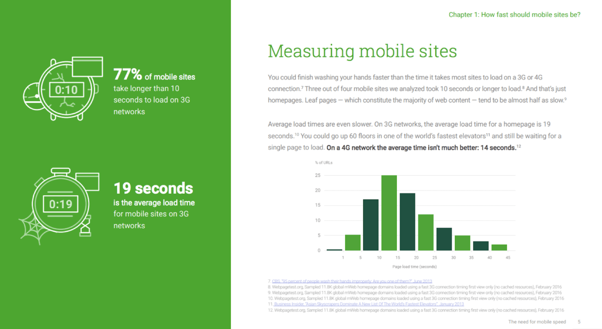
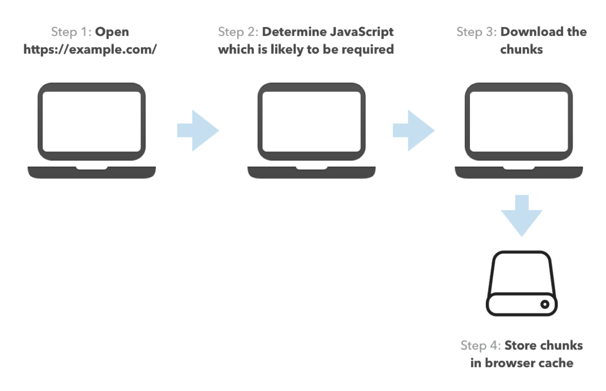
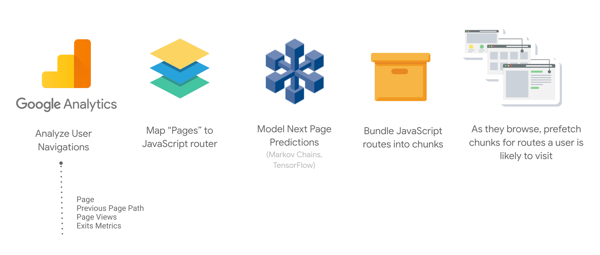

During my session ["Faster Web Navigations with Predictive Prefetching"](https://www.youtube.com/watch?v=0jB4YWgAxUo) at Google I/O 2019, I talked about optimizing web apps with code-splitting and its potential performance implication on subsequent page navigations. In the second part of the talk, I discussed how to improve navigation speed by empowering predictive prefetching and how Guess.js implements this technique.

<div style="width:100%; padding-top: 56.25%; position: relative;">
<iframe style="width:100%; height: 100%;position: absolute; top: 50%; left:
50%; transform: translate(-50%,-50%);"
src="https://www.youtube.com/embed/0jB4YWgAxUo" frameborder="0"
allow="accelerometer; autoplay; encrypted-media; gyroscope; picture-in-picture"
allowfullscreen></iframe>
</div>

## Code-splitting for faster web apps

Web apps are slow, and JavaScript is among the most expensive resources that you ship. Waiting for a slow web app to load can frustrate your users and decrease conversions.



Lazy-loading is an efficient technique to reduce the bytes of JavaScript that you're transferring over the wire. You can use several techniques to lazy-load JavaScript, including:

- Component-level code-splitting
- Route-level code-splitting

With component-level code-splitting, you can move individual components to separate JavaScript chunks. On particular events, you can load the scripts and render the components.

Route-level code-splitting has similar functionality with the difference that you move entire routes into independent chunks. Once the user performs a transition from one route to another, they have to download the associated JavaScript and bootstrap the requested page. All these operations can lead to significant delays, especially on slow networks.

## Prefetching JavaScript



Prefetching is a technique which allows you to download in the background and save into the cache resources that you think the user will need soon. The usual way to do this is by using `<link rel="prefetch">`. Two common pitfalls with prefetching are:

- Prefetching too many resources and consuming a lot of data (*overfetching*)
- Never prefetching the resources the user needs

Predictive allows you to solve these problems by consuming a report for the users' navigational patterns.

## Predictive prefetching with Guess.js

A JavaScript library which provides predictive prefetching functionality is [Guess.js](https://github.com/guess-js). Guess.js consumes a report from Google Analytics or another analytics provider to build a predictive model that could be used for smartly prefetching only what the user may need in the future.

Guess.js has integration with Angular, Next.js, Nuxt.js, and Gatsby. To use it in your application, you should add a single line of webpack configuration specifying a [Google Analytics view ID](https://stackoverflow.com/questions/36898103/what-is-a-viewid-in-google-analytics):

```js/0,5
const { GuessPlugin } = require('guess-webpack');

// ...
plugins: [
   // ...
   new GuessPlugin({ GA: 'XXXXXX' })
]
// ...
```

If you're not using Google Analytics, you can specify a `reportProvider` and download data from your favorite service.

### Integration with Angular

To integrate Guess.js with an Angular CLI project, you can use [`ngx-build-plus`](https://github.com/manfredsteyer/ngx-build-plus). The steps you need to go through include:

* Install of `ngx-build-plus`, `guess-webpack`, and `guess-parser`
* Add the `GuessPlugin` as part of your webpack configuration specifying a Google Analytics view ID or, if using different analytics provider, a `reportProvider`:

```js
const { GuessPlugin } = require('guess-webpack');
const { parseRoutes } = require('guess-parser');

module.exports = {
  plugins: [
    new GuessPlugin({
      GA: 'VIEW_ID',
      runtime: {
	      delegate: false
      },
      routeProvider() {
	      return parseRoutes('.');
      }
    })
  ]
};
```

* Build your application specifying your extended webpack config with the `--extra-webpack-config` option

For a video introduction, check the video below.

<div style="width:100%; padding-top: 56.25%; position: relative;">
<iframe style="width:100%; height: 100%;position: absolute; top: 50%; left:
50%; transform: translate(-50%,-50%);"
src="https://www.youtube.com/embed/5FRxQiGqqmM" frameborder="0"
allow="accelerometer; autoplay; encrypted-media; gyroscope; picture-in-picture"
allowfullscreen></iframe>
</div>

## How does Guess.js work?

Guess.js will add predictive prefetching going through the following steps:

1. Extract data from your favorite analytics provider
1. Map the URLs from the report to the JavaScript chunks produced by webpack
1. Based on the extracted data, it creates a simple predictive model of which pages a user is likely to navigate to from any given page.
1. Invoke the model for each chunk, predicting which are the other chunks likely to be needed next
1. Add prefetching instructions in each chunk



## Learn more

You learn more about Guess.js in the following resources:

- [Faster Web Navigations with Predictive Prefetching](https://www.youtube.com/watch?v=0jB4YWgAxUo)
- [Introducing Guess.js - a toolkit for enabling data-driven user-experiences on the Web](https://blog.mgechev.com/2018/05/09/introducing-guess-js-data-driven-user-experiences-web/)
- [Documentation](https://guess-js.github.io)
- [Source code](https://github.com/guess-js)
