## Dark mode before *Dark Mode*

<figure class="w-figure w-figure--inline-right">
  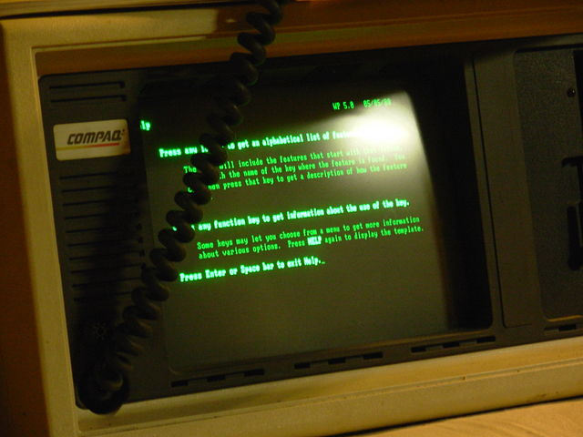
  <figcaption class="w-figcaption">Fig. — Green screen (<a href="https://commons.wikimedia.org/wiki/File:Compaq_Portable_and_Wordperfect.JPG">Source</a>)</figcaption>
</figure>

We have gone full circle with dark mode.
In the dawn of personal computing, dark mode wasn't a deliberate choice,
but purely a matter of fact:
Monochrome Cathode-Ray Tube (CRT) computer monitors work by firing electron beams
on a phosphorescent screen, and as the phosphor that these early CRTs used was green,
they were oftentimes referred to as
[green screens](https://commons.wikimedia.org/wiki/File:Schneider_CPC6128_with_green_monitor_GT65,_start_screen.jpg).
Information like text was displayed in green, and the rest of the screen was black.

<figure class="w-figure w-figure--inline-left">
  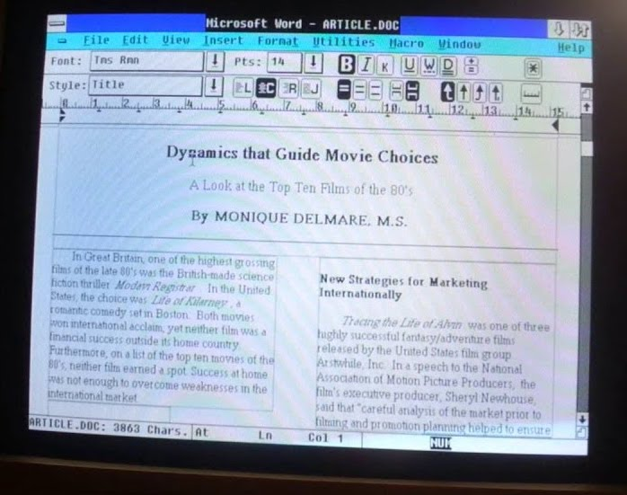
  <figcaption class="w-figcaption">Fig. — Dark-on-white (<a href="https://www.youtube.com/watch?v=qKkABzt0Zqg">Source</a>)</figcaption>
</figure>

The subsequently introduced Color CRTs display multiple colors
through the use of red, green, and blue phosphors.
They create white by activating all three phosphors simultaneously.
With the advent of more sophisticated *What You See Is What You Get* (WYSIWYG)
[desktop publishing](https://en.wikipedia.org/wiki/Desktop_publishing),
the idea of making the virtual document resemble a physical sheet of paper became popular.


<figure class="w-figure w-figure--inline-right">
  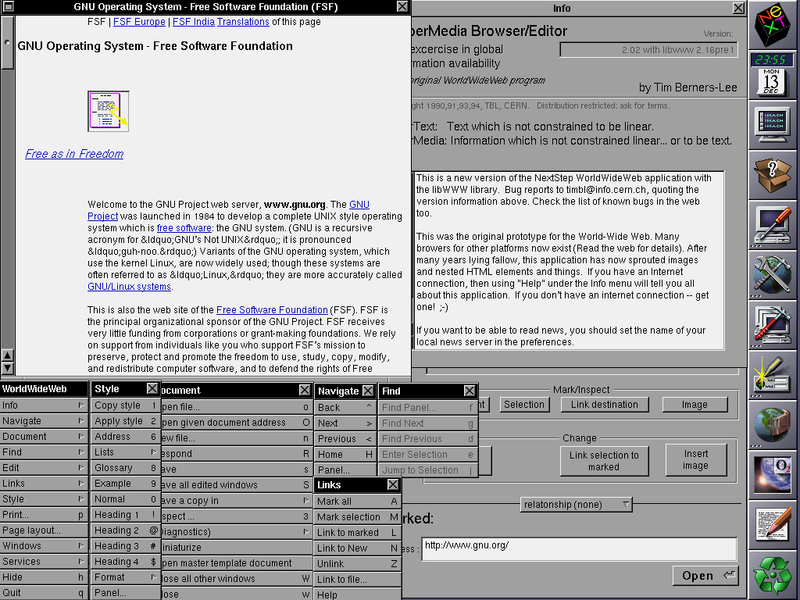
  <figcaption class="w-figcaption">Fig. — The WorldWideWeb browser (<a href="https://commons.wikimedia.org/wiki/File:WorldWideWeb_FSF_GNU.png">Source</a>)</figcaption>
</figure>

This is where *dark-on-white* as a design trend started,
and this trend was carried over to the
[early document-based web](http://info.cern.ch/hypertext/WWW/TheProject.html)
and was also the way the first browser, [WorldWideWeb](https://en.wikipedia.org/wiki/WorldWideWeb)
(remember,
[CSS wasn't even invented](https://en.wikipedia.org/wiki/Cascading_Style_Sheets#History) yet),
[displayed webpages](https://commons.wikimedia.org/wiki/File:WorldWideWeb_FSF_GNU.png).
Fun fact: the second ever browser, the
[Line Mode Browser](https://en.wikipedia.org/wiki/Line_Mode_Browser)—as a terminal-based browser—was
green on dark.
To the present day, web pages and web apps are typically designed with dark text
on a light background, a baseline assumption that is also hard-coded in user agent stylesheets like
[Chrome's](https://chromium.googlesource.com/chromium/blink/+/master/Source/core/css/html.css).

<figure class="w-figure w-figure--inline-left">
  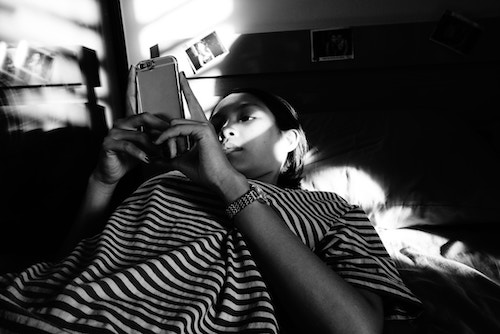
  <figcaption class="w-figcaption">Fig. — Smartphone used in bed (<a href="https://unsplash.com/photos/W39xsPWZgA4">Source</a>)</figcaption>
</figure>

Nowadays, a lot of content consumption and creation has shifted to mobile devices
that use backlit Liquid Crystal Displays (LCD)
or energy-saving Active-Matrix Organic Light-Emitting Diode (AMOLED) screens,
and on the desktop as well—which can be a full PC or a laptop—the days of CRTs are long over.
With such smaller and more transportable computers, tablets, and smartphones,
new usage patterns have evolved.
People use their devices even in their beds at night-time, and leisure tasks
like web browsing, coding for fun, or high-end gaming
frequently happen after-hours in dim environments anyway.
The more people use their devices in the dark—and even more since Apple has introduced
[Dark Mode in macOS Mojave](https://support.apple.com/en-us/HT208976) on the desktop—the
more the idea of going back to the roots of *light-on-dark* becomes popular.

## Why dark mode

When people get asked
[why they like or want dark mode](https://medium.com/dev-channel/let-there-be-darkness-maybe-9facd9c3023d),
the most popular response is that *"it's easier on the eyes,"*
followed by *"it's elegant and beautiful."*
Apple in their
[Dark Mode developer documentation](https://developer.apple.com/documentation/appkit/supporting_dark_mode_in_your_interface)
explicitly write: *"The choice of whether to enable a light or dark appearance
is an aesthetic one for most users, and might not relate to ambient lighting conditions."*


  Read up more on
  [user research regarding why people want dark mode and how they use it](https://medium.com/dev-channel/let-there-be-darkness-maybe-9facd9c3023d).


<figure class="w-figure w-figure--inline-right">
  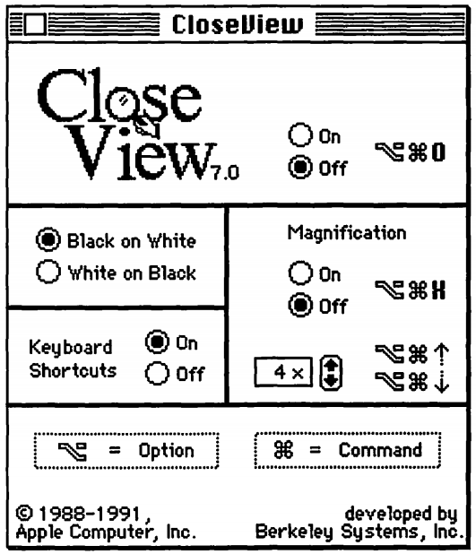
  <figcaption class="w-figcaption">Fig. — System&nbsp;7 CloseView (<a href="https://archive.org/details/mac_Macintosh_System_7_at_your_Fingertips_1992">Source</a>)</figcaption>
</figure>

### Accessibility

However, there're also people who actually *need* dark mode or other accessibility tools,
for example, users with low vision.
The earliest occurrence of such an accessibility tool I could find is
[System&nbsp;7](https://en.wikipedia.org/wiki/System_7)'s *CloseView* feature that had a toggle for
*"Black on White"* and *"White on Black,"* which arguably can be called dark mode.
While System&nbsp;7 supported color, the default user interface was still black-and-white.


  You can actually
  [experience System&nbsp;7](https://archive.org/details/mac_MacOS_7.0.1_compilation)
  live thanks to the
  [Internet Archive](https://archive.org/)
  (unfortunately the *CloseView* feature was on a separate floppy disk not part of the emulation).


These inversion-based implementations showed their weaknesses the moment color was introduced.
User research by Szpiro *et al.* on
[how people with low vision access computing devices](https://dl.acm.org/citation.cfm?id=2982168)
showed that all interviewed users disliked inverted images, however,
that many preferred light text on a dark background.
On its mobile devices, Apple accommodates for this shortcoming with a feature called
[Smart Invert](https://www.apple.com//accessibility/iphone/vision/)
that reverses the colors on the display, except for images, media,
and some apps that use dark color styles.

### Computer Vision Syndrome

Computer Vision Syndrome, also known as Digital Eye Strain, is
[defined](https://onlinelibrary.wiley.com/doi/full/10.1111/j.1475-1313.2011.00834.x)
as *"the combination of eye and vision problems associated with the use of computers
(including desktop, laptop, and tablets) and other electronic displays (e.g.
smartphones and electronic reading devices)."*
It has been [proposed](https://bmjopen.bmj.com/content/5/1/e006748)
that the use of electronic devices by adolescents, particularly at night time,
leads to an increased risk of shorter sleep duration,
longer sleep-onset latency, and increased sleep deficiency.
Additionally, exposure to blue light has been widely
[reported](https://www.ncbi.nlm.nih.gov/pmc/articles/PMC4254760/)
to be involved in the regulation of circadian rhythm and the sleep cycle,
and irregular light environments may lead to sleep deprivation,
possibly affecting mood and task performance, according to
[research by Rosenfield](https://www.college-optometrists.org/oip-resource/computer-vision-syndrome--a-k-a--digital-eye-strain.html).
To limit these negative effects, reducing blue light by adjusting the display color temperature
through features like iOS' [Night Shift](https://support.apple.com/en-us/HT207570) or Android's
[Night Light](https://support.google.com/pixelphone/answer/7169926?) can help,
as well as avoiding bright lights or irregular lights in general through dark themes or dark modes.

### Power savings on AMOLED screens

Finally, dark mode is known to save a *lot* of energy on AMOLED screens.
Case studies by the Android team that focused on popular Google apps
like YouTube have shown that the power savings can be up to 60%.
The video below has more details on this.

<iframe width="560" height="315" src="https://www.youtube-nocookie.com/embed/N_6sPd0Jd3g?start=305"
    frameborder="0" allow="accelerometer; autoplay; encrypted-media; gyroscope; picture-in-picture"
    allowfullscreen
></iframe>

## Activating dark mode in the operation system

Now that I have covered the background of why dark mode is such a big thing for many,
let me go into detail how you can support it.
Before I dive into this, let me first clarify how people can activate dark mode in the first place.
Operating systems that support a dark mode or theme
typically have an option to activate it somewhere in the settings.
On macOS&nbsp;X, it's in the system preference's *General* section and called *Appearance*,
and on Windows&nbsp;10, it's in the *Colors* section and called *Choose your color*.
For Android&nbsp;Q, you can find it under *Display* as a *Dark Theme* toggle switch.

<figure>
  <div style="overflow-x: auto; padding-left:1rem;">
    <table class="w-screenshot w-screenshot--filled">
      <tr>
        <td style="vertical-align:top;">
          <figure class="w-figure w-figure--inline-left">
            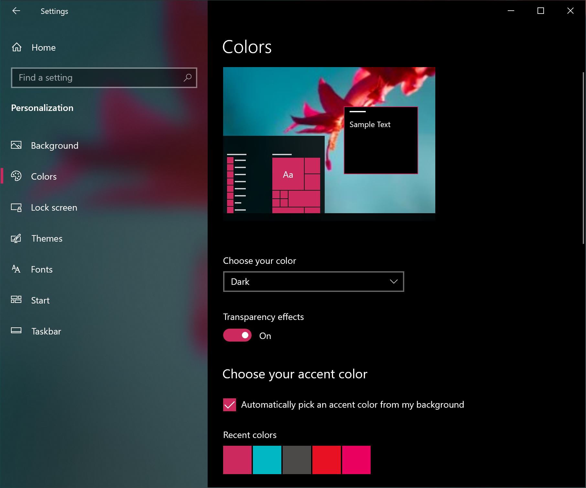
            <figcaption class="w-figcaption">Windows&nbsp;10 dark theme settings</figcaption>
          </figure>
        </td>
        <td style="vertical-align:top;">
          <figure class="w-figure w-figure--inline-left">
            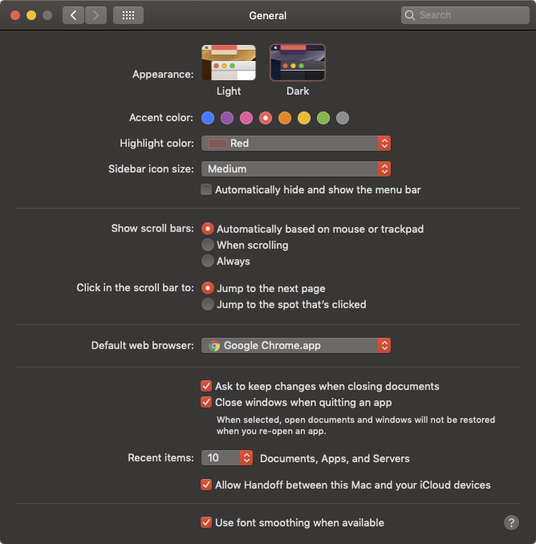
            <figcaption class="w-figcaption">macOS&nbsp;X dark mode settings</figcaption>
          </figure>
        </td>
        <td style="vertical-align:top;">
          <figure class="w-figure w-figure--inline-left">
            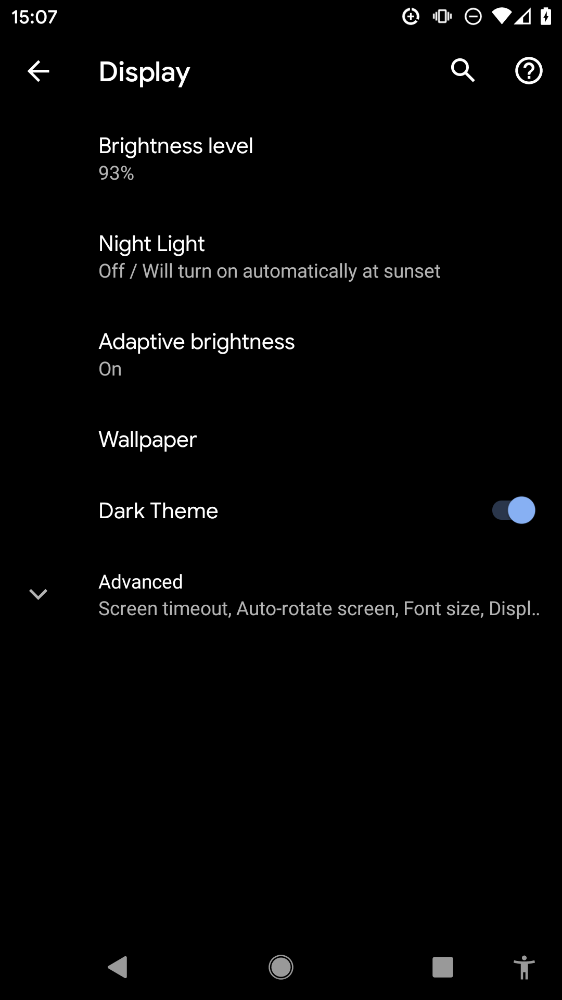
            <figcaption class="w-figcaption">Android&nbsp;Q dark theme settings</figcaption>
          </figure>
        </td>
        <td style="vertical-align:top;">
          <figure class="w-figure w-figure--inline-left">
            
            <figcaption style="width: 10rem;" class="w-figcaption">iOS&nbsp;13 appearance settings</figcaption>
          </figure>
        </td>
      </tr>
    </table>
  </div>
  <figcaption class="w-figcaption">Fig. — Dark mode settings on various operating systems</figcaption>
</figure>

## The `prefers-color-scheme` media query

[Media queries](https://developer.mozilla.org/en-US/docs/Web/CSS/Media_Queries/Using_media_queries)
allow authors to test and query values or features of the user agent or display device,
independent of the document being rendered.
They are used in the CSS `@media` rule to conditionally apply styles to a document,
and in various other contexts and languages, such as HTML and JavaScript.
[Media Queries Level&nbsp;5](https://drafts.csswg.org/mediaqueries-5/)
introduces so-called user preference media features, that is,
a way for sites to detect the user's preferred way to display content.


  An established user preference media feature is `prefers-reduced-motion`
  that lets you detect the desire for less motion on a page.
  I have written about
  [`prefers-reduced-motion`](https://developers.google.com/web/updates/2019/03/prefers-reduced-motion)
  before.


The `prefers-color-scheme` media feature is used to detect
if the user has requested the page to use a light or dark color theme.
It takes the following values:

- `no-preference`:
  Indicates that the user has made no preference known to the system.
  This keyword value evaluates as `false` in the
  [boolean context](https://drafts.csswg.org/mediaqueries-5/#boolean-context).
- `light`:
  Indicates that the user has notified the system that they prefer a page that has a light theme
  (dark text on light background).
- `dark`:
  Indicates that the user has notified the system that they prefer a page that has a dark theme
  (light text on dark background).

## Supporting dark mode

Let's finally see how supporting dark mode looks like in practice.
Just like with the [Highlander](https://en.wikipedia.org/wiki/Highlander_(film)),
with dark mode, *there can be only one*: dark or light, but never both!
Please don't force users to download CSS in the critical rendering path
that is for a mode they don't currently use.
To optimize load speed, I have therefore split my CSS into three parts
in order to [defer non-critical CSS](/defer-non-critical-css/):

- `style.css` that contains generic styles that are used universally on the site.
- `dark.css` that contains only the rules needed for dark mode.
- `light.css` that contains only the rules needed for light mode.

The two latter ones are loaded conditionally with a `<link media>` query.
Initially,
[not all browsers will support `prefers-color-scheme`](https://caniuse.com/#feat=prefers-color-scheme),
which I deal with dynamically by loading the default `light.css` file via `document.write`
in a minuscule inline script.

```html
<!-- index.html -->
<script>
  // If `prefers-color-scheme` is not supported, fall back to light mode.
  // In this case, the file will be downloaded with `highest` priority.
  if (!window.matchMedia('(prefers-color-scheme)').matches) {
    document.write('<link rel="stylesheet" href="/light.css"">');
  }
</script>
<!-- The main stylesheet -->
<link rel="stylesheet" href="/style.css">
<!--
  Conditionally either load the light or the dark stylesheet. The matching file
  will be downloaded with `highest`, the non-matching file with `lowest`
  priority. If the browser doesn't support `prefers-color-scheme`, the media
  query is unknown and the files are downloaded with `lowest` priority (but
  above I force `highest` for the default light experience).
-->
<link rel="stylesheet" href="/dark.css" media="(prefers-color-scheme: dark)">
<link rel="stylesheet" href="/light.css" media="(prefers-color-scheme: no-preference), (prefers-color-scheme: light)">
```

I make maximum use of [CSS variables](https://developer.mozilla.org/en-US/docs/Web/CSS/var),
this allows my generic `style.css` to be, well, generic,
and all the customization happens in the two other files `dark.css` and `light.css`.
Below you can see an excerpt of the actual styles, but it should suffice to convey the overall idea.
I declare two variables, `--background-color` and `--color`
that essentially create a *dark-on-light* and a *light-on-dark* baseline theme.

```css
/* light.css */
:root {
  --background-color: rgb(250, 250, 250);
  --color: rgb(5, 5, 5);
}
```

```css
/* dark.css */
:root {
  --background-color: rgb(5, 5, 5);
  --color: rgb(250, 250, 250);
}
```

In my `style.css`, I then use these variables in the `body { … }` rule.
You will also have noticed a property `color-scheme` with the space-separated value `light dark`.
This tells the browser which color themes my app supports
and allows it to activate special variants of the user agent stylesheet.
This is useful to, for example, let the browser render form fields
with a dark background and light text, adjust the scrollbars,
or to enable a theme-aware highlight color.
The exact details of `color-scheme` are specified in
[CSS Color Adjustment Module Level&nbsp;1](https://drafts.csswg.org/css-color-adjust-1/).


  Read up more on
  [what `color-scheme` actually does](https://medium.com/dev-channel/what-does-dark-modes-supported-color-schemes-actually-do-69c2eacdfa1d).


```css
/* style.css */
:root {
  color-scheme: dark light;
}

body {
  background-color: var(--background-color);
  color: var(--color);
}
```

In the following [Glitch](https://dark-mode-baseline.glitch.me/) embed,
you can see a more complete example that puts the concepts from above into practice.

<div style="height: 420px; width: 100%;">
  <iframe
    allow="geolocation; microphone; camera; midi; vr; encrypted-media"
    src="https://glitch.com/embed/#!/embed/dark-mode-baseline?path=style.css&previewSize=100&attributionHidden=true"
    style="height:100%; width:100%; border:0;">
  </iframe>
</div>

When you play with this example, you can see
why I load my `dark.css` and `light.css` via media queries.
Try toggling dark mode and reload the page:
the particular currently non-matching stylesheets are still loaded, but with lowest priority,
so that they never compete with resources that are needed by the site right now.


  Read up more on
  [why browsers download stylesheets with non-matching media queries](https://blog.tomayac.com/2018/11/08/why-browsers-download-stylesheets-with-non-matching-media-queries-180513).


<figure class="w-figure">
  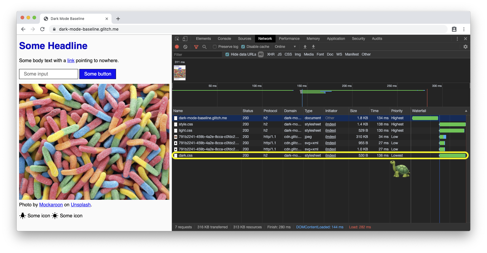
  <figcaption class="w-figcaption">Fig. — Site in light mode loads the dark mode CSS with lowest priority.</figcaption>
</figure>

<figure class="w-figure">
  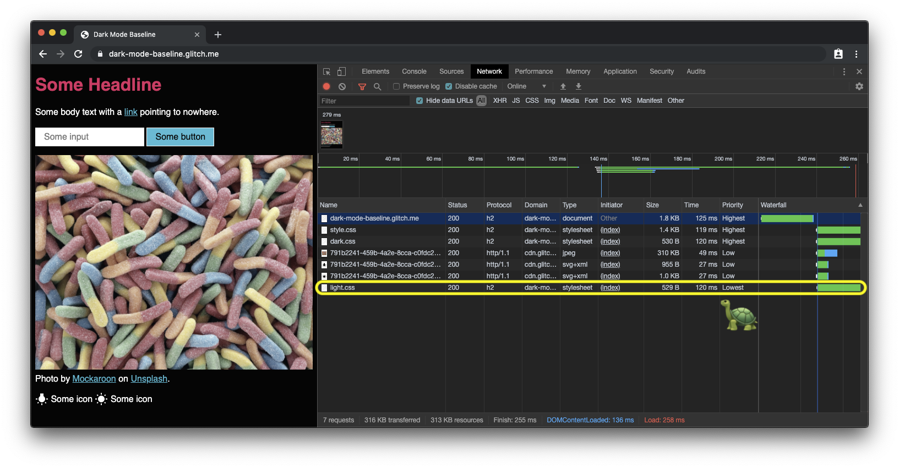
  <figcaption class="w-figcaption">Fig. — Site in dark mode loads the light mode CSS with lowest priority.</figcaption>
</figure>

<figure class="w-figure">
  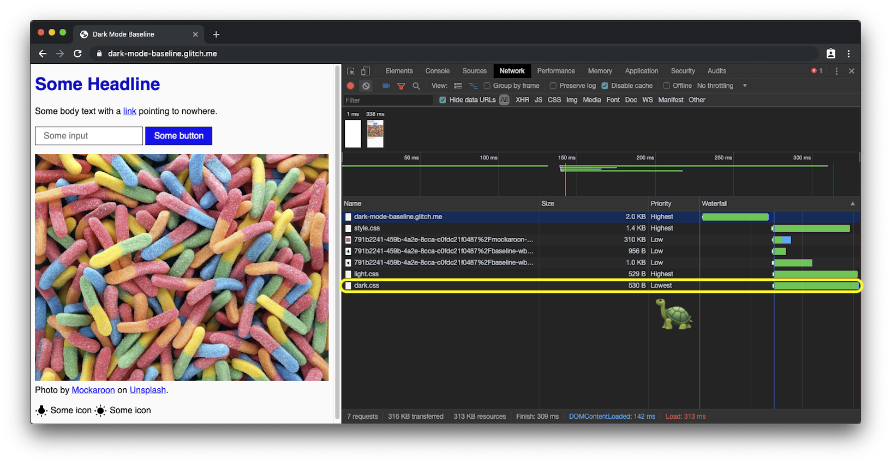
  <figcaption class="w-figcaption">Fig. — Site in default light mode on a browser that doesn't support <code>prefers-color-scheme</code> loads the dark mode CSS with lowest priority.</figcaption>
</figure>

## Dark mode best practices

### Photographic images

If you compare the two screenshots above, you will notice that not only the core theme has changed
from *dark-on-light* to *light-on-dark*, but that also the hero image looks slightly different.
My [research](https://medium.com/dev-channel/re-colorization-for-dark-mode-19e2e17b584b)
has shown that the majority of the surveyed people
prefer slightly less vibrant and brilliant images when dark mode is active.
I refer to this as *re-colorization*.
Re-colorization can be achieved through a CSS filter on my images.
I use a CSS selector that matches all images that don't have `.svg` in their URL,
the idea being that I can give vector graphics (icons) a different re-colorization treatment
than my images (photos), more about this in the [next paragraph](#vector-graphics-and-icons).
Note how I again use a [CSS variable](https://developer.mozilla.org/en-US/docs/Web/CSS/var),
so I can later on flexibly change my filter.


  Read up more on
  [user research regarding re-colorization preferences with dark mode](https://medium.com/dev-channel/re-colorization-for-dark-mode-19e2e17b584b).


```css
/* dark.css */
--image-filter: grayscale(50%);

img:not([src*=".svg"]) {
  filter: var(--image-filter);
}
```

Not everyone is the same and people have different dark mode needs.
By sticking to the re-colorization method described above,
I can easily make the grayscale intensity a user preference that I can change via JavaScript.

```js
const filter = 'grayscale(70%)';
document.documentElement.style.setProperty('--image-filter', value);
```

### Vector graphics and icons

For vector graphics—that in my case are used as icons—I use a different re-colorization method.
While [research](https://dl.acm.org/citation.cfm?id=2982168) has shown
that people don't like inversion for photos, it works very well for most icons.
Again I use CSS variables to determine the inversion amount
in the regular and in the `:hover` state.
Note how I only invert icons in `dark.css` but not in `light.css`, and how the `:hover` state
gets a different inversion intensity in the two cases to make the icon appear
slightly darker or slightly brighter, dependent on the mode the user has selected.

```css
/* dark.css */
--icon-filter: invert(100%);
--icon-filter_hover: invert(40%);

img[src*=".svg"] {
  filter: var(--icon-filter);
}
```

```css
/* light.css */
--icon-filter_hover: invert(60%);
```

```css
/* style.css */
img[src*=".svg"]:hover {
  filter: var(--icon-filter_hover);
}
```

## Conclusions


## Related links

- Resources for the `prefers-color-scheme` media query:
    - [Chrome Platform Status page](https://chromestatus.com/feature/5109758977638400)
    - [Chromium bug](https://crbug.com/889087)
    - [Media Queries Level&nbsp;5 spec](https://drafts.csswg.org/mediaqueries-5/#prefers-color-scheme)
- Resources for the `color-scheme` meta tag and CSS property:
    - [Chrome Platform Status page](https://chromestatus.com/feature/5330651267989504)
    - [Chromium bug](http://crbug.com/925935)
    - [CSS WG GitHub Issue for the meta tag and the CSS property](https://github.com/w3c/csswg-drafts/issues/3299)
    - [HTML WHATWG GitHub Issue for the meta tag](https://github.com/whatwg/html/issues/4504)

## Acknowledgements

I would like to thank the participants of the various user studies
that have helped shape the recommendations in this article.
