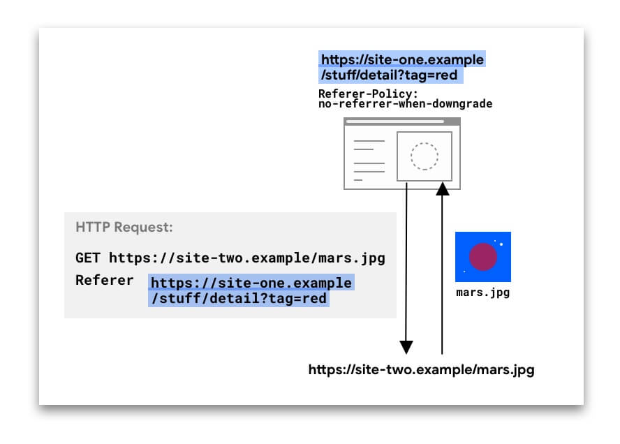
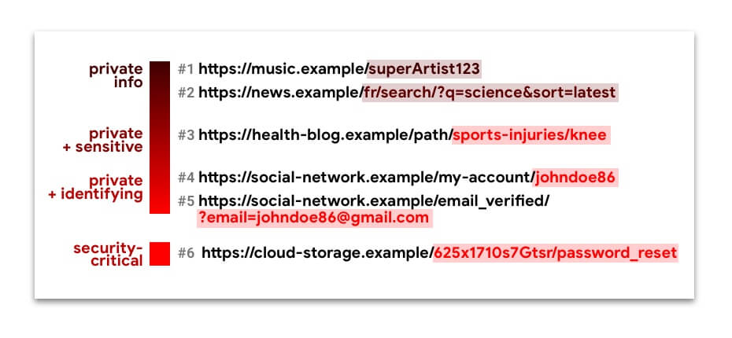
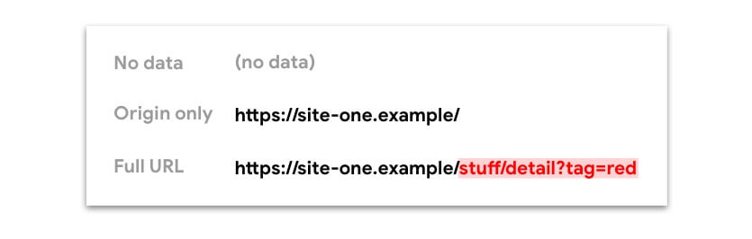
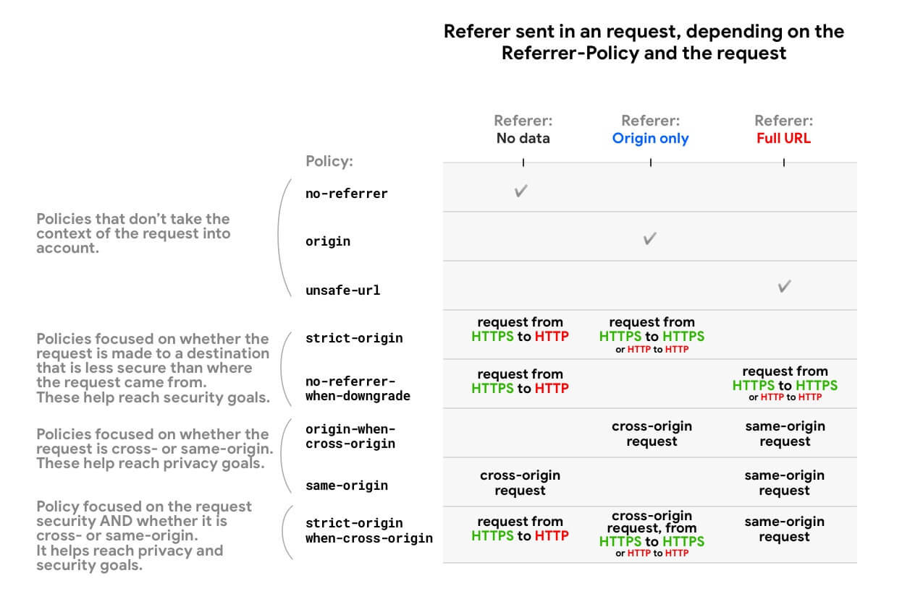
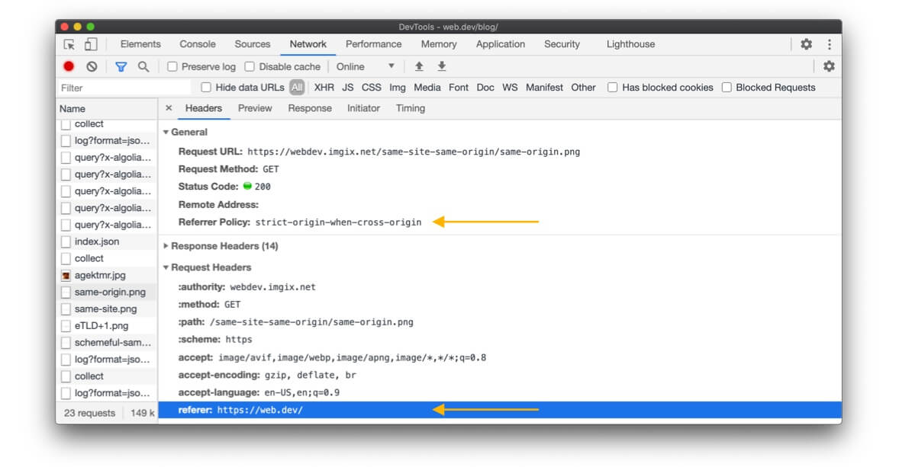

## Summary

- Unexpected cross-origin information leakage hinders web users' privacy. A protective referrer
  policy can help.
- Consider setting a referrer policy of `strict-origin-when-cross-origin`. It retains much of the
  referrer's usefulness, while mitigating the risk of leaking data cross-origins.
- Don't use referrers for Cross-Site Request Forgery (CSRF) protection. Use [CSRF
  tokens](https://cheatsheetseries.owasp.org/cheatsheets/Cross-Site_Request_Forgery_Prevention_Cheat_Sheet.html#token-based-mitigation)
  instead, and other headers as an extra layer of security.

 Before we start:

- If you're unsure of the difference between "site" and "origin", check out [Understanding
  "same-site" and "same-origin"](/same-site-same-origin/).
- The `Referer` header is missing an R, due to an original misspelling in the spec. The
  `Referrer-Policy` header and `referrer` in JavaScript and the DOM are spelled correctly. 

## Referer and Referrer-Policy 101

HTTP requests may include the optional [`Referer`
header](https://developer.mozilla.org/en-US/docs/Web/HTTP/Headers/Referer), which indicates the
origin or web page URL the request was made from. The [`Referrer-Policy`
header](https://developer.mozilla.org/en-US/docs/Web/HTTP/Headers/Referrer-Policy) defines what data
is made available in the `Referer` header.

In the example below, the `Referer` header includes the complete URL of the page on *site-one* from
which the request was made.

<figure class="w-figure">
  
</figure>

The `Referer` header might be present in different types of requests:

- Navigation requests, when a user clicks a link
- Subresource requests, when a browser requests images, iframes, scripts, and other resources that a
  page needs.

For navigations and iframes, this data can also be accessed via JavaScript using
`document.referrer`.

The `Referer` value can be insightful. For example, an analytics service might use the value to
determine that 50% of the visitors on *site-two.example* came from *social-network.example*.

But when the full URL including the path and query string is sent in the `Referer` **across
origins**, this can be **privacy-hindering** and pose **security risks** as well. Take a look at
these URLs:

<figure class="w-figure">
  
</figure>

URLs #1 to #5 contain private information—sometimes even identifying or sensitive. Leaking these
silently across origins can compromise web users' privacy.

URL #6 is a [capability URL](https://www.w3.org/TR/capability-urls/). You don't want it to fall in
the hands of anyone other than the intended user. If this were to happen, a malicious actor could
hijack this user's account.

**In order to restrict what referrer data is made available for requests from your site, you can set
a referrer policy.**

## What policies are available and how do they differ?

You can select one of eight policies. Depending on the policy, the data available from the `Referer`
header (and `document.referrer`) can be:

- No data (no `Referer` header is present)
- Only the [origin](/same-site-same-origin/#origin)
- The full URL: origin, path, and query string

<figure class="w-figure">
  
</figure>

Some policies are designed to behave differently depending on the **context**: cross-origin or
same-origin request, security (whether the request destination is as secure as the origin), or both.
This is useful to limit the amount of information shared across origins or to less secure
origins—while maintaining the richness of the referrer within your own site.

Here is an overview showing how referrer policies restrict the URL data available from the Referer
header and `document.referrer`:

<figure class="w-figure">
  
</figure>

MDN provides a [full list of policies and behavior
examples](https://developer.mozilla.org/en-US/docs/Web/HTTP/Headers/Referrer-Policy#Directives).

Things to note:

- All policies that take the scheme (HTTPS vs. HTTP) into account (`strict-origin`,
  `no-referrer-when-downgrade` and `strict-origin-when-cross-origin`) treat requests from an HTTP
  origin to another HTTP origin the same way as requests from an HTTPS origin to another HTTPS
  origin—even if HTTP is less secure. That's because for these policies, what matters is whether a
  security **downgrade** takes place, i.e. if the request can expose data from an encrypted origin
  to an unencrypted one. An HTTP → HTTP request is unencrypted all along, so there is no downgrade.
  HTTPS → HTTP requests, on the contrary, present a downgrade.
- If a request is **same-origin**, this means that the scheme (HTTPS or HTTP) is the same; hence
  there is no security downgrade.

## Default referrer policies in browsers

_As of July 2020_

**If no referrer policy is set, the browser's default policy will be used.**

<div class="w-table-wrapper">
  <table>
    <thead>
      <tr>
        <th>Browser</th>
        <th>Default <code>Referrer-Policy</code> / Behavior</th>
      </tr>
    </thead>
    <tbody>
      <tr>
        <td>Chrome</td>
        <td>
          Planning to switch to <code>strict-origin-when-cross-origin</code> in <a href="https://developers.google.com/web/updates/2020/07/referrer-policy-new-chrome-default">version 85</a> (previously <code>no-referrer-when-downgrade</code>) 
        </td>
      </tr>
      <tr>
        <td>Firefox</td>
        <td>
          <ul>
            <li><code>no-referrer-when-downgrade</code></li>
            <li><a href="https://bugzilla.mozilla.org/show_bug.cgi?id=1589074">Considering </a><code>strict-origin-when-cross-origin</code>
            </li>
            <li><code>strict-origin-when-cross-origin</code> in Private Browsing and for trackers</li>
          </ul>
        </td>
      </tr>
      <tr>
        <td>Edge</td>
        <td>
          <ul>
            <li><code>no-referrer-when-downgrade</code></li>
            <li><a href="https://github.com/privacycg/proposals/issues/13">Experimenting</a> with <code>strict-origin-when-cross-origin</code>
            </li>
          </ul>
        </td>
      </tr>
      <tr>
        <td>Safari</td>
        <td>
          Similar to <code>strict-origin-when-cross-origin</code>. See
          <a href="https://webkit.org/blog/9661/preventing-tracking-prevention-tracking/">Preventing Tracking Prevention Tracking</a> for details.
        </td>
      </tr>
    </tbody>
  </table>
</div>

## Setting your referrer policy: best practices

 Explicitly set a privacy-enhancing policy, such as
`strict-origin-when-cross-origin`(or stricter). 

There are different ways to set referrer policies for your site:

- As an HTTP header
- Within your
  [HTML](https://developer.mozilla.org/en-US/docs/Web/HTTP/Headers/Referrer-Policy#Integration_with_HTML)
- From JavaScript on a [per-request
  basis](https://javascript.info/fetch-api#referrer-referrerpolicy)

You can set different policies for different pages, requests or elements.

The HTTP header and the meta element are both page-level. The precedence order when determining an
element's effective policy is:

1. Element-level policy
1. Page-level policy
1. Browser default

**Example:**

`index.html`:

```html
<meta name="referrer" content="strict-origin-when-cross-origin" />

```

The image will be requested with a `no-referrer-when-downgrade` policy, while all other subresource
requests from this page will follow the `strict-origin-when-cross-origin` policy.

## How to see the referrer policy?

When inspecting an HTTP request:

- in Chrome, Edge and Firefox, you can see the `Referrer-Policy`.
- in Chrome, Edge, Safari and Firefox, you can see the `Referer`.

<!-- <figure class="w-figure">
  
  <figcaption class="w-figcaption">
    Chrome DevTools, Network panel with a request selected.
  </figcaption>
</figure> -->

<figure class="w-figure">
  
  <figcaption class="w-figcaption">
    Chrome DevTools, <b>Network</b> panel with a request selected.
  </figcaption>
</figure>

## Which policy should you set for your website?

Summary: Explicitly set a privacy-enhancing policy such as `strict-origin-when-cross-origin` (or
stricter).

### Why "explicitly"?

If no referrer policy is set, the browser's default policy will be used—in fact, websites often
defer to the browser's default. But this is not ideal, because:

- Browser default policies are either `no-referrer-when-downgrade`,
  `strict-origin-when-cross-origin`, or stricter—depending on the browser and mode
  (private/incognito). So your website won't behave predictably across browsers.
- Browsers are adopting stricter defaults such as `strict-origin-when-cross-origin` and mechanisms
  such as [referrer trimming](https://github.com/privacycg/proposals/issues/13) for cross-origin
  requests. Explicitly opting into a privacy-enhancing policy before browser defaults change gives
  you control and helps you run tests as you see fit.

### Why `strict-origin-when-cross-origin` (or stricter)?

You need a policy that is secure, privacy-enhancing, and useful—what "useful" means depends on what
you want from the referrer:

- **Secure**: if your website uses HTTPS ([if not, make it a
  priority](/why-https-matters/)), you don't want your website's URLs to leak in
  non-HTTPS requests. Since anyone on the network can see these, this would expose your users to
  person-in-the-middle-attacks. The policies `no-referrer-when-downgrade`,
  `strict-origin-when-cross-origin`, `no-referrer` and `strict-origin` solve this problem.
- **Privacy-enhancing**: for a cross-origin request, `no-referrer-when-downgrade` shares the full
  URL—this is not privacy-enhancing. `strict-origin-when-cross-origin` and `strict-origin` only
  share the origin, and `no-referrer` shares nothing at all. This leaves you with
  `strict-origin-when-cross-origin`, `strict-origin`, and `no-referrer` as privacy-enhancing
  options.
- **Useful**: `no-referrer` and `strict-origin` never share the full URL, even for same-origin
  requests—so if you need this, `strict-origin-when-cross-origin` is a better option.

All of this means that **`strict-origin-when-cross-origin`** is generally a sensible choice.

**Example: Setting a `strict-origin-when-cross-origin` policy:**

`index.html`:

```html
<meta name="referrer" content="strict-origin-when-cross-origin" />
```

Or server-side, for example in Express:

```javascript
const helmet = require('helmet');
app.use(helmet.referrerPolicy({policy: 'strict-origin-when-cross-origin'}));
```

### What if `strict-origin-when-cross-origin` (or stricter) doesn't accommodate all your use cases?

In this case, don't set an unsafe policy such as `unsafe-url`. What you can do instead is take a
**progressive approach**: set a protective policy for your website and if need be, a more permissive
policy for specific requests or elements.

**Example:**

`index.html`:

```html
<meta name="referrer" content="strict-origin-when-cross-origin" />

```

`script.js`:

```javascript
fetch(url, {referrerPolicy: 'no-referrer-when-downgrade'});
```

 A per-element policy is not supported in all
browsers browsers (Examples: `referrerpolicy` for [`a`
elements](https://caniuse.com/#feat=mdn-html_elements_a_referrerpolicy),
for [`img` elements](https://caniuse.com/#feat=mdn-html_elements_img_referrerpolicy),
and for [`link` elements](https://caniuse.com/#feat=mdn-html_elements_link_referrerpolicy)).
But browsers that don't support this tend to take a strict approach anyway
(for example, all cross-origin requests will set `Referer` to the
origin). 

### What else should you consider?

Your policy should depend on your website and use cases—this is up to you, your team, and your
company. If some URLs contain identifying or sensitive data, set a protective policy.

 Data that might not look sensitive to you can be sensitive for your users, or
is simply not data they want or expect to silently leak cross-origin. 

## Using the referrer from incoming requests: best practices

### Cross-Site Request Forgery (CSRF) protection

Using the referrer from incoming requests for CSRF protection has a few pitfalls:

- It can be hidden with the `no-referrer` policy, or spoofed by the request emitter. If you have no
  control over the request emitter's implementation, you can't make assumptions about any header you
  receive.
- The `Referer` header (and `document.referrer`) may contain **more data than you need**, for
  example a full URL when you only want to know if the request is cross-origin.

Use [CSRF
tokens](https://cheatsheetseries.owasp.org/cheatsheets/Cross-Site_Request_Forgery_Prevention_Cheat_Sheet.html#token-based-mitigation)
as your primary protection instead. For extra protection use
[SameSite](https://web.dev/samesite-cookie-recipes/#%22unsafe%22-requests-across-sites)—and instead
of `Referer`, you can use headers such as
[`Origin`](https://developer.mozilla.org/en-US/docs/Web/HTTP/Headers/Origin) (available on POST and
CORS requests) and
[`Sec-Fetch-Site`](https://developer.mozilla.org/en-US/docs/Web/HTTP/Headers/Sec-Fetch-Site) (if
available).

### Logging

The `Referer` header (and `document.referrer`) may contain private, personal, or identifying data—so
it must be treated as such.

And instead of `Referer`, consider using other headers that might address your use case:
[`Origin`](https://developer.mozilla.org/en-US/docs/Web/HTTP/Headers/Origin) and
[`Sec-Fetch-Site`](https://developer.mozilla.org/en-US/docs/Web/HTTP/Headers/Sec-Fetch-Site).

## Conclusion

A protective referrer policy is a great way to give your users more privacy.

To learn more about different techniques to protect your users, check out
web.dev's [Safe and secure](/secure/) collection!

_With many thanks for contributions and feedback to all reviewers - especially Kaustubha Govind,
David Van Cleve, Mike West, Sam Dutton, Rowan Merewood, Jxck and Kayce Basques._

## Resources

- [Understanding "same-site" and "same-origin"](https://web.dev/same-site-same-origin/)
- [A new security header: Referrer Policy
  (2017)](https://scotthelme.co.uk/a-new-security-header-referrer-policy/)
- [Referrer-Policy on
  MDN](https://developer.mozilla.org/en-US/docs/Web/HTTP/Headers/Referrer-Policy)
- [Referer header: privacy and security concerns on
  MDN](https://developer.mozilla.org/en-US/docs/Web/Security/Referer_header:_privacy_and_security_concerns)
- [Chrome change: Blink intent to
  implement](https://groups.google.com/a/chromium.org/d/msg/blink-dev/aBtuQUga1Tk/n4BLwof4DgAJ)
- [Chrome change: Blink intent to
  ship](https://groups.google.com/a/chromium.org/forum/#!topic/blink-dev/lqFuqwZDDR8)
- [Chrome change: status entry](https://www.chromestatus.com/feature/6251880185331712)
- [Chrome change: 85 beta
  blogpost](https://blog.chromium.org/2020/07/chrome-85-upload-streaming-human.html)
- [Referrer trimming GitHub thread: what different browsers
  do](https://github.com/privacycg/proposals/issues/13)
- [Referrer-Policy Spec](https://w3c.github.io/webappsec-referrer-policy/#referrer-policy-delivery)
