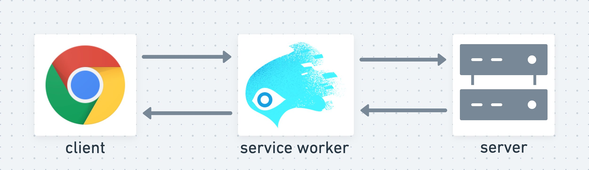

Service Workers are powerful and absolutely worth mastering. They'll enable you to deliver an entirely new level of experience to your users. Your site can load _instantly_. It can work _offline_. It can be installed as a native app, and feel every bit as polished, but with the reach and freedom of the web.

But Service Workers are unlike anything most of us web devs are used to. They come with a steep learning curve and a handful of snags you've got to watch out for.

The best way to ensure success with Service Workers is to have the right mindset when working with them. In this post we'll wrap our brains around the paradoxical traits that make Service Workers both tricky and awesome.

## The Same, but Different

While coding your Service Worker, many things will feel familiar. You get to use your favorite new JavaScript language features. You listen to lifecycle events just like with UI events. You manage control flow with promises like you're used to.

But other Service Worker behavior causes you to scratch your head in confusion. Especially when you refresh the page and don't see your code changes applied.

### A New Layer

Normally when building a site you have just two layers to think about: the client and the server. Service Worker is a brand new layer that sits in the middle.



Think of your Service Worker as a sort of _browser extension_ — one that your site can install in your users' browser. Once installed, the Service Worker _extends_ the browser for your site with a powerful middle layer. This Service Worker layer can intercept and handle all of the requests your site makes.

The Service Worker layer has its **own lifecycle** independent of the browser tab. A simple page refresh isn't enough to update it. Just like you wouldn't expect a page refresh to update code deployed on a server. Each layer has its own unique rules for updating.

In the [Service Workies](https://serviceworkies.com) game we cover the many details of the Service Worker lifecycle and give you a ton of practice working with it.



Think of your Service Worker as a new middle layer, with its own lifecycle and methods for updating.


## Powerful, but Limited

Having a Service Worker on your site gives you incredible benefits. Your site can:

- work flawlessly even when the user is offline
- gain massive performance improvements through [caching](https://developer.mozilla.org/en-US/docs/Web/API/Cache)
- use [push notifications](https://developers.google.com/web/fundamentals/push-notifications/)
- be installed as a [PWA](https://developers.google.com/web/progressive-web-apps/)

With as much as Service Workers can do, they are limited by design. They can't do anything synchronous or in the same thread as your site. So that means no access to:

- localStorage
- the DOM
- the window

The good news is there are a handful of ways your page can communicate with its Service Worker, including direct [postMessage](https://developer.mozilla.org/en-US/docs/Web/API/Client/postMessage), one-to-one [Message Channels](https://developer.mozilla.org/en-US/docs/Web/API/MessageChannel) and one-to-many [Broadcast Channels](https://developers.google.com/web/updates/2016/09/broadcastchannel).


Think of your Service Worker as something that lives outside of your page. You can talk to it, but it can't access your page directly.


## Long lived, but Short Lived

An active Service Worker goes on living even after a user leaves your site or closes the tab. The browser keeps this Service Worker around so that it will be ready the next time the user comes back to your site. Before the very first request is made, the Service Worker gets a chance to intercept it and take control of the page. This is what allows a site to work offline — the Service Worker can serve a cached version of the page itself, even if the user has no connection to the internet.

In [Service Workies](https://serviceworkies.com) we visualize this concept with Kolohe (a friendly Service Worker) intercepting and handling requests.


### Stopped

Despite Service Workers appearing to immortal, they can be **stopped** at almost any time. The browser doesn't want to waste resources on a Service Worker that isn't currently doing anything. Getting stopped isn't the same thing as getting _terminated_ — the Service Worker remains installed and activated. It's just put to sleep. The next time it's needed (e.g. to handle a request) the browser wakes it back up.

### waitUntil

Because of the constant possibility of getting put to sleep, our Service Worker needs a way to let the browser know when it's doing something important and doesn't feel like taking a nap. This is where `event.waitUntil()` comes into play. This method extends the lifecycle it's used in, keeping it both from being stopped and from moving on to the next phase of its lifecycle until we're ready. This gives us time to setup caches, fetch resources from the network, etc.

This example tells the browser that our Service Worker isn't done installing until the `assets` cache has been created and populated with the picture of a sword:

```js
self.addEventListener("install", event => {
  event.waitUntil(
    caches.open("assets").then(cache => {
      return cache.addAll(["/weapons/sword/blade.png"]);
    })
  );
});
```

### Watch out for Global State

When this start/stop happens the Service Worker's global scope is reset. So be careful not to use any global state in your Service Worker or you'll be sad the next time it wakes back up and has different state from what it was expecting.

Consider this example that uses some global state:

```js
const favoriteNumber = Math.random();
let hasHandledARequest = false;

self.addEventListener("fetch", event => {
  console.log(favoriteNumber);
  console.log(hasHandledARequest);
  hasHandledARequest = true;
});
```

On each request this Service Worker will log a number — let's say `0.13981866382421893`. The `hasHandledARequest` variable also changes to `true`. Now the Service Worker sits idle for a bit so the browser stops it. The next time there's a request, the Service Worker is needed again so the browser wakes it up. Its script is **evaluated again**. Now `hasHandledARequest` is reset to `false`, and `favoriteNumber` is something completely different — `0.5907281835659033`.

You can't rely on stored state in a Service Worker. Also creating instances of things like Message Channels can cause bugs: you'll get a brand new instance every time the Service Worker stops/starts.


This snag is especially important to keep in mind while working on your Service Worker code because when your DevTools are open, the start/stop behavior is disabled. You may not even see bugs caused by relying on global state until they've shipped to your users.


In [Service Workies chapter 3](https://gedd.ski/post/service-workies-chapter3/) we visualize our stopped Service Worker as losing all color while he hangs out waiting to be woken up.



Think of your Service Worker as a [whippet](https://www.akc.org/dog-breeds/whippet/) dog. He's fast, loyal and awesome. He'll stick around by your side no matter what. But mostly he just wants to sleep. All the time. You've got to let him know when you want him to stay awake. Good boy!


## Together, but Separate

Your page can only be _controlled_ by one Service Worker at a time. But it can have two Service Workers _installed_ at once. When you make a change to your Service Worker code and refresh the page, you aren't actually editing your Service Worker at all. Service Workers are _immutable_. You're instead making a brand new one. This new Service Worker (let's call it SW2) will _install_ but it won't _activate_ yet. It has to _wait_ for the current Service Worker (SW1) to terminate (when your user leaves your site).

### Messing with Another Service Worker's Caches

While installing, SW2 can get things setup — usually creating and populating caches. But heads up — this new Service Worker has access to everything that the current Service Worker has access to. If you're not careful, your new waiting Service Worker can really mess things up for your current Service Worker. Some examples that could cause you trouble:

- SW2 could delete a cache that SW1 is actively using
- SW2 could edit the contents of a cache that SW1 is using, causing SW1 to respond with assets that the page isn't expecting

### Skip skipWaiting

A Service Worker can also use the risky `skipWaiting()` method to take control of the page as soon as it's done installing. This is generally a bad idea unless you're intentionally trying to replace a buggy Service Worker. The new Service Worker might be using updated resources that the current page isn't expecting, leading to errors & bugs.

### Start Clean

The way to prevent your Service Workers from clobbering each other is to make sure they use different caches. The easiest way to accomplish that is to version the cache names they use.

```js
const version = 1;
const assetCacheName = `assets-${version}`;

self.addEventListener("install", event => {
  caches.open(assetCacheName).then(cache => {
    // confidently do stuff with your very own cache
  });
});
```

When you deploy a new Service Worker, you'll bump the `version` so that it does what it needs with an entirely separate cache from the previous Service Worker.


### End Clean

Once your Service Worker reaches the `activated` state, you know it has taken over and the previous Service Worker is redundant (no longer used). At this point it's important to clean up after the old Service Worker. Not only is is polite to your users' cache storage limits, but it can also prevent unintentional bugs.

The [caches.match](https://developer.mozilla.org/en-US/docs/Web/API/CacheStorage/match) function is an often used shortcut for retrieving an item from _any_ cache where there's a match. But it iterates through the caches in the order they were **created**. So let's say you've got two versions of a script file `app.js` hanging out in two different caches — `assets-1` and `assets-2`. Your page is expecting the newer script that's stored in `assets-2`. But if you haven't deleted the old cache, `caches.match('app.js')` is going to return the old one from `assets-1` and most likely break your site.

All it takes to clean up after previous Service Workers is to delete any cache this new Service Worker doesn't use:

```js
const version = 2;
const assetCacheName = `assets-${version}`;

self.addEventListener("activate", event => {
  event.waitUntil(
    caches.keys().then(cacheNames => {
      return Promise.all(
        cacheNames.map(cacheName => {
          if (cacheName !== assetCacheName){
            return caches.delete(cacheName);
          }
        });
      );
    });
  );
});

```

It takes just a bit of work and disciple to keep your Service Workers isolated, but it's definitely worth it.


Think of the combination of your Service Worker and your site as an [installable](https://web.dev/installable) app. Each version should work. Each version should be separate from the others. Imagine how buggy a game like Overwatch would be if Blizzard accidentally released a patch that used new game logic but outdated assets. You'd rage on the forums so fast! Keep your app versions tidy & clean.


## Service Worker Mindset

Getting into the right mindset while thinking about Service Workers will help you build yours with confidence. Once you get the hang of them you'll be able to create incredible experiences for your users.

If you want to master all this by [playing a game](https://gedd.ski/post/mastery-through-play/), then you're in luck! [Google Developers](https://twitter.com/ChromiumDev) and I collaborated on a project — [Service Workies](https://serviceworkies.com) where you master the ways of the Service Worker to slay the offline beasts. Go check it out!


