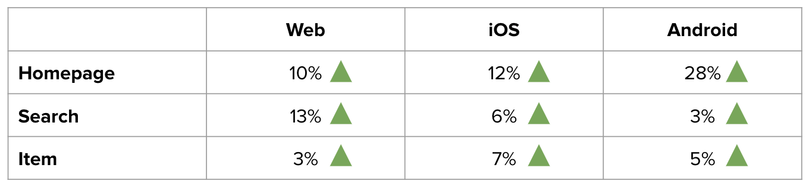
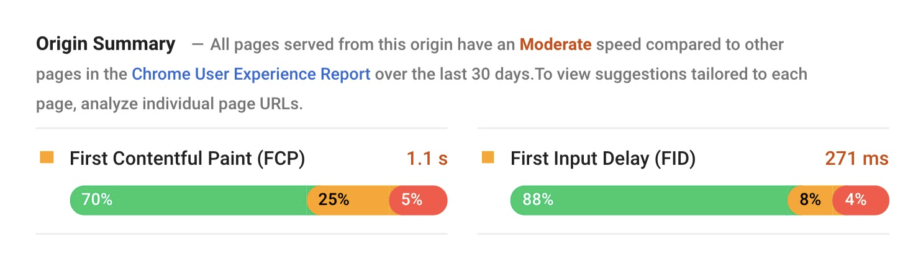
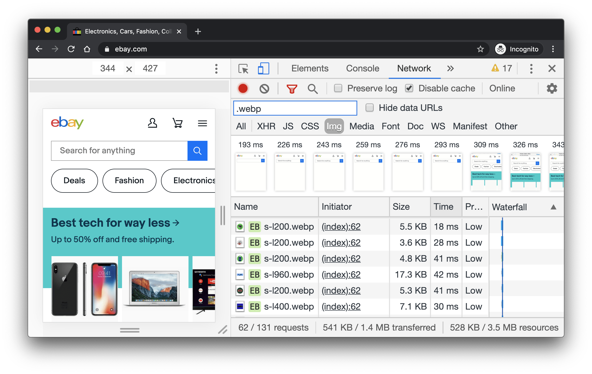
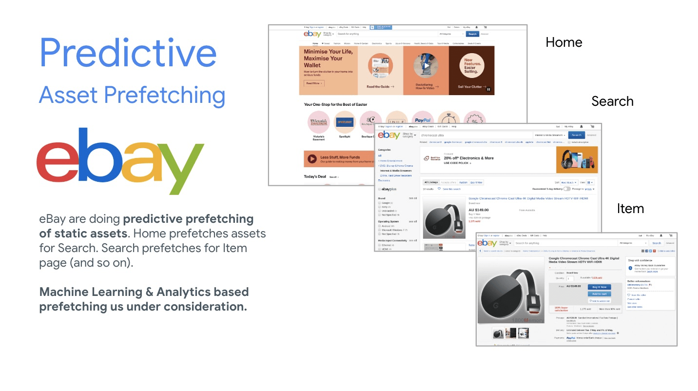
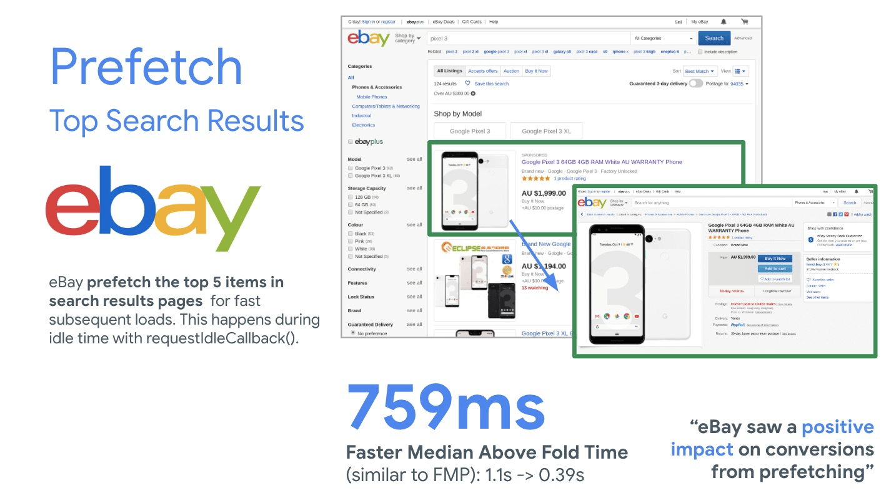
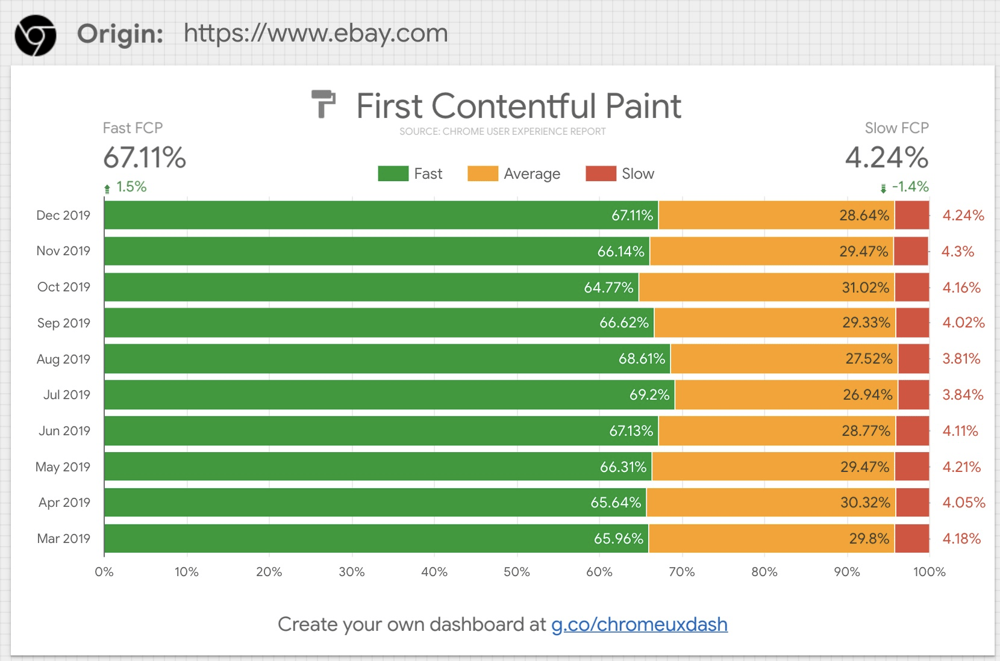

Speed was a [company-wide](https://tech.ebayinc.com/engineering/speed-by-a-thousand-cuts/) initiative for eBay in 2019, with many teams determined to make the site and apps as fast as possible for users. In fact, **for every 100 milliseconds improvement in search page loading time, eBay saw a 0.5% increase in "Add to Cart" count.**

Through the adoption of [Performance Budgets](https://web.dev/performance-budgets-101/) (derived after doing a competitive study with the [Chrome User Experience Report](https://developers.google.com/web/tools/chrome-user-experience-report)) and a focus on key user-centric performance metrics, eBay were able to make significant improvements to site speed. 

<figure class="w-figure">
  
  <figcaption class="w-figcaption">
    
  </figcaption>
</figure>

...and their Chrome User Experience Report data highlights this too.

<figure class="w-figure">
  
  <figcaption class="w-figcaption">
    Chrome User Experience Report data for <a href="https://web.dev/fcp/">First Contentful Paint</a> and <a href="https://web.dev/fid/">First Input Delay</a> for the eBay.com origin.
  </figcaption>
</figure>

There's still more work ahead but we thought we would share eBay's learnings so far.

# Web Performance "cuts"

The improvements eBay made were possible due to the reduction or cuts (in size and time) of various entities that take part in a user's journey.  We selected a topics from their work that would resonate with the community at large, rather than being eBay specific:

## Reduce payload across all textual resources

One way to make sites fast is to simply load less code. eBay reduced their textual payloads by trimming all the [unused and unnecessary bytes](https://web.dev/remove-unused-code/) of JavaScript, CSS,  HTML, and JSON responses served to users. Previously, with every new feature, eBay kept increasing the payload of their responses, without cleaning up what was unused. This added up over time and becomes a performance bottleneck. Teams usually procrastinated on this cleanup activity, but you would be surprised by the savings. The cut here is the wasted bytes in the response payload.

## Critical path optimization for above the fold content

Not every pixel on the screen is equally important. The content above the fold (ATF) is obviously [more critical](https://web.dev/extract-critical-css/) than something below the fold. Native and web apps are aware of this, but what about services? eBay’s service architecture has a layer called [Experience Services](https://tech.ebayinc.com/engineering/experience-services-ebays-solution-to-multi-screen-application-development/), which the frontends (native apps and web servers) talk to. 

This layer is specifically designed to be view- or device-based, rather than entity-based like item, user, or order. eBay then introduced the concept of the critical path for Experience Services. The idea is that when a request comes to these services, they work on getting the data for above the fold content immediately, by calling other upstream services in parallel. Once data is ready, it is instantly flushed. 

The below the fold data is sent in a later chunk or lazy-loaded. The outcome: users get to see above the fold content quicker. The cut here is the time spent by services to display relevant content.

## Image optimizations

Images are one the [largest](https://almanac.httparchive.org/en/2019/media) contributors to page bloat, and this is even true for eCommerce. Even the smallest optimization will go a long way. eBay did two optimizations for images. First, eBay standardized on the [WebP image format](https://web.dev/serve-images-webp/) for search results across all platforms. The search results page is the most image-heavy page at eBay, and they were already using WebP, but not in a consistent pattern. 

<figure class="w-figure">
  
  <figcaption class="w-figcaption">
    WebP images being served to supported browsers on eBay.com.
  </figcaption>
</figure>

Through this initiative, eBay made WebP the image format across iOS, Android, and supported browsers. Second, though eBay’s listing images are heavily optimized (size and format), the same rigor did not apply for curated images (for example, the top module on the [homepage](https://www.ebay.com/)). eBay has a lot of hand-curated images, which are uploaded through various tools. Previously the optimizations were up to the uploader, but now eBay enforces the rules within the tools, so all images uploaded will be optimized appropriately. The cut here is the wasted image bytes sent to users.

## Predictive prefetch of static assets

A user session on eBay is just not one page. It is a flow. For example, the flow can be a homepage navigation to search to item. So why don’t pages in the flow help each other? That is the idea of [predictive prefetch](https://web.dev/predictive-prefetching/), where one page prefetches the static assets required for the next likely page. 

So when a user navigates to the predicted page, the assets are already in the browser cache. This is done for CSS and JavaScript assets, where the URLs can be retrieved ahead of time. One thing to note here is that it helps only on first-time navigations, as for subsequent ones, the static assets will already be in the cache. The cut here is the network time for CSS and JavaScript static assets on the first navigation.

<figure class="w-figure">
  
  <figcaption class="w-figcaption">
    eBay are doing predictive prefetching of static assets. Home prefetches assets for Search. Search prefetches for the Item pages and so on.
  </figcaption>
</figure>

## Prefetching top search results

When a user searches eBay, it is highly likely that they will navigate to an item in the top 10 of the search results. eBay’s analytics data support this statement. So they went ahead and prefetched the items from search and kept it ready when the user navigates. The prefetching happens at two levels. One on the server-side, where item service caches the top 10 items in search results. When the user goes to one of those items, eBay save server processing time. 

Server-side caching is leveraged by native apps and is rolled out globally. The other happens at browser level cache, which is available in Australia. Item prefetch was an advanced optimization due to the dynamic nature of items. There are also many nuances to it — page impressions, capacity, auction items, etc. You can learn more about it in this [talk](https://www.youtube.com/watch?v=ogEhUnQdQiU&t=984s), or watch for a detailed blog post. The cut here can either be server processing time or network time, depending on where the item is cached.

<figure class="w-figure">
  
  <figcaption class="w-figcaption" loading="lazy">
    eBay prefetch the top 5 items in search results pages for fast subsequent loads. This happens during idle time with <a href="https://developer.mozilla.org/en-US/docs/Web/API/Window/requestIdleCallback">requestIdleCallback()</a>.
  </figcaption>
</figure>

## Search images eager download

In the search results page, when a query is issued at a high level, two things happen. One is the recall/ranking step, where the most relevant items matching the query are returned. The second step is augmenting the recalled items with additional user-context related information such as shipping. Previously the search results were rendered only after both the steps were done. 

It is still the same now, but after the first step, eBay immediately send the first 10 item images to the browser in a chunk along with the header, so the downloads can start before the rest of the markup arrives. As a result, the images will now appear quicker. This change is rolled out globally for the web platform. The cut here is the download start time for search results images.

## Autosuggest edge caching

When users type in letters in the search box, suggestions pop-up. These suggestions do not change for letter combinations for at least a day. They are ideal candidates to be cached and served from a [CDN](https://en.wikipedia.org/wiki/Content_delivery_network) (for a max of 24 hours), instead of requests coming all the way to a data center. International markets will especially benefit from CDN caching. 

<figure class="w-figure">
  
  <figcaption class="w-figcaption">
    eBay's search box where edge caching for autosuggest helped improve performance.
  </figcaption>
</figure>

There was a catch, though. eBay had some elements of personalization in the suggestions pop-up, which goes against caching. Fortunately, it was not an issue in the native apps, as the user interface for personalization and suggestions can be separated. For the web, in international markets, latency was more important than the small element of personalization. With that out of the way, eBay now have autosuggestions served from a CDN cache globally for native apps and non-US markets for eBay. The cut here is the network latency and server processing time for autosuggestions.

## Homepage unrecognized users edge caching

For the web platform, the homepage content for unrecognized users is the same for a particular region. These are users who are either first-time to eBay or start with a fresh session, hence no personalization. Though the homepage creatives keep changing frequently there is still room for caching. 

So eBay decided to cache the unrecognized user content (HTML) on their edge network ([PoPs](https://en.wikipedia.org/wiki/Point_of_presence)) for a short period. First-time users can now get homepage content served from a server near them, instead of from a data center. eBay are still experimenting with this in international markets, where it will have a bigger impact. The cut here is again both network latency and server processing time for unrecognized users.

## Optimizations for other platforms

### Native app parsing improvements

Native apps (iOS and Android) talk to backend services whose response format is typically JSON. These JSON payloads can be large. Instead of parsing the whole JSON to render something on the screen, eBay introduced an efficient parsing algorithm that optimizes for content that needs to be displayed immediately. 

Users can now see the content quicker. In addition, for the Android app, eBay start initializing the search view controllers as soon as the user starts typing in the search box. Previously this happened only after they press the search button. Now users can get to their search results faster (iOS already had this optimization). The cut here is the time spent by devices to display relevant content.

### Native apps startup time improvements

This applies to [cold start](https://developer.android.com/topic/performance/vitals/launch-time#cold) time optimizations for native apps, in particular, Android. When an app is cold started, a lot of initialization happens both at the OS level and application level. Reducing the initialization time at the application level helps users see the home screen quicker. eBay did some profiling and noticed that not all initializations are required to display content and that some can be done lazily. 

More importantly, eBay observed that there was a blocking third-party analytics call that delayed the rendering on the screen. Removing the blocking call and making it async further helped for example cold start times. The cut here is the unnecessary startup time for native apps.

## Conclusions

All the performance cuts eBay made collectively contributed towards moving the needle, and it happened over a period of time. The releases were phased in throughout the year, with each release shaving off tens of milliseconds, ultimately reaching the point where eBay are now:

<figure class="w-figure">
  
  <figcaption class="w-figcaption">
    Impact of eBay's speed efforts on their field metrics over time, illustrated with the <a href="https://g.co/chromeuxdash">Chrome UX Report Dashboard</a>
  </figcaption>
</figure>

Performance is a feature and a [competitive edge](https://web.dev/value-of-speed/). Optimized experiences lead to higher user engagement, conversions, and ROI. In eBay's case, these optimizations varied from things that were low-effort to a few that were advanced. We hope you found this summary helpful.

Check out [Speed by a thousand cuts](https://tech.ebayinc.com/engineering/speed-by-a-thousand-cuts/) to learn more and watch out for more detailed articles on their performance work in the near future.

