If users ever need to log in to your site, then good sign-in form design is
critical. This is especially true for people on poor connections, on mobile, in
a hurry, or under stress. Poorly designed sign-in forms get high bounce rates.
Each bounce could mean a lost and disgruntled user—not just a missed sign-in
opportunity.

<!-- Stats for sign-up/sign-in bounce rates. -->

If you would prefer to learn these best practices with a hands-on tutorial,
check out the Sign-in best practices codelab.

Here is an example of a sign-in form that demonstrates all of the best practices:

<!-- Add Glitch. -->

## Checklist

* [Use meaningful HTML elements](#use-meaningful-html): `<form>`, `<input>`,
  `<label>`, and `<button>`.
* [Label every input with a `<label>`](#use-label).
* Use element attributes to [access built-in browser
  features](#element-attributes): `type`, `name`, `autocomplete`, `required`,
  `autofocus`.
* [Use `name="new-password"`](#new-password) for a sign-up password input and
  for the new password in a "Change password" form.
* [Use `autocomplete="current-password"`](#current-password) for a sign-in
  password input.
* [Don't use autocomplete for a new password](#no-new-password-autocomplete).
* [Provide **Show password** functionality](#show-password).
* [Use **aria-label** and **aria-describedby**](#accessible-password-inputs) for
  password inputs.
* [Don't double up inputs](#no-double-inputs).
* Design forms so the [mobile keyboard doesn't obscure inputs or
  buttons](#keyboard-obscures-form).
* Ensure forms are usable on mobile: [legible text](#size-text-correctly),
  inputs and buttons [large enough to work as touch targets](#size-correctly).
* [Display links to your Terms of Service and privacy policy
  documents](#tos-privacy-policy).
* [Maintain site style and include branding](#branding) (logo and name) on your
  sign-up and sign-in form pages. 
* [Test in the field as well as the lab](#analytics-rum): build page analytics,
  interaction analytics and user-centric performance measurement into your
  sign-up and sign-in flow.
* [Test across browsers and devices](#range-of-devices): form behaviour varies
  significantly across platforms.



This article is about frontend best practice. It does not explain how to build backend services to authenticate users, store their credentials or manage their accounts.

[12 best practices for user account, authorization and password management](https://cloud.google.com/blog/products/gcp/12-best-practices-for-user-account) outlines core principles for running your own backend.

If you have users in different parts of the world, you need to consider localizing your site's use of third party identity services as well as its content.



## Use meaningful HTML {​: #use-meaningful-html }

Use elements built for the job: `<form>`, `<label>` and `<button>`. These enable built-in browser functionality, improve accessibility, and add meaning to your markup.

### Use &lt;form&gt; {​: #use-form }

You might be tempted to wrap inputs in a `<div>` and handle input data submission purely with JavaScript. It's generally better to use a plain old `<form>`. This makes your site accessible to screenreaders and other assistive devices, and enables a range of built-in browser features (see below).

An HTML form makes it simpler to build basic functional sign-in for older browsers, and to enable sign-in even if JavaScript fails.

### Use &lt;label&gt; {​: #use-label }
To label an input, use a `<label>`!

```html
<label for="email">Email</label>
<input id="email" …>
```

Two reasons:
* A tap or click on a label moves focus to its input. Associate a label with an input by using the label's `for` attribute with the input's `name` or `id`.
* Screenreaders announce label text when the label or the label's input gets focus.

Don't use placeholders as input labels. People are liable to forget what the input was for once they've started entering text, especially if they get distracted. (Was I entering an email address, a phone number, or an account ID?) There are lots of other potential problems with placeholders: see [Don't Use The Placeholder Attribute](https://www.smashingmagazine.com/2018/06/placeholder-attribute/) and [Placeholders in Form Fields Are Harmful](https://www.nngroup.com/articles/form-design-placeholders/) if you're unconvinced.

It's probably best to put your labels above your inputs. This enables consistent design across mobile and desktop and, according to [Google AI research](https://ai.googleblog.com/2014/07/simple-is-better-making-your-web-forms.html), enables quicker scanning by users. You get full width labels and inputs, and you don't need to adjust label and input width to fit the label text.


Try out the example at [glitch.com/edit/#!/label-position](https://glitch.com/edit/#!/label-position) on mobile.


<figure class="w-figure">
  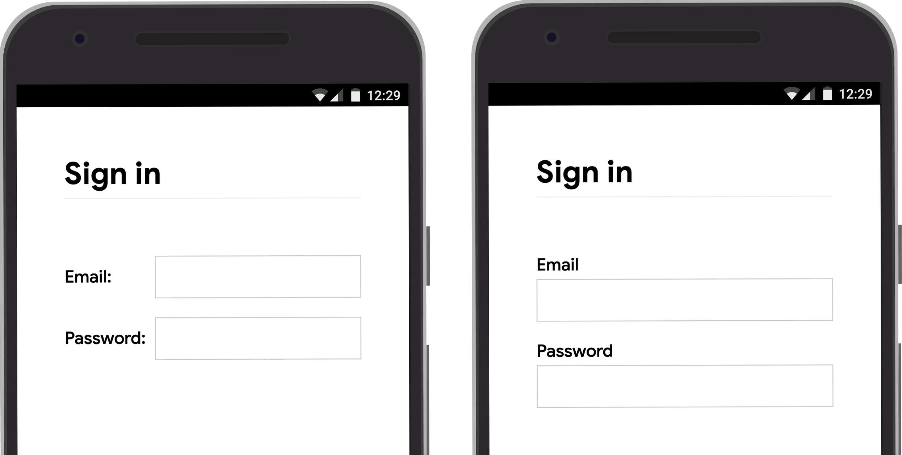
  <figcaption class="w-figcaption">Label and input width is limited when both are on the same line.</figcaption>
</figure>

### Use &lt;button&gt; {​: #use-button }

Use buttons for buttons! Button elements provide accessible behaviour and built-in form submission functionality, and they can easily be styled. There's no point in using a div or some other element pretending to be a button. 

Give the submit button in a sign-up or sign-in form a value that says what it does, such as **Create account** or **Sign in**, not **Submit** or **Start**.

Consider disabling the **Sign in** button once the user has tapped or clicked it. [Many users click buttons multiple times](https://baymard.com/blog/users-double-click-online) even on sites that are fast and responsive. That slows down interactions and adds to server load.

Conversely, don't disable form submission awaiting user input. (For example, don't disable the **Sign in** button if users haven't entered their customer PIN.)  Users may miss out something in the form, then try repeatedly tapping the (disabled) **Sign in** button and think it's not working. At the very least, if you must disable form submission, explain to the user what's missing when they click on the disabled button.


The default type for a button in a form is `submit`.

If you want to add another button in a form (for **Show password**, for example) add `type="button"`. Otherwise clicking or tapping on it will submit the form.



### Don't double up inputs {​: #no-double-inputs }

Some sites force users to enter emails or passwords twice.

That might reduce errors for a few users, but causes extra work for *all* users, and [increases abandonment rates](https://uxmovement.com/forms/why-the-confirm-password-field-must-die/). Better to enable users to confirm their email address (you'll need to do that anyway) and make it easy for them to reset their password.

[Do we stats for this?]


## Make the most of element attributes {​: #element-attributes }

This is where the magic really happens!

Browsers have multiple helpful built-in features that use input element attributes.


### Help users start faster {​: #autofocus }

Add an `autofocus` attribute to the first input in your login form. That makes it clear where to start and, on desktop at least, means users don't have to select the input to start typing.

<figure class="w-figure">
  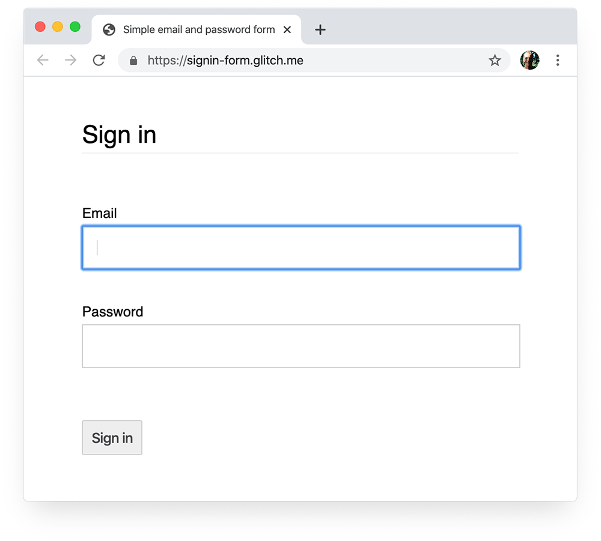
  <figcaption class="w-figcaption">Autofocus provides clear visual focus on desktop.</figcaption>
</figure>

## Keep passwords private—but enable users to see them if they want {​: #show-password }

Passwords inputs should have `type="password"` to hide password text. 

Using `<input type="password">` also means that browsers such as Firefox offer to save your password when a form is submitted (along with using the `name` and `id` attributes to guess the meaning of form inputs).

However, you should add a **Show password** icon or button to enable users to check the text they've entered—and don't forget to add a **Forgot password** link. (See [Enable password display](#enable-password-display).)

<figure class="w-figure">
  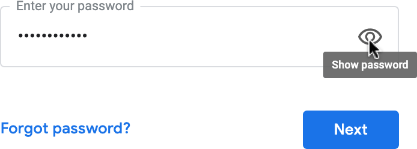
  <figcaption class="w-figcaption">Password input from the Google sign-in form: with <strong>Show password</strong> icon and <strong>Forgot password</strong> link.</figcaption>
</figure>

## Give mobile users the right keyboard {​: #mobile-keyboard }

Use `<input type="email">` to give mobile users an appropriate keyboard and enable basic built-in email address validation by the browser (no JavaScript required!)

If you need to use a telephone number instead of an email address, `<input type="tel">` enables a telephone keypad on mobile. You can also use the `inputmode` attribute where necessary: `inputmode="numeric"` is ideal for PIN numbers. [Everything You Ever Wanted to Know About inputmode](https://css-tricks.com/everything-you-ever-wanted-to-know-about-inputmode/) has more detail.


`type="number"` adds an up/down arrow to increment numbers, so don't use it for numbers that aren't meant to be incremented, such as ID and account numbers.


### Prevent mobile keyboard from obscuring the "Sign in" button {​: #keyboard-obscures-form }

Unfortunately, if you're not careful, mobile keyboards may cover your form or, worse, partially obscure the **Sign in** button. Users may give up before realizing what has happened.

<figure class="w-figure">
  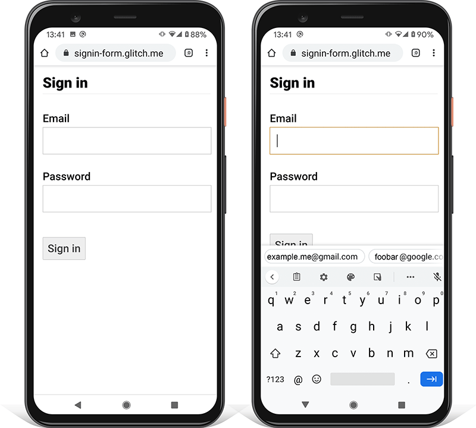
  <figcaption class="w-figcaption">The "Sign in" button: now you see it, now you don't.</figcaption>
</figure>

Where possible, avoid this by displaying only the email/phone and password inputs and **Sign in** button at the top of your sign-in page. Put other content below.

<figure class="w-figure">
  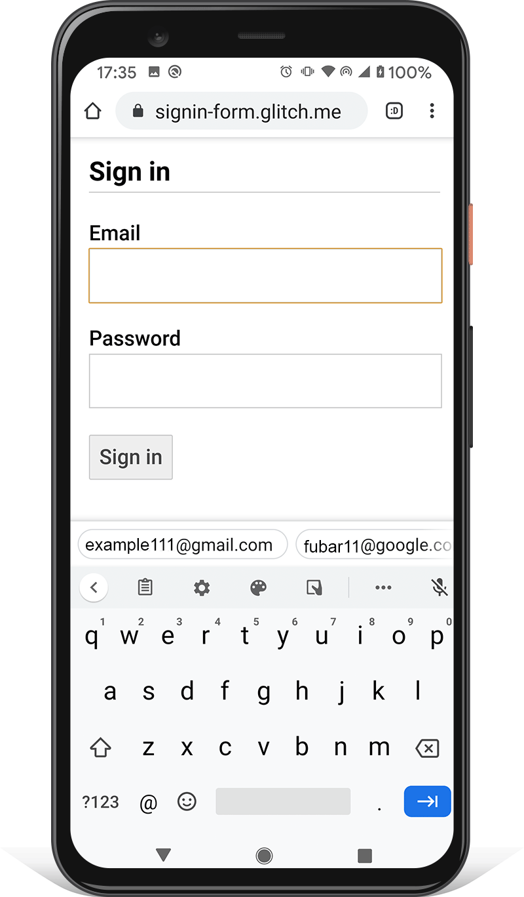
  <figcaption class="w-figcaption">The keyboard doesn't obscure the "Sign in" button.</figcaption>
</figure>

{​: #range-of-devices }

You'll need to test on a range of devices for your target audience, and adjust accordingly. BrowserStack enables [free testing for open source projects](https://www.browserstack.com/open-source) on a range of real devices and browsers.

<figure class="w-figure">
  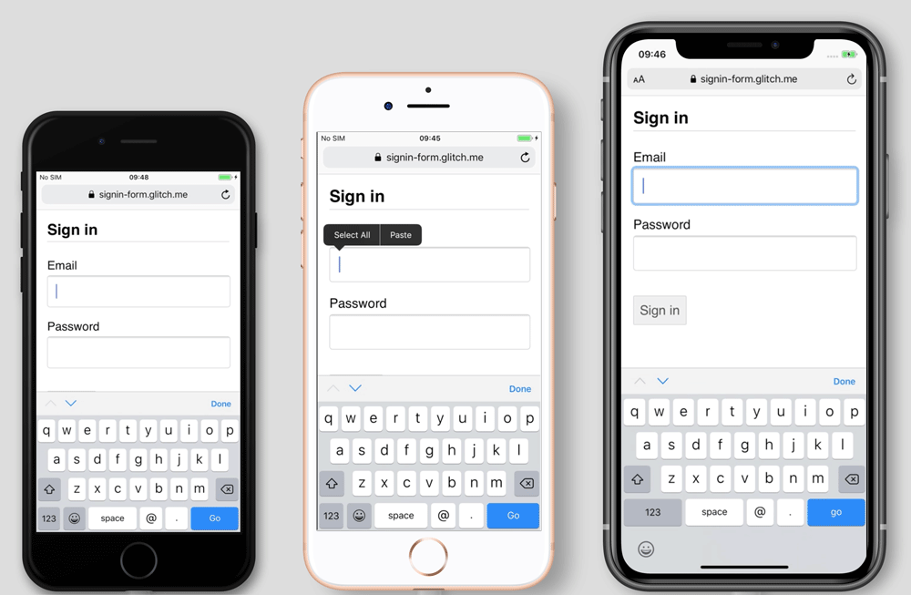
  <figcaption class="w-figcaption">The "Sign in" button: obscured on iPhone 7 and 8, but not on iPhone 11.</figcaption>
</figure>

{​: #use-two-pages }

Some sites (including Amazon and eBay) avoid the problem by asking for email/phone and password on two 'pages'. This approach also simplifies the experience: the user is only tasked with one thing at a time.

<figure class="w-figure">
  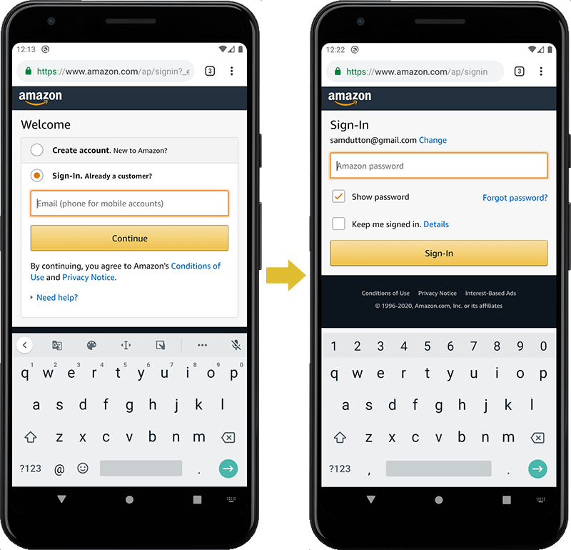
  <figcaption class="w-figcaption">Two-stage sign-in: email or phone, then password.</figcaption>
</figure>


### Help users avoid re-entering data {​: #autofill }

You can help browsers help users by autofilling inputs. This is particularly important for email inputs, which get [high abandonment rates](https://www.formisimo.com/blog/conversion-rate-increases-57-with-form-analytics-case-study/).

[Add something to refute warnings **against** autocomplete?]

There are two parts to this:
1. The input `name` attribute helps browsers store data for email and other input types for use with `autocomplete`. Some browsers, including Firefox, also take note of the `id` and `type` attributes.
2. The `autocomplete` attribute enables browsers to autofill inputs using data stored using the `name` attribute.

You need different behaviour for password inputs in sign-up and sign-in forms. 

{​: #no-new-password-autocomplete }

Don't add autofill to a password input in a sign-up form. The browser may already have a password stored for the site, and autofilling a password doesn't make sense on sign-up: for example, if two people share the same device and one wants to create a new account.

{​: #new-password }

Use the appropriate password input name to help the browser differentiate between new and current passwords:
* `name="new-password"` for the password input in a sign-up form, or the new password in a change-password form. This tells the browser that you want it to store a new password for the site.

{​: #current-password }

* `name="current-password"` for the password input in a sign-in form, or the input for the user's old password in a change-password form. This tells the browser that you want it to use the current password that it has stored for the site. 

For a sign-up form, code should look like this:

```html
<input name="new-password" type="password" …>
```

For sign-in:

```html
<input name="current-password" type="password" autocomplete="current-password" …>
```

{​: #password-managers }

Different browsers handle email autofill and password suggestion somewhat differently, but the effect is much the same. On Safari 11 and above on desktop, for example, the password manager is displayed, and then biometric authentication (fingerprint or facial recognition) is used if available.

<figure class="w-figure">
  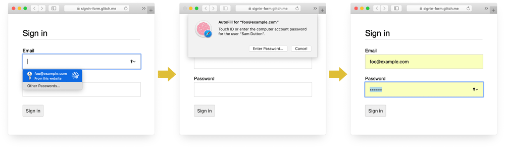
  <figcaption class="w-figcaption">Sign-in with autocomplete—no text entry required!</figcaption>
</figure>

Chrome on desktop displays email suggestions depending on what you type, shows the password manager, then autofills the password.

<figure class="w-figure">
  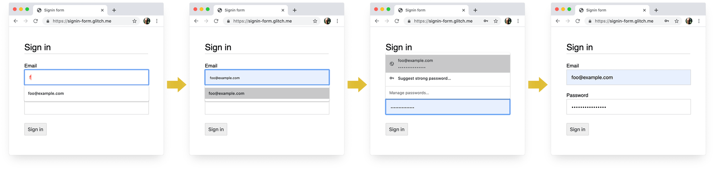
  <figcaption class="w-figcaption">Autocomplete sign-in flow in Chrome. (These screenshots show Chrome 83.)</figcaption>
</figure>



Browser password and autofill systems are not simple.

The algorithms for guessing, storing and displaying values are not standardized, and vary from platform to platform.

For example, as pointed out by [Hidde de Vries](https://hiddedevries.nl/en/blog/2018-01-13-making-password-managers-play-ball-with-your-login-form): "Firefox's password manager complements [its heuristics](https://dxr.mozilla.org/firefox/source/toolkit/components/passwordmgr/src/nsLoginManager.js#626) with a [recipe system](https://bugzilla.mozilla.org/show_bug.cgi?id=1119454).


[Autofill: What web devs should know, but don't](https://cloudfour.com/thinks/autofill-what-web-devs-should-know-but-dont) has a lot more information about using `name` and `autocomplete`. The [HTML spec](https://html.spec.whatwg.org/multipage/form-control-infrastructure.html#inappropriate-for-the-control) lists all 59 possible values.


### Enable the browser to suggest a strong password {​: #enable-browser-password-suggestion }

Modern browsers suggest a strong password if `autocomplete="new-password"` is included for the password input in a sign-up form.

Here's how Safari does it on desktop.

<figure class="w-figure">
  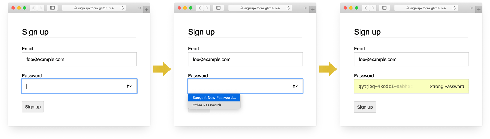
  <figcaption class="w-figcaption">Password suggestion flow in Safari. (Strong unique password suggestion has been available in Safari since version 12.0.)</figcaption>
</figure>

Using built in browser password generators means users and developers don't need to work out what a 'strong password' is. Since browsers can securely store passwords and autofill them as necessary, there's no need for users to remember or enter passwords.


The downside with this approach is that there's no way to share passwords across platforms.

For example, a user may use Safari on their iPhone and Chrome on their Windows laptop.

[So what's our advice?]


{​: #use-required-attribute }

### Help save users from accidentally missing input fields

Add the `required` attribute to both email and password fields.

Modern browsers automatically prompt and set focus for missing data. 

No JavaScript required!

<figure class="w-figure">
  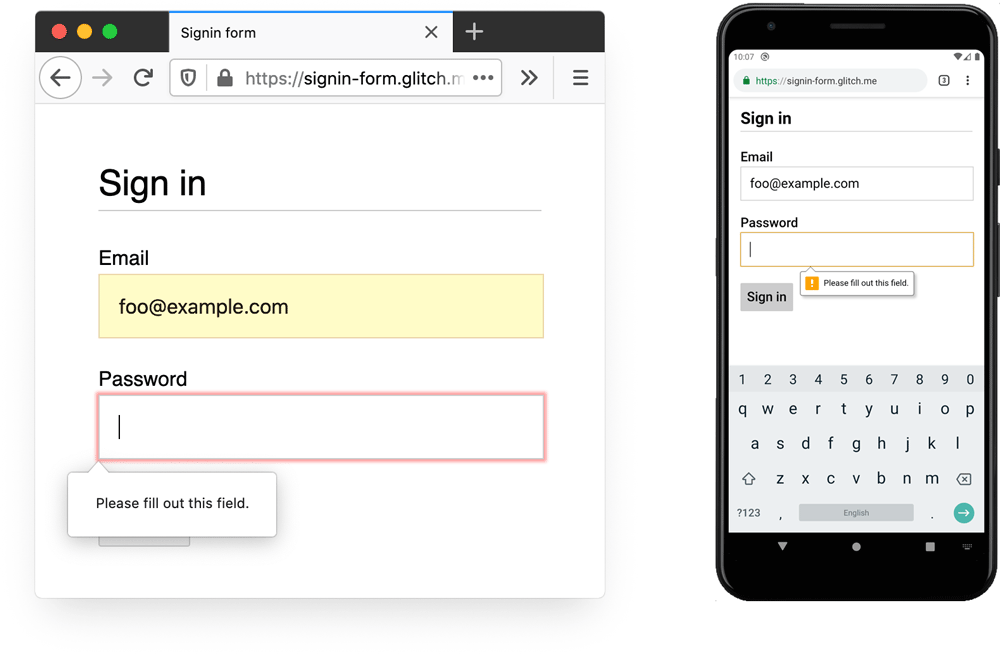
  <figcaption class="w-figcaption">Prompt and focus for missing data, desktop Firefox and Chrome for Android. (The screenshots show Firefox 76 and Chrome 83.)</figcaption>
</figure>


## Design for fingers and thumbs {​: #design-for-mobile }

[Do we have any stats for form filling on mobile versus desktop?]

The default browser size for just about everything relating to input elements and buttons is too small, especially on mobile. 

This may seem obvious, but it's a common problem with sign-in forms on many sites.


### Make sure inputs and buttons are large enough {​: #size-correctly }

The default size and padding for inputs and buttons is too small on desktop and even worse on mobile.

<figure class="w-figure">
  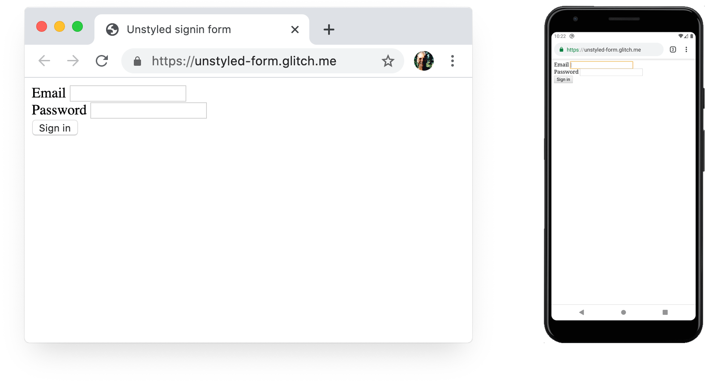
  <figcaption class="w-figcaption">Default styling on desktop and mobile: inputs and buttons are too small.</figcaption>
</figure>


According to [Android accessibility guidance](https://support.google.com/accessibility/android/answer/7101858?hl=en-GB) the recommended target size for touchscreen objects is 7–10 mm. Apple interface guidelines suggest 48x48 px, and the W3C suggest [at least 44x44 CSS pixels](https://www.w3.org/WAI/WCAG21/Understanding/target-size.html). On that basis, add (at least) about 15 px of padding to input elements and buttons for mobile, and around 10 px on desktop. Try this out with a real mobile device and a real finger or thumb. You should comfortably be able to tap each of your inputs and buttons.

The [Tap targets are not sized appropriately](https://web.dev/tap-targets/) Lighthouse audit can help you automate the process of detecting input elements that are too small.

{​: #design-for-thumbs }


Design for thumbs.

Search for [touch target](https://www.google.com/search?q=touch+target) and you'll see lots of pictures of forefingers. However, in the real world, many people use their thumbs to interact with phones.

Thumbs are bigger than forefingers, and control is less precise. All the more reason for adequately sized touch targets.


### Make text big enough {​: #size-text-correctly }

As with size and padding, the default browser font size for input elements and buttons is too small, particularly on mobile.

<figure class="w-figure">
  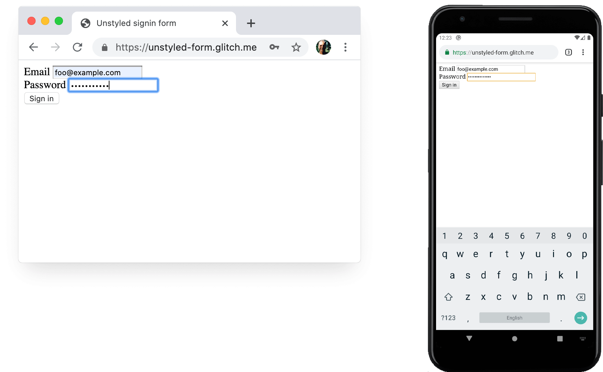
  <figcaption class="w-figcaption">Default styling on desktop and mobile: input text is too small to be legible for many users.</figcaption>
</figure>

Browsers on different platforms size fonts differently, so it's difficult to specify a particular font size that works well everywhere. A quick survey of popular websites shows sizes of 13–16 px on desktop: matching that physical size is a good minimum for text on mobile.

This means you need to use a larger pixel size on mobile: 16 px on Chrome on desktop is quite legible, but even with good vision it's difficult to read 16 px text on Chrome on Android. You can set different font pixel sizes for different viewport sizes using [media queries](https://developers.google.com/web/fundamentals/design-and-ux/responsive#apply_media_queries_based_on_viewport_size). 20 px is about right on mobile—but you should test this out with friends or colleagues who don't have 20/20 vision.

The [Document doesn't use legible font sizes](https://web.dev/font-size/) Lighthouse audit can help you automate the process of detecting text that's too small.


Unfortunately, autofill text (on Chrome for Android, at least) is small, and can't be sized with CSS.

There's a bug for this at [crbug.com/953689](https://crbug.com/953689). If you think this is important, star it!



### Provide enough space between inputs {​: #size-margins-correctly }

Add enough margin to make inputs work well as touch targets. In other words, aim for about a finger width of margin.


### Make sure your inputs are clearly visible {​: #ensure-inputs-visible }

The default border styling for inputs makes them hard to see. They're almost invisible on some platforms such as Chrome for Android.

As well as padding, add a border: on a white background, a good general rule is to use #ccc or darker.

<figure class="w-figure">
  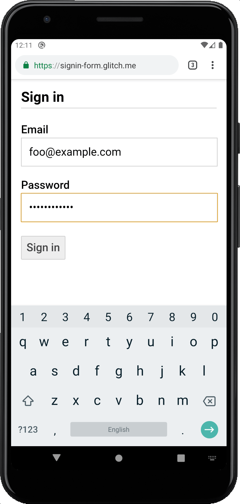
  <figcaption class="w-figcaption">Legible text, visible input borders, adequate padding and margins.</figcaption>
</figure>


### Use built-in browser features to warn of invalid input values {​: #use-built-in-validation }

Browsers have built-in features to do basic form validation for inputs with a `type` attribute.

Browsers warn when you submit a form with an invalid value, and set focus on the problematic input.

<figure class="w-figure">
  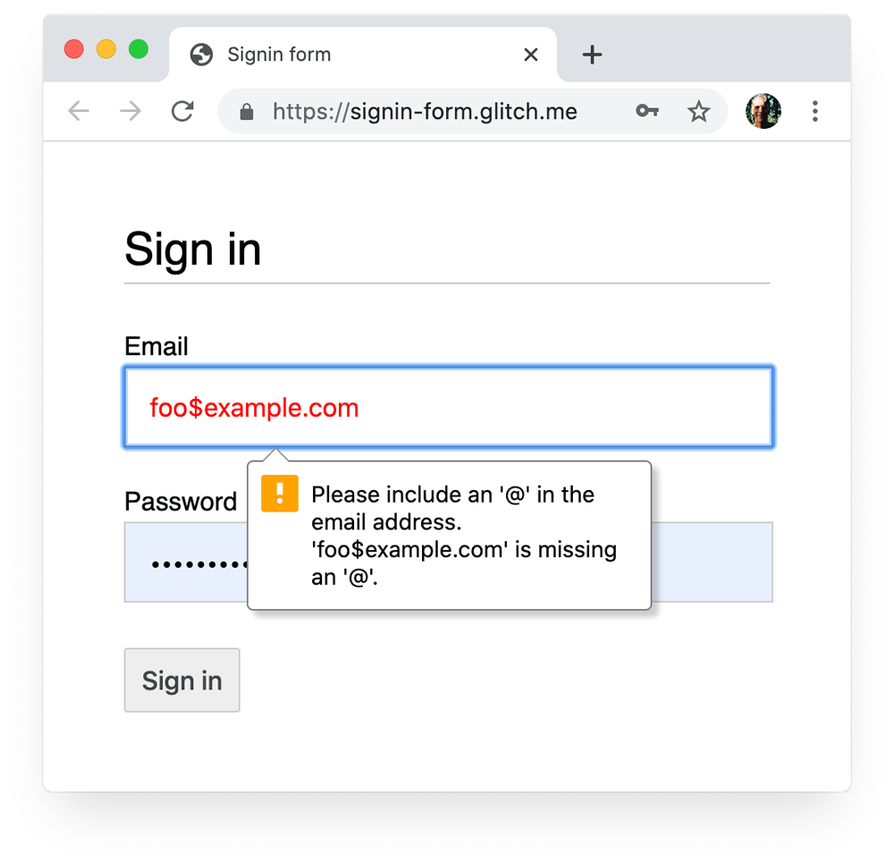
  <figcaption class="w-figcaption">Basic built-in validation by the browser.</figcaption>
</figure>

You can use the :invalid CSS selector to highlight invalid data. Use `:not(:placeholder-shown)` to avoid selecting inputs with no content. 

```css
input[type=email]:not(:placeholder-shown):invalid {
  color: red;
  outline-color: red;
}
```


## Use JavaScript where necessary

### Toggle password display {​: #enable-password-display-toggle }

You should add a **Show password** icon or button to enable users to check the text they've entered. [Usability suffers](https://www.nngroup.com/articles/stop-password-masking/) when users can't see the text they've entered. Currently there's no built-in way to do this, though [there are plans for implementation](https://twitter.com/sw12/status/1251191795377156099). You'll need to use JavaScript instead: you can see this in action in [step 4](https://glitch.com/edit/#!/signin-form-codelab-4) of the codelab for this article.

<figure class="w-figure">
  
  <figcaption class="w-figcaption">Google sign-in form: with <strong>Show password</strong> icon and <strong>Forgot password</strong> link.</figcaption>
</figure>

The following code to add **Show password** functionality uses text, not an icon:

HTML:
```html/2
<section>
  <label for="password">Password</label>
  <button id="toggle-password" type="button" aria-label="Show password as plain text. Warning: this will display your password on the screen.">Show password</button>
  <input id="password" name="password" type="password" autocomplete="current-password" required>
</section>
```

Here's the CSS to make the button look like plain text:

```css
button#toggle-password {
  background: none;
  border: none;
  cursor: pointer;
  /* Media query isn't shown here. */
  font-size: var(--mobile-font-size); 
  font-weight: 300;
  padding: 0;
  /* Display at the top right of the container */
  position: absolute;
  top: 0;
  right: 0;
}
```

And the JavaScript for showing the password:

```javascript
const passwordInput = document.getElementById('password');
const togglePasswordButton = document.getElementById('toggle-password');

togglePasswordButton.addEventListener('click', togglePassword);

function togglePassword() {
  if (passwordInput.type === 'password') {
    passwordInput.type = 'text';
    togglePasswordButton.textContent = 'Hide password';
    togglePasswordButton.setAttribute('aria-label',
      'Hide password.');
  } else {
    passwordInput.type = 'password';
    togglePasswordButton.textContent = 'Show password';
    togglePasswordButton.setAttribute('aria-label',
      'Show password as plain text. ' +
      'Warning: this will display your password on the screen.');
  }
}
```

Here's the end result:

<figure class="w-figure">
  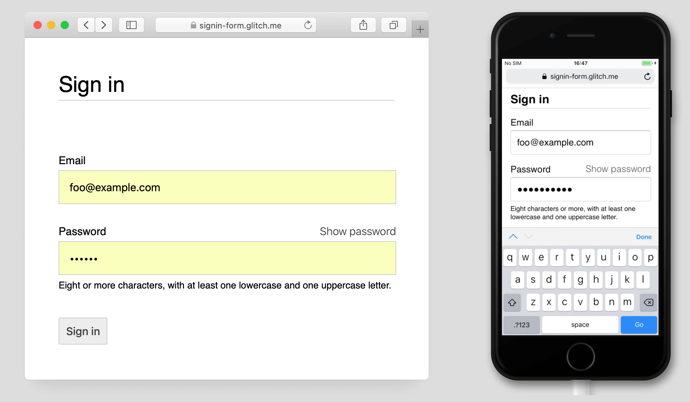
  <figcaption class="w-figcaption">Sign-in form with <strong>Show password</strong> text 'button', in Safari on Mac and iPhone 7.</figcaption>
</figure>


### Make password inputs accessible {​: #accessible-password-inputs }

Use `aria-describedby` to explain password constraints, using the element that describes the constraints for your password input. Screenreaders read the label text, the input type (password), and then the description. 

```html
<input type="password" aria-describedby="password-constraints" ...>
<div id="password-constraints">Eight or more characters with a mix of letters, numbers and symbols.</div>
```

When you add **Show password** functionality, make sure to include an`aria-label` to warn that the password will be displayed. Otherwise users may inadvertently reveal passwords.

```html
<button id="toggle-password" aria-label="Show password as plain text.
Warning: this will display your password on the screen.">Show password</button>
```

You can see both these `aria` features in action at [glitch.com/#!/signin-form](https://glitch.com/edit/#!/signin-form).

[Creating Accessible Forms](https://webaim.org/techniques/forms/) has more tips to help make forms accessible.


### Validate in realtime and before submission {​: #javascript-validation }

HTML form elements and attributes have built-in features for basic validation, but you should also use JavaScript to do more robust validation while users are entering data and when they attempt to submit the form. 


Client-side validation helps users enter data and can avoid unnecessary server load, but you must always validate and sanitize data on your backend.


[Step 5](https://glitch.com/edit/#!/signin-form-codelab-5) of the sign-in form codelab uses the [Constraint Validation API](https://html.spec.whatwg.org/multipage/forms.html#constraints) (which is [widely supported](https://caniuse.com/#feat=constraint-validation)) to add custom validation using built-in browser UI to set focus and display prompts.

Find out more: [Use JavaScript for more complex real-time validation](https://developers.google.com/web/fundamentals/design-and-ux/input/forms#use_javascript_for_more_complex_real-time_validation).


### Analytics and RUM {​: #analytics-rum }

"What you cannot measure, you cannot improve" is particularly true for sign-up and sign-in forms. You need to set goals, measure success, improve your site—and repeat.

[Discount usability testing](https://www.nngroup.com/articles/discount-usability-20-years/) can be helpful for trying out changes, but you'll need real-world data to really understand how your users experience your sign-up and sign-in forms:

* **Page analytics**: including sign-up and sign-in page views, bounce rates, and exits.
* **Interaction analytics**: such as [goal funnels](https://support.google.com/analytics/answer/6180923?hl=en) (where do users abandon your sign-in or sign-in flow?) and [events](https://developers.google.com/analytics/devguides/collection/gtagjs/events) (what actions do users take when interacting with your forms?)
* **Website performance**: [user-centric metrics](/user-centric-performance-metrics) to understand the real experience of your users (are your sign-up and sign-in forms slow for some reason and, if so, what is the cause?).

You may also want to consider implementing A/B testing in order to try out different approaches to sign-up and sign-in, and staged rollouts to validate the changes on a subset of users before releasing changes to all users.


## …and finally {​: #general-guidelines }

Some general guidelines to help reduce sign-in form abandonment:

* Don't make users hunt for sign-in! Put a link to the sign-in form at the top of the page, using well-understood wording such as "Sign In", "Create Account" or "Register".
* Keep it focused! Sign-up forms are not the place to distract people with offers and other site features.
* Minimize sign-up complexity. Collect other user data (such as addresses or credit card details) only when users see a clear benefit from providing that data.
* Before users start on your sign-up form, make it clear what the value proposition is. How do they benefit from signing in? Give users concrete incentives to complete sign-up.
* If possible allow users to identify themselves with a mobile phone number instead of an email address, since some users may not use email.
* Make it easy for users to reset their password, and make the **Forgot your password?** link obvious.
* Link to your Terms of Service and privacy policy documents: make it clear to users from the start how you safeguard their data. {​: #tos-privacy-policy }
* Include the logo and name of your company or organization on your signup and sign-in pages, and make sure that language, fonts and styles match the rest of your site. Some forms don't feel like they belong to the same site as other content, especially if they have a significantly different URL. {​: #branding }

[Something about (re)CAPTCHA?]


## Find out more {​: #find-out-more }

* [Create Amazing Forms](https://developers.google.com/web/fundamentals/design-and-ux/input/forms)
* [Best Practices For Mobile Form Design](https://www.smashingmagazine.com/2018/08/best-practices-for-mobile-form-design/)
* [More capable form controls](/more-capable-form-controls)
* [Creating Accessible Forms](https://webaim.org/techniques/forms/)

Photo by [Katka Pavlickova](https://unsplash.com/@katerinapavlickova) on [Unsplash](https://unsplash.com).