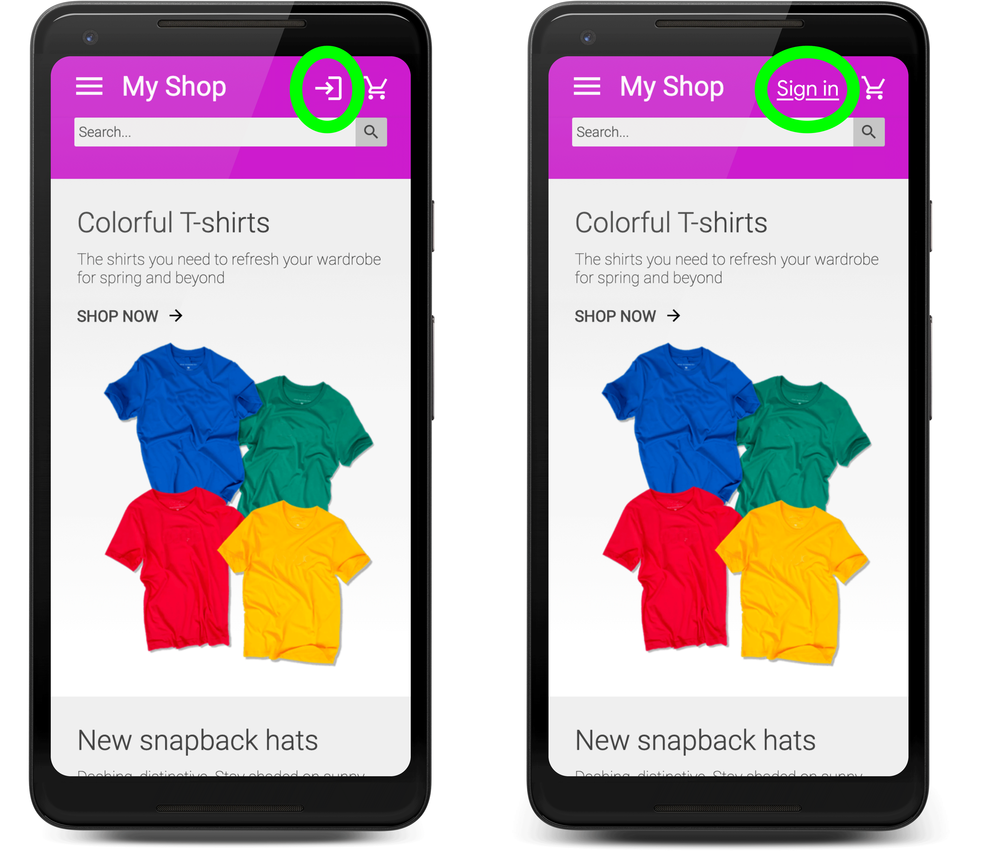

<!--   -->

If users ever need to log in to your site, then good sign-up form design is
critical. This is especially true for people on poor connections, on mobile, in
a hurry, or under stress. Poorly designed sign-up forms get high bounce rates.
Each bounce could mean a lost and disgruntled user—not just a missed sign-up
opportunity.


  If you would prefer to learn these best practices with a hands-on tutorial,
  check out the [Sign-up form best practices codelab](/codelab-sign-up-form-best-practices).


Here is an example of a very simple sign-up form that demonstrates all of the best practices:



## Checklist

* [Avoid sign-up if you can](#no-forced-sign-up).
* [Make it obvious how to create an account](#obvious-account-creation).
* [Make it obvious how to access account details](#obvious-account-details).
* [Cut form clutter](#cut-clutter).



This post is about *form* best practices. It does not explain how to implement sign-up via a third-party 
identity provider (federated login) or show how to build backend services to authenticate users, store 
credentials, and manage accounts. [Integrating Google Sign-In into your web app](https://developers.google.com/identity/sign-in/web/sign-in) explains how to use federated login for your site, and 
[12 best practices for user account, authorization and password management](https://cloud.google.com/blog/products/gcp/12-best-practices-for-user-account) outlines core back-end principles for managing user accounts. 


## Avoid sign-up if you can {: #no-forced-sign-up }

Before you implement sign-up, and force users to create an account on your site, consider whether 
you need to. Wherever possible you should avoid gating features behind login. 

The best sign-up form is no sign-up form! 

By asking a user to create an account, you come between them and what they're trying to achieve. 
You're asking a favor, and asking the user to trust you with personal data. Every password and item 
of data you store carries privacy and security 'data debt', becoming a liability and a cost for 
your site. 

If you just need to save information for a user between navigations or browsing sessions, 
[consider using client-side storage](web.dev/storage-for-the-web
) instead of forcing them to create an account. For shopping sites, forcing users to create an 
account to make a purchase is cited as a major reason for shopping cart abandonment. You should 
[make guest checkout the default](/payment-and-address-form-best-practices#guest-checkout).

## Make it obvious how to create an account {: #obvious-account-creation}

Make sign-up UI obvious. A **Login** or **Sign in** button at the top right of the page is the norm. 
Avoid using an ambiguous icon or vague wording ('Get on board!') and don't relegate login to a 
navigational menu. 

[Don't make me think!](https://uxplanet.org/dont-make-me-think-20-wise-thoughts-about-usability-from-steve-krug-876b563f1d63).

<figure class="w-figure">
  
  <figcaption class="w-figcaption">Make sign-in obvious. An icon may be ambiguous, but a <b>Sign 
  in</b> button or link is obvious.</figcaption>
</figure>


You may be wondering whether to add a button or link for *sign up* as well as *sign in*. Many major 
sites now simply display a single **Sign in button**. When the user clicks on that, they also get a 
link to create an account if necessary. That's a common pattern now, and most of your users will 
understand it.


Make sure to link accounts for users who sign up via an identity provider such as Google and who 
also sign up using email and password. That's easy to do if you can access a user's email address 
from the profile data from the identity provider, and match the two accounts. The code below shows 
how to access email data for a Google Sign-in user.

```js
// auth2 is initialized with gapi.auth2.init()
if (auth2.isSignedIn.get()) {
  var profile = auth2.currentUser.get().getBasicProfile();
  console.log(`Email: ${profile.getEmail()}`);
}

```

## Make it obvious how to access account details {: #obvious-account-details}

Once a user has signed in, make it clear how to access account details.

In particular, make it simple to change passwords. 

## Cut form clutter and distractions {: #cut-clutter}

In the sign-up flow, your job is to minimize complexity and keep the user focused. Cut the clutter. 
This is not the time for distractions and temptations!

Collect additional user data (such as name and address) only when you need to, and when the user sees a clear benefit from providing that data. 
Every item of data you communicate and store incurs cost and liability.


## Keep learning {: #resources }

* [Create Amazing Forms](https://developers.google.com/web/fundamentals/design-and-ux/input/forms)
* [Best Practices For Mobile Form Design](https://www.smashingmagazine.com/2018/08/best-practices-for-mobile-form-design/)
* [More capable form controls](/more-capable-form-controls)
* [Creating Accessible Forms](https://webaim.org/techniques/forms/)
* [Streamlining the Sign-up Flow Using Credential Management API](https://developers.google.com/web/updates/2016/04/credential-management-api)
* [Verify phone numbers on the web with the Web OTP API](https://web.dev/web-otp/)

Photo by [@ecowarriorprincess](https://unsplash.com/@ecowarriorprincess) on [Unsplash](https://unsplash.com/photos/lUShu7PHIGA).
