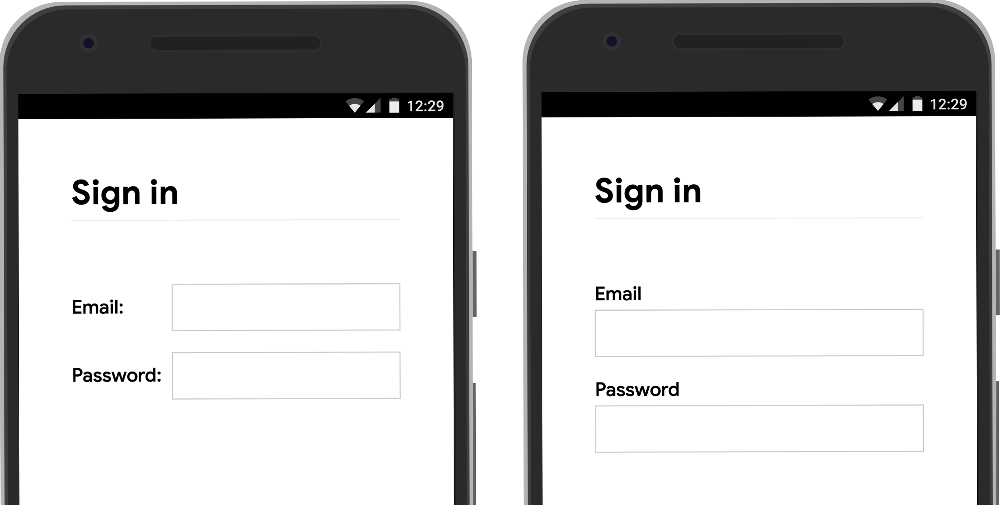
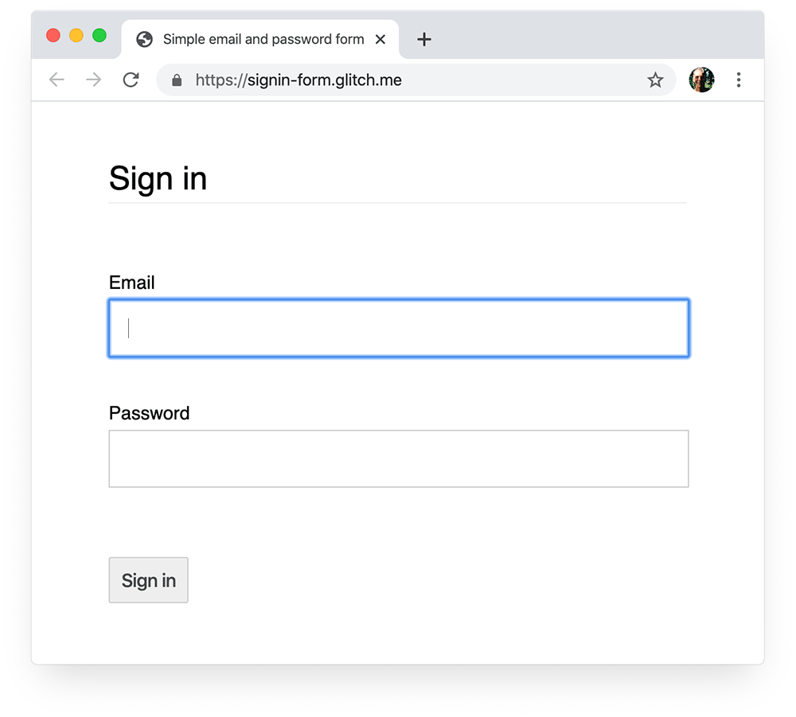

If users ever need to log in to your site, then good signin form design is absolutely crucial.

This is especially true for people on poor connections, on mobile, in a hurry, or under stress.

Poorly designed signin forms get high bounce rates. Each bounce means a lost and disgruntled user—not just a missed signin opportunity.

[Stats for signup/signin bounce rates.]


## Checklist

* Use standard elements: form, input, label and button.
* Use label elements to label inputs.
* Make the most of attributes: type, name, autocomplete, required, autofocus.
* Use `name="new-password"` for a signup password input.
* Use `autocomplete="current-password"` for a signin password input.
* Provide **Show password** functionality.
* Don't double up email or password inputs.
* Design forms so the mobile keyboard doesn't obscure inputs or buttons.
* Ensure your forms are usable on mobile: legible text, inputs and buttons large enough to work as touch targets.
* Build page analytics, interaction analytics and user-centric performance measurement into your signup and signin flow.



This article is about front-end best practice. It does not explain how to build back-end services to authenticate users, store their credentials or manage their accounts.

[12 best practices for user account, authorization and password management](https://cloud.google.com/blog/products/gcp/12-best-practices-for-user-account) outlines core principles for running your own back-end.



## Use meaningful HTML

The basic principle here is to use elements built for the job: `<form>`, `<label>` and `<button>`. These enable built-in browser functionality, improve accessibility, and add meaning to your markup.

### Use &lt;form&gt;

You might be tempted to wrap inputs in a `<div>` and handle submission purely with JavaScript.

It's generally better to use a plain old `<form>`. This makes your site accessible to screenreaders and other assistive devices, and enables a range of built-in browser features (see below).

An HTML form can also make it simpler to build basic functional signin for older browsers, and to enable signin even if JavaScript fails.

### Use &lt;label&gt;
To label an input, use a `<label>`!

```html
<label for="email">Email</label>
<input id="email" …>
```

Two reasons:
* A tap or click on a label moves focus to its input. (You associate a label with an input by using the label's `for` attribute with the input's ID.)
* Screenreaders announce label text when the label or the label's input gets focus.

Don't use placeholders as input labels. People are liable to forget what the input was for once they've started entering text, especially if they get distracted. (Was I entering an email address or a phone number, or something else?) There are lots of other potential problems with placeholders: see [Don't Use The Placeholder Attribute](https://www.smashingmagazine.com/2018/06/placeholder-attribute/) and [Placeholders in Form Fields Are Harmful](https://www.nngroup.com/articles/form-design-placeholders/) if you're unconvinced.

It's probably best to put your labels above your inputs. This enables consistent design across mobile and desktop and, according to [Google AI research](https://ai.googleblog.com/2014/07/simple-is-better-making-your-web-forms.html), enables quicker scanning by users. You get full width labels and inputs, and you don't need to adjust label and input width to fit the label text.


Try out the example at [glitch.com/edit/#!/label-position](https://glitch.com/edit/#!/label-position) on mobile.


<figure class="w-figure">
  
  <figcaption class="w-figcaption">Label and input width is limited when both are on the same line.</figcaption>
</figure>

[Add information about `aria[describedby`?]

### Use &lt;button&gt;

As with forms and labels, use button elements for button behaviour, to improve accessibility and enable built-in browser functionality.

Consider disabling the signin button when the user taps or clicks it. [Many users click buttons multiple times, every time](https://baymard.com/blog/users-double-click-online) even on sites that are fast and responsive! That just slows things down and can add to server load.

Conversely, don't disable the signin button awaiting user input. Users may miss out something in the form, then try tapping the (disabled) signin button and think it's not working. If they tap on the disabled button, tell them what's missing.

[Screenshot: anonymised version of Google Meet login, which has this problem. Caption: 'The distracted user doesn't see that they need to provide a name, and taps repeatedly on the Sign In button, which seems to be broken.]


The default type for a button in a form is `submit`.

If you want to add another button in a form (for **Show password**, for example) add `type="button"`. Otherwise clicking or tapping on it will submit the form.



### Don't double up your inputs

Some sites force users to enter emails or passwords twice.

That might reduce errors for a few users, but causes extra work for *all* users—and [increases abandonment rates](https://uxmovement.com/forms/why-the-confirm-password-field-must-die/). Better to enable users to confirm their email address (you should do that anyway) and make it easy for them to reset their password.

[Do we stats for this?]


## Make the most of element attributes

This is where the magic really happens!

Browsers have a lot of helpful built-in features that use input element attributes.


### Help users start faster

Add an `autofocus` attribute to the first input in your login form. That makes it clear where to start and, on desktop at least, means users don't have to select the input to start typing.

<figure class="w-figure">
  
  <figcaption class="w-figcaption">Autofocus provides clear visual focus on desktop.</figcaption>
</figure>

## Keep passwords private—but let users see them if they want

Passwords inputs should have `type="password"` to hide password text. (Sounds obvious, but some sites miss this.)

However, you should add a **Show password** icon or button to enable users to check the text they've entered. (See [Enable password display](#enable-password-display).)

[Screenshot from Google signin form.]

Using `<input type="password">` also means that browsers such as Firefox offer to save your password when a form is submitted (along with using the `name` and `id` attributes to guess the meaning of form inputs).

## Give mobile users the right keyboard

Use `<input type="email">` to give mobile users an appropriate keyboard and enable basic built-in email address validation by the browser (no JavaScript required!)

If you need to use a telephone number instead of an email address, `<input type="tel">` enables a telephone keypad on mobile. You can also use the `inputmode` attribute where necessary: `inputmode="numeric"` is ideal for PIN numbers. [Everything You Ever Wanted to Know About inputmode](https://css-tricks.com/everything-you-ever-wanted-to-know-about-inputmode/) has more detail.


`type="number"` adds an up/down arrow to increment numbers, so don't use it for numbers that aren't meant to be incremented, such as ID and account numbers.


### Avoid the mobile keyboard covering the Submit button

Unfortunately, mobile keyboards can wind up covering your form or, worse, partially obscuring the Submit button:

[Screenshot showing Submit button partially obscured by keyboard on Android and iOS.]

Where possible, avoid this by displaying only the email/phone and password inputs and submit button at the top of your signin page. Put other content below.

[Screenshot showing page on Android, with and without h1.]

Some sites (including Amazon and eBay) avoid the problem by asking for email/phone and password on two different 'pages'.

[Screenshot]


### Help users avoid re-entering data

You can help browsers to help users, by autofilling inputs where possible. This is particularly true for email inputs, which get [high abandonment rates](https://www.formisimo.com/blog/conversion-rate-increases-57-with-form-analytics-case-study/).

There are two parts to this:
1. The input `name` attribute helps browsers store data for email and other input types. Some browsers, including Firefox, also take note of the `id` and `type` attributes.
2. The `autocomplete` attribute enables browsers to autofill inputs using stored data.

Remember that you need different behaviour for inputs in signup and signin forms. In particular, passwords shouldn't be autofilled on signup.

To avoid this problem, use `name="new-password"` for the password input in a signup form, and `name="current-password"` in a signin form.

For a signup form, password input code should look like this:

```html
<input name="new-password" type="password" …>
```

For signin:

```html
<input name="current-password" type="password" autocomplete="current-password" …>
```

Not surprisingly, different browsers handle things differently.

On Safari, for example …

[Show screenshot]

On Chrome …

[Show screenshot]



Browser password and autofill systems are not simple.

The algorithms for guessing, storing and displaying values are not standardized, and vary from platform to platform.

For example, as pointed out by [Hidde de Vries](https://hiddedevries.nl/en/blog/2018-01-13-making-password-managers-play-ball-with-your-login-form): "Firefox's password manager complements [its heuristics](https://dxr.mozilla.org/firefox/source/toolkit/components/passwordmgr/src/nsLoginManager.js#626) with a [recipe system](https://bugzilla.mozilla.org/show_bug.cgi?id=1119454).


[Screencast video of Safari signin showing Touch ID]

[Autofill: What web devs should know, but don't](https://cloudfour.com/thinks/autofill-what-web-devs-should-know-but-dont) has a lot more information about using `name` and `autocomplete`. The [HTML spec](https://html.spec.whatwg.org/multipage/form-control-infrastructure.html#inappropriate-for-the-control) lists all 59 possible values.


### Enable the browser to suggest a strong password

Modern browsers suggest a strong password if `autocomplete="new-password"` is included for the password input in a signin form.

[Screenshots: Chrome, Safari, Firefox]

### Help save users from accidentally missing input fields

Add the `required` attribute to both email and password fields.

Modern browsers automatically prompt and set focus if you miss a required field. No JavaScript required!

[Video or screenshot of built-in browser prompting—Safari desktop is good]


## CSS for fingers and thumbs

[Do we have any stats for form filling on mobile versus desktop?]

The browser default size for just about everything relating to input elements and buttons is too small, especially on mobile.

### Make sure inputs and buttons are large enough

The default size and padding for inputs and buttons is too small on desktop and even worse on mobile.

[Screenshots of input with no styling on desktop and mobile, multiple browsers.]

According to [Android accessibility guidance](https://support.google.com/accessibility/android/answer/7101858?hl=en-GB) the recommended target size for touchscreen objects is 7–10 mm. Apple interface guidelines suggest 48x48 px, and the W3C suggest [at least 44x44 CSS pixels](https://www.w3.org/WAI/WCAG21/Understanding/target-size.html).

On that basis, add (at least) about 15 px of padding to input elements and buttons for mobile, and around 10 px on desktop. Try this out with a real mobile device and a real finger or thumb. You should comfortably be able to tap each of your inputs and buttons.


Design for thumbs!

Search for [touch target](https://www.google.com/search?q=touch+target) and you'll see lots of pictures of forefingers. However, in the real world, many people use their thumbs to interact with phones.

Thumbs are bigger than forefingers, and control is less precise.

All the more reason for adequately sized touch targets.


### Make text big enough

As with size and padding, the default browser font size for input elements and buttons is too small, particularly on mobile.

[Screenshots of input with no styling on desktop and mobile, multiple browsers.]

Browsers on different platforms size fonts differently, so it's difficult to specify a particular font size that works well everywhere. A quick survey of popular websites shows sizes of 13–16 px on desktop: that's probably a good minimum

Make sure to use a larger pixel size on mobile: 16 px on Chrome on desktop is quite large but, without 20/20 vision, is quite hard to read on Chrome on Android.

[Screenshot: 16 px on desktop versus mobile]

20 px is about right on mobile—but you can test this out with friends or colleagues who don't have 20/20 vision.

[Screenshot: 20 px on Android and iOS.]


Unfortunately, autofill text (on Chrome for Android, at least) is small, and can't be sized with CSS.

There's a bug for this at [crbug.com/953689](crbug.com/953689). If you think this is important, star it!



### Provide enough space between inputs

Sounds obvious, but many sites get this wrong:

[Screenshot of inputs too close together.]

Add enough margin to make inputs work well as touch targets. In other words, aim for about a finger width of margin:

[Screenshot of inputs with reasonable spacing.]


### Make sure your inputs are clearly visible

The default border styling for inputs makes them hard to see. They're almost invisible on some platforms such as Chrome for Android:

[Screenshot showing unstyled input element on Chrome for Android]

As well as padding, add a border (#ccc or darker is a start):

[Screenshot showing input element with border-color: #ccc and padding on Chrome for Android]


### Use CSS to show invalid input values

You can use the :invalid CSS selector like this:

`input[type=email]:invalid`


## Use JavaScript where necessary

### Enable password display

You should add a **Show password** icon or button to enable users to check the text they've entered. [Usability suffers](https://www.nngroup.com/articles/stop-password-masking/) when users can't see the text they've entered. Currently there's no built-in way to display **Show password** UI, though [there are plans for implementation](https://twitter.com/sw12/status/1251191795377156099), so you'll need to use JavaScript. You can see this in action in the codelab for this article.

With a **Show password** button, make sure to include an`aria-label` warn that the password will be displayed. Otherwise screenreader users may inadvertently reveal passwords:

```html
<button id="toggle-password" aria-label="Show password as plain text.
Warning: this will display your password on the screen.">Show password</button>
```

[Creating Accessible Forms](https://webaim.org/techniques/forms/) has more tips to help make forms accessible.


### Validate before submission

[Validation: see https://developers.google.com/web/fundamentals/design-and-ux/input/forms#use_javascript_for_more_complex_real-time_validation)
Prevent submission of invalid forms
Masking
…
]


### Analytics and RUM

"What you cannot measure, you cannot improve" is particularly true for signup and signin forms. You need to set goals, measure success, improve your site—and repeat.

[Discount usability testing](https://www.nngroup.com/articles/discount-usability-20-years/) can be helpful for trying out changes, but you'll need real-world data to really understand how your users experience your signup and signin forms:

* **Page analytics**: including page views, bounce rates, and exit pages.
* **Interaction analytics**: such as [goal funnels](https://support.google.com/analytics/answer/6180923?hl=en) (where do users abandon your signin or signin flow?) and [events](https://developers.google.com/analytics/devguides/collection/gtagjs/events) (what actions do users take when interacting with your forms?)
* **Website performance**: [user-centric metrics](/user-centric-performance-metrics) to understand the real experience of your users (are your signup and signin forms slow for some reason and, if so, what is the cause?).

You may also want to consider implementing A/B testing in order to try out different approaches to signup and signin, and staged rollouts to 'test the water' before releasing changes to all your users.


## …and finally

Some general guidelines to help reduce signin form abandonment:

* Don't make users hunt for signin. It's surprising how many sites get this wrong! Put a link to the signin form at the top of the page, with well-understood wording such as **Sign In**, **Create Account** or **Register**.
* Keep it focused! This is not the place to distract people with offers and unrelated site features.
* Where possible, keep signin separate from collection of other user data such as addresses or credit card details.
* Before users start on your signin form, make it clear what the value proposition is. How do they benefit from signing in? Make sure users have real incentives to complete signin.
* Allow for mobile phone or email.
* Add CAPTCHA (such as reCAPTCHA) if necessary
* Make it easy for users to get a forgotten password, or reset their password.


## Find out more

* [Create Amazing Forms](https://developers.google.com/web/fundamentals/design-and-ux/input/forms)
* [Best Practices For Mobile Form Design](https://www.smashingmagazine.com/2018/08/best-practices-for-mobile-form-design/)
* [More capable form controls](/more-capable-form-controls)