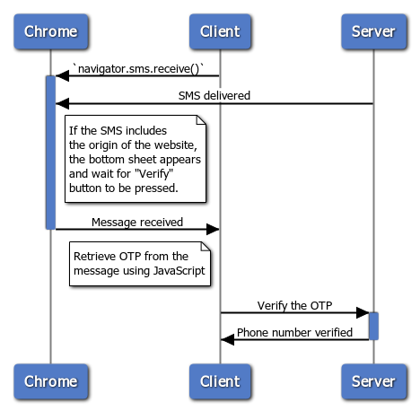

## What is the SMS Receiver API?

These days, most people in the world own a mobile device with a phone number,
and developers are commonly using a phone number as an identifier for users of
their services.

There are a variety of ways to verify phone numbers, but a randomly generated
one-time password (OTP) sent by SMS to the number is the most common. Sending
this code back to the developer's server demonstrates control of the phone
number.

This idea is already deployed in many online scenarios to achieve:

* **Phone number as a user's primary identifier:** When signing up for a new
  service, some websites ask for a phone number instead of an email address and
  use it as their primary identifier. It's important to verify phone numbers in
  this use case.
* **Two step verification:** When signing in, a website asks for a one-time code
  sent via SMS on top of a password for extra security.
* **Payment confirmation:** When a user is making a payment, asking a one-time
  code sent via SMS can help authenticate the person's intent.

The current process creates friction for the user. Finding an OTP within an SMS
message, then copying and pasting it to the form is cumbersome. Easing this has
been a long standing request for the web from many of the largest global
developers. Android has [an API that does exactly
this](https://developers.google.com/identity/sms-retriever/). So does
[iOS](https://developer.apple.com/documentation/security/password_autofill/about_the_password_autofill_workflow)
and
[Safari](https://developer.apple.com/documentation/security/password_autofill/enabling_password_autofill_on_an_html_input_element).

With the SMS Receiver API, you can programmatically obtain an OTP from an SMS
message and verify a phone number for the user more easily.


keep in mind that SMS is a weak form of authentication: attackers can
spoof SMS and can hijack a person's phone number. Carriers can also recycle
phone numbers to new users after an account was closed. While SMS OTP is useful
to verify a phone number when a user sets up an account with your service, we
recommend using stronger forms of authentication, such as multiple factors and
[WebAuthn](https://www.w3.org/TR/webauthn/) to establish new sessions for these
users.


## Current status

<table>
<tr>
<td markdown="block">
Step
</td>
<td markdown="block">
Status
</td>
</tr>
<tr>
<td markdown="block">
1. Create explainer
</td>
<td markdown="block">
<a href="https://github.com/samuelgoto/sms-receiver/blob/master/README.md" >Complete</a>
</td>
</tr>
<tr>
<td markdown="block">
2. Create initial draft of specification
</td>
<td markdown="block">
In Progress
</td>
</tr>
<tr>
<td markdown="block">
3. Gather feedback & iterate on design
</td>
<td markdown="block">
In Progress
</td>
</tr>
<tr>
<td markdown="block">
<strong>4. Origin trial</strong>
</td>
<td markdown="block">
<strong>Starts in Chrome 78</strong><br/>
Expected to run through Chrome 81
</td>
</tr>
<tr>
<td markdown="block">
5. Launch
</td>
<td markdown="block">
Not started
</td>
</tr>
</table>

## See it in action

Let's say a user wants to verify their phone number with a website. The website
sends a text message to the user over SMS and the user enters the OTP from the
message to verify the ownership of the phone number.

With the SMS Receiver API, these steps will become as easy as one tap for the
user.

<video autoplay loop muted playsinline>
  <source src="https://storage.googleapis.com/web-dev-assets/sms-receiver-announce/demo.mp4" type="video/mp4">
</video>

Notice that as the text message arrives, the bottom sheet appears and pressing
**Verify** allows the OTP to be autofilled in the form or even submitted
automatically, signing in the user. The whole process is diagrammed in the image
below.

<figure class="w-figure w-figure--center">
  
  <figcaption class="w-figcaption w-figcaption--fullbleed">
    SMS Receiver API diagram
  </figcaption>
</figure

Try [the
](https://sms-receiver-demo.glitch.me)[demo](https://sms-receiver-demo.glitch.me)
yourself. It doesn't ask for your phone number and send SMS to your device, but
you can send one from another device by copying the text displayed on the demo
because it doesn't matter who the sender is in the SMS Receiver API.

1. Prepare Google Chrome on Android 78 or later with "Experimental Web Platform
   Feature" flag turned on at
   `chrome://flags/#enable-experimental-web-platform-features`.
1. Go to
   [https://sms-receiver-demo.glitch.me](https://sms-receiver-demo.glitch.me).
1. Select your browser channel from the provided list.
1. Press **Copy** to copy the text message and send it to another phone.
1. Press **Verify**.
1. From the other phone, send yourself the copied text message via SMS.

Did you receive the SMS and see the prompt to enter the code to the input area?
That is how the SMS Receiver API works for end users.


If you are using Chrome in Android's Work Profile feature, it will not be
able to see SMS messages because applications in the Work Profile cannot see
information in Personal Profile applications, including the Messages
application.


## Using the SMS Receiver API

Using the SMS Receiver API consists of two parts: JavaScript code in your appon
your website and the formatted message text sent via SMS.


Note: The SMS Receiver API requires a secure origin (HTTPS).


### Feature detection

Feature detection is much the same as for many other APIs:

```js
if ('sms' in navigator) {
  ...
}
```

### Process the OTP

The SMS Receiver API itself is simple enough:

```js
const sms = await navigator.sms.receive();
```

Once a user taps **Verify**, displayed in the bottom sheet, the promise
containing the text message will resolve. You can use a regular expression to
distill the OTP and verify the user. For example, if a text message contains a
six digit verification code following `otp=`, the code would look like this:

```js
const code = sms.content.replace(/[\s\S]*otp=([0-9a-zA-Z]{6})[\s\S]*$/m, '$1');
```

You can now submit the code to the server to verify it.

### Designing the SMS message

The API itself should have looked simple enough, but a critical part is to
format your SMS text message according to a specific convention. The message has
to be sent after `navigator.sms.receive()` is called and in **the right format**.

The SMS message must be received on the device where `navigator.sms.receive()`
was called.

The message must adhere to the following formatting:

* The application hash of the user's Chrome instance. (These are static strings.
  See the table after the example.)
* The origin part of the URL of the website that invoked the API. It must be
  preceded by `For: `.
* The URL must contain a query parameter `otp` whose value is the OTP.

An example message that can be retrieved by the browser would look like this:

```text
Your OTP is: 123456.

For: https://sms-receiver-demo.glitch.me/?otp=123456&PqEvUq15HeK
```

The application hash of Chrome instances are static. Use one of these strings
for development depending on which Chrome build you will be working with.

<table>
<tr>
<td markdown="block">
<strong>Chrome build</strong>
</td>
<td markdown="block">
<strong>APK hash string</strong>
</td>
</tr>
<tr>
<td markdown="block">
Chrome Canary
</td>
<td markdown="block">
<code>PqEvUq15HeK</code>
</td>
</tr>
<tr>
<td markdown="block">
Chrome Dev
</td>
<td markdown="block">

</td>
</tr>
<tr>
<td markdown="block">
Chrome Beta
</td>
<td markdown="block">
<code>xFJnfg75+8v</code>
</td>
</tr>
<tr>
<td markdown="block">
Chrome Stable
</td>
<td markdown="block">
<code>EvsSSj4C6vl</code>
</td>
</tr>
<tr>
<td markdown="block">
Locally built Chromium
</td>
<td markdown="block">
<code>s3LhKBB0M33</code>
</td>
</tr>
</table>

### Demos

Try various messages with the demo:
[https://sms-receiver-demo.glitch.me](https://sms-receiver-demo.glitch.me)

You may also fork it and create your version:
[https://glitch.com/edit/#!/sms-receiver-demo](https://glitch.com/edit/#!/sms-receiver-demo).

### Enabling support during the origin trial

Starting in Chrome 78, [the SMS Receiver API is available as an origin trial on
Chrome for
Android](https://developers.chrome.com/origintrials/#/view_trial/607985949695016961).
Origin trials allow you to try new features and give feedback on their
usability, practicality, and effectiveness, both to us, and to the web standards
community. For more information, see the [Origin Trials Guide for Web
Developers](https://googlechrome.github.io/OriginTrials/developer-guide.html).

To participate in an origin trial:

1. Request a
   [token](https://developers.chrome.com/origintrials/#/view_trial/607985949695016961)
   for your origin.
1. Add the token to your pages, there are two ways to provide this token on any
   pages in your origin
    * Add an origin-trial `<meta>` tag to the head of any page. For example,
      this may look something like: `<meta http-equiv="origin-trial" content="TOKEN_GOES_HERE">`
    * If you can configure your server, you can also provide the token on pages
      using an `Origin-Trial` HTTP header. The resulting response header should
      look something like: `Origin-Trial: TOKEN_GOES_HERE`

## Feedback

We want to hear about your experiences with the SMS Receiver API.

### Tell us about the API design

Is there something about the API that doesn't work as expected? Or are there
missing methods or properties that you need to implement your idea?

* File an issue on the [SMS Receiver API explainer GitHub
  repo](https://github.com/samuelgoto/sms-receiver), or add your thoughts to an
  existing issue.

### Problem with the implementation?

Did you find a bug with Chrome's implementation? Or is the implementation
different from the spec?

* File a bug at
  [https://new.crbug.com](https://bugs.chromium.org/p/chromium/issues/entry?components=Blink%3EContacts).
  Include as much detail as you can, simple instructions for reproducing, and
  set **Components** to Blink&gt;SMS.

### Planning to use the API?

Planning to use the SMS Receiver API? Your public support helps us prioritize
features, and shows other browser vendors how critical it is to support them.

* Send a Tweet to [@ChromiumDev](https://twitter.com/chromiumdev) with
  `#smsreceiver` and let us know where and how you're using it.

## FAQ
### Why did you not align with Safari's `one-time-code`?

We're carefully investigating Safari's
[`autocomplete="one-time-code"`](https://developer.apple.com/documentation/security/password_autofill/enabling_password_autofill_on_an_html_input_element)
proposal which is taking a declarative approach. Currently we have a hypothesis
that the imperative approach will reduce the steps verifying a phone number. The
declarative approach is easier to implement for developers, but requires at
least three taps: focus on the input field, select the one-time-code, then
submit the form. Our approach requires that people make only a single tap.

Nevertheless, we intend to explore the declarative approach as we receive
developers' feedback.

### Is it safe to use SMS as a way to authenticate?

We don't consider SMS to be the most secure way to verify a user. Web apps
should use WebAuthn for the strongest authentication. However, SMS
authentication is used extensively and is the only option for some people, so
it's still beneficial to make it easier to use:

* SMS is available everywhere, including on low-cost or old phones. Biometric
  sensors, FIDO2, and WebAuthn are better alternatives, but they tend to be
  available only on expensive phones.
* A phone number is human pronounceable making it easy to communicate. For
  example, in the case of account recovery, you can tell your phone number to a
  support operator and verify your identity via SMS or a phone call.

### Can't we omit the browser's app hash?

We would [like to remove
it](https://github.com/samuelgoto/sms-receiver/issues/4#issuecomment-528991114),
but it's a platform restriction that we don't have control over.

### Will an SMS message timeout?

Yes. We're planning to use AbortController to tim the request out ([tracking
bug](https://bugs.chromium.org/p/chromium/issues/detail?id=976401)), but it's
not implemented as of Chrome 78.

### Will the apk hash change for an installed PWA?

No. A PWA's app hash is the same as the browser it runs in.