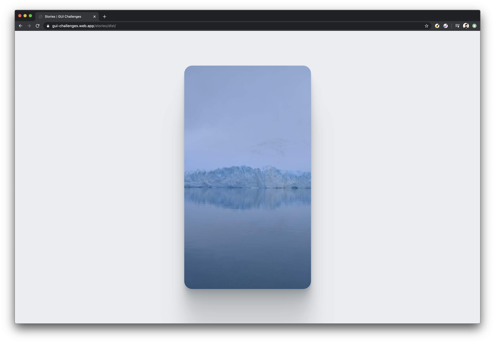

<figure class="w-figure">
  
  <figcaption class="w-figcaption">Screenshot of our Stories component responsive to desktop</figcaption>
</figure>

<!--  -->

Let’s explore and get inspired by this minimal way to layout an interactive Stories element. It’s fairly similar to a carousel, but allows navigating a multidimensional array as opposed to an array. As if there’s a carousel inside each carousel 🤯 

### Introduction
Stories are commonly found as a mobile only, tap centric pattern for navigating multiple subscriptions. For example: on Instagram, users open a friend’s story and go through the pictures in it. They generally do this many friends at a time. By tapping on the right side of the device, users move forward through “their stories,” which are their friends and their friends’ stories.

Today’s is mobile web focused and supports keyboard navigation. We’ll also be testing cross platform, sharing the differences we end up with and why it’s okay and awesome. 

## Platform Features
This component was able to come together so smoothly because of a few critical features that made it all possible. 

### `scroll-snap-points`
I chose these for a Stories component because I knew I was going to want touch centric horizontal pagination, and snap points are a way to codify scroll pagination scenic moments. Like friends’ stories, I think those make great scenic moments. 

More specifically, to me that meant:
- **Free native inertia:** every platform will get native swiping through friends
- **Free keyboard support:** left/right move through the snap points
- **A growing spec:** new features and improvements are being added

<div class="w-columns">

```css/4-5
.stories {
  display: grid;
  grid: 1fr / auto-flow 100vw;
  gap: 1ch;
  overflow-x: auto;
  scroll-snap-type: x mandatory;
  overscroll-behavior-x: contain;
}
```


Parent with overscroll defines snap behavior





```css/3-4
.user {
  display: grid;
  grid: [story] 1fr / [story] 1fr;
  scroll-snap-align: start;
  scroll-snap-stop: always;
}
```


Children opt into being a snap target



</div>


Here’s a great breakdown of [`scroll-snap-points` by Sarah Drasner](https://css-tricks.com/introducing-css-scroll-snap-points/) and [the CSS spec](https://www.w3.org/TR/css-scroll-snap-1/) for reference.



### `CSS Grid`
Our layout turned into a few swift tasks for CSS grid as it’s equipped with some powerful ways to wrangle content. 

#### Horizontal Scrolling Container
Our primary component wrapper is a horizontal scroll container, we knocked it out with this CSS:

```css/1-3
.stories {
  display: grid;
  grid: 1fr / auto-flow 100vw;
  gap: 1ch;
  overflow-x: auto;
  scroll-snap-type: x mandatory;
  overscroll-behavior-x: contain;
}
```

We’ve set the display to to only 1 row that fills the height (`1fr`), and set the columns to `auto-flow` with a template width of `100vw`, which on a device would be full width. Our goal, is on a mobile phone, think of this like the row size being the viewport height and each column is the viewport width. Each column will be a friend. We want friends to continue outside of the viewport so we have somewhere to scroll to. Grid will make however many columns it needs to layout your HTML friends, creating a perfect scrolling container for us. 

#### Stacking
Another layout task was, for each friend we needed their stories in an additionally pagination ready state. In preparation for animation and other fun patterns, I chose a stack. 


When I say stack, I mean like you’re looking down on a sandwich, not like you’re looking from the side. 


With CSS grid, we can define a single cell grid (aka a square), where the rows and columns share an alias `[story]`, and then each child gets assigned to that named single cell space: 

```css/1-2
.user {
  display: grid;
  grid: [story] 1fr / [story] 1fr;
  scroll-snap-align: start;
  scroll-snap-stop: always;
}
```

```css/1-1
.story {
  grid-area: story;
  background-size: cover;
  ...
}
```

This puts our HTML in control of the stacking order and also keeps all elements in flow. We didn’t need to do anything with `absolute` positioning, `z-index` or box correct with `height: 100%; width: 100%;`. The parent grid already defined the size of the story picture viewport, so each of these story images need told to fill it!

## Cross Browser
We tested on Opera, Firefox, Safari, and Chrome; plus Android and iOS. Here’s the web features where we found differences in capabilities and support. 


None of the features chosen were not supported or buggy


We did though have some CSS not apply, so some platforms miss out on UX optimizations. I did enjoy not needing to manage these features and felt safe assuming they would eventually reach other browsers and platforms. 

### `scroll-snap-stop`
A carousel, which may be the first thing built with `scroll-snap-points` may not always need to force each image to stop after a user interacts with it. It might be fine or encouraged to quickly throw your way through it. But, not stories, those are best navigated one-by-one, and that’s what `scroll-snap-stop` will let the developer specify. 

On [caniuse](https://caniuse.com/#search=scroll-snap-stop) it shows Chromium only at the time of writing this article. This means on Firefox, Safari, etc that a user can skip a friend. It’s fine, user’s won’t be blocked by this. They may just need to be careful, or we can write js to ensure that friend they skipped isn’t marked as viewed.

[Read more in the spec](https://www.w3.org/TR/css-scroll-snap-1/#scroll-snap-stop) if you’re interested.

### `overscroll-behavior`
Ever had a modal scroll behind you or found times when scrolling seems to jump out of an inner scrolling space and into an outer scrolling space? `overscroll-behavior` let’s the developer trap that scroll and never let it leave. It’s nice for all sorts of occasions, and this stories component uses it to prevent additional swipes and scrolling gestures from leaving the stories component. 

Safari and Opera were the 2 browser’s that didn’t [support](https://caniuse.com/#search=overscroll-behavior) this, and that’s totally ok. Those users will get an overscroll experience like they’re used to and may never notice this enhancement. I’m personally a big fan and like including it as part of nearly every overscroll feature I implement. It’s a harmless addition that only can lead to an improvement.

### `scrollIntoView({behavior: 'smooth'})`
When a user taps or clicks and has reached the end of a friends set of stories, it’s time to move to the next friend in the scroll snap point set. With javascript, we were able to reference the next friend and request for it to be scrolled into view. The support for the basics of this are great, every browser scrolled it into view. But, not every browser did it `smooth`. This just means it’s scrolled into view instead of snapped. Makes for a more seamless transition.

Safari was the only one not to support smooth here, you can check out the results [here on caniuse](https://caniuse.com/#feat=scrollintoview). Read the fine print for smooth specific reporting. 

## Hands-On
Now that you know how I did it, how would you?! Remix the Glitch, share your versions, let’s diversify our approaches and learn all the ways to built on the web.

