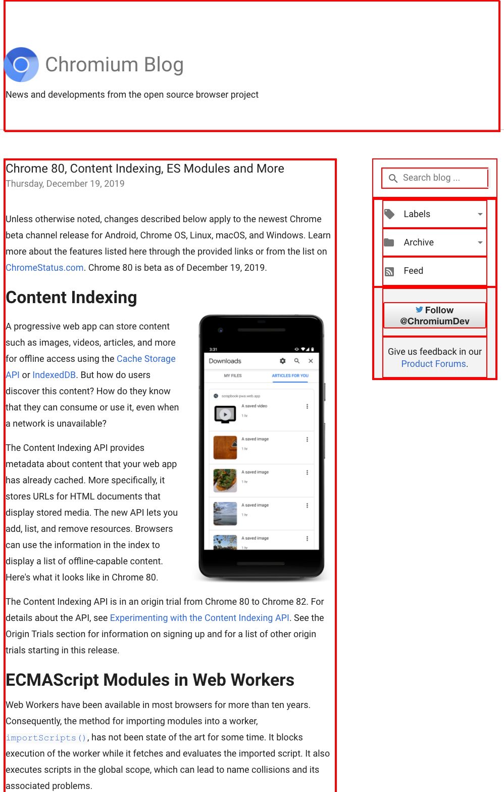
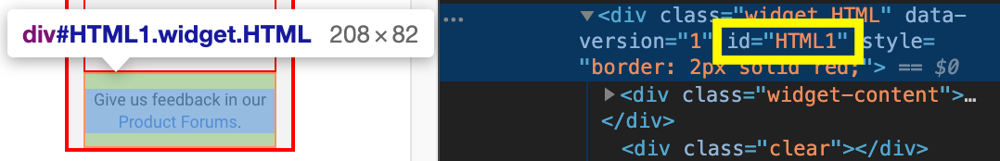
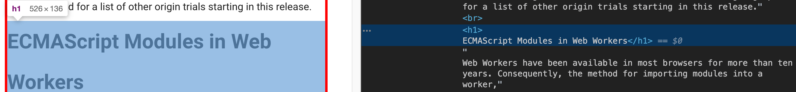
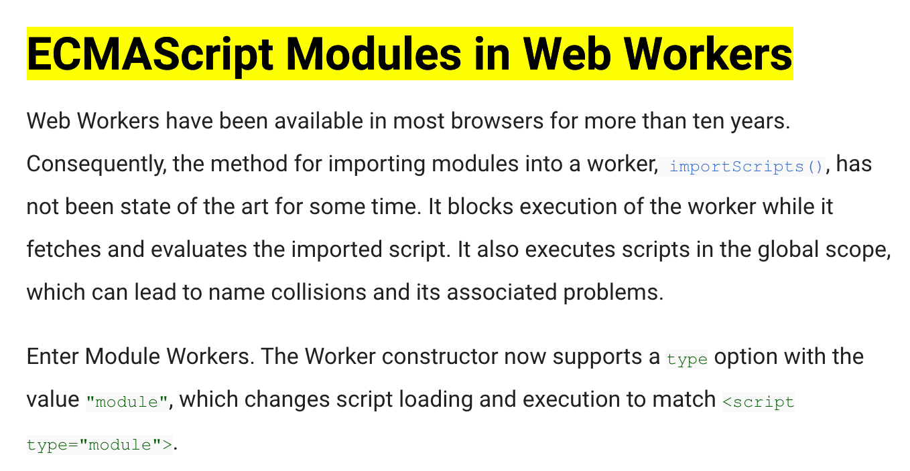
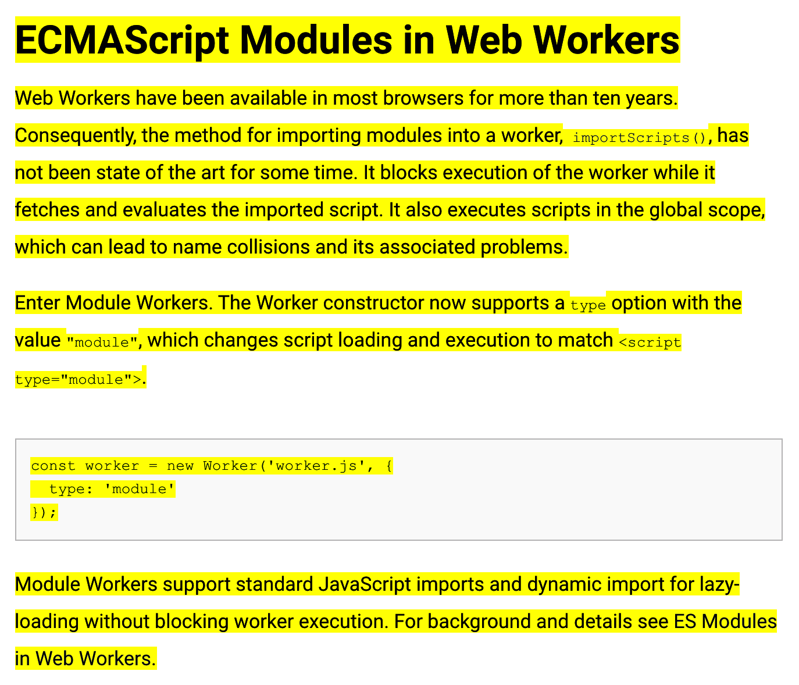
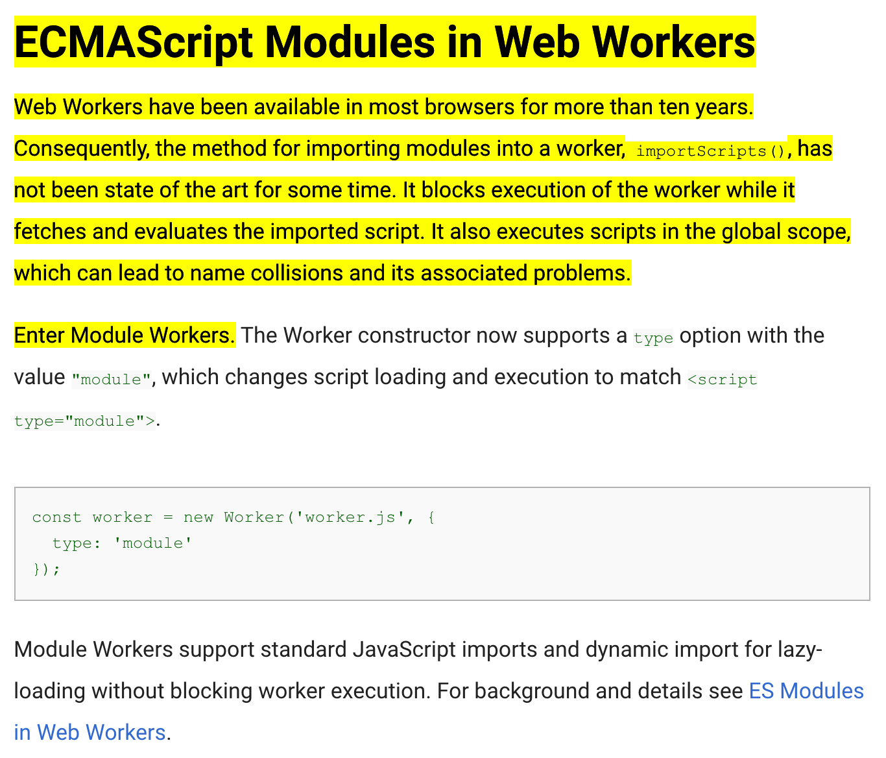
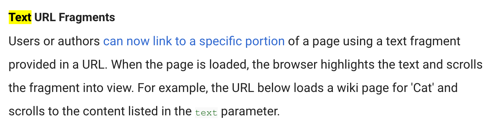
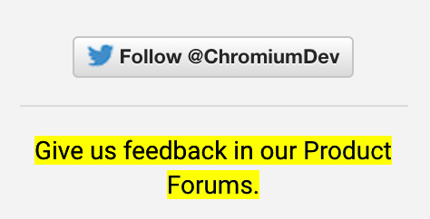
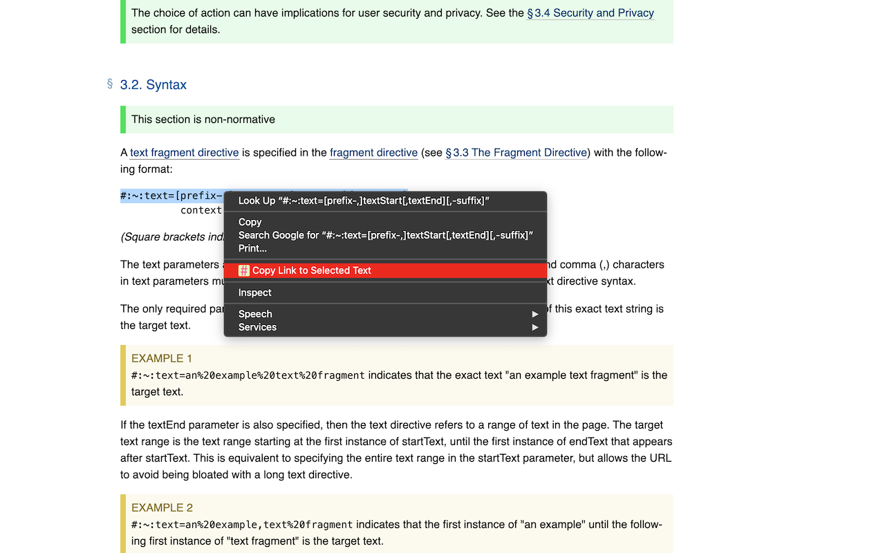

## Fragment Identifiers

Chrome&nbsp;80 was a big release.
It contained a number of highly anticipated features like
[ECMAScript Modules in Web Workers](https://web.dev/module-workers/),
[nullish coalescing](https://v8.dev/features/nullish-coalescing),
[optional chaining](https://v8.dev/features/optional-chaining), and more.
The release was, as usual, announced as a
[blog post](https://blog.chromium.org/2019/12/chrome-80-content-indexing-es-modules.html)
on the Chromium blog.
You can see an excerpt of the blog post in the screenshot below.

<figure class="w-figure">
  
  <figcaption class="w-figcaption">Chromium blog post with red boxes around elements with an <code>id</code> attribute.</figcaption>
</figure>

Probably you ask yourself what all the red boxes mean.
They are the result of running the following snippet in the Developer Tools.
It highlights all elements that have an `id` attribute.

```js
document.querySelectorAll('[id]').forEach((el) => {
  el.style.border = 'solid 2px red';
});
```

I can place a deep link to any element highlighted with a red box thanks to the
[fragment identifier](https://developer.mozilla.org/en-US/docs/Web/HTTP/Basics_of_HTTP/Identifying_resources_on_the_Web#Fragment)
that I then use in the [hash](https://developer.mozilla.org/en-US/docs/Web/API/URL/hash)
of the URL of the page.
Assuming I wanted to deep link to the *Give us feedback in our
[Product Forums](http://support.google.com/bin/static.py?hl=en&page=portal_groups.cs)*
box in the aside, I could do so by handcrafting the URL
<a href="https://blog.chromium.org/2019/12/chrome-80-content-indexing-es-modules.html#HTML1"><code>https://blog.chromium.org/2019/12/chrome-80-content-indexing-es-modules.html<strong>#HTML1</strong></code></a>.
As you can see in the Elements panel of the Developer Tools, the element in question
has an `id` attribute with the value `HTML1`.

<figure class="w-figure">
  
  <figcaption class="w-figcaption">Dev Tools showing the <code>id</code> of an element.</figcaption>
</figure>

If I parse this URL with JavaScript's `URL()` constructor, the different components are revealed.
Check the `hash` with the value `#HTML1`.

```js/3
new URL('https://blog.chromium.org/2019/12/chrome-80-content-indexing-es-modules.html#HTML1');
/* Creates a new `URL` object
URL {
  hash: "#HTML1"
  host: "blog.chromium.org"
  hostname: "blog.chromium.org"
  href: "https://blog.chromium.org/2019/12/chrome-80-content-indexing-es-modules.html#HTML1"
  origin: "https://blog.chromium.org"
  password: ""
  pathname: "/2019/12/chrome-80-content-indexing-es-modules.html"
  port: ""
  protocol: "https:"
  search: ""
  searchParams: URLSearchParams {}
  username: ""
}
*/
```

The pure fact though that I had to open the Developer Tools to find out the `id`
of the element in question speaks volumes about the probability this particular section of the page
was meant to be linked to by the author of the blog post.

But what about the sections I actually may have wanted to link to in real life?
Unfortunately there is not a single red box in the entire blog post body.
Say I wanted to deep link to the *ECMAScript Modules in Web Workers* heading.
As you can see in the screenshot below, the `<h1>` in question does not have an `id` attribute.
Without a fragment identifier, there is no way how I could link to this heading.
This is the problem that Text Fragments solve.

<figure class="w-figure">
  
  <figcaption class="w-figcaption">Dev Tools showing a heading without an <code>`id`</code>.</figcaption>
</figure>

## Text Fragments

The [Text Fragments](https://wicg.github.io/ScrollToTextFragment/) proposal adds support
for specifying a text snippet in the URL fragment.
When navigating to a URL with such a text fragment, the user agent can quickly emphasize
and/or bring it to the user's attention.

### `textStart`

In its simplest form, the syntax of Text Fragments is as follows:
The hash symbol `#` followed by `:~:text=` and finally `textStart`, which represents the
[percent-encoded](https://developer.mozilla.org/en-US/docs/Web/JavaScript/Reference/Global_Objects/encodeURIComponent)
text I want to link to.

```bash
#:~:text=textStart
```

Taking up the example from above where I wanted to place a deep link to the
*ECMAScript Modules in Web Workers* heading, the URL in this case would be
<a href="https://blog.chromium.org/2019/12/chrome-80-content-indexing-es-modules.html#:~:text=ECMAScript%20Modules%20in%20Web%20Workers"><code>https://blog.chromium.org/2019/12/chrome-80-content-indexing-es-modules.html<strong>#:~:text=ECMAScript%20Modules%20in%20Web%20Workers</strong></code></a>
(the Text Fragment is emphasized in bold).
If you click it, a supporting browser like Chrome will scroll the text fragment into view
and highlight it:

<figure class="w-figure">
  
  <figcaption class="w-figcaption">Text fragment scrolled into view and highlighted.</figcaption>
</figure>

### `textStart` and `textEnd`

Now what if I wanted to link to the entire *section* titled *ECMAScript Modules in Web Workers*?
Percent-encoding the entire text of the section would make the resulting URL impracticably long.

Luckily there is a better way. Rather than the entire text, I can frame the desired text
by making use of the `textStart,textEnd` syntax.
Therefore, I specify a couple of percent-encoded words at the beginning of the desired text,
and a couple of percent-encoded words at the end of the desired text, separated by a comma&nbsp;`,`.

In the running example, it would look like this:
<a href="https://blog.chromium.org/2019/12/chrome-80-content-indexing-es-modules.html#:~:text=ECMAScript%20Modules%20in%20Web%20Workers,ES%20Modules%20in%20Web%20Workers."><code>https://blog.chromium.org/2019/12/chrome-80-content-indexing-es-modules.html<strong>#:~:text=ECMAScript%20Modules%20in%20Web%20Workers,ES%20Modules%20in%20Web%20Workers.</strong></code></a>.
For `textStart`, we have `ECMAScript%20Modules%20in%20Web%20Workers`, then a comma&nbsp;`,`
followed by `ES%20Modules%20in%20Web%20Workers.` as `textEnd`.
When you click through, on a supporting browser like Chrome, the whole section is highlighted
and scrolled into view:

<figure class="w-figure">
  
  <figcaption class="w-figcaption">Text fragment scrolled into view and highlighted.</figcaption>
</figure>

Now you may wonder about my choice of `textStart` and `textEnd`.
Actually, the slightly shorter URL <a href="https://blog.chromium.org/2019/12/chrome-80-content-indexing-es-modules.html#:~:text=ECMAScript%20Modules,Web%20Workers."><code>https://blog.chromium.org/2019/12/chrome-80-content-indexing-es-modules.html<strong>#:~:text=ECMAScript%20Modules,Web%20Workers.</strong></code></a>
with only two words on each side would have worked, too.
Compare `textStart` and `textEnd` with the previous values.

If I take it one step further and now use only one word for both `textStart` and `textEnd`,
you can see that I am in trouble.
The URL <a href="https://blog.chromium.org/2019/12/chrome-80-content-indexing-es-modules.html#:~:text=ECMAScript,Workers."><code>https://blog.chromium.org/2019/12/chrome-80-content-indexing-es-modules.html<strong>#:~:text=ECMAScript,Workers.</strong></code></a>
is even shorter now, but the highlighted text fragment is no longer the originally desired one.
The highlighting stops at the first occurrence of the word `Workers.`, which is correct,
but not what I intended to highlight.
The problem is that the desired section is not uniquely identified
with the current one-word `textStart` and `textEnd` values:

<figure class="w-figure">
  
  <figcaption class="w-figcaption">Non-intended text fragment scrolled into view and highlighted.</figcaption>
</figure>

### `prefix-` and `-suffix`

Using long enough values for `textStart` and `textEnd` is one solution for obtaining a unique link.
In some situations, however, this is not possible.
On a side note, why did I choose the Chrome&nbsp;80 release blog post as my example?
The answer is that in this release Text Fragments were introduced:

<figure class="w-figure">
  
  <figcaption class="w-figcaption">Text Fragments announcement blog post excerpt.</figcaption>
</figure>

If I wanted to link to the word `text`
that is written in a green code font at the bottom of the screenshot above,
I would set `textStart` to `text`.
Since the word `text` is, well, only one word, there cannot be a `textEnd`,
but even just the blog post excerpt alone contains four times the word `text`.
What now?
The URL
<a href="https://blog.chromium.org/2019/12/chrome-80-content-indexing-es-modules.html#:~:text=text"><code>https://blog.chromium.org/2019/12/chrome-80-content-indexing-es-modules.html<strong>#:~:text=text</strong></code></a>
matches at the first occurrence of the word `Text`.


  Note that the Text Fragment matching is case-insensitive.


<figure class="w-figure">
  
  <figcaption class="w-figcaption">Text Fragment matching at the first occurrence of <code>Text</code>.</figcaption>
</figure>

Luckily there is a solution.
In cases like this, I can specify a `prefix​-` and a `-suffix`.
The word before the green code font `text` is `the`, and the word after is `parameter`.
No other of the three occurrences of the word `text` has the same surrounding words.
Armed with this knowledge, I can tweak the previous URL and add the `prefix-` and the `-suffix`.
Like the other parameters, they, too, need to be percent-encoded.
<a href="https://blog.chromium.org/2019/12/chrome-80-content-indexing-es-modules.html#:~:text=the-,text,-parameter"><code>https://blog.chromium.org/2019/12/chrome-80-content-indexing-es-modules.html<strong>#:~:text=the-,text,-parameter</strong></code></a>.
To allow the parser to clearly identify the `prefix-` and the `-suffix`,
they need to be separated from the `textStart` and the optional `textEnd` with a dash&nbsp;`-`.

<figure class="w-figure">
  
  <figcaption class="w-figcaption">Text Fragment matching at the correct occurrence of <code>Text</code>.</figcaption>
</figure>

### The full syntax

The full syntax of Text Fragments is shown below (square brackets indicate an optional parameter).
The values for all parameters need to be percent-encoded.
This is especially important for the dash `-`, ampersand `&`, and comma `,` characters,
so they are not being interpreted as part of the text directive syntax.

```bash
#:~:text=[prefix-,]textStart[,textEnd][,-suffix]
```

Each of `prefix-`, `textStart`, `textEnd`, and `-suffix` will only match text within a single
[block-level element](https://developer.mozilla.org/en-US/docs/Web/HTML/Block-level_elements#Elements),
but full `textStart,textEnd` ranges *can* span multiple blocks.
For example, `:~:text=The quick,lazy dog` will fail to match in the following example,
because the starting string "The quick" does not appear within a single,
uninterrupted block-level element:

```html
  <div>The<div> </div>quick brown fox</div>
  <div>jumped over the lazy dog</div>
```

It does, however, match in this example:

```html
  <div>The quick brown fox</div>
  <div>jumped over the lazy dog</div>
```

### Multiple text fragments in one URL

Note that multiple text fragments can appear on one URL.
The particular text fragments need to be separated by an ampersand character `&`.
Here is an example link with three text fragments:
<a href="https://blog.chromium.org/2019/12/chrome-80-content-indexing-es-modules.html#:~:text=Text%20URL%20Fragments&text=text,-parameter&text=:~:text=On%20islands,%20birds%20can%20contribute%20as%20much%20as%2060%25%20of%20a%20cat's%20diet"><code>https://blog.chromium.org/2019/12/chrome-80-content-indexing-es-modules.html<strong>#:~:text=Text%20URL%20Fragments&text=text,-parameter&text=:~:text=On%20islands,%20birds%20can%20contribute%20as%20much%20as%2060%25%20of%20a%20cat's%20diet<strong></code></a>.


### Mixing element and text fragments

Traditional element fragments can be combined with text fragments.
It is perfectly fine to have both in the same URL, for example,
to provide a meaningful fallback in case the original text on the page changes,
so the text fragment does not match anymore.
The URL
<a href="https://blog.chromium.org/2019/12/chrome-80-content-indexing-es-modules.html#HTML1:~:text=Give%20us%20feedback%20in%20our%20Product%20Forums."><code>https://blog.chromium.org/2019/12/chrome-80-content-indexing-es-modules.html<strong>#HTML1:~:text=Give%20us%20feedback%20in%20our%20Product%20Forums.</strong></code></a>
linking to the *Give us feedback in our
[Product Forums](http://support.google.com/bin/static.py?hl=en&page=portal_groups.cs)* section
contains both an element fragment (`HTML1`), as well as a text fragment
(`text=Give%20us%20feedback%20in%20our%20Product%20Forums.`):

<figure class="w-figure">
  
  <figcaption class="w-figcaption">Linking with both element fragment and text fragment.</figcaption>
</figure>

### The fragment directive

So far I have only quickly glanced over one important addition without actually explaining it:
the fragment directive `:~:`.
To avoid compatibility issues with the usage of existing URL element fragments as shown above,
the [Text Fragments specification](https://wicg.github.io/ScrollToTextFragment/)
introduces the fragment directive.
The fragment directive is a portion of the URL fragment delimited by the code sequence `:~:`.
It is reserved for user agent instructions, such as `text=`,
and is stripped from the URL during loading so that author scripts cannot directly interact with it.
User agent instructions are also called *directives*.
In the concrete case, `text=` is therefore called a *text directive*.

### Feature detectability

Support for Text Fragments is feature-detectable
by checking for the existence of the `fragmentDirective` in the `Location` interface.
Unlike the other properties like `hash` that I have mentioned above,
`fragmentDirective` does not return any value and is read-only.
The fragment directive is a mechanism for URLs to specify instructions
directed to the browser rather than the document.
It is meant to avoid direct interaction with author script,
so that future user agent instructions can be added without fear
of introducing breaking changes to existing content.
One potential example of such future additions could be translation hints.

```js
if ('fragmentDirective' in window.location) {
  // Text Fragments is supported.
}
```

### Polyfillability

The Text Fragments feature can be polyfilled to some extent.
There is early [work in progress](https://github.com/tomayac/text-fragments-polyfill/)
to create an extension for browsers that do not support Text Fragments natively
where the functionality is implemented in JavaScript.

### Security

Text fragment directives are invoked only on full (non-same-page) navigations
that are the result of a
[user activation](https://html.spec.whatwg.org/multipage/interaction.html#tracking-user-activation).
Additionally, navigations originating from a different origin than the destination
will require the navigation to take place in a
[`noopener`](https://html.spec.whatwg.org/multipage/links.html#link-type-noopener) context,
such that the destination page is known to be sufficiently isolated.
Text fragment directives are only applied to the main frame.
This means that text will not be searched inside iframes,
and iframe navigation will not invoke a text fragment.

### Privacy

It is important that implementations of the Text Fragments specification
do not leak whether a text fragment was found on a page or not.
While element fragments are fully under the control of the original page author
(remember how there was no way to link to the section
I wanted to link to before in my running example),
text fragments can be created by anyone.

Imagine I ran an evil ad network `evil-ads.example.com`.
Further imagine that in one of my ad iframes I opened a hidden cross-origin iframe
to `dating.example.com` with a Text Fragment URL
<code>dating.example.com<strong>#:~:text=Log%20Out</strong></code>
when the user interacts with the ad.
If the text "Log Out" is found, I know the victim is currently logged in to `dating.example.com`,
which I could use for user profiling.
Since a naive Text Fragments implementation might decide
that a successful match should cause a focus switch,
on `evil-ads.example.com` I could listen for the `blur` event and thus know when a match occurred.
In Chrome, we have implemented Text Fragments in such a way that the above scenario cannot happen.

Another attack might be to exploit network traffic based on scroll position.
Assume I had access to network traffic logs of my victim, like as the admin of a company intranet.
Now imagine there existed a long human resources document "what to do if you suffer from…"
and then a list of conditions like "burn out", "anxiety", etc.
I could place a tracking pixel next to each item on the list.
If I then determine that loading the document temporally co-occurs
with the loading of the tracking pixel next to, say, the "burn out" item,
I can then, as the intranet admin, determine that an employee has clicked through
on a text fragment link with `:~:text=burn%20out`
that the employee may have assumed was confidential and not visible to anyone.
Since this example is somewhat contrived
and its exploitation requires very specific preconditions to be met,
on the Chrome team we have decided to implement scroll on navigation,
which is one of the preconditions.
Other user agents may decide to show a manual scroll UI element instead.
For sites that still wish to opt-out, we have proposed a
[Document Policy](https://github.com/w3c/webappsec-feature-policy/blob/master/document-policy-explainer.md)
header value that they can send, so user agents will not process Text Fragment URLs.
Since Document Policy is not yet shipped, we plan on running an origin trial to apply this policy
as an intermediate solution.

```bash
Document-Policy: force-load-at-top
```

## Creating Text Fragment URLs with a browser extension

Creating Text Fragments URLs by hand is tedious,
especially when it comes to making sure they are unique.
If you really want to, the specification has some tips and lists the exact
[steps for generating Text Fragment URLs](https://wicg.github.io/ScrollToTextFragment/#generating-text-fragment-directives).
We provide a browser extension called
[Link to Text Fragment](https://chrome.google.com/webstore/a/google.com/detail/link-to-text-fragment/pbcodcjpfjdpcineamnnmbkkmkdpajjg?hl=en)
that lets you link to any text by selecting it, and then clicking "Copy Link to Selected Text"
in the context menu.



## Conclusion

Text Fragments URL is a powerful feature to link to arbitrary text on webpages.
The scholarly community can use it to provide highly accurate citation or reference links.
Search engines can use it to deeplink to text results on pages.
Social networking sites can use it to let users share specific passages of a webpage
rather than inaccessible screenshots.
I hope you start
[using Text Fragment URLs](https://blog.chromium.org/2019/12/chrome-80-content-indexing-es-modules.html#:~:text=Text%20URL%20Fragments&text=text,-parameter&text=:~:text=On%20islands,%20birds%20can%20contribute%20as%20much%20as%2060%%20of%20a%20cat's%20diet)
and find them as useful as I do.

## Related links

- [TAG Review](https://github.com/w3ctag/design-reviews/issues/392)
- [Chrome Platform Status entry](https://chromestatus.com/features/4733392803332096)
- [Chrome tracking bug](https://crbug.com/919204)
- [Intent to Ship thread](https://groups.google.com/a/chromium.org/d/topic/blink-dev/zlLSxQ9BA8Y/discussion)
- [WebKit-Dev thread](https://lists.webkit.org/pipermail/webkit-dev/2019-December/030978.html)
- [Mozilla standards position thread](https://github.com/mozilla/standards-positions/issues/194)

## Acknowledgements

Text Fragments was implemented and specified by
[Nick Burris](https://github.com/nickburris)
and [David Bokan](https://github.com/bokand),
with contributions from [Grant Wang](https://github.com/grantjwang).
Hero image by [Greg Rakozy](https://unsplash.com/@grakozy) on
[Unsplash](https://unsplash.com/photos/oMpAz-DN-9I).
