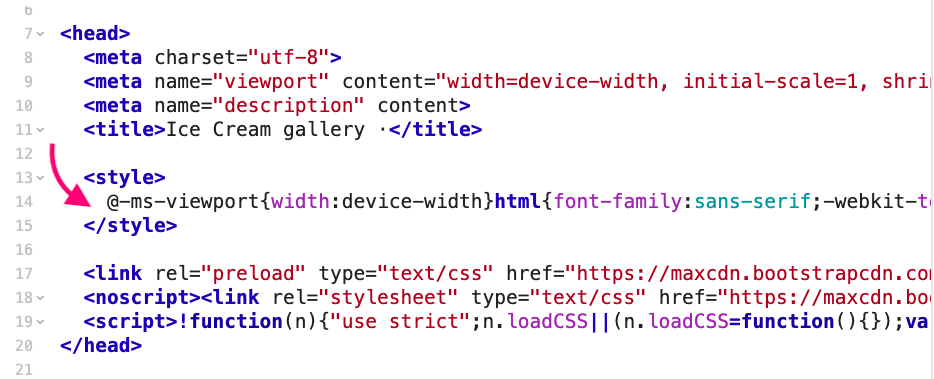
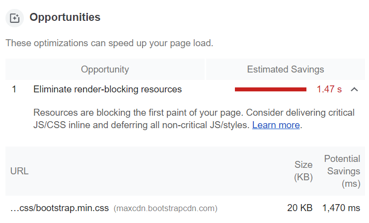

The browser must download and parse CSS files before it can show the page, which makes CSS a render-blocking resource. If CSS files are big, or network conditions are poor, requests for CSS files can significantly increase the time it takes for a web page to render.


Critical CSS is a technique that extracts the CSS for above-the-fold content in order to get a meaningful render as fast as possible.


<figure class="w-figure  w-figure--center">
  
</figure>


Above-the-fold is all the content a viewer sees on page load, before scrolling. There is no universally defined pixel height of what is considered above the fold content since there is a myriad of devices and screen sizes.


Inlining extracted styles in the `<head>` of the HTML document eliminates the need to make an additional request to fetch these styles. The remainder of the CSS can be loaded asynchronously.

<figure class="w-figure  w-figure--center">
    
    <figcaption class="w-figcaption">
    Inlined critical CSS
    </figcaption>
</figure>

If you have poor [First Contentful Paint](https://web.dev/first-contentful-paint/) (FCP) and see "Eliminate render-blocking resource" or “Defer unused CSS” as opportunities in Lighthouse audits, it’s a good idea to give critical CSS a go.


Keep in mind that if you inline a large amount of CSS, it delays the transmission of the rest of the HTML document. If everything is prioritized then nothing is. Inlining also has some downsides in that it prevents the browser from caching the CSS for reuse on subsequent page loads, so it’s best to use it sparingly.


To get the best results, aim to keep your HTML file, including inlined CSS, under **14 KB** (compressed). Due to the [slow start of TCP protocol](https://calendar.perfplanet.com/2018/tcp-slow-start/), approximately 14 KB is the maximum that can be transferred in the initial roundtrip, before browser needs to make another network request. 

Improving render times can make a huge difference in [perceived performance](https://developers.google.com/web/fundamentals/performance/rail#ux), especially under poor network conditions. On mobile networks, high latency is an issue regardless of bandwidth.

The performance impact you can achieve with this technique depends on the type of your website. Generally speaking, the more CSS a site has, the greater the possible impact of inlined CSS.

# Overview of tools

Determining the critical CSS for a page is rather complex. It requires analysis of the entire DOM to determine the styles that are applied to each element in the viewport. Doing this manually would be a tedious process, but there are a number of great tools that do this automatically. 

## Critical

[Critical](https://github.com/addyosmani/critical) extracts, minifies and inlines above-the-fold CSS and is available as [npm module](https://www.npmjs.com/package/critical). It can be used with Gulp (directly) or with Grunt (as a [plugin](grunt-critical)) and there’s a [webpack plugin](html-critical-webpack-plugin) too.

It’s a simple tool that takes a lot of thinking out of the process. You don’t even have to specify the stylesheets, Critical automatically detects them. It also supports extracting critical CSS for multiple screen resolutions.

## criticalCSS

[CriticalCSS](https://github.com/filamentgroup/criticalCSS) is another [npm module](https://www.npmjs.com/package/criticalcss) that extracts above-the-fold CSS. It is also available as a CLI. 

It doesn’t have options to inline and minify critical CSS, but it does let you force-include rules that don't actually belong in critical CSS and gives you more granular control over including `@font-face` declarations.

## Penthouse

[Penthouse](https://github.com/pocketjoso/penthouse) is a good choice if your site or app has a large number of styles or styles which are being dynamically injected into the DOM (common in Angular apps). It is a more robust tool that uses [Puppeteer](https://github.com/GoogleChrome/puppeteer) under the hood. It features an [online hosted version](https://jonassebastianohlsson.com/criticalpathcssgenerator/) too. 

Penthouse doesn’t detect stylesheets automatically, you have to specify the HTML and CSS files that you want to generate critical CSS for. The upside is that it’s good at running many jobs in parallel.

