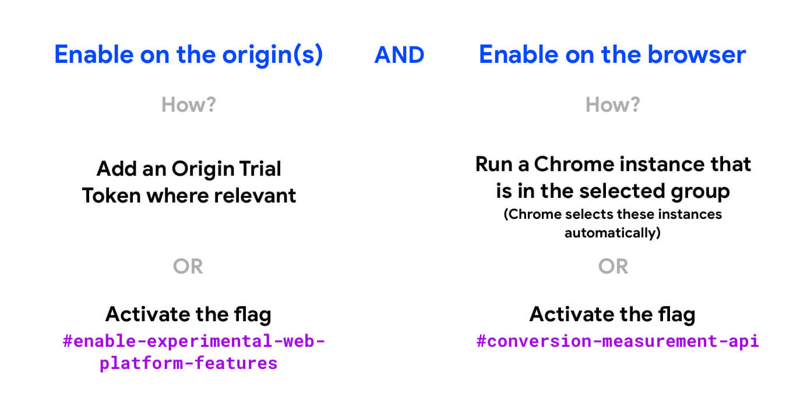

The [Event Conversion Measurement API](/conversion-measurement) measures when an ad click leads to a
conversion, without using cross-site identifiers. Here, you'll find must-dos and tips to use this
API locally or as an experiment for your end users.

## Demo

If you're considering using the API, see the
[demo](https://goo.gle/demo-event-level-conversion-measurement-api) and the corresponding
[code](https://github.com/GoogleChromeLabs/trust-safety-demo/tree/main/conversion-measurement) for a
simple end-to-end implementation example.

## Browser support

The Event Conversion Measurement API can be supported:

- As an [origin trial](/origin-trials/), from Chrome 86 beta to Chrome 88 (February 2021). Origin
  trials enable the API for **all visitors** of a given [origin](/same-site-same-origin/#origin).
  **You need to register your origin for the origin trial in order to try the API with end users**.
- By turning on flags, in Chrome 86 and later. Flags enable the API on a **single user**'s browser.
  **Flags are useful when [developing locally](#develop-locally)**.

See details about the Chrome versions where the API is active on the [Chrome feature
entry](https://chromestatus.com/feature/6412002824028160).

### When is the API available?

For the conversion measurement API to be available on a page, it needs to be:

- Enabled on the **origin**. 
- AND—this is specific to this API—Enabled on the **browser**.

To enable the API on **an origin** for end users, an [origin trial
token](/#register-for-the-origin-trial) must be added where relevant. To activate the API on
**all origins**, for example for [development purposes](/#develop-locally), a single user can activate
the flag `#enable-experimental-web-platform-features`. (Visit `chrome://flags` in Chrome to activate
flags.)

To enable the API on the **browser**, some users won't have to do anything, because the API is
enabled automatically on some Chrome instances. If you want to force-activate the API on your Chrome
instance, for example for [development purposes](/#develop-locally), turn on the flag
`#conversion-measurement-api`.

<figure class="w-figure">
  
</figure>


**Why isn't an origin trial token enough for the API to be available on a page?**
Origin trial features shouldn't exceed a small percentage of global page loads, because they're
ephemeral. Because of this, sites that have registered for origin trials typically need to
selectively enable API usage for small portions of their users. But the Event Conversion Measurement
API involves actions on different top-level pages—so it can be difficult to consistently divert a
user into an experiment group across sites to avoid this usage limit. To make this easier for
developers, Chrome **automatically applies a diversion for this API**. This way, sites can use
client-side feature detection alongside the origin trial to check whether the API can be used, and
don't have to worry as much about throttling their usage.
This means that the API won't be enabled for all users, even for origins that are registered for
origin trials.


## Experiment with the API, with end users

To test the API with end users, you'll need to:

1. Design your experiment.
1. Set up your experiment, by registering your origin for the origin trial and activating the API.

### Design your experiment

Depending on your goal, you may want to look at different aspects of the API when running your
experiment.

If your goal is to **understand the API mechanics**, your experiment could be as follows:

- Track conversions.
- See how you can assign different values to conversion events.
- Look at the conversion reports you're receiving.

If your goal is to **see how well the API satisfies basic use cases**, your experiment could be as
follows:

- Track conversions.
- Look at the aggregate count of conversions you're receiving.
- Recover the corrected count of conversions. See how in [Recover the corrected conversion
  count](<#(optional)-recover-the-corrected-conversion-count>).
- Optionally, if you want to try something more advanced: tweak the noise correction script. For
  example, try different groupings to see what sizes are necessary for the noise to be negligible.
- Compare the corrected count of conversions with source-of-truth data (cookie-based conversion data).

### Set up your experiment

#### Register for the origin trial

- If you're planning on using the API as a third-party, you may be eligible to register your
  [origin](/same-site-same-origin/#origin) for a [third-party origin
  trial](/third-party-origin-trials) so you can test at scale across your customer sites.
- If you're planning to use the API directly on your own origin(s), you can directly register your
  origin(s) for an [origin trial](/origin-trials/).

**Note:** you can't register the origin `localhost`. Instead, see how to activate the API for local
development in [Develop locally](#develop-locally).

#### Activate the API

Once you've registered your origin for the origin trial and added the origin trial token where
necessary, **the API is enabled [only for some visitors of this origin](#when-is-the-api-available)**.

Because of this, it's recommended that you run API-related code only when the feature is available
(since you want to avoid having attributes or executions in your code that have no effect). Once
you've registered your origin for the origin trial and added the token on the page(s) where it's
necessary, follow these steps:

**On the publisher/ad click origin:**

- Detect whether the feature is available on that specific client,
  by running `document.featurePolicy.features().includes('conversion-measurement')` in the top-level
  context of the page.
  A more explicit way to write this would be:
  ```javascript
  function isConversionMeasurementEnabled() {
    return document.featurePolicy.features().includes('conversion-measurement');
  }
  ```
- If this returns `true` i.e. if the feature is available, add the conversion measurement attributes
  onto the tag (`impressiondata`, `conversiondestination` and optionally `reportingorigin` and
  `impressionexpiry`).
- Additionally, if your ad tag is included in an iframe, you need to add a
  [Feature Policy](https://developers.google.com/web/updates/2018/06/feature-policy) for those ads to
  support conversion measurement, as follows:

  ```html/0
  <iframe src="..." allow="conversion-measurement">
    <a impressiondata="..."></a>
  </iframe>
  ```

  **Note:** This last step is only needed for **cross-origin** child contexts, such as iframes with a
  cross-origin value in `src`. It is not needed for ads placed directly on a publisher page or in
  **same-origin child contexts**—in this case, the API is enabled (provided that
  `isConversionMeasurementEnabled()`, defined above, returns true).

**On the advertiser/ad conversion origin:**

- Detect whether the feature is available, by running `isConversionMeasurementEnabled()` (defined
  above) in the top-level context of the page.
- Register conversions only if this returns `true` i.e. if the feature is available.

### (Optional) Recover the corrected conversion count

Even though the conversion data is [noised](/conversion-measurement/#noising-of-conversion-data),
the reporting endpoint can recover the true count of reports that have a specific conversion value.
See how in this [noise corrector example
script](https://github.com/WICG/conversion-measurement-api/blob/master/noise_corrector.py).

User privacy isn't impacted by this technique, because you can't determine whether a specific
event's conversion data was noised. But this gives you the correct conversion count at an
**aggregated** level.

## Develop locally

### Set up your browser for local development

- Use Chrome version 86 or later. You can check what version of Chrome you're using by typing
  `chrome://version` in the URL bar.
- To activate the feature locally—for example if you're developing on `localhost`—you need to enable
  flags. Go to flags by typing `chrome://flags` in Chrome's URL bar. Turn on the **two** flags
  `#enable-experimental-web-platform-features` and `#conversion-measurement-api`.
- Disable third-party cookie blocking. In the long term, dedicated browser settings will be
  available to allow/block the API. Until then, third-party cookie blocking is used as the signal
  that users don't want to share data about their conversions—and hence that this API should be
  disabled.
- Don't use Incognito mode or Guest mode. The API is disabled on these profiles.
- Some ad-blocking browser extensions may block some of the API's functionality (e.g. script names
  containing `ad`). Deactivate ad-blocking extensions on the pages where you need to test the API,
  or create a fresh user profile without extensions.

### Test your origin trial token(s)

If you've registered for an origin trial, the feature should be enabled for your end users **when
their browser is in the [selected Chrome group](#when-is-the-api-available)**. You may want to test
if your origin trial tokens work as expected—but _your_ browser may not be in the selected Chrome
group. To emulate this, enable the flag `#conversion-measurement-api`. This will make your browser
behave like if it was in the selected Chrome group.

### Debug

You can see the conversion reports the browser has scheduled to send at
`chrome://conversion-internals/` > **Pending Reports**. Reports are sent at scheduled times, but for
debugging purposes you may want to get the reports immediately.

- To receive all of the scheduled reports now, click **Send All Reports** in
  `chrome://conversion-internals/` > **Pending Reports**.
- To always receive reports **immediately** without having to click this button, enable the flag
  `chrome://flags/#conversion-measurement-debug-mode`.

## Share your feedback

If you're experimenting with the API, your feedback is key in order to improve the API and support
more use cases—please [share your feedback](/conversion-measurement/#share-your-feedback)!

_With many thanks to Jxck for his feedback on this article._

_Hero image by William Warby / @wawarby on [Unsplash](https://unsplash.com/photos/WahfNoqbYnM),
edited._
