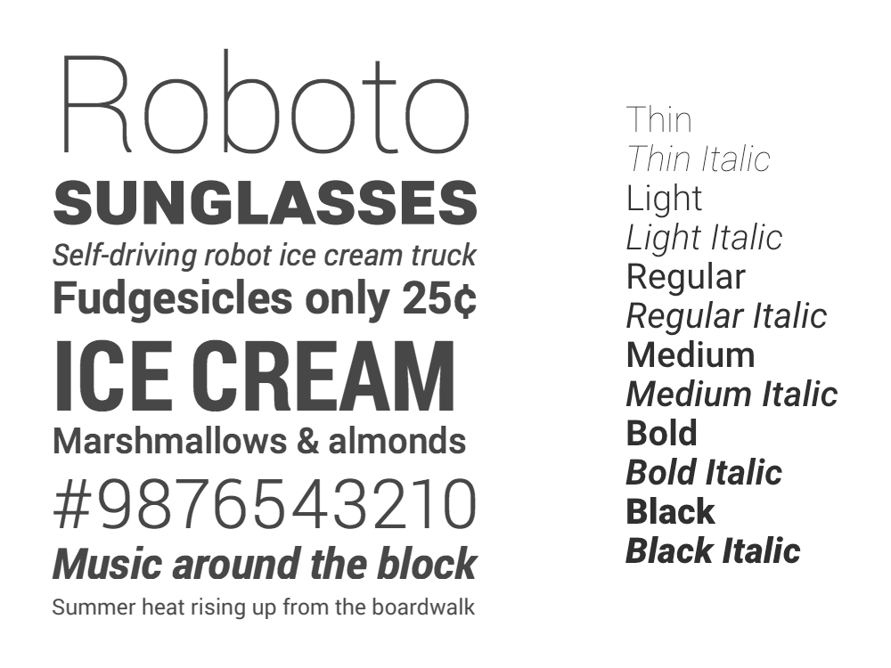
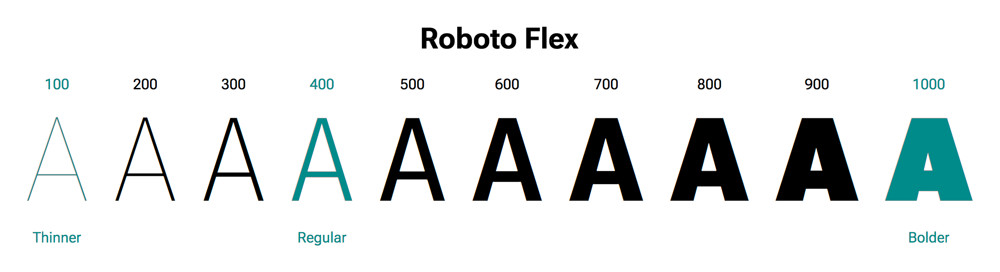
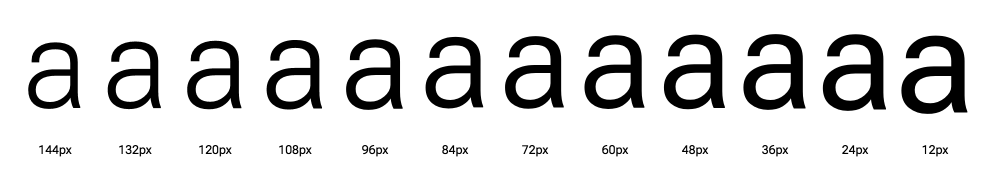

<!--
MAIN URL: https://web.dev/variable-fonts/

Changelog RN:

- Removed original Grade demo image and https://variable-font-experiments.glitch.me in favor of Roboto Flex
- Moved "Use cases and benefits" below browser/CSS tech stuff
- Removed ". I write code like I mix paint:  Dribbble · http://dribbble.com/mustafa_x" -- Dave, did you want to incorporate this somewhere?


TODO add these to "authors" in yaml ↑
{ % include "web/_shared/contributors/dcrossland.html" %}
{ % include "web/_shared/contributors/roeln.html" %}


- redo all images

[xxx](https://alistapart.com/article/how-we-read/) ??

- Spell check

- Apply smart quotes throughout

- Inter w/slnt: https://codepen.io/rs42/full/WNvWRqM -- RN: Using Roboto Flex in this document, so no need?

- add notes about font-stretch not working with css animation (https://bugs.chromium.org/p/chromium/issues/detail?id=924353) -- RN: This has been fixed, let's not mention?


RN: Can we get rid of this?
project_path: /web/fundamentals/_project.yaml
book_path: /web/fundamentals/_book.yaml
description: Introduction to variable fonts – what they are and how to use them
-->

In this article, we will look at what variable fonts are, the benefits they offer,
and how we can use them in our work. First, let's review how typography and
font loading work on the web before variable fonts became available.

## Introduction

The terms font and typeface are often used interchangeably by developers.
However there is a difference: A typeface is the underlying visual design that can exist in many different typesetting technologies, and a font is one of these implementations, in a digital file format.
In other words, a typeface is what you _see_, and the font is what you _use_.

Another concept that is often overlooked is the distinction between a style, and a family.
A style is a single and specific typeface, such as Bold Italic, and a family is the complete set of styles.

Before variable fonts, each style was implemented as a separate font file.
With variable fonts, all styles can be contained in a single file.

<figure class="w-figure">
  
  <figcaption class="w-figcaption w-figcaption--fullbleed">
    Above: Left, a specimen of the Roboto typeface family. Right, named styles within the family.
  </figcaption>
</figure>

## Challenges for the Designer and Developer

<!--
RN: Are we still doing print industry references in 2020? How many web developers would relate to that in an article called "Introduction to variable fonts on the web"?

Cut to the chase?

Unlike books or magazines, which can have as many fonts on a page as they like, a website will have to download every single font it uses. This has been a sticking point for richer typographic experiences, as each font comes at a cost.

With traditional web fonts... etc.
-->

When a designer creates a print project they face some constraints, such as the physical size of the page layout, the number of colors they can use is determined by the kind of printing press that will be used, and so on.
But they can use as many typeface styles as they like.
This means that the typography of print media is often rich and sophisticated, so that the reading experience is truly delightful.
Think of the last time you enjoyed browsing an excellent magazine.

Web designers and developers have different constraints than print designers, and an important one is the associated bandwidth costs of our designs.
This has been a sticking point for richer typographic experiences, as they come at a cost.
With traditional web fonts, each style used in our designs requires users to download a separate font file, which increases latency and page rendering time.
Only including the Regular and Bold styles, plus their italic counterparts, can amount to 500k or more of font data.
This is even before we have dealt how the fonts are rendered, and the fallback or delayed-loading patterns we are going to use (such as ["FOIT" and
"FOUT."](https://www.zachleat.com/web/fout-vs-foit/))

Many font families offer a much wider range of styles, from Thin to Black weights, narrow and wide widths, a variety of stylistic details, and even size-specific designs (optimized for large or small text sizes.)
<!-- RN: sentence below makes it sound the previous sentence lists "few capablities"?
Maybe something like: "Since you'd have to load a new font file for every style (or combinations of styles), many web developers choose not to use these capabilities, reducing the reading experience of their users." -->
When using so few of these capabilities, we reduce the reading experience of our users.

## Anatomy of a Variable Font

Variable fonts addresses these callenges, by packing styles into a single file.

<!-- RN: I'm just a yokel and English isn't my 1st language, but maybe ease into this anatomy a bit more? Or make it less complex? -->

This works by starting with a central or 'default' master style, usually the 'Regular' – an upright roman design with the most typical weight and width that is most suitable for plain text.
This is then connected to other style masters in a continuous range, called an 'axis.'
The most common axis is **Weight**, which can connect the default style through to a Bold master style.
Any individual style can be located along an axis, and is called an 'instance' of the variable font.
Some instances are named by the font developer, for example Weight axis location 600 is called SemiBold.

The variable font [Roboto Flex](https://github.com/TypeNetwork/Roboto-Flex) has three masters for its **Weight** axis. The Regular master is at the center, and two masters at the opposite ends of the axis, that are lighter and heavier.
Between these, you can choose from 900 instances:

<figure class="w-figure">
  
  <figcaption class="w-figcaption w-figcaption--fullbleed">
    Above: Illustrated anatomy of the Weight axis for the typeface Roboto.
  </figcaption>
</figure>

The font developer can offer a set of different axes, and because they all share the same default master, you can combine them.
Roboto has three masters in a Width axis: the Regular is at the center of the axis, and two masters, narrower and wider, are at each end.
These provide all the widths of the Regular style, and combine with the Weight axis to provide all the widths for every weight.

<figure class="w-figure">
  <video controls autoplay loop muted class="w-screenshot">
    <source src="roboto-dance.mp4" type="video/mp4">
    <!-- TODO: video file should be hosted on https://storage.googleapis.com/web-dev-assets/variable-fonts -->
  </video>
    <figcaption>
    Roboto Flex in random combinations of Width and Weight
  </figcaption>
</figure>

This means there are thousands of styles!
This may seem like massive overkill, but the quality of the reading experience can be remarkably enhanced by this diversity of type styles.
And, if it is without performance penalty, web developers can use a few or as many styles as they wish – it’s up to their design.

<!-- TODO DC restart here -->

### Italics

The way that Italics are handled in variable fonts is interesting, as there are
two difference approaches. Typefaces like Helvetica or Roboto have interpolation
compatible contours, so their Roman and Italic styles can be interpolated
between and the **Slant** axis can be used to get from Roman to Italic.

Other typefaces (such as Garamond, Baskerville, or Bodoni) have Roman and Italic
glyph contours that are not interpolation compatible. For example, the contours
that typically define a Roman lowercase “n” do not match the contours used to
define an Italic lowercase “n”. Instead of interpolating one contour to the
other, the **Italic** axis toggles from Roman to Italic contours.

<figure class="w-figure">
  
  <figcaption>
    Amstelvar's “n” contours in Italic (12 point, regular weight, normal width),
    and in Roman. Image supplied by David Berlow, type designer and typographer
    at Font Bureau.
  </figcaption>
</figure>

After the switch to Italic, the axes available to the user should be the same
as those for the Roman, just as the character set should be the same.

A glyph substitution capability can also be seen for individual glyphs, and used
anywhere in the design space of a variable font. For example, a dollar sign
design with two vertical bars works best at larger point sizes, but at smaller
point sizes a design with only one bar is better. When we have fewer pixels
for rendering the glyph, a two bar design can become illegible. To combat this,
much like the Italic axis, a glyph substitution of one glyph for another can
occur along the **Optical Size** axis at a point decided by the type designer.

In summary, where the contours allow for it, type designers can create fonts
that interpolate between various masters in a multi-dimensional design space.
This gives you granular control over your typography, and a great deal of power.

## Axes Definitions

There are five [registered axes](https://docs.microsoft.com/en-us/typography/opentype/spec/dvaraxisreg#registered-axis-tags), which control known, predictible features of the font: weight, width, optical size, slant and italics. Besides those, a font can contain custom axes. These can control any design aspect of the font the type designer wishes: the size of serifs, the length of swashes, the height of ascenders or the size of the dot on the i.

Even though axes can control the same feature, they might use different values. For example, in the Oswald and Hepta Slab variable fonts there is only one axis available, Weight, but the ranges are different – Oswald has the same range as before it was upgraded to be variable, 200 to 700, but Hepta Slab has an extreme hairline weight at 1 that goes all the up to 900.

The five registered axes have 4-character lowercase tags that are used to
set their values in CSS:

<table class="responsive">
	<tbody>
		<tr>
			<th colspan="2">Axis names and CSS values</th>
		</tr>
		<tr>
			<td>
				Weight
			</td>
			<td>
				<code>wght</code>
			</td>
		</tr>
		<tr>
			<td>
				Width
			</td>
			<td>
				<code>wdth</code>
			</td>
		</tr>
		<tr>
			<td>
				Slant
			</td>
			<td>
				<code>slnt</code>
			</td>
		</tr>
		<tr>
			<td>
				Optical Size
			</td>
			<td>
				<code>opsz</code>
			</td>
		</tr>
		<tr>
			<td>
				Italics
			</td>
			<td>
				<code>ital</code>
			</td>
		</tr>
	</tbody>
</table>


Since the font developer defines which axes are available in a variable font, and which values they can have, it is essential to find out what each font offers.
The font's documentation should provide this, or you can inspect the font using a tool like [Wakamai Fondue](https://wakamaifondue.com).

## Variable Fonts in CSS

### Loading Variale Font Files

<!-- TODO something about GF API here -->

Variable fonts are loaded though the same `@font-face` mechanism as traditional static web fonts, but with two new enhancements:

```css
@font-face {
	font-family: 'Roboto Flex';
	src: url('RobotoFlex-VF.woff2') format('woff2 supports variations'),
       url('RobotoFlex-VF.woff2') format('woff2-variations');
	font-weight: 100 1000;
	font-stretch: 25% 151%;
}
```

**1. Source Formats:** We don't want the browser to download the font if it doesn't support variable fonts, so we add a `format` description: once in the [future format](https://www.w3.org/TR/css-fonts-4/#font-face-src-requirement-types) (`woff2 supports variations`), once in the current but soon to be deprecated format (`woff2-variations`). If the browser supports variable fonts and supports the upcoming syntax, it will use the first declaration. If it supports variable fonts and the current syntax, it will use the second declaration. They both point to the same font file.

<!-- TODO 2021 Q1 revisit this, based on progress in https://www.w3.org/TR/css-fonts-4/#font-face-src-requirement-types to allow removing the 2nd src -->

**2. Style Ranges:** You'll notice we're supplying two values for `font-weight` and `font-stretch`. Instead of telling the browser which specific weight this font provides (e.g. `font-weight: 500;`), we now give it the **range** of weights supported by the font. For Roboto Flex, the Weight axis ranges from 100 to 1000, and CSS directly maps the axis range to the `font-weight` style property. By specifying the range in `@font-face`, any value outside this range will be "capped" to the nearest valid value. The Width axis range is mapped in the same way to the `font-stretch` property.

### Using Weights and Widths

Currently, the axes you can reliably set from CSS are `wght` through `font-weight`, and `wdth` through `font-stretch`.

Traditionally, you would set `font-weight` as a keyword (`light`, `bold`) or as a numerical value in steps of 100. With variable fonts, you can set any value within the font's Width range:

```css
.kinda-light {
  font-weight: 125;
}

.super-heavy {
  font-weight: 1000;
}
```

<figure class="w-figure">
  <video controls autoplay loop muted class="w-screenshot">
    <source src="roboto-flex-weight.mp4" type="video/mp4">
    <!-- TODO: video file should be hosted on https://storage.googleapis.com/web-dev-assets/variable-fonts -->
  </video>
    <figcaption>
    Roboto Flex' Weight axis being changed from its minimum to its maximum.
  </figcaption>
</figure>

Likewise, we can set `font-stretch` with keywords (`condensed`, `ultra-expanded`) or with percentage values:

```css
.kinda-narrow {
  font-stretch: 33.3%;
}

.super-wide {
  font-stretch: 151%;
}
```

<figure class="w-figure">
  <video controls autoplay loop muted class="w-screenshot">
    <source src="roboto-flex-width.mp4" type="video/mp4">
    <!-- TODO: video file should be hosted on https://storage.googleapis.com/web-dev-assets/variable-fonts -->
  </video>
    <figcaption>
    Roboto Flex' Width axis being changed from its minimum to its maximum.
  </figcaption>
</figure>

### Using Italics and Obliques

<!-- TODO explain what italic and oblique are in typeface design -->
<!-- RN: Already explained in ### Italics ? Still gave it a shot: -->

The `ital` axis is intended for fonts that contain both a regular style, and an italic style. The axis is meant to be an on/off switch: value `0` is off and will show the regular style, value `1` will show the italics. Different from other axis, there's no transition. A value of `0.5` won't give you "half italics".

The `slnt` axis is different from italics in that it's not a new *style*, but just slants the regular style. By default its value is `0`, which means the default upright lettershapes. Roboto Flex has a maximum slant of -10 degrees, meaning the letters will lean to the right when going from 0 to -10.

It would be intuitive to set these axis through the `font-style` property, but as of April 2020, how to exactly do this is [still being worked out](https://github.com/w3c/csswg-drafts/issues/3125). So for now, you should treat these as custom axes, and set them through `font-variation-settings`:

```css
i, em, .italic {
	/* Should be font-style: italic; */
	font-variation-settings: 'ital' 1;
}

.slanted {
	/* Should be font-style: oblique 10deg; */
	font-variation-settings: 'slnt' 10;
}
```

<figure class="w-figure">
  <video controls autoplay loop muted class="w-screenshot">
    <source src="roboto-flex-slant.mp4" type="video/mp4">
    <!-- TODO: video file should be hosted on https://storage.googleapis.com/web-dev-assets/variable-fonts -->
  </video>
    <figcaption>
    Roboto Flex' Slant axis being changed from its minimum to its maximum.
  </figcaption>
</figure>

### Using Optical Sizes

A typeface can be rendered very small (a 12px footnote) or very large (a 80px headline). Fonts can respond to these size changes by changing its lettershapes to better suit its size. A small size might be better off without fine details, while a large size might benefit from more details and thinner strokes.

<!-- TODO explain how opsz is defined as px and pt -->

A new CSS property has been introduced for this axis: `font-optical-sizing`. By default it's set to `auto`, which makes the browser set the axis value automatically based on the `font-size`.

So picking the best optical size is done automatically, but if you wish to turn this off you can set `font-optical-sizing` to `none`.

You can also set a custom value for the `opsz` axis, if you deliberately want an optical size that doesn't match the font size. The following CSS would cause text to be displayed at a large size, but at an optical size as if it were printed in `8pt`:

```css
.small-yet-large {
  font-size: 100px;
  font-variation-settings: 'opsz' 8;
}
```

<figure class="w-figure">
  
  <figcaption>
    Example of different designs for Roboto Flex' letter 'a' at different sizes.
    <a href="https://codepen.io/RoelN/pen/PoPvdeV">Try it yourself on Codepen</a>
  </figcaption>
</figure>

### Using Custom Axes

Roboto Flex offers a few custom axes, and the most important is Grade (`GRAD`). A Grade axis is interesting as it changes the weight of the font without changing the widths, so line breaks do not change.
By playing with a Grade axis, you can avoid being forced to fiddle with changes to Weight axis that effects the overall width, and then changes to the Width axis that effect the overall weight.

Note that tags for custom axes are always in uppercase, to destinguish them from registered axes.

<figure class="w-figure">
  <video controls autoplay loop muted class="w-screenshot">
    <source src="roboto-flex-grade.mp4" type="video/mp4">
    <!-- TODO: video file should be hosted on https://storage.googleapis.com/web-dev-assets/variable-fonts -->
  </video>
    <figcaption>
    Roboto Flex' Grade axis being changed from its minimum to its maximum.
  </figcaption>
</figure>

As `GRAD` is a custom axis, with a range of -1 to 1, we need to address it with `font-variation-settings`. We could create three classes:

```css
.grade-light {
	font-variation-settings: `GRAD` -1;
}

.grade-normal {
	font-variation-settings: `GRAD` 0;
}

.grade-heavy {
	font-variation-settings: `GRAD` 1;
}
```

However, here's a little gotcha. Every property you don't set through `font-variation-settings` will automatically be reset to their defaults. Previously set values aren't inherited. This means the following will not work as expected:

```html
<span class="slanted grade-light">
	I should be slanted and have a light grade
</span>
```

First the browser will apply `font-variation-settings: 'slnt' 10` from the `.slanted` class. Then it will apply `font-variation-settings: 'GRAD' -1` from the `.grade-light` class. But this will reset the `slnt` back to its default of 0! The result will be text in a light grade, but not slanted.

We can work around this by using CSS variables:

```css
/* Set the default values */
:root {
	--slnt: 0;
	--GRAD: 0
}

/* Change value for these elements and their children */
.slanted {
	--slnt: 10;
}

.grade-light {
	--grad: -1;
}

.grade-normal {
	--grad: 0;
}

.grade-heavy {
	--grad: 1;
}

/* Apply whatever value is kept in the CSS variables */
.slanted,
.grade-light,
.grade-normal,
.grade-heavy {
	font-variation-settings: 'slnt' var(--slnt), 'GRAD' var(--GRAD);
}
```

Animating CSS variables doesn't work (by design), so something like this doesn't work:

```css
@keyframes width-animation {
   from { --wdth: 25; }
   to   { --wdth: 151; }
}
```

So animations will have to happen directly on `font-variation-settings`.

## Performance Gains

OpenType variable fonts allow us to store multiple variations of a type
family into a single font file.
[Monotype](https://medium.com/@monotype/part-2-from-truetype-gx-to-variable-fonts-4c28b16997c3) ran an experiment by combining 12 input fonts to generate eight weights, across three widths, across both the Italic and Roman styles.
Storing 48 individual fonts in a single variable font file meant a **88% reduction in file size**.

On the flip side, if you are animating the font between settings, this may cause the browser performance issues. Learn more about this on [Surma's Supercharged](https://www.youtube.com/watch?v=B42rUMdcB7c).

With variable fonts, app and website makers can offer really rich typography experiences that express each brand, without the previous bandwidth and latency costs. However, if you are using a single font such as Roboto Regular and nothing else, you might see a net gain in font size if you were to switch to a variable font with many axes. As always, it depends on your use-case.

## Fallbacks and Browser Support

All modern browsers support variable fonts.
See [caniuse.com](https://caniuse.com/#search=font-variation-settings) for more details.
In case you need to support older browsers, you can choose to build your site with static fonts, and use variable fonts as progessive enhancement.

```css
/* Set up Roboto for old browsers, only regular + bold */
@font-face {
  font-family: Roboto;
  src: url('Roboto-Regalar.woff2');
  font-weight: normal;
}

@font-face {
  font-family: Roboto;
  src: url('Roboto-Bold.woff2');
  font-weight: bold;
}

body {
	font-family: Roboto;
}

.super-bold {
	font-weight: bold;
}

/* Set up Roboto for modern browsers, all weights */
@supports (font-variation-settings: normal) {
  @font-face {
    font-family: Roboto;
    src: url('RobotoFlex-VF.woff2');
    font-weight: 100 1000;
  }

  <!-- TODO insert @import GF API here using weight 400..1000 --- although, in this case, isn't the supports stuff all taken care of and style selection algo means this isn't needed ? -->

  .super-bold {
	font-weight: 1000;
  }
}
```

For older browsers, text with the class `.super-bold` will get rendered in the normal bold, as that's the only bold font we have available. When variable fonts are supported, we can actually use the heaviest weight of 1000.


## Use Cases and Benefits

Setting the axes values comes down to personal taste and applying typographic
best practices.
The danger with any new technology is possible misuse, and settings that are overly artistic or exploratory could also decrease legibility of the actual text.
For titles, exploring different axes to create great artistic designs are exciting, but for body copy this risks making the text illegible.

### Exciting Expression

<figure class="w-figure">
  
</figure>

One great example of artistic expression is shown above, an explorations of the typeface
[Decovar](https://www.typenetwork.com/brochure/decovar-a-decorative-variable-font-by-david-berlow)
by Mandy Michael.

You can view the working example and source code for the above sample
[here](https://codepen.io/mandymichael/pen/YYaWop).

### Animation

<figure class="w-figure">
  <video controls autoplay loop muted class="w-screenshot">
    <source src="axis-praxis.mp4" type="video/mp4">
    <!-- TODO: video file should be hosted on https://storage.googleapis.com/web-dev-assets/variable-fonts -->
  </video>
    <figcaption>
    Typeface Zycon, designed for animation by David Berlow, type designer and
    typographer at Font Bureau.
  </figcaption>
</figure>

There is also a possibility to explore animating characters
with variable fonts. Above is an example of different axes being used
with the typeface Zycon. See the live
[animation example on Axis Praxis](https://www.axis-praxis.org/specimens/zycon).

[Anicons](https://typogram.github.io/Anicons) is the world’s first animated color icon font, based on Material Design Icons. Anicons is an experiment that combines two cutting edge font technologies: variable fonts and color fonts.

<figure class="w-figure">
  <video controls autoplay loop muted class="w-screenshot">
    <source src="anicons-animation.mp4" type="video/mp4">
    <!-- TODO: video file should be hosted on https://storage.googleapis.com/web-dev-assets/variable-fonts -->
  </video>
    <figcaption>
    A few examples of hover animations from Anicon's color icon font
  </figcaption>
</figure>

### Finesse

<figure class="w-figure">
  
</figure>

Roboto Flex and Amstelvar offer a set of "Parametric Axes."
In these axes, the letters are deconstructed into 4 fundamental aspects of form:
black or positive shapes, white or negative shapes, and the x and y dimensions.
In the same way that primary colors can be blended with any other color to adjust it, these 4 aspects can be used to fine tune any other axis.

Ascender and descender lengths are adjusted in the Optical Size axis, but a "one size fits all" approach does not work: Further adjustments are needed, such as in response to line length, shown above.

## Thanks {: .hide-from-toc }

This article would have only been made possible with the help of the following
people:

* [Mustafa Kurtuldu](https://twitter.com/mustafa_x), UX designer and design advocate at Google
* [Roel Nieskens](https://twitter.com/PixelAmbacht), UX designer/developer and typography expert at [Kabisa](https://kabisa.nl)
* [Dave Crossland](https://twitter.com/davelab6), Program Manager, Google Fonts
* [David Berlow](https://twitter.com/dberlow), type designer and typographer at
  [Font Bureau](https://fontbureau.typenetwork.com/)
* [Laurence Penney](https://twitter.com/lorp), developer of [axis-praxis.org](https://axis-praxis.org)
* [Mandy Michael](https://twitter.com/Mandy_Kerr), developer of [variablefonts.dev](https://variablefonts.dev)

## Feedback {: #feedback }

{ % include "web/_shared/helpful.html" %}
