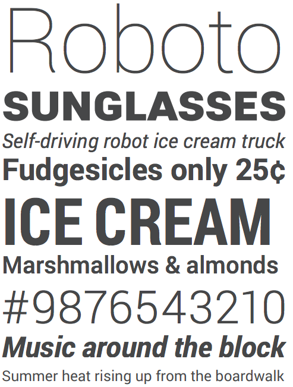
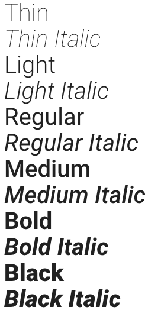
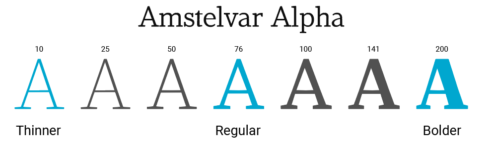
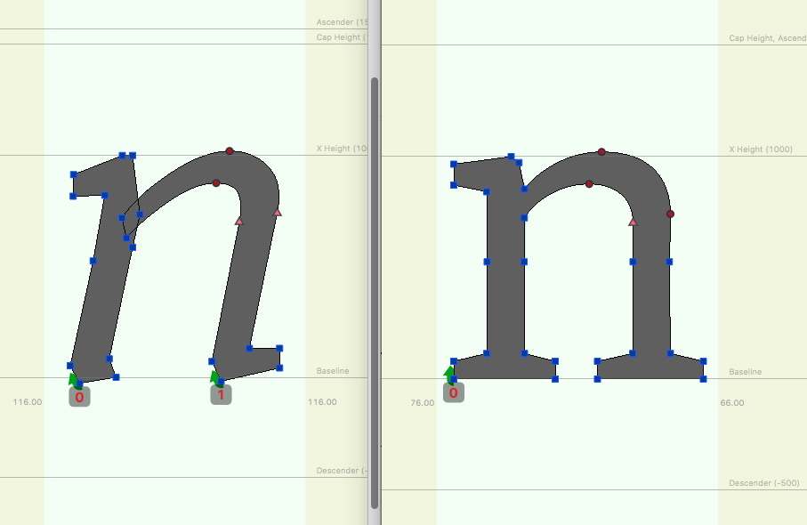

Variable fonts can significantly reduce the size of your font files and make
it possible to animate your font characters. This guide explains how
variable fonts work, how typographers implement variable fonts, and how
to work with variable fonts in CSS.

## Browser compatibility {: #compatibility }

As of May 2020 variable fonts are supported in most browsers. See
[Can I use variable fonts?](https://caniuse.com/#feat=variable-fonts)
and [Fallbacks](#fallbacks).

## Introduction

The terms font and typeface are used interchangeably in the developer industry.
However there is a difference: A typeface includes an entire family of designs,
such as the [Roboto](https://fonts.google.com/specimen/Roboto) typeface.
Meanwhile a font is one of the digital files of that family, like "Roboto Bold"
or "Roboto Italic." In other words, a typeface is what you _see_, and the font is
what you _use_.

<figure class="w-figure">
  
  <figcaption class="w-figcaption">
    Examples of the Roboto typeface that was designed and developed
    by Christian Robertson.
  </figcaption>
</figure>

<figure class="w-figure">
  
  <figcaption class="w-figcaption">
    Different fonts within the Roboto family.
  </figcaption>
</figure>

### Challenges for the Designer and Developer

When a graphic designer prepares their work, they typically export the final
artwork in a way that either embeds all of the fonts used, or they provide
an export archive that contains all of the assets used separately, a bit like a
basic website. The cost to the designer depends on the suitability of the
typeface for the rendering context  (is it legible at small sizes, for example)
and the license to use the fonts.

On the web, we have to consider both aspects, plus the associated bandwidth
costs. For every member of a typeface family used in our designs, we have had to
require another font file to be downloaded by our users before they can see that
text. Only including the Regular and Bold styles, plus their italic
counterparts, can amount to 500&nbsp;KB or more of data. This has been a sticking point
for web designers and developers, as a richer typographic experience comes
at a cost. This is even before we have dealt with how the fonts are rendered, and the
fallback or delayed-loading patterns we are going to use to prevent [FOIT and
FOUT](https://css-tricks.com/fout-foit-foft/).

## Anatomy of a variable font

A variable font is a collection of master styles, with one central "default"
master (usually the Regular font style) and multiple registered "axes" which
tie the central master to the other masters. For example, the **Weight** axis
might connect a Light style master to the default style and through to the Bold
style master. The individual styles that can be located along this axis are
called instances.

For example, the variable font [Amstelvar](https://github.com/TypeNetwork/Amstelvar)
has three masters for its **Weight** axis: The Regular master is at the center,
and two masters, Thinner and Bolder, are at the opposite ends of the axis.
Between these there are potentially 200 instances that can be chosen by the
designer or developer:

<figure class="w-figure">
  
  <figcaption class="w-figcaption">
    Typeface Amstelvar, designed by David Berlow, type designer and
    typographer at Font Bureau.
  </figcaption>
</figure>

The [OpenType specification](https://docs.microsoft.com/en-gb/typography/opentype/spec/dvaraxisreg)
specifies other axis, such as **Width**, **Optical Size**, **Italic** and
**Slant**. All of these axes share the same default master, and we can combine
them to explore an exponential number of typographic styles, like powers of 2,
3, and 4 do to numbers.

Amstelvar also has three masters in a Width axis: Again the Regular is at the
center of the axis, and two masters, narrow and wider, are at the opposite ends
of this axis. These not only provide all the widths of the Regular style, but
also all the widths and weights combined.

Among Amstelvar's registered axes (Width, Weight and Optical Size) there are
thousands of styles. This may seem like massive overkill, but consider that
Amstelvar only supports the Latin writing system. Considering the needs of all
the world's scripts, and many of today's typography applications, the quality
of the reading experience can be remarkably enhanced by this diversity of type
styles within a font. And, if it is without performance penalty, the user can
use a few or as many styles as they wish–it's up to their design.

### Italics are slightly different

The way that italics are handled in variable fonts is interesting, as there are
two different approaches. Typefaces like Helvetica or Roboto have 
interpolation-compatible contours, so their Roman and Italic styles can be interpolated
between and the **Slant** axis can be used to get from Roman to Italic.

Other typefaces (such as Garamond, Baskerville, or Bodoni) have Roman and Italic
glyph contours that are not interpolation-compatible. For example, the contours
that typically define a Roman lowercase "n" do not match the contours used to
define an Italic lowercase "n". Instead of interpolating one contour to the
other, the **Italic** axis toggles from Roman to Italic contours.

<figure class="w-figure">
  
  <figcaption class="w-figcaption">
    Amstelvar's "n" contours in Italic (12 point, regular weight, normal width),
    and in Roman. Image supplied by David Berlow, type designer and typographer
    at Font Bureau.
  </figcaption>
</figure>

After the switch to Italic, the axes available to the user should be the same
as those for the Roman, just as the character set should be the same.

A glyph substitution capability can also be seen for individual glyphs, and used
anywhere in the design space of a variable font. For example, a dollar sign
design with two vertical bars works best at larger point sizes, but at smaller
point sizes a design with only one bar is better. When we have fewer pixels
for rendering the glyph, a two bar design can become illegible. To combat this,
much like the Italic axis, a glyph substitution of one glyph for another can
occur along the **Optical Size** axis at a point decided by the type designer.

In summary, where the contours allow for it, type designers can create fonts
that interpolate between various masters in a multi-dimensional design space.
This gives you granular control over your typography, and a great deal of power.

## Axes Definitions

Since the font developers define which axes are available in their fonts, it is
essential to check the font's documentation to know what is available. For
example, in the Gingham variable font designed by Christoph Koeberlin, there are
two axes available, Width and Weight. The Amstelvar variable font does not
contain a Slant axis, but does have an axis it calls Grade, plus many more axes.

A Grade axis is interesting as it changes the weight of the font without
changing the widths, so line breaks do not change. By playing with a
Grade axis, you can avoid being forced to fiddle with changes to the Weight axis
that effects the overall width, and then changes to the Width axis that effect
the overall weight. This is possible because the Amstelvar default style has
been deconstructed in the 4 fundamental aspects of form: black or positive
shapes, white or negative shapes, and the X and Y dimensions. These 4 aspects
can be mixed to form the other styles, such as Width and Weight, in the way
that primary colors can be mixed to create any other color.

<figure class="w-figure">
  <video controls autoplay loop muted class="w-screenshot">
    <source src="https://storage.googleapis.com/web-dev-assets/variable-fonts/amstel-grade-e.mp4" 
            type="video/mp4">
  </video>
  <figcaption class="w-figcaption">
    Grade axis being changed on the fly.
  </figcaption>
</figure>



The five registered axes plus Grade have 4-character tags that are used to
set their values in CSS:

<div class="w-table-wrapper">
  <table>
    <tbody>
      <tr>
        <th colspan=2>Axis names and CSS values</th>
      </tr>
      <tr>
        <td>
          Weight
        </td>
        <td>
          <code>wght</code>
        </td>
      </tr>
        <tr>
        <td>
          Width
        </td>
        <td>
          <code>wdth</code>
        </td>
      </tr>
            <tr>
        <td>
          Slant
        </td>
        <td>
          <code>slnt</code>
        </td>
      </tr>
            <tr>
        <td>
          Optical Size
        </td>
        <td>
          <code>opsz</code>
        </td>
      </tr>
            <tr>
        <td>
          Italics
        </td>
        <td>
          <code>ital</code>
        </td>
      </tr>
            <tr>
        <td>
          Grade
        </td>
        <td>
          <code>GRAD</code>
        </td>
      </tr>
    </tbody>
  </table>
</div>

In order to add a variable font first we must link it, as with any custom font;

```css
@font-face {
  font-family: 'AmstelvarAlpha';
  src: url('../fonts/AmstelvarAlpha-VF.ttf');
}
```

The way we define an axis value is by using the CSS property `font-variations`
which has a series of values that pair the axis tag with an instance location:

```css
#font-amstelvar {
  font-family: 'AmstelvarAlpha';
  font-variation-settings: 'wdth' 400, 'wght' 98;
}
```

<figure class="w-figure">
  <video controls autoplay loop muted class="w-screenshot">
    <source src="https://storage.googleapis.com/web-dev-assets/variable-fonts/gingham-weight-e.mp4" 
            type="video/mp4">
  </video>
  <figcaption class="w-figcaption">
    A demonstration of the Weight and Width axes being changed on the fly.
  </figcaption>
</figure>

## Responsibility of the typesetter

Setting the axes values comes down to personal taste and applying typographic
best practices. The danger with any new technology is possible misuse, and
settings that are overly artistic or exploratory could also decrease legibility
of the actual text. For titles, exploring different axes to create great
artistic designs are exciting, but for body copy this risks making the text
illegible.

<figure class="w-figure">
  
  <figcaption class="w-figcaption">
    A great example of artistic expression is 
    <a href="https://codepen.io/mandymichael/pen/YYaWop">Mandy Michael's exploration</a> of the typeface
    <a href="https://www.typenetwork.com/brochure/decovar-a-decorative-variable-font-by-david-berlow">Decovar</a>.
  </figcaption>
</figure>

It's also possible to animate characters with variable fonts.

<figure class="w-figure">
  <video controls autoplay loop muted class="w-screenshot">
    <source src="https://storage.googleapis.com/web-dev-assets/variable-fonts/axis-praxis.mp4" 
            type="video/mp4">
  </video>
  <figcaption class="w-figcaption">
    <a href="https://www.axis-praxis.org/specimens/zycon">An example of using different axes to animate characters</a>
    with the typeface Zycon. Zycon was designed for animation by David Berlow, type designer and
    typographer at Font Bureau.
  </figcaption>
</figure>

## Variable fonts performance gains {: #performance }

OpenType variable fonts allow us to store multiple variations of a type
family into a single font file. [Monotype](https://goo.gl/9gonHT)
ran an experiment by combining 12 input fonts to
generate eight weights, across three widths, across both the Italic and Roman
styles. Storing 48 individual fonts in a single variable font file meant a
**88% reduction in file size**.

On the flip side, if you are animating the font between settings, this may
cause the browser performance issues. Learn more about this in
the Supercharged episode on variable fonts.



With variable fonts, app and website makers can offer really rich typography
experiences that express each brand, without the previous bandwidth and latency
costs. However, if you are using a single font such as Roboto Regular and
nothing else, you might see a net gain in font size if you were to switch to a
variable font with many axes. As always, it depends on your use-case.

## Fallbacks {: #fallbacks }

As mentioned in [Browser compatibility](#compatibility), most browsers support
variable fonts. For the remaining browsers that do not, you can use `@supports`
to create a viable fallback:

```css
@supports (font-variation-settings: 'wdth' 200) {
  @font-face {
    /* https://github.com/TypeNetwork/Amstelvar */
    font-family: AmstelvarAlpha;
    src: url('../fonts/AmstelvarAlpha-VF.ttf');
    font-weight: normal;
    font-style: normal;
  }

  #font-amstelvar {
    font-family: AmstelvarAlpha;
    font-variation-settings: 'wdth' 400, 'wght' 98;
  }
}
```

## Thanks

This article would not have been possible without the help of the following
people:

* David Berlow, type designer and typographer at
  [Font Bureau](https://fontbureau.typenetwork.com/)
* Laurence Penney, developer of [axis-praxis.org](https://axis-praxis.org)
* [Mandy Michael](https://twitter.com/Mandy_Kerr)
* Dave Crossland, Program Manager, Google Fonts

Hero image by [Bruno Martins](https://unsplash.com/@brunus) on
[Unsplash](https://unsplash.com/photos/OhJmwB4XWLE).
