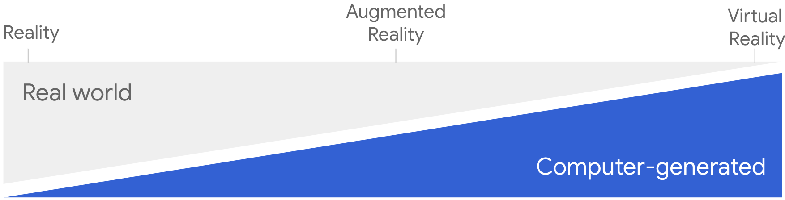

Immersive experiences have come to the web in Chrome 79. The WebXR Device API
brings virtual reality (with augmented reality to come later). While an update
to the GamePad API extends the advanced use of controlls to VR. Other browsers
will be supporting these specs soon, including Firefox Reality, Oculus Browser,
Edge and Magic Leap's Helio browser, among others.

This article begins a series on the immersive web. This installment covers
setting up a basic WebXR application and constructing a frame loop, the
workhorse of an immersive experience. Later articles will cover drawing to a
screen and interacting with input devices using [Gamepad API
updates](https://www.chromestatus.com/features/5659025263820800) mentioned
above. Though Chrome only supports virtual reality for now, everything I cover
in this and succeeding articles applies equally to both AR and VR.

If you've followed the progress of immersive experiences on the web, you know
there has been much experimentation in recent years. An early WebVR
implementation, released in 2017 in Firefox and in 2018 in Chrome behind a flag,
proved inadequate for [various
reasons](https://developers.google.com/web/updates/2018/05/welcome-to-immersive#what_happened_to_webvr_11).
The work to correct its shortcomings blossomed last year into the [WebXR Device
API](https://www.w3.org/TR/webxr/). It was in an origin trial for a while, and
now Chrome is enabling it by default.

## What is the immersive web?

Though we use two terms to describe immersive experiences&mdash;augmented
reality and virtual reality&mdash;many think of them on a spectrum from complete
reality to completely virtual, with degrees of immersion in between. The 'X' in
XR is intended to reflect that thinking by being a sort of algebraic variable
that stands for anything in the spectrum of immersive experiences.

<figure class="w-figure w-figure--center">
  
  <figcaption class="w-figcaption w-figcaption--fullbleed">
    The spectrum of immersive experiences
  </figcaption>
</figure

Examples of immersive experiences include:

* Games
* 360° videos
* Traditional 2D (or 3D) videos presented in immersive surroundings
* Home buying
* Viewing products in your home before you buy them
* Immersive art
* Something cool nobody's thought of yet

## Concepts and usage

I'll explain a few basics of using the WebXR Device API. If you need more depth
than I've provided, check out the Immersive Web Working Group's [WebXR
samples](https://immersive-web.github.io/webxr-samples/) or [MDN's growing
reference
materials](https://developer.mozilla.org/en-US/docs/Web/API/WebXR_Device_API).
If you're familiar with early versions of the WebXR Device API, you should
glance over all of this material. There have been changes.

The code in this article is based on the Immersive Web Working Group's barebones
sample ([demo](https://immersive-web.github.io/webxr-samples/xr-barebones.html),
[source](https://github.com/immersive-web/webxr-samples/blob/master/xr-barebones.html)),
but is edited for clarity and simplicity.

Part of creating the WebXR specification has been fleshing out security and
privacy measures to protect users. Consequently, implementations must adhere to
certain requirements. A web page or app must be active and focused before it can
request anything sensitive from the viewer. Web pages or apps must be served
over HTTPS. The API itself is designed to protect information obtained from
sensors and cameras, which it needs in order to function.

### Requesting a session

Entering an XR session requires a user gesture. To get that, use feature
detection and make a call to `isSessionSupported()`. In the example below, I've
indicated that I want a virtual reality session with the `'immersive-vr'`
session type. [Other session
types](https://developer.mozilla.org/en-US/docs/Web/API/XR/isSessionSupported#Syntax)
are defined in the spec and will be available in future versions of Chrome. Once
I know that virtual reality sessions are supported, I enable a button that lets
me acquire a user gesture.

```js
if (navigator.xr) {
  const supported = await navigator.xr.isSessionSupported('immersive-vr');
  if (supported) {
    xrButton.addEventListener('click', onButtonClicked);
    xrButton.textContent = 'Enter VR';
    xrButton.disabled = false;
  }
}
```

After enabling the button, I wait for a click event then request a session.

```js
let xrSession = null;
function onButtonClicked() {
  if (!xrSession) {
    navigator.xr.requestSession('immersive-vr')
    .then((session) => {
      xrSession = session;
      xrButton.textContent = 'Exit XR';
      onSessionStarted(xrSession);
    });
  } else {
    xrSession.end();
  }
}
```

Notice the object hierarchy in this code. It moves from `navigator` to `xr` to
an `XRSession` instance. In early versions of the API, a script had to request a
device before requesting a session. Now, the device is acquired implicitly.

### Entering a session

After getting a session, I need to start it and enter it. But first, I need to
set up a few things. A session needs an `onend` event handler so that the app or
web page can be reset when the user exits.

I'll also need a `<canvas>` element to draw my scene on. It needs to be an
XR-compatible WebGL context. All drawing is done using the WebGL API or a
WebGL-based framework such as [Three.js](https://threejs.org/).

Now that I have a place to draw, I need a source of content to draw on
it. For that, I create an instance of `XRWebGLLayer`. I associate it with the
canvas by calling `XRSession.updateRenderState()`.

Once I'm in a session, I need a way of determining where things are in virtual
reality. I'll need a reference space. A `'local-floor'` reference space is one
where the origin is located near the viewer and the y-axis is 0 at floor level
and is not expected to move. There are [other types of reference
spaces](https://developer.mozilla.org/en-US/docs/Web/API/XRSession/requestReferenceSpace),
but that is a more complicated topic than I can go into here. I save the
reference space to a variable because I'll need it when I draw to the screen.

```js
function onSessionStarted(xrSession) {
  xrSession.addEventListener('end', onSessionEnded);

  let canvas = document.createElement('canvas');
  gl = canvas.getContext('webgl', { xrCompatible: true });

  xrSession.updateRenderState({
    baseLayer: new XRWebGLLayer(session, gl)
  });

  xrSession.requestReferenceSpace('local-floor')
  .then((refSpace) => {
    xrRefSpace = refSpace;
    xrSession.requestAnimationFrame(onXRFrame);
  });
}
```

After getting a reference space, I call `XRSession.requestAnimationFrame()`.
This is the start of presenting virtual content, which is done in the frame
loop.

### Running a frame loop

The frame loop is a user-agent controlled infinite loop in which content is
repeatedly drawn to the screen. Content is drawn in discrete blocks called
frames. The succession of frames creates the illusion of movement. The number of
frames per second currently varies between devices, and may be anything from 60
to 144, but that has no bearing on your code.

The basic process for the frame loop is:

<ol>
  <li>Call <code>XRSession.requestAnimationFrame()</code>. In response, the user agent invokes the <code>XRFrameRequestCallback</code>, which is defined by you.</li>
  <li>Inside your callback function:
    <ol>
      <li>Call <code>XRSession.requestAnimationFrame()</code> again.</li>
      <li>Query for the position (called a pose in WebXR) of the viewer.</li>
      <li>Draw content from the viewer's point of view.</li>
      <li>Process user input.</li>
    </ol>
  </li>
</ol>

In this section I'll mainly cover steps 2-1 and 2-2. I'll cover the remaining
steps in later articles.

#### The XRFrameRequestCallback

The `XRFrameRequestCallback` is defined by you. It takes two parameters: a
`DOMHighResTimeStamp` and an `XRFrame` instance. The `XRFrame` object provides
the information needed to render a single frame to the display. The
`DOMHighResTimeStamp` argument is for future use.

Before doing anything else, I'm going to request the next animation frame. As
previously stated, the timing of frames is determined by the user agent based on
the underlying hardware. Requesting the next frame first ensures that if
something during the callback throws an error I can ensure that the frame loop
continues.

```js
function onXRFrame(hrTime, xrFrame) {
  let xrSession = xrFrame.session;
  session.requestAnimationFrame(onXRFrame);
  // Render a frame.
}
```

#### Getting poses

Before drawing anything on the screen, I need to know where the viewer is in
immersive space. The position and orientation of a thing in immersive space is
called a pose. Both viewers and input devices have a pose. Both viewer and input
device poses are defined as an `XRRigidTransform`, which consists of a position
vector and an orientation quaternion. I get the viewer's pose by calling
`XRFrame.getViewerPose()` on the current animation frame. I pass it the
reference space I acquired when I set up the session.

```js/3-6
function onXRFrame(hrTime, xrFrame) {
  let xrSession = xrFrame.session;
  session.requestAnimationFrame(onXRFrame);
  let xrViewerPose = xrFrame.getViewerPose(xrRefSpace);
  if (xrViewerPose) {
    // Render based on the pose.
  }
}
```

#### Drawing the views

After checking the pose, it's time to draw something. The `XRViewerPose`
contains an array of `XRView` interfaces which represents a display or a portion
of a display and returns the information needed to render content that's
correctly positioned for the device and the viewer such as the field of view, eye
offset, and other optical properties. Since I'm drawing for two eyes, I have two
views, which I loop through and draw a separate image for each.

If I were implementing for phone-based augmented reality, I would have only one
view but I'd still loop through them. This is an important difference between
WebXR and other immersive systems. Though it may seem pointless to iterate
through one view, doing so allows you to have a single rendering path for a
spectrum of immersive experiences.

One thing I didn't cover is how to draw to the screen, though I've shown it
below. That's done through layer objects such as the `XRWebGLLayer` interface and a
means of drawing graphics such as the WebGL APIs or the Three.js framework. It's
such a lengthy subject it will be covered in a later article.

```js/8
function onXRFrame(hrTime, xrFrame) {
  let xrSession = xrFrame.session;
  session.requestAnimationFrame(onXRFrame);
  let xrViewerPose = xrFrame.getViewerPose(xrRefSpace);
  if (xrViewerPose) {
    let glLayer = xrSession.renderState.baseLayer;
    // Bind the baseLayer’s framebuffer and use WebGL to draw something.
    gl.bindFramebuffer(gl.FRAMEBUFFER, glLayer.framebuffer);
    for (let xrView of xrViewerPose.views) {
      let vp = glLayer.getViewport(view);
      gl.viewport(vp.x, vp.y, vp.width, vp.height);
      // Draw to the portion of the framebuffer associated with this view.
    }
  }
}
```

### End the session

An immersive session may end for several reasons including ending by your own
code through a call to `XRSession.end()`. Other causes include the headset being
disconnected or another application taking control of it. This is why a
well-behaved application should monitor the `end` event. When it occurs, discard
the session and its related render objects. An ended immersive session cannot be
resumed. To reenter the immersive experience, my app needs to start a new
session.

Recall from [Entering a session](#entering-a-session) that during setup, I added
an `onend` event handler.

```js
function onSessionStarted(xrSession) {
  xrSession.addEventListener('end', onSessionEnded);
  // More setup…
}
```

Inside the event handler, restore the state of the app before the user entered a
session.

```js
function onSessionEnded(event) {
  xrSession = null;
  xrButton.textContent = 'Enter VR';
}
```

## Conclusion

Now that I've shown you how the frame loop works, you should have enough to at
least make sense of sample code. Hopefully that's enough to start experimenting.
In the next article, I'll cover a bit about WebGL and how it interacts with
certain WebXR interfaces.

Photo by [JESHOOTS.COM](https://unsplash.com/@jeshoots) on [Unsplash](https://unsplash.com/)
