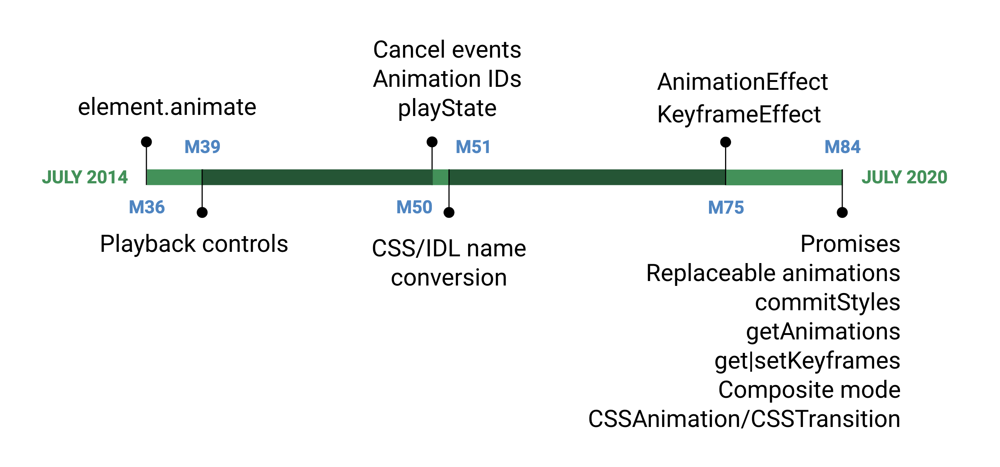

Adding animations to your website is not only for cosmetic reasons. When used correctly, animations improve user perception and [memory](https://www.researchgate.net/publication/229351931_The_Effects_of_Animation_and_Format_on_the_Perception_and_Memory_of_Online_Advertising) of your brand, guide user actions, but also helps users navigate your application—providing context in a digital space.

<figure class="w-figure">
  
  <figcaption class="w-figcaption">
    The long history of the Web Animations API.
  </figcaption>
</figure>

The [Web Animations API](https://www.w3.org/TR/web-animations-1/) is a tool that enables developers to write [imperative](https://www.youtube.com/watch?v=WaNoqBAp8NI) animations with JavaScript. It was written to underpin both CSS animation and transition implementations and enable future effects to be developed, as well as existing effects to be composed and timed.

While it has a long history, originally launching in Chrome 36, the latest release, Chrome 84, brings us a slew of previously unsupported features. 

## Getting Started

Creating an animation via the web animations API should feel very familiar if you've used `"@keyframe"` rules. First you'll need to create a Keyframe Object. What might look like [this](https://codepen.io/una/pen/RwWMvPw) in CSS:

```css
@keyframes openAnimation {
  0% {
    transform: scale(0);
  }
  100% {
    transform: scale(1);
  }
}
```

Would look like [this](https://codepen.io/una/pen/abvYXJX) in JavaScript:

```js
const openAnimation = [
  { transform: 'scale(0)' }, 
  { transform: 'scale(1)' }, 
];
```

Where you set parameters for animation in CSS:

```css
.modal {
  animation: openAnimation 1s 1 ease-in;
}
```

You would set in JS:

```js
document.querySelector('.modal').animate(
    openAnimation ,  {
    duration: 1000, // 1s
    iterations: 1, // single iteration
    easing: 'ease-in' // easing function
  }
);
```

So the amount of code is about the same, but with JavaScript, you get a couple of superpowers that you don't have with CSS alone. This includes the ability to sequence effects, and to control their play states.


  Hyphenated property names become camel case when used in keyframes (i.e. `background-color` to `backgroundColor`)


### Get | Set Animations

Creating keyframes in JavaScript is no longer the only way to interact with animations using the Web Animations API. You can now get and set CSS animations.

-- MORE HERE --

## Orchestrating Animations with Promises

In Chrome 84, you now have two methods that can be used with promises: `"animation.ready"` and `"animation.finished"`.

- `animation.ready` enables you to wait for pending changes to take effect (i.e. switching between playback control methods such as play and pause)
- `animation.finished` provides a means of executing custom JavaScript code when an animation is complete.

Let's continue with our previous example, and create an orchestrated animation chain with `"animation.finished"`. Here, you have a vertical transformation (`"scaleY"`), followed by a horizontal transformation (`"scaleX"`), followed by an opacity change on a child element: 

<figure class="w-figure">
  <video controls autoplay loop muted class="w-screenshot">
    <source src="./modal-open.mp4">
  </video>
  <figcaption class="w-figcaption">
    Applying transformations and opacity to an opening modal element. <a href="https://codepen.io/una/pen/dyYKJMz">See Demo on Codepen</a>
  </figcaption>
</figure>

```js/1
const anim1 = modal.animate(openModal, openModalSettings);
anim1.finished.then(() => { text.animate(fadeIn, fadeInSettings)});
```

We've chained these animations using `"animation.finished.then()"` prior to executing the next animation set in the chain. This way, the animations appear in order, and you are even applying effects to different target elements with different options set (such as speed and ease).

Within CSS, this would be cumbersome to recreate, especially when applying unique, yet sequenced animations to multiple elements. You'd have to use a `"@keyframe"`, sort out the correct timing percentages to place the animations, and use `"animation-delay"` prior to triggering the animations in the sequence.

## Play, Pause, Reverse

What can open, should close! Luckily, since Chrome 39, the WAAPI has provided us the ability to play, pause, and reverse our animations.

You can take the above animation, and give it a smooth, reversed animation when clicking the button again using `".reverse()"`. This way, you can create a smoother and more contextual interaction for our modal.

<figure class="w-figure">
  <video controls autoplay loop muted class="w-screenshot">
    <source src="./modal-reverse.mp4">
  </video>
  <figcaption class="w-figcaption">
    An example of a modal opening and closing upon button click. <a href="https://codepen.io/kevers-google/details/LYpvdNG">See Demo on Codepen </a>
  </figcaption>
</figure>

What you need to do is create two play-pending animations (`"openModal"`, and an inline opacity transformation), and then pause one of the animations, delaying it until the other is finished. You can then use promises to wait for each to be finished before playing. Finally, you can check to see if a flag (such as an `"open"` variable in this case) is set, and then reverse each animation.

```js/13-14
document.querySelector('button').addEventListener('click', () => {                                 
  // Create two play-pending animations.
  let animations = [
    document.querySelector('.modal').animate(openModal, openModalSettings),
    document.querySelector('.text').animate({ opacity: [0, 1] }, 
                       openModalSettings)
  ];

  // Pause one of the animations and delay it's start until the
  // other is finished.
  if (open) {
    animations.forEach((anim) => {
      anim.currentTime = anim.effect.getTiming().duration;
      anim.reverse();
    });
    animations = animations.reverse();
  }
  
  // Run animations sequentially.
  animations[1].pause();  
  animations[0].finished.then(() => {
    animations[1].play();
  });
  open = !open;
});
```


  For a great example of `"playState"`, check out [this example](https://codepen.io/samthor/pen/mJxPRK?editors=0010) from [Sam Thorogood](/authors/samthor/).


-- More concise snippet/way of writing this here --


## Performance Improvements with Replaceable Animations

When creating animations based on events, such as on `"mousemove"`, a new animation is created each time, which can quickly consume memory and degrade performance.  To address this problem, replaceable animations were introduced, enabling automated cleanup, where finished animations are flagged as replaceable and automatically removed if replaced by another finished animation.

For a small number of animations, this is not typically a problem, but consider the following example:

<figure class="w-figure">
  <video controls autoplay loop muted class="w-screenshot">
    <source src="./comet-trail.mp4">
  </video>
  <figcaption class="w-figcaption">
  A comet trail animates when the mouse moves. <a href="https://codepen.io/kevers-google/details/gOaqXoQ">View Demo on Codepen</a>
  </figcaption>
</figure>

-- Is this right, below: --

In the example above, you are denoting replaceable animations with `"fill:forwards"`, and can calculate exactly how many animations are being replaced by tallying up the count with each removed animation, using `"anim.onremove"` to trigger the counter. 

-- animation.commitStyles demo --

There are a few new methods to take your animation control even further:

- `animation.commitStyles()` updates the style of an element based on the underlying style along with all animations on the element in the composite order.
- `animation.onremove()` - calls some custom JavaScript code when an animation is replaced.
- `animation.replaceState()` provides a means of tracking whether an animation is active, persisted, or removed.
- `animation.persist()` marks an animation as non-replaceable. Persisting an animation is useful when used with animation compositing modes, such as "add".

## Dynamic Interactions with Partial Keyframes

<figure class="w-figure">
<video controls autoplay loop muted class="w-screenshot">
    <source src="./retargetting.mp4">
  </video>  <figcaption class="w-figcaption">
    Retargeting example, where a mouse click adjusts the animation to a new location.<a href="https://codepen.io/una/pen/BaoveQJ">See Demo on Codepen </a>
  </figcaption>
</figure>
 
 ```js
elem.addEventListener('mousemove', evt => {
  circle.animate(
    { transform: translate(${evt.clientX}px, ${evt.clientY}px) },
    { duration: 500, fill: 'forwards' }
  );
});
```

Example here shows re-targeting. This highlights partial keyframes. 

- only a to keyframe, no from keyframe, the from from is implicit from where you are now

## Compositing Animations

With the Web Animations API, you can now composite your animations, meaning they can be additive or accumulative. [Composite modes](https://css-tricks.com/additive-animation-web-animations-api/) allow developers to write distinct animations and have control over how effects are combined. Three composite modes are now supported: `"replace"` (the default mode), `"add"`, and `"accumulate"`.

When you composite animations, a developer can write short, distinct effects and see them combined together:

-- example with boxes here ---


--- reconfigure this one ---

<figure class="w-figure">
  <video controls autoplay loop muted class="w-screenshot">
    <source src="./dropdown.mp4">
  </video>
  <figcaption class="w-figcaption">
  A bouncy dropdown menu which has two composited animations applied to it. <a href="https://codepen.io/kevers-google/details/ExVrbEm">View Demo on Codepen</a>
  </figcaption>
</figure>

-- note: I will jazz the style up later --

In the example above, two animations are composited. The first is a macro-animation, which animates the `"top"` property, moving the dropdown vertically downwards by the full height of the menu itself as a slide-in effect, and the second micro-animation applies a little bounce as it hits the bottom.

```js/12
const dropDown = menu.animate(
    [
      { top: `${-menuHeight}px`, easing: 'ease-in' },
      { top: 0 }
    ], { duration: 300, fill: 'forwards' });

  dropDown.finished.then(() => {
    const bounce = menu.animate(
      [
        { top: '0px', easing: 'ease-in' },
        { top: '10px', easing: 'ease-out' },
        { ... }
      ], { duration: 300, composite: 'add' });
  });
```

Without `"composite: add"`, the animation would look like:

-- does this look any different? --

The composite mode `"accumulate"` behaves slightly differently from add. For properties that are additive such as translations or rotations, the results are the same. Properties like scale, which are multiplicative, behave differently.  <-- is this right? is there an example?

### What's Coming Next!

These are all exciting additions to the Web Animations capabilities in today's browsers. And even more capabilities are coming down the pipeline:

- [Scroll-linked animations with the Houdini API](https://www.w3.org/TR/css-animation-worklet-1/#scroll-timeline)
- [Mutable timelines](https://drafts.csswg.org/web-animations-2/#setting-the-timeline)
- [Group Effect and Synchronization](https://drafts.csswg.org/web-animations-2/#grouping-and-synchronization)
