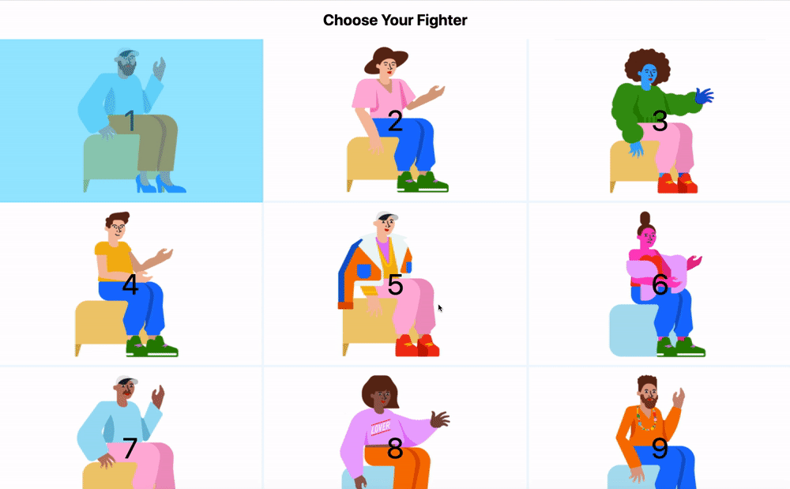

Adding delightful animations to your website is not only for cosmetic reasons. When used correctly, animations improve user perception and [memory](https://www.researchgate.net/publication/229351931_The_Effects_of_Animation_and_Format_on_the_Perception_and_Memory_of_Online_Advertising) of your brand, guide user actions, but also helps users navigate your application—providing context in a digital space.

And an exciting piece of news: the [Web Animations API](https://www.w3.org/TR/web-animations-1/) has just hit Chrome stable! This API enables developers to incorporate [imperative](https://www.youtube.com/watch?v=WaNoqBAp8NI) animations with JavaScript. It was written to underlie both CSS animation and transition implementations and enable future effects to be developed, as well as existing effects to be composed and timed. This lets us take advantage of CSS animations, but extend those in a way that we can't do with CSS alone.

## Getting Started

With the Web Animations API, we can take advantage of some really great features that allow for more robust animations! Specifically, new features to both the document and individual elements allow for you to pause, rewind, and wait for an animation to end before triggering another animation.

These are hugely beneficial when orchestrating animations for complex components, such as a you may need for a getting started guide or even to just apply multiple, tiered animations to a modal opening.

To use the Web Animations API, we'll need to create a Keyframe Object. If you're familiar with CSS `@keyframe`s, this is very similar. What might look like [this](https://codepen.io/una/pen/RwWMvPw) in CSS:

```css
@keyframes openAnimation {
  0% {
    transform: scale(0);
  }
  100% {
    transform: scale(1);
  }
}
```

Would look like [this](https://codepen.io/una/pen/abvYXJX) in JavaScript:

```js
const openAnimation = [
  { transform: 'scale(0)' }, 
  { transform: 'scale(1)' }, 
];
```

Where we set parameters for animation in CSS:

```css
.modal {
  animation: openAnimation 1s 1 ease-in;
}
```

We would set in JS:

```js
document.querySelector('.modal').animate(
    openAnimation ,  {
    duration: 1000, // 1s
    iterations: 1, // single iteration
easing: 'ease-in' // easing function
  }
);
```

So the amount of code is about the same, but with JavaScript, we get a couple of superpowers that we don't have with CSS alone. A few of those are the ability to group effects, and to move within an animation timeline.

## Orchestrating Animations with Promises

Now in Chrome stable, we have two methods that can be used with promises: `animation.ready()` and `animation.finished`

-  `animation.ready` is a promise that enables you to wait for pending changes to take effect (i.e. switching between playback control methods such as play and pause)
- `animation.finished` is a promise provides a means of executing custom JavaScript code when an animation is complete.

Let's continue with our previous example, and create an orchestrated animation chain with `animation.finished`. Here, we have a vertical transformation (`scaleY`), followed by a horizontal transformation (`scaleX`), followed by an opacity change on a child element: 

<figure class="w-figure">
  
  <figcaption class="w-figcaption">
    <a href="https://codepen.io/una/pen/dyYKJMz">See Demo on Codepen </a>
  </figcaption>
</figure>

-- CODE BLOCK HERE FROM THE ABOVE --

We've chained these animations using `animation.finished.then()` prior to executing the next animation set in the chain. This way, the animations appear in order, and we are even applying effects to different target elements with different options set (such as speed and ease).

Within CSS, this would be cumbersome to recreate. You'd have to use a `@keyframe` and sort out the correct percentages to place the animations, and use animation delays prior to triggering the animations in the sequence. Another factor is applying the animations to different elements (the parents vs the child, for example). This would need to be calculated properly with delays and there's a lot of room for error.

## Play, Pause, Reverse

What can open, should close! Luckily, the WAAPI provides us the ability to play, pause, and reverse our animations. 

We can take the above animation, and give it a smooth, reversed animation when clicking the button again using `.reverse()`. This way, we can create a smoother and more contextual interaction for our modal.

<figure class="w-figure">
  
  <figcaption class="w-figcaption">
    <a href="https://codepen.io/una/pen/eYpbaOb">See Demo on Codepen </a>
  </figcaption>
</figure>

What we need to do is create two play-pending animations, and then pause one of the animations, delaying it until the other is finished. We can then use promises to wait for each to be finished before playing. Finally, we can check to see if a flag (such as an `open` variable in this case) is set, and then reverse each animation.

```js
document.querySelector('button').addEventListener('click', () => {
  // Create two play-pending animations.
  const expandCollapseAnim = modal.animate(openModal, openModalSettings);
  const showFadeAnim = text.animate(fadeIn, fadeInSettings);
  
  // Pause one of the animations and delay it's start until the
  // other is finished.
  let firstAnimation, secondAnimation;
  if (open) {
    firstAnimation = showFadeAnim;
    secondAnimation = expandCollapseAnim;
    showFadeAnim.currentTime = fadeInSettings.duration;
    expandCollapseAnim.currentTime = openModalSettings.duration;
    expandCollapseAnim.reverse();
    showFadeAnim.reverse();
  } else {
    firstAnimation = expandCollapseAnim;
    secondAnimation = showFadeAnim;
  }
  secondAnimation.pause();
  
  firstAnimation.finished.then(() => {
    secondAnimation.play();
  });

  // set open state
  open = !open;
});
```

-- code block -- 


  For a great example of `GroupEffect` and `playState` using start and pause states, check out [this example](https://codepen.io/samthor/pen/mJxPRK?editors=0010) from [Sam Thorogood](/authors/samthor/).



## Retargeting

<figure class="w-figure">
  
  <figcaption class="w-figcaption">
    <a href="https://codepen.io/una/pen/BaoveQJ">See Demo on Codepen </a>
  </figcaption>
</figure>

## Replaceable Animations

The next really exciting addition are replaceable animations. Fill modes provide a convenient means of 'sticking' the start or end value of an animation, but at a cost.  For a small number of animations, this is not typically a problem, but consider the following example:
 
 ```js
elem.addEventListener('mousemove', evt => {
  circle.animate(
    { transform: translate(${evt.clientX}px, ${evt.clientY}px) },
    { duration: 500, fill: 'forwards' }
  );
});
```

-- have graphic here to match --


To address this problem, replaceable animations were introduced. When the effect of an animation in the finished state is overridden by another finished animation, it is removed from the set of active animations. There are a few new methods to take your animation control even  further:

- `animation.commitStyles` is a method used to update the style of an element based on underlying style along with all animatinos on the element in the composite order.
- `animation.onremove` - with the onremove event handler, we can run custom JavaScript code when an animation is replaced.
- `animation.replaceState` provides a means of tracking whether an animation is active, persisted or removed.
- `animation.persist` marks an animation as non-replaceable. Persisting an animation is useful when used with animation compositing modes, such as add.

Speaking of compositing modes, with the Web Animations API, you can now composite your animations, meaning they can be additive or accumulate.

## Compositing Animations

[Composite modes](https://css-tricks.com/additive-animation-web-animations-api/) provide additional control over how effects are combined. Currently, three composite modes are supported: 'replace’ (default mode), 'add’, and 'accumulate’.

A box animating without composite (default of replace) would look like this:

-- gif here --

```js
box.animate([{transform: 'translateX(100px)', composite: 'add' }], { duration: 1000, fill: 'forwards' });
```

If we added an `add` composite, the animation would look much different:

-- gif here --

```js
box.animate([{transform: 'translateX(100px)', composite: 'add' }], { duration: 1000, fill: 'forwards' });
```

The composite mode `accumulate` behaves slightly differently from add. For properties that are additive such as translations or rotations, the results are the same.  Properties like scale behave differently.  

-- gif here --

```js
box.animate([{transform: 'translateX(100px)', composite: 'accumulate' }], { duration: 1000, fill: 'forwards' });
```

### What's Coming Next!

- Scroll-linked animations (Houdini API)
- Mutable timelines