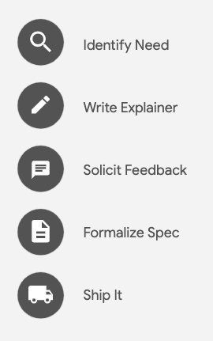
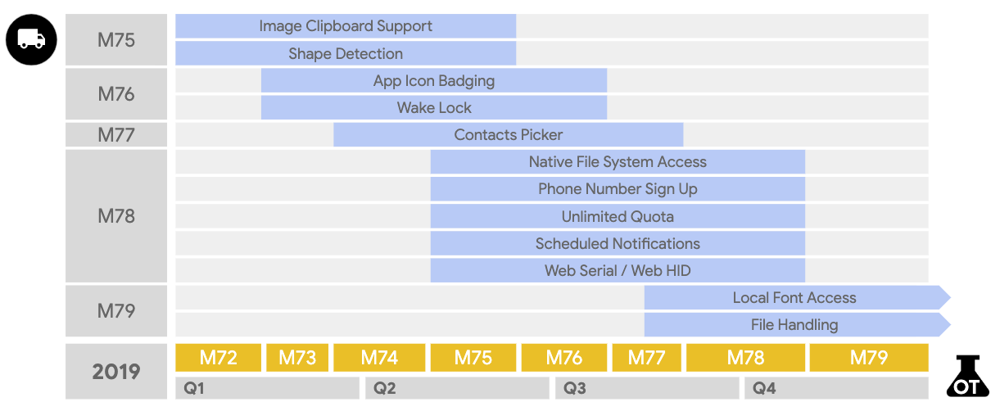

### Introduction

I’ll admit, I’m a little biased, I think the web platform is the best platform. What I love about the web is the scale, it reaches users all around the world—on essentially any device. It’s easy to use, and easy to share. There’s nothing to install. But most importantly, it’s an open-ecosystem that anyone can use or build on.
Almost everything I need to do these days, I do on the web. I always have a tab open to gmail, calendar, and drive. I write my code samples and feature demos using Glitch. I do all my code reviews for our docs on GitHub.
In the last couple years, the capabilities on the web have grown tremendously with things like WebUSB, camera controls, media recording and so many more. But let’s be honest, it has some limitations…
There apps that are just not possible to build and deliver on the open web today.

<figure class="w-figure w-figure--inline-right">
  
  <figcaption class="w-figcaption">
    Sad panda
  </figcaption>
</figure>

Want to build something that interacts with local files? Sorry.
How about something that can access the user’s contacts? Nope.
Want to register as a share target?
Sorry, sad panda.
We call this the *app gap* the gap between what’s possible on the web and what’s possible on native.
On the Chrome team, we want to change that. We think web apps should be able to do anything native apps can. We want to remove those limitations, so that you can build *and* deliver apps on the open web that have never been possible before, or required some kind of framework to do.

We’ve been working to bridge and close that gap for some time now. The web app manifest makes it possible to provide an “installed” experience, delivered via the web. Service workers enable you to deliver the fast and reliable performance that users expect from any installed experience. Web assembly gets you closer to the metal for complex code. And there are plenty more.
Some of these features seem scary at first, especially in light of how they’re implemented on native. But the web is inherently safer than native, opening a web page shouldn’t be scary. Adding new functionality to the web needs to be done in a way that maintains user security, privacy, trust, and the other core tenets of the web.

<figure class="w-figure w-figure--fullbleed">
  
  <figcaption class="w-figcaption">
    The app gap
  </figcaption>
</figure>

Our internal codename for the project alludes to this, *Project Fugu*. Fugu is a type of fish that, when cut properly, is considered a delicacy, and it is delicious. But, it’s also poisonous, if cut improperly, may be fatal. We take this very seriously.

<figure class="w-figure w-figure--inline-left">
  
  <figcaption class="w-figcaption">
    Project Fugu
  </figcaption>
</figure>

Nothing should ever be granted access by default, but instead rely on a permission model that puts the user in total control, and is easily revoke-able. It needs to be crystal clear when, and how these APIs are being used. We have a good white paper that dives deeper into some of our thinking—linked on screen.
Obviously, there’s a lot more to this topic than what I can cover in just a couple of slides, and every API has its own things that need to be considered. We must balance the needs of developers, with keeping users safe and in control of their data. They should never be put at risk just by navigating to a page, or by using a web app.
We’ve identified more than 75 features that we think are critical to closing the app gap, and I’m sure there are many more! You can see the list of stuff we’re working on by going to [crbug.com](https://crbug.com/) and searching for bugs tagged `proj-fugu`.

### The Fugu process

Guiding a feature from the idea stage to a standardized, shipped API, is important to us… We want to close the app gap while maintaining the core tenets of the web. That means we're designing and building these as web standards. I'm happy to see other companies excited about closing the app gap. Microsoft is actively working on several new features including app icon shortcuts, and Intel implemented the Generic Sensors API and is now working on wake lock and Web NFC.

<figure class="w-figure w-figure--inline-right">
  
  <figcaption class="w-figcaption">
    Fugu process
  </figcaption>
</figure>

The first step is identifying a specific need, or use case. Many of these are features you've asked for, either by talking to us directly, or by filing feature requests on [crbug.com](https://crbug.com/).
As we start to think about the API, we put our initial thinking into an explainer—essentially a design doc that is meant to explain the problem, along with some sample code showing how the API might work.
Once the explainer has a reasonable level of clarity, it’s time to publicize it, to solicit feedback, and iterate on the design.
We need to hear from you, to make sure that your use cases are covered. Is there anything that’s missing? Or is there anything about the design that doesn’t make sense? During this time, we keep iterating on the explainer, improving it based on your feedback.
And we’re also looking for public support from sites and apps that would use the new API. It can be as simple as a tweet from an engineer saying our app would use this. Your public support helps us to prioritize these features, and shows other browser vendors how critical it is to support them.
Once the explainer is in a good state, the design work transitions into a formal specification, where we continue working with developers and other browser vendors on the spec.
As the design starts to stabilize, we typically use an origin trial to experiment with the implementation.
Origin trials allow you to try new features with real users, and give feedback on the implementation.
This real world feedback helps shape and validate the design, ensuring we get it right, before it becomes a standard.
Finally, once the origin trial is complete, the spec has been finalized, and all of the other launch steps have been completed, it’s time to ship it to stable.
OK, enough background—let’s take a look at some of the APIs that we’re working on right now and see how we’re trying to close the app gap.

### Web Bluetooth

Bluetooth Low Energy, or just BLE, is a wireless technology that you can find in many gadgets like heart rate sensors, beacons, lights, and also toys.
But many times when you want to interact with a BLE device, they make you download YET ANOTHER APP,
when actually you should just be able to use a web app.
Web Bluetooth can be used to control all sorts of devices after pairing them,
which is painless and quick and works via a picker.
For example, the Batmobile from Lego can be controlled from a web app,
without the need to download a native app.

```js
const bluetoothServiceUUID = '00001623-1212-efde-1623-785feabcd123';
const device = await navigator.bluetooth.requestDevice({
  filters: [
    {namePrefix: 'HUB'}
  ],
  optionalServices: [bluetoothServiceUUID]
});
console.log('Connected to', device.name);
const server = await device.gatt.connect();
const service = await server.getPrimaryService(bluetoothServiceUUID);
```

Before connecting to a Web Bluetooth device like the Batmobile, I first need to know its ID.
The bluetooth Service UUID that you can see here is the unique identifier of the Lego Batmobile.
I can optionally also  provide a name or a namePrefix parameter.
You can think of the services filter as a way to only look for certain categories of devices,
for example, just heart rate sensors or just devices whose name starts with “HUB”,
Which is the name Lego gave to its bluetooth controller inside of the Batmobile.
When I then request a device, I will see it in the connection picker
where I can then pair it and start using it.
Web Bluetooth is a powerful API, so this requires a secure connection,
and the connection picker only shows after a user gesture.
After the pairing step, next, I connect to the device’s server
that provides the service of the device.
In the concrete case a Batmobile remote control service, how cool is that?

| Web Bluetooth | |
| ------------- | --- |
| Explainer | [bit.ly/2YageJB](https://bit.ly/2YageJB) |
| Updates Post | [bit.ly/2vSAItp](https://bit.ly/2vSAItp) |
| Feedback | [bit.ly/2ZOvJsd](https://bit.ly/2ZOvJsd)
| Spec | [bit.ly/2Y3G8hL](https://bit.ly/2Y3G8hL) |
| Demo | [bit.ly/2J9TJQw](https://bit.ly/2J9TJQw) |

Web Bluetooth is an established API that has been in Chrome for a while.
It’s fully shipped and you can use it today.
If you have great use cases, or have built a cool demo app
like Niels Batmobile controller that we show in the sandbox, do let us know.

### Web Share

Sharing should just be universally supported, no matter if native or web.
Thanks Neels—Sharing is a critical feature for many apps, whether that means your app shares something to other apps, or other apps are able to share to you. Native apps typically make sharing super easy, and frequently plug into the system provided share APIs.
The web should be able to integrate with the system provided picker, and with the Web Share API, you can! It allows your site to share links and text to other apps via the share picker.

```js
if ('share' in navigator) {
  const shareOpts = {
    title: 'Unlocking New Capabilities for the Web',
    text: 'One of the most exciting talks at I/O',
    url: 'https://www.google.com',
  }
  navigator.share(shareOpts)
    .then(() => {…})
    .catch((e) => {…});
}
```

Working with the Web Share API is pretty straight-forward…
It’s best to use feature detection to see if it’s available. If it’s not, you want to fallback to your traditional sharing mechanism.
But, if it is, provide the title, text, and link that you want to share…
…then call navigator.share. That’s it.
In the latest Chrome beta, we just added support for sharing files—this is pretty hot, because it makes it easy to share a file to your favorite web app!

### Web Share Target

Web apps like social media sites should be able to register themselves as share targets to the system.
On the other side of the equation is the ability to tell the system that you are a share target, and want to receive shares from other apps.
Web apps like social media sites should be able to register themselves as share targets to the system.
The Web Share Target API allows an installed web apps to register with the OS as a share target. Users can easily share content to your web app because it appears in the system provided share target picker.

In fact, Twitter’s PWA recently implemented this. If you’ve installed Twitter’s PWA, and try to share something from your share menu, you’ll see Twitter listed there.

```json
"share_target": {
  "action": "/share-target/",
  "method": "GET",
  "enctype": "application/x-www-form-urlencoded",
  "params": {
    "title": "title",
    "text": "text",
    "url": "url"
  }
}
```

To register your app as a share target, add a share_target entry to the web app manifest.
When the user chooses your app as their share target, the system will open a new window to the URL specified in the action property, and provide the required info. Then, in your app, you can decide how you want to handle the incoming info. For example, Twitter drafts a new tweet.
Don’t forget to pre-cache the share handler page so that it loads instantly and works no matter what the network connection is! Otherwise users will be frustrated by your share experience and will stop using it.

| Web Share and Web Share Target | |
| --- | --- |
| Explainer | [bit.ly/2H0PuUF](https://bit.ly/2H0PuUF) |
| Updates Post | [bit.ly/2J4unUj](https://bit.ly/2J4unUj) |
| Discourse Thread | [bit.ly/2H3uI6N](https://bit.ly/2H3uI6N) |
| Spec | [bit.ly/2HegLmX](https://bit.ly/2HegLmX) |
| Demo | [bit.ly/2Heh0yn](https://bit.ly/2Heh0yn) |

Web Share and Web Share Target are available today, and they provide a nice way to integrate with the system.

| Web Share Target (v2) | |
| --- | --- |
| Explainer | [bit.ly/2H0PuUF](https://bit.ly/2H0PuUF) |
| Updates Post | Coming soon |
| Discourse Thread | Coming soon |
| Spec | [bit.ly/2H0PVhL](https://bit.ly/2H0PVhL) |
| Demo | Coming soon |

We’ve also been working on Web Share Target v2, which goes a step further and allows you to be a share target for files. This means users can not only share text and links, but they can also share pictures, music, and other binary files. I suspect that we’ll see Web Share Target v2 land later this year around Chrome 76.
Web apps like social media sites should be able to register themselves as share targets to the system.

### Media Session

On your desktop computer or laptop keyboard,
you oftentimes have media keys for playing and pausing,
or for skipping forward or backward.
For web apps, these keys are typically not accessible,
but there is no reason why there shouldn’t be a way to support them.
When you build a media player app,
you could for quite some time now integrate with Android’s media controls
in the control panel via the media session API,
not only with rich album artwork, but also with media controls like skipping, pausing, etc.
What’s new is that now you can finally also use the media keys on physical hardware keyboards
to control the playing, pausing, skipping and so on of your media.
This also works while the media tab is in the background, or in fullscreen mode.

```js
navigator.mediaSession.setActionHandler('previoustrack', () => {
  // User hit "Previous Track" key.
});

navigator.mediaSession.setActionHandler('nexttrack', () => {
  // User hit "Next Track" key.
});

navigator.mediaSession.setActionHandler('play', () => {
  // User hit "Play" key.
});

navigator.mediaSession.setActionHandler('pause', () => {
  // User hit "Pause" key.
});
```

To make this happen, I set up action handlers
in the `navigator.mediaSession` interface for the previous track action,
for the next track action, for the play, and the pause action.

| Media Session API | |
| --- | --- |
| Explainer | [bit.ly/2H1t4UM](https://bit.ly/2H1t4UM) |
| Updates Post | [bit.ly/2v1WMAz](https://bit.ly/2v1WMAz) |
| Feedback | [bit.ly/2Y8arUP](https://bit.ly/2Y8arUP) |
| Spec | [bit.ly/2VcFeCM](https://bit.ly/2VcFeCM) |
| Demo | [bit.ly/2ZVbb1k](https://bit.ly/2ZVbb1k) |

| | Status |
| --- | --- |
| | Identify Need |
| | Write Explainer |
| 👉 | Solicit Feedback |
| | Formalize Spec |
| | ShipIt |

The Media Session API is fully shipped now and works on Android, macOS, Windows, and Chrome OS.
Support for Linux is under development.

### Shape Detection

A lot of things in the world have barcodes that you can scan with your phone camera, and when your camera detects a face, it will highlight it with a boundary box.
Web apps should be able to tap into our devices’ built-in detectors.
With getUserMedia, it’s easy to get a video stream from the users web cam, and there are JavaScript libraries that can be used to process the video, find barcodes, or do face detection.
In fact, that’s exactly how the Chrome Experiment, *Movi Kanti Revo*, worked, moving your head, would move you through the experience.
Web apps should be able to tap into our devices’ built-in detectors.
But doing shape detection like that in JavaScript is expensive, and many native platforms have APIs for doing that kind of thing built in.
The Shape Detection API has three interfaces, a face detector, a barcode detector and a text detector.

The face detector is just that, it can detect a face, but that's it, there's no facial recognition capabilities here. In some cases it can find landmarks on the face like where your eyes, nose and mouth are. These landmarks can be used for adding fun filters, taking pictures when everyone is looking at the camera, or virtual fitting rooms. Imagine being able to try on a pair of sunglasses before holding them in your hand.

The barcode detector can be used to scan all kinds of barcodes, and there are some neat use cases that we are going to dive into deeper detail in a minute or two. And the text detector does exactly what you'd expect it to, it can find and highlight text in an image.

```js
if ('FaceDetector' in window) {
  const faces = await new FaceDetector().detect(img);
} else {
  // Use fallback
}

if ('BarcodeDetector' in window) {
  const codes = await new BarcodeDetector().detect(img);
} else {
  // Use fallback
}
```

Each detector has a detect method that takes an image, video, or blob. It'll check the image, and asynchronously return whatever it finds.

| | Status |
| --- | --- |
| | Identify Need |
| | Write Explainer |
| 👉 | Solicit Feedback |
| | Formalize Spec |
| | ShipIt |

| Shape Detection API | |
| --- | --- |
| Explainer | [bit.ly/2JkrmPI](https://bit.ly/2JkrmPI) |
| Updates Post | [bit.ly/2Vl6ZJm](https://bit.ly/2Vl6ZJm) |
| Discourse Thread | [bit.ly/2H3uI6N](https://bit.ly/2H3uI6N) |
| Spec | [bit.ly/2VkglVE](https://bit.ly/2VkglVE) |
| Demo | [bit.ly/2H1gGTg](https://bit.ly/2H1gGTg) |

We just finished an origin trial of the shape detection API. One of the key reasons we do origin trials, is that it allows us to validate the API design. In this case, we realized there was a bit more work to do, and we've been making a few updates to the spec, adding new methods to simplify certain use cases. We also realized that text detection wasn't at a quality level we were happy with, and so will likely hold off on shipping it until it's in better shape.

### Perception Toolkit

As you could see in the demo, there are some pretty neat use cases for the Shape Detection API.
But pulling all that together so that it will work across all browsers is a bit tricky.
The Shape Detection API is coming out of Origin Trial,
however, it isn’t supported on all mobile browsers yet.
Fortunately, this is a good example of where a JavaScript library can help make life easier for you,
using platform APIs where available, and JavaScript and Web Assembly where they aren’t.
We are happy today to announce an early version of the Perception Toolkit,
a library that allows people to navigate your site with their camera.
This idea of navigating your website by pointing the camera at things in the physical world
has a lot of power and can help users complete tasks faster.
For example, if you want to learn more about a product,
instead of typing into the search box, at times it can be a lot faster to just scan its barcode
to find the page you’re looking for.
Another use case is museum tours where,
rather than forcing visitors to download an app they will never use again,
you can just scan the actual artworks from the web app to deliver an enriched online experience.
The Perception Toolkit does planar image detection,
which means if museums have digitized their artworks already,
it is a small step to a make them recognized by the toolkit.

The Perception Toolkit does three things.
First, it manages a camera session for you, and can detect barcodes, QR codes, and 2D image targets
using native APIs when available, Web Assembly when not.
Next, it allows you to link real-world targets like barcodes with pages on your website.
This is done using structured data, so it’s easy to manage.
Finally, it makes the user interface easy.
From onboarding the user to rendering cards.
You have full control over the user interface,
but it takes care of the heavy lifting.

The whole thing is open source, so there’s a lot of flexibility here to customize however you’d like,
but the general idea is that you can get up and running quickly to add camera-based navigation to your site.
If you want to try this out, we have a live demo in the Web Sandbox.
You can do this on your own device, just go to the URL on the screen in the Web Sandbox area,
and try pointing your camera at sandbox signs, logos… and see what comes up!

### Badging API

Web apps for a long time now can be installed as well, so why shouldn’t they be capable of creating badges as well?
Installed apps frequently alert the user to new information, either through notifications, or through a badge on the icon.
Badging makes it easy to subtly notify the user about something might require their attention. Or it can indicate a small amount of information. Badges are less intrusive than notifications, they don't interrupt the user, which means they can updated more frequently. And, because they don’t interrupt the user, no special permission are needed to use them.
There are plenty of great uses cases for badges.
Chat, email, and social apps might show the number of unread notifications.
A video compressor might indicate progress, letting the user know how many videos are left to process.
Games could let the user know it’s their turn.
And of course, there are plenty more use cases.

One quick reminder, it only works for installed progressive web apps, if it's not installed, there's no icon to badge.

```js
// Setting a badge
window.Badge.set(42);

// Set the badge to a simple dot on the icon
window.Badge.set();

// Alternatively, explicitly clearing it
window.Badge.clear();
window.Badge.set(0);
```

Setting the badge is done by calling window.Badge.set…  Set takes an optional value, if a number is provided, it’ll show that number, but if it’s blank, the system will just show a dot as the notification. To clear the notification, just call clear.
It’s available as an origin trial now on Windows and macOS, and we’re working on ChromeOS support, so you can start using it today. During the origin trial, you’ll need to call window.ExperimentalBadge.

| | Status |
| --- | --- |
| | Identify Need |
| | Write Explainer |
| 👉 | Solicit Feedback |
| | Formalize Spec |
| | ShipIt |

| Badging API | |
| --- | --- |
| Explainer | [bit.ly/2Hejk8z](https://bit.ly/2Hejk8z) |
| Updates Post | [bit.ly/301m1CX](https://bit.ly/301m1CX) |
| Discourse Thread | [bit.ly/2H1drv4](https://bit.ly/2H1drv4) |
| Spec | [bit.ly/2H7oseC](https://bit.ly/2H7oseC) |
| Demo | [bit.ly/2H4XT9N](https://bit.ly/2H4XT9N) |

If everything goes smoothly, the API should be available in stable around Chrome 78.
We’re still looking for signs of public support. If you think this is something you might use, please—let us know, share a tweet with us, or add a comment on the discourse thread linked on the slide.

### Wake Locks

Many native apps can keep a device awake to perform background tasks,
for example, presentation apps like PowerPoint can keep the screen on,
so that it doesn’t turn off in the middle of the presentation.
Web apps like Google Slides have the same use case,
so why shouldn’t they be able to request a wake lock?
To avoid draining the battery, most devices quickly go to sleep when left idle.
While this is fine most of the time, some applications need to keep the screen
or the device awake in order to complete their work.
I mentioned keeping your screen awake during presentations,
but there are plenty of other good use cases.
For example, a run-tracking app turns the screen off,
but needs to keep the system awake to record your route.
Or maybe a game where you focus on the screen while thinking about your next turn.
The Wake Lock API enables you to support use cases like that
and enables new experiences which—until now—required a native app.
The API also aims to reduce the need for hacky
and potentially power-hungry workarounds like looping an invisible video
just to keep a screen on.
The Wake Lock API provides two types of wake locks: screen and system.

A `screen` wake lock prevents the device’s screen from turning off
so that the user can see the information that’s displayed on screen.

A `system` wake lock prevents the device’s CPU from entering standby mode
so that your app can continue running.

While they are treated independently, one may imply the effects of the other.
For example, a screen wake lock implies that the app—and therefore the system—
should continue running.

```js
// Getting a "screen" wake lock
let wakeLock = await navigator.getWakeLock('screen');
// Listening for active changes
wakeLock.addEventListener('activechange', (e) => {
  console.log(e.target);
});

// Requesting the wake lock to become active
let wakeLockRequest = wakeLock.createRequest();

// Canceling the wake lock after 1min
setTimeout(() => {
  wakeLockRequest.cancel();
  wakeLockRequest = null;
}, 60 * 1000);
```

In order to use the Wake Lock API,
I need to create and initialize a wakelock object for the type of wake lock I want.
Here, I’m requesting a “screen” wake lock.
Once created, the promise resolves with a wakelock object,
but note, the wake lock isn’t active yet, it will need to be activated first.
Before I activate the wake lock,
let me first set up an event listener to receive notifications
when the wake lock state is changed.
To activate the wake lock, I need to create a request,
and now finally the screen won’t turn off ever again.
Until, of course, I cancel the wake lock.
The spec is currently being rewritten based on early feedback and the code will change,
but what you can see in the code sample is what you can actually play with today.

| | Status |
| --- | --- |
| | Identify Need |
| | Write Explainer |
| 👉 | Solicit Feedback |
| | Formalize Spec |
| | ShipIt |

| Wake Lock | |
| --- | --- |
| Explainer | Coming soon |
| Updates Post | [bit.ly/2IVyCCd](https://bit.ly/2IVyCCd) |
| Feedback | [bit.ly/2VGqBHk](https://bit.ly/2VGqBHk) |
| Spec | [bit.ly/2DNcINh](https://bit.ly/2DNcINh) |
| Demo | [bit.ly/2VBZBJ7](https://bit.ly/2VBZBJ7) |

In Development

Wake lock is moving along quite well:
The folks at Intel have been busy with the implementation; it’s available behind a flag,
but again please note that the current implementation will change.
I suspect we’ll start to see something land in an origin trial
around Chrome 76 or 77, but, that could change as we build out the API,
work through the permission model, and so forth.

### Native File System

Apps that read and write local files or directories are nearly impossible on the web today. Essentially the user needs to open and “upload” the file, make their edits. Then, to save their work, they need to “download” the file. Instead of being saved back to the original file, it’s treated like a download and dropped in the downloads folder.
The Native File System API aims to change that, making it possible for users to choose files or directories that a web app can interact with on the native file system.
Single file editors like Squoosh for example, a PWA that our team shipped earlier this year are an ideal use case for the file system API…
Control-O to open a file, compress it, and hit CTRL-S to save it, and repeat.

And of course, there are plenty of other examples…
Notepad for simple text files;
Sketchup for drawings;
and Figma for creating prototypes.
Beyond single file editors, we also want to enable apps that work with collections of files, think media players or photo gallery apps. And one I'm super excited about, multi-file editors. I dream of a day, when VSCode can be shipped on the web and I can install it as a Progressive Web App!

One of the key design elements of the API is that the primary entry point is a picker that will require a user gesture to invoke. This ensures the user is in full control over what files and directories a website has access to. And we expect access to some files and folders to be blocked completely. As I said earlier, visiting a web page, should never be risky for users.

```js
const fileRef = await self.chooseFileSystemEntries(fileOpts);

// Read from the file
const file = await fileRef.getFile();
const image_data = await file.arrayBuffer();

// Write to the file
const writer = await fileRef.getWriter();
await writer.write(0, new_image_data);
```

We’re still iterating on the spec for the native file system, so this code is likely to change between now and the time you can start playing with the API. Here’s the code Squoosh might use. It prompts the user to choose a file, gets the file, and reads the file into an array buffer to save the file, we get a file writer and write the file to disk.

| | Status |
| --- | --- |
| | Identify Need |
| | Write Explainer |
| 👉 | Solicit Feedback |
| | Formalize Spec |
| | ShipIt |

| Native File System | |
| --- | --- |
| Explainer | [bit.ly/2Hek3GP](https://bit.ly/2Hek3GP) |
| Updates Post | [bit.ly/2LpvnVJ](https://bit.ly/2LpvnVJ) |
| Discourse Thread | [bit.ly/2GZOz73](https://bit.ly/2GZOz73) |
| Spec | [bit.ly/2H1titL](https://bit.ly/2H1titL) |
| Demo | Coming soon |

There's an early draft of the native file system spec in the works, but there isn’t anything to try yet.
As with our other capabilities, if this is something think you'll use, get involved now!

### Web Serial

Many devices such as microcontrollers or 3D printers communicate through serial data.
Up until now, these devices can't be integrated with web apps.
What if there were a way to bridge the physical and the web worlds
by allowing them to communicate with each other?
Even though modern PCs rarely include the classic 9-pin serial port,
a lot of devices driven by microcontrollers, such as robots and 3D printers,
communicate using serial data, but nowadays commonly over a USB connector or Bluetooth.

```js
const requestOptions = {
  // Filter on devices with the Arduino USB vendor ID.
  filters: [{ vendorId: 0x2341 }],
};

// Request an Arduino from the user.
const port = await navigator.serial.requestPort(requestOptions);

// Open and begin reading.
await port.open({ baudrate: 115200 });
const reader = port.in.getReader();
while (true) {
  const {done, data} = await reader.read();
  if (done) break;
  console.log(data);
}
```

Let’s have a look at how the Serial API will work in practice.
First, I need to filter for known vendor IDs in order to request a port to the device in question.
Here, I’m filtering on the Arduino USB vendor ID.
Remember, it’s all serial data, so I need to agree on a baud rate when opening the port that determines the communication speed over the data channel.
Finally, I can read from the reader until there’s no more data,
which the reader signals with a done flag.
The actual code will look similar to what is defined in the specification,
but some of the details are yet to be worked out.
The permission model will work similarly to WebUSB.

| | Status |
| --- | --- |
| | Identify Need |
| | Write Explainer |
| 👉 | Solicit Feedback |
| | Formalize Spec |
| | ShipIt |

| Web Serial | |
| --- | --- |
| Explainer | [bit.ly/2VcZRP5](https://bit.ly/2VcZRP5) |
| Updates Post | Coming soon |
| Feedback | [bit.ly/2JiSTAS](https://bit.ly/2JiSTAS) |
| Spec | [bit.ly/2GSId9B](https://bit.ly/2GSId9B) |
| Demo | Coming soon |

We started the Serial API way before the Capabilities project and its process came to life
so some of the details need to be refined.
There is an implementation behind a flag,
but most of the work has been on getting the permissions UI in place.
While you can request permission to access a serial port,
the object that your script gets back,
isn't actually useful for anything yet.
We’re aiming to have proper support by the end of the quarter.

### Web HID

Many peripherals use HID to communicate with your computer. The most common classes of HID input devices, like keyboards and mice, are already supported. But devices that are not well supported by the HID driver are often inaccessible to web pages.
WebHID would make these devices accessible, and provide better support for devices that may have limited functionality. Many game pads, for example, have decent support in the browser, but frequently, miss out on key features. With WebHID API, device-specific logic can be moved into javascript, providing full support.
WebHID would allow these devices to be used without requiring additional drivers or modification to the browser.
And there are plenty of other use cases. The extra buttons on head sets could easily control video conferencing apps.
You could control virtual reality experiences with spatial controllers like leap motion.
One note, WebHID isn’t intended to get input from devices with high level APIs—like key presses and pointer events, those will continue to be accessed through the existing APIs.

```js
const devices = await navigator.hid.requestDevice(hidOpts);
const device = devices[0];
console.log('found', device.vendorId, device.productId);
await device.open();
console.log('opened', device.vendorId, device.productId);
device.addEventListener('inputreport', handleInputReport);
await device.sendReport(0x01, initReport);
```

This sample opens all HID devices identified in hidOpts, once they’re found,
it opens a connection to it.
Adds an event listener to listen for input events, and since HID is bi-directional, we’ll send a report out to activate the indicator lights, letting the user know the device is ready to go.

| | Status |
| --- | --- |
| | Identify Need |
| | Write Explainer |
| 👉 | Solicit Feedback |
| | Formalize Spec |
| | ShipIt |

| WebHID | |
| --- | --- |
| Explainer | [bit.ly/2GY8inC](https://bit.ly/2GY8inC) |
| Updates Post | Coming soon |
| Discourse Thread | [bit.ly/2H2Q5oT](https://bit.ly/2H2Q5oT) |
| Spec | [bit.ly/2H4rzUe](https://bit.ly/2H4rzUe) |
| Demo | Coming soon |

There's an early draft of the WebHID spec available now, but there’s nothing to play with quiet yet. Hopefully, we’ll see something around Chrome 78 or so.

### Contacts

Access to the user’s contacts has been a feature of native apps
since almost the dawn of time.
It’s one of the most common feature requests that I hear from web developers,
And this is often the key reason why they still build a native app.
There are many great use cases for a contacts picker API on the web,
but at the core, it is designed to help users reach their friends and family more easily.
For example, in a web based email client,
the picker can be used to select the recipients of an email,
or someone to connect with on social networks.
Instead of providing a site with complete and continuous access to the user’s contacts,
the Contacts *Picker* API is just that, an on-demand picker.
When invoked, it shows a list of a user’s contacts,
and makes it easy for them to pick only the contacts they want to share.
Users can provide access to as few or as many contacts as they choose.
And because access is on demand, each subsequent call to the API shows the picker again.
The contacts picker will only work when served from a secure host, and it can only be shown with a deliberate user gesture.

Users can also explicitly choose which contacts they want to share, and they see what is being shared before they share it.
In designing the API, we want to give developers the features they
need while ensuring users are in control of their own and their contacts’ information,
and clearly understand what they’re sharing.
That means the contacts picker will only work when served from a secure host,
and it can only be shown with a user gesture.
Users can also explicitly choose which contacts they want to share,
and they see what is being shared before they share it.

```js
const options = {
  multiple: false,
  properties: ['name', 'email', 'tel'],
};

try {
  const contacts = await navigator.contacts.select(options);
  // Do something with the contacts
} catch (e) {
  // Handle error
}
```

Opening the contacts picker starts with a call to `navigator.contacts.select()`
that I need to pass an options object with the information I’d like.
Here, I just want one contact, and from this contact the name, emails, and telephone numbers.

```js
[{
  "email": ["noreply@google.com"],
  "name": ["Sundar Pichai"],
  "tel": []
}]
```

The call returns a promise that resolves with an array of contacts selected by the user.
Let’s say the user has selected Sundar Pichai.
Each contact will include an array of all properties that were requested.
For example, our address book entry for Sundar Pichai has his name,
no phone numbers, but does have an email address for him.

| | Status |
| --- | --- |
| | Identify Need |
| | Write Explainer |
| 👉 | Solicit Feedback |
| | Formalize Spec |
| | ShipIt |

| Contacts | |
| --- | --- |
| Explainer | [bit.ly/2Jd34XV](https://bit.ly/2Jd34XV) |
| Updates Post | Coming soon
| Feedback | [bit.ly/2J2VAaP](https://bit.ly/2J2VAaP) |
| Spec | Coming soon |
| Demo | [bit.ly/2Y5bbK6](https://bit.ly/2Y5bbK6) |

We’re in the early phases of experimentation with the contacts picker API.
The explainer has been written and a very first implementation is available behind a flag,
but a lot of the details still need to be discussed,
for example, whether addresses should be accessible via the API.

Like the other APIs we’ve talked about, we’re looking for public support.
If this is something you think you’d use or have general feedback on, just let us know!

### Local Fonts

Designers frequently have many custom fonts installed that they need for creating their work. Things like logotype fonts, company standard fonts, or specially licensed fonts that are only available on the desktop. Today, the browser can use installed fonts, but only if it knows it’s there, since there is no way to get a list of fonts installed on the users device.
The font access API has two components. First, it allows apps to enumerate the list of locally installed fonts, making it easy to use them within the app. And second allows access to the details of a font, such as the individual glyphs and ligature tables, so web apps can take fine control of text rendering using libraries like HarfBuzz.

```js
const fonts = await navigator.fonts.query({local: true});
for (let font of fonts) {
  console.log(font.family, font.postScriptName);
  addFontToSelector(font);
}
```

Let’s take a look at a simple use case, listing the fonts available and adding them to a font selector.
Navigator, fonts, query—which takes an options object that lets us specify our query parameters, then asynchronously returns the list of fonts the match.
In this case, I’ve asked for only local fonts.
Then, we can loop over the list of fonts and add them to our font selector.

| | Status |
| --- | --- |
| | Identify Need |
| | Write Explainer |
| 👉 | Solicit Feedback |
| | Formalize Spec |
| | ShipIt |

| Local Fonts | |
| --- | --- |
| Explainer | [bit.ly/2H14rGn](https://bit.ly/2H14rGn) |
| Updates Post | Coming soon |
| Discourse Thread | [bit.ly/2H3C3Dn](https://bit.ly/2H3C3Dn) |
| Spec | Coming soon |
| Demo | Coming soon |

We’re still iterating on the font access API explainer, we’re looking for your feedback to make sure the key use cases are covered. And like the other APIs we’ve talked about, we’re also looking for public support—if this is something you think you’d use, let us know!

### Other APIs

In the last couple of years,
the capabilities on the web have grown tremendously…
Today, we've only covered a handful of the APIs we've shipped
or are planning to ship this year, that all will help to close the app gap.
But there are a few other features we're working on, that I want to call out quickly.

#### Async Clipboard

We're adding support for programmatically copying images to the clipboard,
which is the most popular bug in Chrome's bug tracker at over 1800 stars.
Currently, the Asynchronous Clipboard API only supports basic reading and writing of text.
But we will be rounding out the existing async clipboard API with support for images,
again helping to unlock a number of creative use cases.

#### SMS-based Phone Number Verification

More and more sites introduce second factor authentication with One Time Passwords (OTP).
The users may be required to use the OTP on sign-in, or for performing critical operations.
SMS is the first obvious choice because the broad majority of users have it.
The SMS Retriever API gives developers the ability
to be notified when specially formatted SMS messages are delivered to the user’s phone.
This can help reduce the friction when verifying phone numbers,
and can be used as a mechanism to limit abuse in account creation,
can ease account recovery, or can be used to confirm critical operations.

#### Notification Triggers

The Push API is not reliable for triggering notifications which must be shown at a particular time.
We want to make it possible to prepare notifications that should be shown in the future by introducing time-based triggers.
Web developers have the ability to display notifications using the Web Push and the Notifications API.
Notification Triggers are a mechanism for preparing notifications
that are to be shown when certain conditions are met.
The trigger could be time-based, location-based or otherwise.
This makes it possible to display notifications at a particular time without involving a server,
and improves reliability by removing the dependency on network connectivity.
This is essential for certain types of web applications, like calendars.

### Next steps

While most of these APIs aren't available yet,
some—like Web Share and Web Share Target—already are,
and there are a few others that are in Origin Trial
that you can all start experimenting with today.

<figure class="w-figure w-figure--fullbleed">
  
  <figcaption class="w-figcaption">
    Tentative launches for in-flight Fugu APIs
  </figcaption>
</figure>


If you want to participate in an Origin Trial with your site,
the list of all currently active Origin Trials can be found at [developers.chrome.com/origintrials](https://developers.chrome.com/origintrials.

And finally, if there are features you think we're missing,
we want to hear about them.
Please file a feature request on [bit.ly/new-fugu-request](https://bit.ly/new-fugu-request).

#### Resources

We have just two links that you need to remember.
The first link is for the codelab, where you can experiment with all the ready-to-play APIs.
Not everything works on all platforms, and you may need to set a flag for some,
but as the—admittedly biased—author of the codelab, I do think it’s still a lot of fun.

[Web Capabilities codelab](https://codelabs.developers.google.com/codelabs/web-capabilities)

The second link is for the capabilities project landing page.
We will keep it up-to-date, and it has outlinks to all the capabilities that are currently in flight.
From there, we also link to the full list of all the upcoming capabilities
that we will get to in the future.

[Capabilities landing page](https://developers.google.com/web/updates/capabilities)