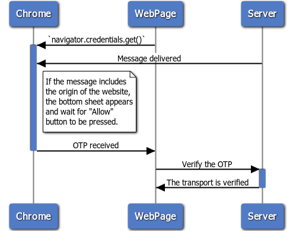

## What is the Web OTP API?

These days, most people in the world own a mobile device and developers are
commonly using phone numbers as an identifier for users of their services.

There are a variety of ways to verify phone numbers, but a randomly generated
one-time password (OTP) sent by SMS is one of the most common. Sending this code
back to the developer's server demonstrates control of the phone number.


The Web OTP API was originally called the SMS Receiver API. You may still see it
named that way in some places. If you used that API, you should still read this
article. [There are significant differences](#differences) between the current
and earlier versions of the API.


This idea is already deployed in many scenarios to achieve:

* **Phone number as an identifier for the user.** When signing up for a new
  service, some websites ask for a phone number instead of an email address and
  use it as an account identifier.
* **Two step verification.** When signing in, a website asks for a one-time code
  sent via SMS on top of a password or other knowledge factor for extra
  security.
* **Payment confirmation.** When a user is making a payment, asking for a
  one-time code sent via SMS can help verify the person's intent.

The current process creates friction for users. Finding an OTP within an SMS
message, then copying and pasting it to the form is cumbersome, lowering
conversion rates in critical user journeys. Easing this has been a long standing
request for the web from many of the largest global developers. Android has [an
API that does exactly
this](https://developers.google.com/identity/sms-retriever/). So does
[iOS](https://developer.apple.com/documentation/security/password_autofill/about_the_password_autofill_workflow)
and
[Safari](https://developer.apple.com/documentation/security/password_autofill/enabling_password_autofill_on_an_html_input_element).

The Web OTP API lets your app receive specially-formatted messages bound to
your app's origin. From this, you can programmatically obtain an OTP from an SMS
message and verify a phone number for the user more easily.


Attackers can spoof SMS and hijack a person's phone number. Carriers can also
recycle phone numbers to new users after an account is closed. While SMS OTP is
useful to verify a phone number for the use cases above, we recommend using
additional and stronger forms of authentication (such as multiple factors and
the [Web Authentication
API](https://developer.mozilla.org/en-US/docs/Web/API/Web_Authentication_API) to
establish new sessions for these users.


## Current status

The table below explains the current status of the Web OTP API.

<table>
<tr>
<th markdown="block">
Step
</th>
<th markdown="block">
Status
</th>
</tr>
<tr>
<td markdown="block">
1. Create explainer
</td>
<td markdown="block">
<a href="https://github.com/WICG/WebOTP/blob/master/explainer.md">Complete</a>
</td>
</tr>
<tr>
<td markdown="block">
2. Create initial draft of specification
</td>
<td markdown="block">
<a href="https://wicg.github.io/WebOTP/">Complete</a>
</td>
</tr>
<tr>
<td markdown="block">
3. Gather feedback and iterate on design
</td>
<td markdown="block">
Complete
</td>
</tr>
<tr>
<td markdown="block">
4. Origin trial
</td>
<td markdown="block">
Complete
</td>
</tr>
<tr>
<td markdown="block">
<strong>5. Launch</strong>
</td>
<td markdown="block">
Chrome 84
</td>
</tr>
</table>

## Changes from earlier versions

Early versions of this API were called SMS Receiver. If you are famillar with
that version of the API be aware of the changes made to it. Improvements from
SMS Receiver API include:

* The SMS message format is now aligned with WebKit's.
* The web page only recives an OTP code regardless of whatever else is in the
  message.
* The browser's application hash code is no longer required in the message.

## See it in action

Let's say a user wants to verify their phone number with a website. The website
sends a text message to the user over SMS and the user enters the OTP from the
message to verify the ownership of the phone number.

With the Web OTP API, these steps are as easy as one tap for the user, as
demonstrated in the video. When the text message arrives, a bottom sheet pops up
and prompts the user to verify their phone number. After clicking the **Verify**
button on the bottom sheet, the browser pastes the OTP into the form and the
form is submitted without the user needing to press **Continue**.

<video autoplay loop muted playsinline>
  <source src="https://storage.googleapis.com/web-dev-assets/web-otp/demo.mp4" type="video/mp4">
  <source src="https://storage.googleapis.com/web-dev-assets/web-otp/demo.webm" type="video/webm">
</video>

The whole process is diagrammed in the image below.

<figure class="w-figure">
  
  <figcaption class="w-figcaption w-figcaption--fullbleed">
    Web OTP API diagram
  </figcaption>
</figure>

Try [the demo](https://web-otp-demo.glitch.me) yourself. It doesn't ask for
your phone number or send an SMS to your device, but you can send one from
another device by copying the text displayed in the demo. This works because it
doesn't matter who the sender is when using the Web OTP API.

1. Go to
   [https://web-otp-demo.glitch.me](https://web-otp-demo.glitch.me) in Chrome 84 or later.
1. Press **Copy** to copy the text message.
1. Using your SMS app send it to another phone.
1. Press **Verify**.
1. From the other phone, send yourself the copied text message via SMS.

Did you receive the SMS and see the prompt to enter the code to the input area?
That is how the Web OTP API works for users.


* If the sender's phone number is included in the receiver's contact list, this API
  will not be triggered due to the design of the underlying [SMS
User Consent  API](https://developers.google.com/identity/sms-retriever/user-consent/request#2_start_listening_for_incoming_messages).
* If you are using a work profile on your Android device and the Web OTP does
  not work, try installing and using Chrome on your personal profile instead
  (i.e. the same profile in which you receive SMS messages).


## Use the Web OTP API

Using the Web OTP API consists of two parts: JavaScript in your web app and
formatted message text sent via SMS. I'll cover the JavaScript first.


The Web OTP API requires a secure origin (HTTPS).


### Feature detection

Feature detection is the same as for many other APIs:

```js
if ('OTPCredential' in window) {
  ...
}
```

### Process the OTP

The Web OTP API itself is simple enough. Use
[`navigator.credentials.get()`](https://developer.mozilla.org/docs/Web/API/CredentialsContainer/get)
to obtain the OTP. Web OTP adds a new `otp` option to that method. It only has
one property: `transport`, whose value must be an array with the string `'sms'`.

```js
const content = await navigator.credentials.get({
  otp: {
    transport:['sms']
  }
});
```

This triggers the browser's permission flow when an SMS message arrives. If permission is
granted, the returned promise resolves with an `OTPCredential` object.

```json
{
  code: "123456" // Obtained OTP
  type: "otp"  // `type` is always "otp"
}
```

Next, pass the OTP value to an `input` field and submit it on behalf of the user.

```js
document.querySelector('#input').value = content.code;
```

### Aborting the message {: #aborting }

To set a timeout that aborts the `get()` call, pass an `AbortController`
instance in the [`options`
object](https://developer.mozilla.org/docs/Web/API/CredentialsContainer/get#Parameters).

```js
const abortController = new AbortController();
let timer = setTimeout(() => {
  abortController.abort();
}, 10 * 1000);

const content = await navigator.credentials.get({
  otp: { transport:['sms'] },
  signal: abortController.signal
});
```

### Use the API declaratively

The code below demonstrates a Web Component that extends `input`.

```js
if ('customElements' in window && 'OTPCredential' in window) {
  customElements.define("one-time-code",
    class extends HTMLInputElement {
      connectedCallback() {
        this.abortController = new AbortController();
        this.receive();
      }
      disconnectedCallback() {
        this.abort();
      }
      abort() {
        this.abortController.abort();
      }
      async receive() {
        try {
          const content = await navigator.credentials.get({
            otp: {transport:['sms']}, signal: this.abortController.signal
          });
          this.value = content.code;
          this.dispatchEvent(new Event('autocomplete'));
        } catch (e) {
          console.error(e);
        }
      }
    }, {
      extends: "input"
  });
}
```

After this declaration you can add `is="one-time-code"` to any `input` element.
As soon as the element is added to the document tree, it starts waiting
for SMS messages to arrive and emits an `autocomplete` event as soon
as an OTP is passed.

```html
<form>
  <input is="one-time-code" autocomplete="one-time-code" required/>
  <input type="submit">
</form>
```

```js
const otp = document.querySelector('#otp');
otp.addEventListener('autocomplete', e => {
  this.form.submit();
});
```

### Format the SMS message {: #format }

The API itself should look simple enough, but a critical part is to
format your SMS text message according to a specific convention. The message has
to be sent after `navigator.credentials.get()` is called and must comply with the
formatting convention.

The SMS message must be received on the device where `navigator.credentials.get()`
was called.

The message must adhere to the following formatting:

* The host part of the URL of the website that invoked the API must be
  preceded by `@`.
* The URL must contain a pound sign ('`#`') followed by the OTP.
* Optionally, the message may contain additional text for the user.

For example:

```text
Your OTP is: 123456.

@www.example.com #123456
```

### Demos

Try various messages with the demo:
[https://web-otp-demo.glitch.me](https://web-otp-demo.glitch.me)

You may also fork it and create your version:
[https://glitch.com/edit/#!/web-otp-demo](https://glitch.com/edit/#!/web-otp-demo).

### Problem with the implementation?

Did you find a bug with Chrome's implementation?

* File a bug at
  [https://new.crbug.com](https://bugs.chromium.org/p/chromium/issues/entry?components=Blink%3ESMS).
  Include as much detail as you can, simple instructions for reproducing, and
  set **Components** to `Blink>SMS`.

### Planning to use the API?

Are you planning to use the Web OTP API? Your public support helps us prioritize
features, and shows other browser vendors how critical it is to support them.
Send a Tweet to [@ChromiumDev](https://twitter.com/chromiumdev) with
`#webotp` and let us know where and how you're using it.

## Differences from SMS Receiver API {: #differences }
Consider Web OTP API an evolved version of the SMS Receiver API. Web OTP API has
a few significant differences compared to the SMS Receiver API.

* The [expected text format](#format) for the SMS message has changed.
* It no longer requires an app hash string to be included in the SMS message.
* The method called is now `navigator.credentials.get()` rather than
  `navigator.sms.receive()`.
* The `get()` receives only the OTP rather than the entire SMS message as
  `receive()` did before.
* It's now possible to [abort the call to `get()`](#aborting).

## FAQ
### Is this API compatible between different browsers?

Chromium and WebKit agreed on the SMS text message format. Find WebKit's
documentation here:
[Delivering origin-bound one-time codes over SMS](https://github.com/wicg/sms-one-time-codes)


### Is it safe to use SMS as a way to authenticate?

While SMS OTP is useful to verify a phone number when the number is first
provided, phone number verification via SMS must be used carefully for
re-authentication since phone numbers can be hijacked and recycled by carriers.
Web OTP is a convenient re-auth and recovery mechanism, but services should
combine it with additional factors, such as a knowledge challenge, or use the
[Web Authentication
API](https://developer.mozilla.org/en-US/docs/Web/API/Web_Authentication_API)
for strong authentication.


Find more questions at [the FAQ section in the explainer](https://github.com/WICG/WebOTP/blob/master/FAQ.md).

