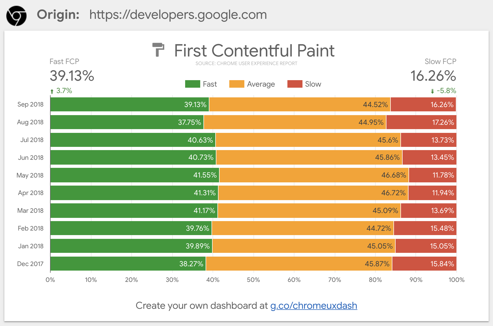
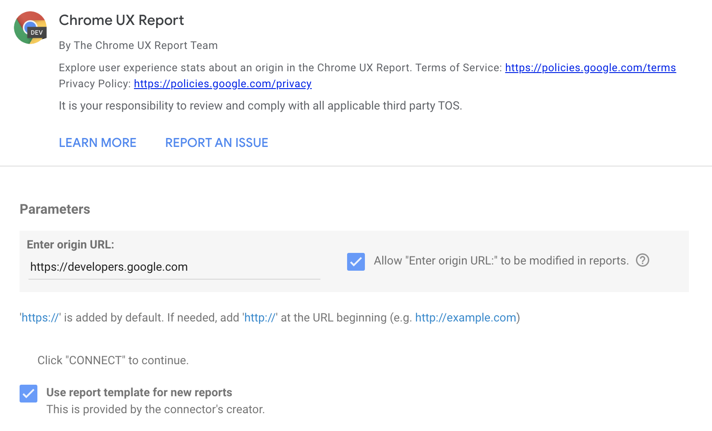
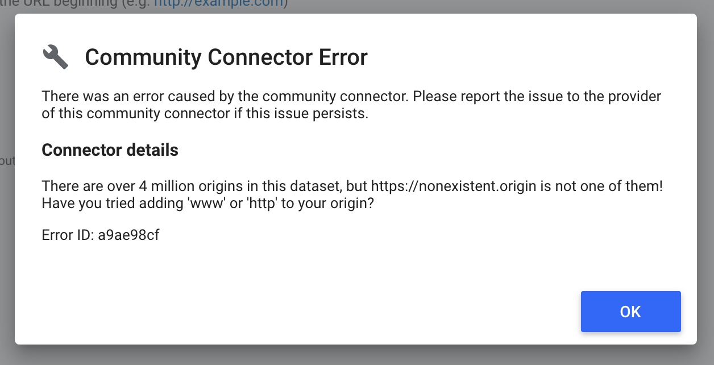
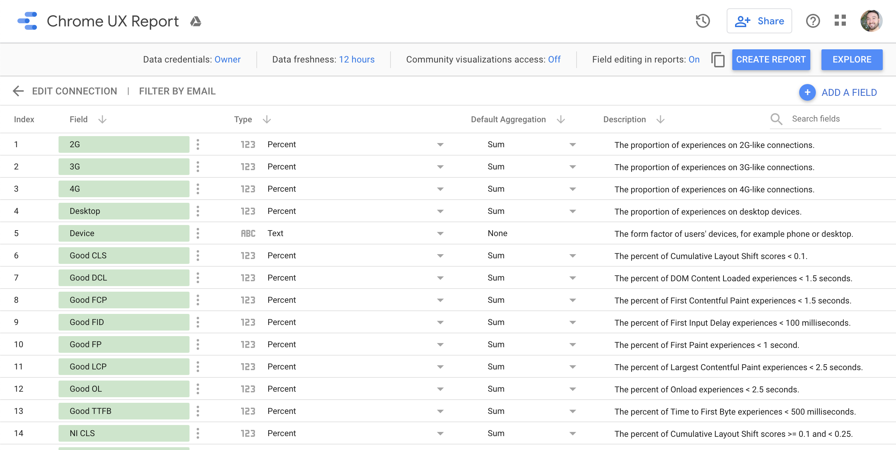
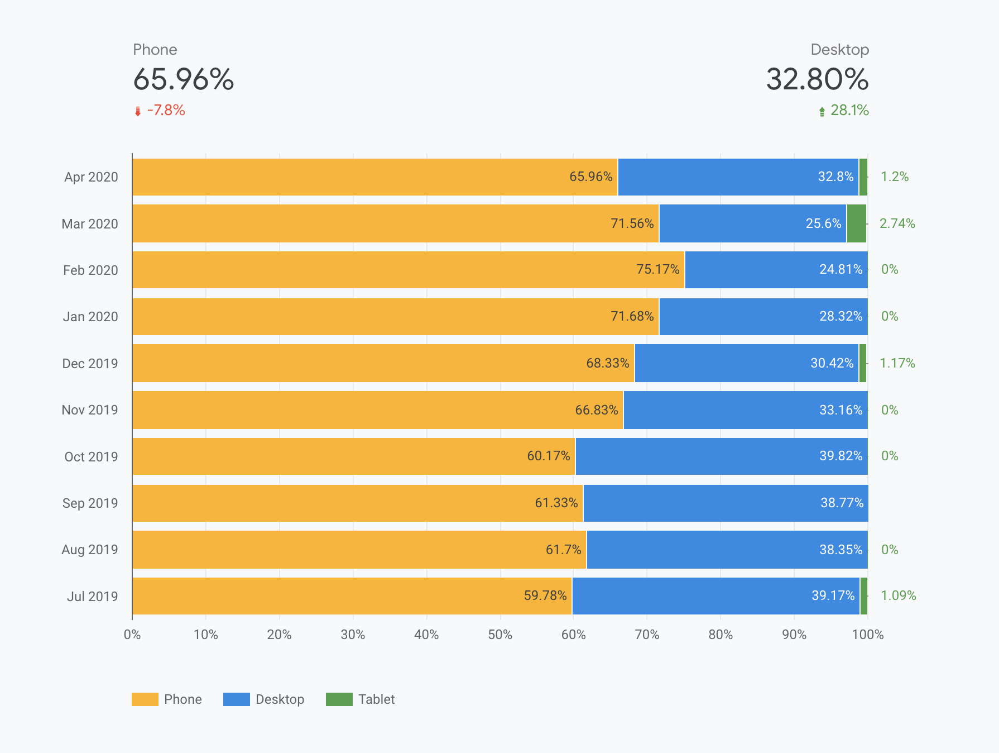
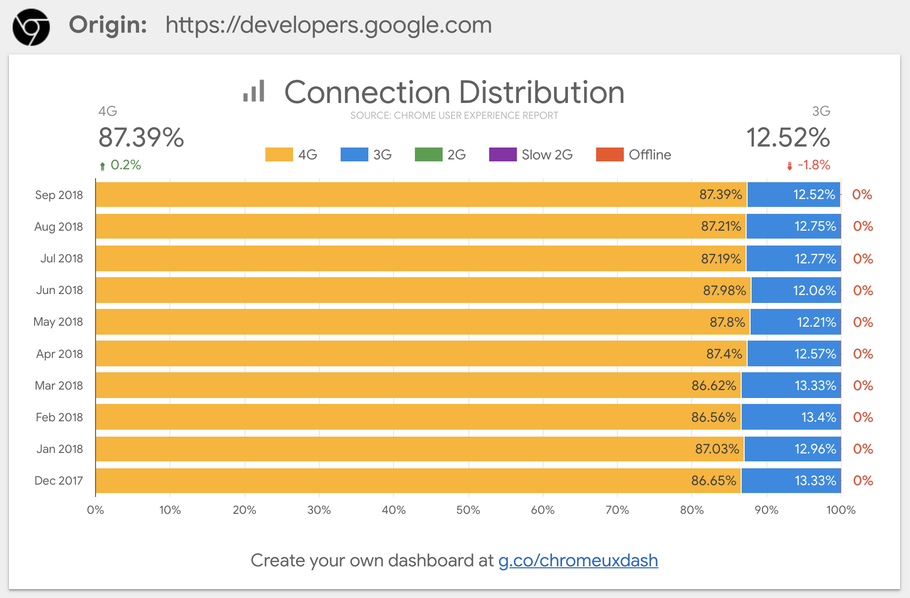
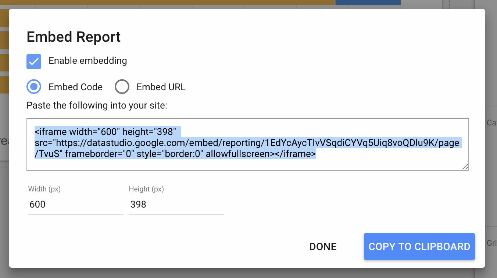

[Data Studio](https://marketingplatform.google.com/about/data-studio/) is a 
powerful data visualization tool that enables you to build dashboards on top of 
big data sources, like the Chrome UX Report 
([CrUX](https://developers.google.com/web/tools/chrome-user-experience-report/)). 
In this guide, learn how to create your own custom CrUX Dashboard to track an 
origin's user experience.

The CrUX Dashboard is built with a Data Studio feature called [Community 
Connectors](https://developers.google.com/datastudio/connector/). 
This connector is a pre-established link between the raw CrUX data on 
[BigQuery](./bigquery.html) and the visualizations of Data Studio. It eliminates 
the need for users of the dashboard to write any queries or generate any charts. 
Everything is built for you -- all you need is to provide an origin to look up. 
The connector code is also 
[open source](https://github.com/googledatastudio/community-connectors/tree/master/chrome-ux-report) 
if you want to see how it works.

## Creating a dashboard

To get started, go to [g.co/chromeuxdash](https://g.co/chromeuxdash). 
This will take you to the CrUX community connector page where you can provide 
the origin for which the dashboard will be generated. Note that first-time users 
may need to complete permission or marketing preference prompts.

The text input field accepts origins only, not full URLs. For example, 
`https://developers.google.com` is an origin but 
`https://developers.google.com/web/tools/chrome-user-experience-report/` is not. 
If you omit the protocol, HTTPS is assumed. Subdomains matter, so 
`developers.google.com` is very different from `google.com`.

Some common issues with origins are providing the wrong protocol, for example 
"https://" instead of "http://", and omitting the subdomain when needed. 
Some websites include redirects, so if `example.com` redirects to 
`https://www.example.com`, then you should use the latter, resolved version of 
the origin. As a rule of thumb, use whichever origin users see in the URL bar.

If your origin is not included in the CrUX dataset, you may get an error message 
like the one below. There are over 4 million origins in the dataset, but the one 
you want may not have sufficient data to be included.

If the origin exists, you'll be taken to the schema page for the dashboard. 
This shows you all of the fields that are included: each effective connection 
type, each form factor, the month of the dataset release, the distribution of 
performance for each supported metric (e.g., first contentful paint), and of 
course the name of the origin. There's nothing you need to do or change on this 
page, just click "Create Report" to continue.

## Using the dashboard

Each dashboard comes with three pages:

1. FCP performance
2. Device distribution
3. Connection distribution

Each page includes a chart showing distributions over time for each available 
monthly release. As new datasets are released, you can simply refresh the 
dashboard to get the latest data.

### FCP Performance

The first page shows you the distribution of FCP performance for each monthly
release. The raw histograms on BigQuery are in 100ms intervals. Here, those
intervals are simplified into three buckets: fast, average, and slow
performance. Fast FCP experiences occur in less than 1 second, average
experiences are between 1 and 2.5 seconds, and slow experiences are 2.5 seconds
or more.

The percent of fast and slow FCP experiences for the most recent release are 
highlighted on top, along with the percent change from the previous release. 
So for example, from August to September 2018, users on this origin experienced 
3.7% more fast FCP and 5.8% fewer slow FCP.


Due to a quirk with Data Studio, you may sometimes see "No Data" here. This is
normal and due to the previous month's release not being available yet. Datasets
are released on the second Tuesday of each month.


### Device distribution

The device distribution chart shows you the breakdown of phone, desktop, and 
tablet users over time. Many origins tend to have little to no tablet data so 
you'll see "0%" hanging off the edge of the chart.

### Connection distribution

The third and final page shows you the breakdown of effective connection types 
per month. There are five possible connection types (4G, 3G, 2G, Slow 2G, and 
Offline), but you will typically only see two or three in the chart. In the 
example above, 2G, Slow 2G, and offline are all 0%.

## Sharing the dashboard

Data Studio dashboards can be shared just like a Google Doc to provide access to 
your team or to make the dashboard publicly viewable by permalink. Needless to 
say, you don’t have to own the site you are getting a dashboard for, so you can 
easily use this tool to keep an eye on your competitors' sites.

Dashboards may also be embedded into websites or blog posts and retain all of 
their interactivity features.

## FAQ

### When would I use the CrUX Dashboard as opposed to other tools?

The CrUX Dashboard is based on the same underlying data available on BigQuery, 
but you don't need to write a single line of SQL to extract the data and you 
don't ever have to worry about exceeding any free quotas. Setting up a dashboard 
is quick and easy, all of the visualizations are generated for you, and you have 
the control to share it with anyone you want.

### Are there any limitations to using the CrUX Dashboard?

Currently, only FCP is available in the dashboard. Seeing other metrics would 
require querying the raw data on BigQuery. Also, there is not currently a way to 
drill down into segments like specific countries or form factors.

### Where can I learn more about Data Studio?

Check out the [Data Studio features page](https://marketingplatform.google.com/about/data-studio/features/) 
for more info.

