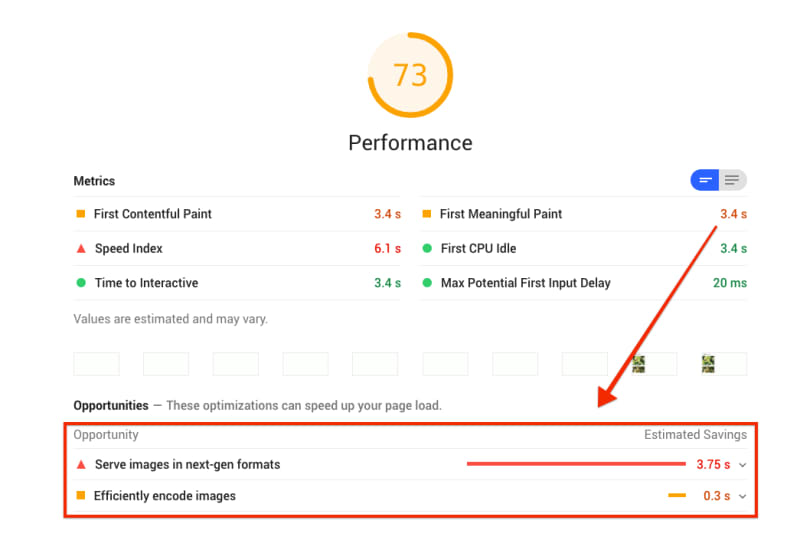
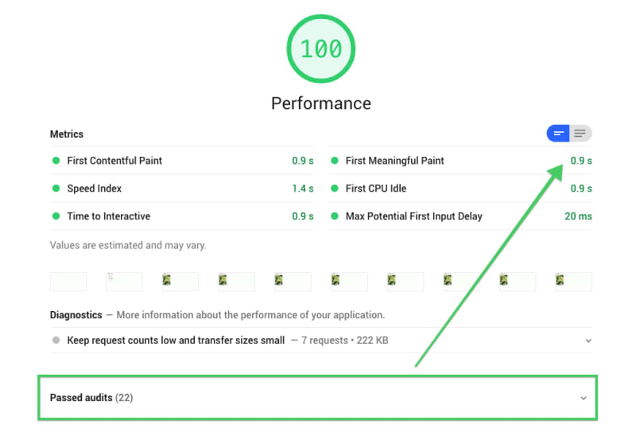

In this codelab, learn how to use a simple URL API to optimize images for faster downloads and serve media in next-gen formats. All of that happens dynamically in the cloud without any build step.

## Get a Cloudinary account

Click [here](https://cloudinary.com/users/register/free) to sign up for a free Cloudinary account. Remember to set a custom cloud name (at the end of the registration form). Your cloud name is used to build the URL that your images will be publicly available from.

For example: `https://res.cloudinary.com/`<span class="w-c--success">my_cloud_name</span>`/...`

<figure class="w-figure">
  <a href="https://cloudinary.com/users/register/free" target="_blank" rel="noopener noreferrer">
    
  </a>
  <figcaption class="w-figcaption w-figcaption--fullbleed">
    Fig. 1 — Setting a custom Cloud Name.
  </figcaption>
</figure>

## Next up

This codelab demonstrates how you can use the power of a cloud to optimize your images and serve next-gen formats dynamically. You will learn how to use dynamic cloud Fetch and Image Transformations features. You will replace the image links with Fetch URLs (explained below) that will automagically upload, transform, and optimize your images.

For example:

```html/1/0


```


  The [Cloudinary Fetch URL](https://cloudinary.com/documentation/fetch_remote_images) feature is a quick way to deliver images from remote URLs. The image can be manipulated and optimized on-the-fly, before being cached and delivered through fast, localized CDNs and not via local web servers. It requires no build step and no manual upload.


## Optimize an image

- Click the **Remix to Edit** button (in the top-right corner) to make the project editable.
- In the next few steps, you will replace the image link on Line #25 of `index.html` file, with a fetch URL.

### Fetch URL

To create a fetch URL, you have to prepend the following prefix to the existing URL of the image.

An example fetch URL looks like this:

```html
https://res.cloudinary.com/<cloud_name>/image/fetch/<transformations>/<remote_image_url>

```

There are three dynamic parts in this fetch URL which are explained below.

1. `<cloud_name>`
2. `<transformations>`
3. `<remote_image_url>`

### #1 REPLACE `<cloud_name>`

Replace `<cloud_name>` with your Cloudinary [cloud name](https://cloudinary.com/documentation/solution_overview?query=cloud%20name&c_query=Account%20and%20API%20setup%20%E2%80%BA%20Identifiers%20%E2%80%BA%20Cloud%20name#cloud_name). For example, we are going to use the `demo` cloud name here.

`https://res.cloudinary.com/`<span class="w-c--success">demo</span>`/image/fetch/<transformations>/<remote_image_url>`

```html/1/0
https://res.cloudinary.com/<cloud_name>/image/fetch/<transformations>/<remote_image_url>
https://res.cloudinary.com/demo/image/fetch/<transformations>/<remote_image_url>
```

### #2 REPLACE `<transformations>`

Replace `<transformations>` with relevant [Image Transformations](https://cloudinary.com/documentation/image_transformations). Use comma-separated values to optimize the image quality and format delivery by using `q_auto,f_auto`.

```html/1/0
https://res.cloudinary.com/demo/image/fetch/<transformations>/<remote_image_url>
https://res.cloudinary.com/demo/image/fetch/q_auto,f_auto/<remote_image_url>
```

While there are many [Image transformations](https://cloudinary.com/documentation/image_transformations) available, for the sake of this Codelab, we are only going to use two of them.

1. [**Quality**](https://cloudinary.com/documentation/image_transformation_reference#quality_parameter): The parameter `q` controls the quality of the image delivered by the cloud. You can set `q_1` to `q_100` 1 is the lowest quality, and 100 is the highest. Use `q_auto` to calculate the optimal quality of an image automatically.
2. [**Format**](https://cloudinary.com/documentation/image_transformation_reference#format_parameter): The parameter `f` can automatically convert delivered images to WebP and JPEG-XR on supported browsers to save bandwidth and optimize delivery time. Again use `f_auto` to auto format the image.

### #3 REPLACE `<remote_image_url>`

Now replace the `<remote_image_url>` with the original link of the first image. The final URL looks like this:

```html/1/0
https://res.cloudinary.com/demo/image/fetch/q_auto,f_auto/<remote_image_url>
https://res.cloudinary.com/demo/image/fetch/q_auto,f_auto/https://codelab-cloudinary.glitch.me/images/flower1.png
```

### Final image URL

The final image URL after replacing `<cloud_name>`, `<transformations>`, and `<remote_image_url>` looks like this:

```html
https://res.cloudinary.com/demo/image/fetch/q_auto,f_auto/https://codelab-cloudinary.glitch.me/images/flower1.png

```

Which means that you can auto-optimize any image by prepending the following to its URL.

```html
https://res.cloudinary.com/demo/image/fetch/q_auto,f_auto/
```

### RESULTS

After replacing the link of the first image (line #25) with the fetch URL, your HTML should look like this:

```html/2/1
<div class="wrapper">
  
  
  <div class="price">Violet bouquet- $9</div>
</div>
```

This helps save more than 90% on image size.

<div class="w-table-wrapper">
  <table>
    <tbody>
      <thead>
        <tr>
          <th>
            <p>
              <a
                href="https://codelab-cloudinary.glitch.me/images/flower1.png"
                target="_blank"
                rel="noopener noreferrer"
                ></a>
            </p>
            <strong>289 KB</strong> (Original)
          </th>
          <th>
            <p>
              <a
                href="https://res.cloudinary.com/demo/image/fetch/q_auto,f_auto/https://codelab-cloudinary.glitch.me/images/flower1.png"
                target="_blank"
                rel="noopener noreferrer"
              >
                
              </a>
            </p>
            <strong>22 KB</strong> (Cloudinary)
          </th>
        </tr>
      </thead>
    </tbody>
  </table>
</div>

The photo on the right is 92.39% smaller than the one on the left, yet would probably look identical to the average user.


  Now prepend all image links in the `index.html` with `https://res.cloudinary.com/demo/image/fetch/q_auto,f_auto/`. Make sure to change `demo` to your `cloud_name`.


## ✔︎ Check-in

Your `index.html` file should now look like this:

```html
<!--
Copyright 2018 Google LLC.
SPDX-License-Identifier: Apache-2.0
-->
<!DOCTYPE html>
<html lang="en">
  <head>
    <title>Cloudinary URL API Demo: Optimized Images</title>
    <meta name="Description" content="In this codelab, learn how to use Cloudinary with its simple URL API to optimize images for faster downloads and serve media in next-gen formats. All of that happens dynamically in the Cloud without any build step.">
    <link href="https://cloudinary-res.cloudinary.com/image/asset/favicon-192x192-d6a96e11dd5adfebbb717d154665ee80.png" rel="icon" sizes="192x192" type="image/png">
    <meta charset="utf-8">
    <meta http-equiv="X-UA-Compatible" content="IE=edge">
    <meta name="viewport" content="width=device-width, initial-scale=1">
    <style>body {text-align: center}img {border: 1px solid black}.wrapper {margin-bottom: 24px}.wrapper .price {font-size: 24px}</style>
  </head>
  <body>
    <header>
      <h1>
        Foobar Flowershop
      </h1>
      <p>We sell the best flowers!</p>
    </header>
    <div class="wrapper">
      
      <div class="price">Yellow bouquet - $9</div>
    </div>
    <div class="wrapper">
      
      <div class="price">Cream bouquet - $5</div>
    </div>
    <div class="wrapper">
      
      <div class="price">Light pink bouquet - $6</div>
    </div>
    <div class="wrapper">
      
      <div class="price">Violet bouquet - $8</div>
    </div>
    <div class="wrapper">
      
      <div class="price">Polka dot bouquet - $11</div>
    </div>
    <div class="wrapper">
      
      <div class="price">Burgandy bouquet - $7</div>
    </div>
  </body>
</html>
```

## Image Performance Gains

There are impressive web performance gains by using <a href="https://cloudinary.com/documentation/image_optimization">cloud to optimize images</a> without losing quality.

<div class="w-table-wrapper">
  <table>
    <caption>
      Table 1 — The before/after Image sizes comparison.
    </caption>
    <tbody>
      <tr>
        <th>IMAGE</th>
        <th>ORIGINAL</th>
        <th>CLOUDINARY</th>
        <th>SIZE</th>
      </tr>
      <tr>
        <td>flower1.png</td>
        <td><span class="w-c--warning">289 KB</span></td>
        <td><span class="w-c--success">22 KB</span></td>
        <td><span class="w-c--success">↓ -92.39%</span></td>
      </tr>
      <tr>
        <td>flower2.jpg</td>
        <td><span class="w-c--warning">59 KB</span></td>
        <td><span class="w-c--success">19 KB</span></td>
        <td><span class="w-c--success">↓ -67.8%</span></td>
      </tr>
      <tr>
        <td>flower3.png</td>
        <td><span class="w-c--warning">367 KB</span></td>
        <td><span class="w-c--success">38 KB</span></td>
        <td><span class="w-c--success">↓ -89.65%</span></td>
      </tr>
      <tr>
        <td>flower4.jpg</td>
        <td><span class="w-c--warning">125 KB</span></td>
        <td><span class="w-c--success">73 KB</span></td>
        <td><span class="w-c--success">↓ -41.6%</span></td>
      </tr>
      <tr>
        <td>flower5.jpg</td>
        <td><span class="w-c--warning">96 KB</span></td>
        <td><span class="w-c--success">47 KB</span></td>
        <td><span class="w-c--success">↓ -51.04%</span></td>
      </tr>
      <tr>
        <td>flower6.jpg</td>
        <td><span class="w-c--warning">68 KB</span></td>
        <td><span class="w-c--success">24 KB</span></td>
        <td><span class="w-c--success">↓ -64.71%</span></td>
      </tr>
    </tbody>
  </table>
</div>

Hooray! These results are much better.

## Lighthouse Audit

Lastly, it's a good idea to use <a target="_blank" rel="noopener noreferrer" href="https://web.dev/discover-performance-opportunities-with-lighthouse">Lighthouse</a> to verify the changes that you just
made.

Lighthouse's "Efficiently encode images" performance audit can let you know if
the JPEG images on your page are optimally compressed.

- To preview the site press the **View App** button (in the right-bottom corner).
- Run the Lighthouse performance audit (Lighthouse ❯ Options ❯ Performance) on
  the <a target="_blank" rel="noopener noreferrer" href="https://codelab-cloudinary.glitch.me/">live version</a> of your Glitch and verify that the "Efficiently encode
  images" as well as "Serve images in next-gen formats" audits were passed.

### RESULTS

Lighthouse audit results for when images were not optimized.

<figure class="w-figure">
  
  <figcaption class="w-figcaption w-figcaption--fullbleed">
    Fig. 2 — Images Not Optimized.
  </figcaption>
</figure>

You can use `https://codelab-cloudinary.glitch.me/` for the first audit. This results in two optimization opportunities:

1. Serve images in next-gen formats, e.g., WebP and JPEG-XR.
2. Efficiently encode images.

<figure class="w-figure">
  
  <figcaption class="w-figcaption w-figcaption--fullbleed">
    Fig. 3 — Optimized Images.
  </figcaption>
</figure>

The cloud-optimized image links exist in the `optimized.html` file. You can test <a target="_blank" rel="noopener noreferrer" href="https://codelab-cloudinary.glitch.me/optimized.html">this link</a>, which results in a perfect score and the page load time is down by 4.05 secs. That is impressive.


  You have used Cloudinary to compress the images optimally, and your page is serving next-gen image formats.


### Further Reading

- [Image transformations](https://cloudinary.com/documentation/image_transformations)
- [Digital media management guides](https://cloudinary.com/documentation/cloudinary_guides)
- [Quality optimization interactive demo](https://demo.cloudinary.com/?mode=qa)
- [Compress images without losing quality](https://cloudinary.com/blog/the_holy_grail_of_image_optimization_or_balancing_visual_quality_and_file_size)
