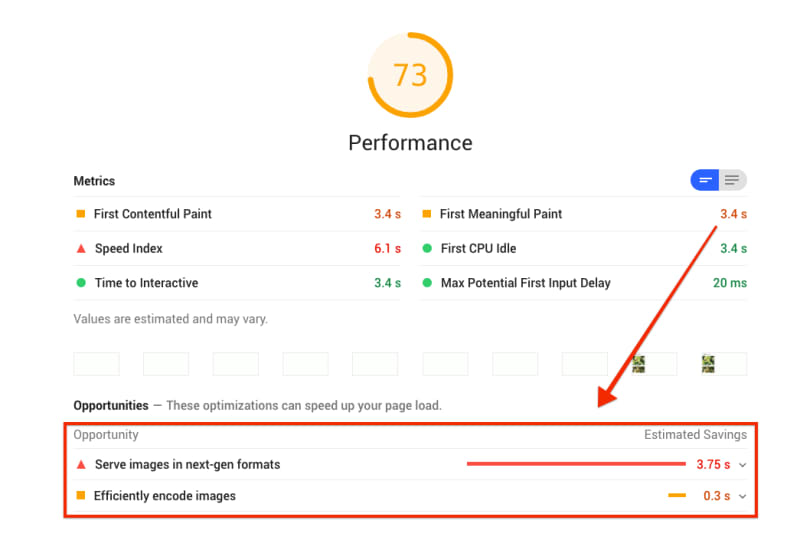
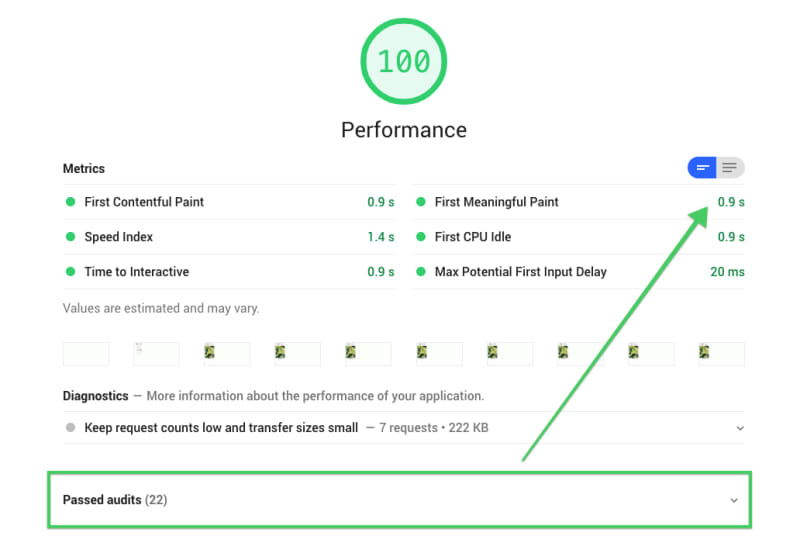

Learn to use Cloudinary's fetch URL API to optimize images and serve them in next-gen formats. 

In this codelab:

1. [Get a free Cloudinary account](#get-a-free-cloudinary-account).
1. [Measure page load time before optimization](#measure-page-load-time-before-optimization).
1. [Optimize images with Cloudinary](#optimize-images-with-cloudinary).
1. [Measure page load time after optimization](#measure-page-load-time-after-optimization).

## Get a free Cloudinary account

First, <a href="https://cloudinary.com/users/register/free" target="_blank" rel="noopener noreferrer">sign up for a free Cloudinary account.</a>

Remember to set a custom cloud name at the end of the registration form. Cloudinary uses your cloud name to build the URLs it will serve your images from.

<figure class="w-figure">
  <video controls autoplay loop muted class="w-screenshot">
    <source src="./cloudname.webm" type="video/webm; codecs=vp8">
    <source src="./cloudname.mp4" type="video/mp4; codecs=h264">
  </video>
  <figcaption class="w-figcaption">
    Setting a custom cloud name.
  </figcaption>
</figure>

## Measure page load time before optimization

Use Lighthouse to measure page load time before optimization.


  To preview a Glitch project in its own tab, press **Share** in the bottom-right corner and copy the **Live App** link into a new Chrome tab.


1.  In Chrome DevTools, on the **Audits** tab, select **Performance**.
1.  Click **Run Audits**.
1.  When the audit completes, see the **Opportunities** section.

<figure class="w-figure">
  
  <figcaption class="w-figcaption w-figcaption--fullbleed">
    Before optimization: Example results of a Lighthouse performance audit.
  </figcaption>
</figure>

You'll resolve these opportunities in the rest of this codelab by optimizing the images with Cloudinary.

## Optimize images with Cloudinary

To optimize the three images in the starting code, you'll create Cloudinary fetch URLs for each one.

A Cloudinary fetch URL looks like this:

```text
https://res.cloudinary.com/<cloud_name>/image/fetch/<transformations>/<remote_image_url>
```


*   `<cloud_name>` is your Cloudinary [cloud name](https://cloudinary.com/documentation/solution_overview?query=cloud%20name&c_query=Account%20and%20API%20setup%20%E2%80%BA%20Identifiers%20%E2%80%BA%20Cloud%20name#cloud_name).

    Example: 
    
    ```text
    demo
    ```

*   `<transformations>` is a list of [Cloudinary image transformations](https://cloudinary.com/documentation/image_transformations) separated by commas.

    Example: 
    
    ```text
    q_auto,f_auto
    ```


  
`q` specifies image **quality** that Cloudinary will deliver. `q_1` is the lowest quality; `q_100` is the highest. `q_auto` tells Cloudinary to calculate the optimal image quality automatically. 

`f` specifies image **format**. Cloudinary can deliver images in WebP and JPEG-XR formats on supported browsers. `f_auto` tells Cloudinary to choose an image format automatically. 



*   `<remote_image_url>` is the original image URL. 

    Example: 

    ```text
    https://codelab-cloudinary.glitch.me/images/flower1.png
    ```

Here's an example of a complete Cloudinary fetch URL:

```html
https://res.cloudinary.com/demo/image/fetch/q_auto,f_auto/https://codelab-cloudinary.glitch.me/images/flower1.png
```

### Replace image URLs with Cloudinary fetch URLs 

In this step, you'll edit the image URL on line 25 of index.html.

Click **Remix to Edit** in the top-right corner to make the project editable.

1.  Create a Cloudinary fetch URL:

    ```html
    https://res.cloudinary.com/<cloud_name>/image/fetch/<transformations>/<remote_image_url>
    ```

    *  Replace `<cloud_name>` with your Cloudinary cloud name.

    *  Replace `<transformations>` with `q_auto,f_auto`.

    *  Replace `<remote_image_url>` with the original image URL. 

    Example:

    ```html
    https://res.cloudinary.com/demo/image/fetch/q_auto,f_auto/https://codelab-cloudinary.glitch.me/images/flower1.png
    ```

2.  Replace the image URL on line 25 of index.html with the Cloudinary fetch URL.

    Example:

    ```html/2/1
    <div class="wrapper">
      
      
      <div class="price">Violet bouquet- $9</div>
    </div>
    ```

This decreases image size by more than 90%.

<div class="w-table-wrapper">
  <table>
    <tbody>
      <thead>
        <tr>
          <th>
            <p>
              <a
                href="https://codelab-cloudinary.glitch.me/images/flower1.png"
                target="_blank"
                rel="noopener noreferrer"
                ></a>
            </p>
            <strong>289 KB</strong> (Original)
          </th>
          <th>
            <p>
              <a
                href="https://res.cloudinary.com/demo/image/fetch/q_auto,f_auto/https://codelab-cloudinary.glitch.me/images/flower1.png"
                target="_blank"
                rel="noopener noreferrer"
              >
                
              </a>
            </p>
            <strong>22 KB</strong> (Cloudinary)
          </th>
        </tr>
      </thead>
    </tbody>
  </table>
</div>

The photo on the right is 92.39% smaller than the one on the left, yet would probably look identical to the average user.


  Now prepend all image links in the `index.html` with `https://res.cloudinary.com/demo/image/fetch/q_auto,f_auto/`. Make sure to change `demo` to your `cloud_name`.


### ✔︎ Check-in

The edited part of your `index.html` file should now look like this:

```html/(1,1,5,9,13,17,21)
<div class="wrapper">
  
  <div class="price">Yellow bouquet - $9</div>
</div>
<div class="wrapper">
  
  <div class="price">Cream bouquet - $5</div>
</div>
<div class="wrapper">
  
  <div class="price">Light pink bouquet - $6</div>
</div>
```

## Measure page load time after optimization

These are the results of using Cloudinary to optimize images:

<div class="w-table-wrapper">
  <table>
    <caption>
      Before and after: Image size comparison
    </caption>
    <tbody>
      <tr>
        <th>Image</th>
        <th>Original</th>
        <th>Cloudinary</th>
        <th>Size</th>
      </tr>
      <tr>
        <td>flower1.png</td>
        <td>289 KB</td>
        <td>22 KB</td>
        <td>↓ -92.39%</td>
      </tr>
      <tr>
        <td>flower2.jpg</td>
        <td>59 KB</td>
        <td>19 KB</td>
        <td>↓ -67.8%</td>
      </tr>
      <tr>
        <td>flower3.png</td>
        <td>367 KB</td>
        <td>38 KB</td>
        <td>↓ -89.65%</td>
      </tr>
    </tbody>
  </table>
</div>

Run the Lighthouse performance audit again to see for yourself! 

<figure class="w-figure">
  
  <figcaption class="w-figcaption w-figcaption--fullbleed">
    Lighthouse performance audit: Before
  </figcaption>
</figure>

<figure class="w-figure">
  
  <figcaption class="w-figcaption w-figcaption--fullbleed">
    Lighthouse performance audit: After
  </figcaption>
</figure>

The Lighthouse performance audit should have a perfect score. In the example above, First Meaningful Paint is down by an impressive 2.5 seconds.


  You have used Cloudinary to compress the images optimally, and your page is serving next-gen image formats.


## Further Reading

- [Digital media management guides](https://cloudinary.com/documentation/cloudinary_guides)
- [Quality optimization interactive demo](https://demo.cloudinary.com/?mode=qa)
- [Compress images without losing quality](https://cloudinary.com/blog/the_holy_grail_of_image_optimization_or_balancing_visual_quality_and_file_size)
