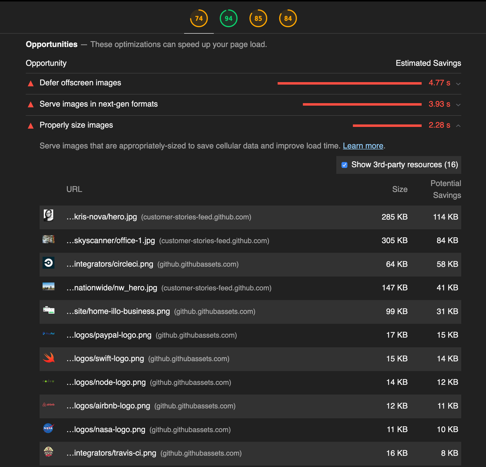
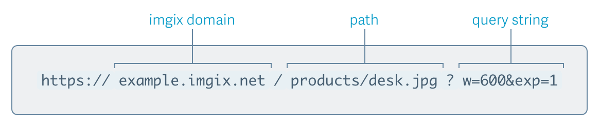

[imgix](https://www.imgix.com/) is a service that transforms, optimizes, and caches your images for a faster website experience. When building your web application, it's nearly impossible to account for all the [various devices](https://www.mydevice.io/#compare-devices) and screen sizes that it might be viewed on. For images, this presents a major problem: in order to display images quickly and with high quality (both of which are key metrics for engagement and conversion) they must be optimized based on their context. With imgix, you can ensure that you're always serving images to your users at the ideal size and speed for their specific device. In addition, imgix provides a wide variety of image transformation options, all easily accessible through a robust API of [URL parameters](https://docs.imgix.com/apis/url?utm_source=webdev&utm_medium=referral&utm_campaign=codelab).

## Measure with Lighthouse

Run Lighthouse to check for opportunities to improve page load. These opportunities are listed under the **Properly size images** audit.



## Set up your imgix account

imgix provides a CDN which caches and serves your content globally. You'll need to sign up for an imgix account and create a [Source](https://docs.imgix.com/setup/creating-sources) that can access your asset library at its origin server, either through Google Cloud Storage, Amazon S3, or a simple web folder. Complete [imgix's tutorial for setting up an account and linking a Source](https://docs.imgix.com/setup?utm_source=webdev&utm_medium=referral&utm_campaign=codelab) and then head back to this tutorial when you're done. After you've set up an account and Source, you'll have access to your assets through a unique domain name created for you by imgix, for example `example.imgix.net`.

## imgix URLs

Once your source is deployed (this usually happens immediately but can sometimes take longer), you can start serving your images via this custom domain name, for example `example.imgix.net/desk.jpg`. The structure of a basic imgix URL follows this format:



In the above URL, the name of the Source is `example`, so the hostname takes the form of `example.imgix.net`. The path consists of any additional directory information required to locate your image within your image storage (for example if you have different subfolders for your images). In this example, `/products/desk.jpg` completes the full path to the image. Once you are able to access your master image from the origin source, you can use imgix's API via query parameters. In the above example, `w=600` resizes the image to 600 pixels wide while `exp=1` increases the image's exposure by 1 unit.

## imgix client libraries

After you become familiar with how to form imgix URLs, you can begin to integrate them in your website. However, doing this manually can take a lot of time, especially depending on the size of the application. To facilitate this, imgix offers a variety of [client libraries](https://docs.imgix.com/libraries?utm_source=webdev&utm_medium=referral&utm_campaign=codelab), which allow developers to programmatically build URLs and streamline integration.
The imgix SDK offers both backend and frontend libraries in a variety of common languages and web frameworks, each providing utilities that follow imgix's recommended best practices. This codelab will explain how to use the imgix.js library.

## Serve responsive images using imgix.js

[imgix.js](https://github.com/imgix/imgix.js) is a Javascript library that allows developers to easily generate responsive images using the `srcset` and `sizes` attributes. What usually requires a lot of manual configuration on the frontend can now be done in just a few lines code.

### Getting started

For the purposes of this Glitch, imgix.js is already installed. For more information on installation and usage, visit the [imgix.js github](https://github.com/imgix/imgix.js).

### View this demo


- At first the image may look like just a blue background. If you scroll around you'll see that it's a very large image of some people in a hot air balloon

### View the code


- Open `views/index.html`, you'll notice that the only element on the page is a single `` with a `src` attribute defined as `https://assets.imgix.net/unsplash/hotairballoon.jpg`.
- If you were to inspect this image, you would see that it is 5184 pixels wide and nearly 1.5 MB. That's way too massive of an image to serve to small devices.

### Improve the code

As mentioned in [Serve responsive images](https://web.dev/serve-responsive-images/#the-%22srcset%22-attribute), you can use the `srcset` attribute to instruct the browser 
to download different-sized images depending on screen size.

Under the `images` directory, you can see three images: `hotairballoon-large.jpg`, `hotairballoon-medium.jpg`, and `hotairballoon-small.jpg`. The three images are exactly the same, except they've been manually resized in an image-editing application and saved at 1200, 750, and 400 pixels wide, respectively.


- Replace the original `` element in your `index.html` to use these three instead:

```html

```

- To test this, make your browser window very narrow.

- Slowly make your browser window wider. Notice that the browser automatically downloads the larger sizes of the image as the window gets wider. You might need to clear your HTTP cache in order to see the browser download each image size.

### How imgix makes this easier

But what if you want to have more than three sizes of the image because you want to cover more scenarios? Or you want to make sure your page is running as optimally as possible? Imagine if you wanted a page that had ten different versions of an image defined in the element's `srcset`. Well, if you were to do that much manual work for each image on your page, the time and effort could really add up.

Luckily, with imgix.js you can dynamically generate these images through your Source that you created earlier. 

- Try using the imgix.js-defined attribute `ix-src` in your  `` element:

```html

```

Now try opening the app and resizing browser. As the browser is resized, it will load images with different widths.


You will probably need to clear your cache in between page loads in order to observe this happening. Otherwise, the browser will try to use the image version that is already in the cache.


If you inspect this element by using your browser's DevTools (right-click the image and select _Inspect_) you'll see imgix.js has automatically generated HTML similar to the following:

```html

```

Here you can see the value imgix provides. Because the imgix API allows you to create as many different image variations as you want, you can construct a custom `srcset` in just a few lines of code that serves a properly-sized image to nearly every device imaginable. Compare the amount of time that would take against manually resizing and saving each of these variations individually.

You might also notice that the widths listed within the `srcset` increase exponentially. For one, this ensures that the rendered image is never larger than the source image by more than a certain percentage, which guarantees better visual quality. Additionally, by limiting the number of derivative images in total, your site will gain improved load performance as a result of more frequent cache hits.

In other words, imgix gives you developer tools that provide the best of both worlds: image quality and optimized performance!
