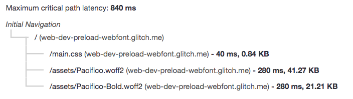
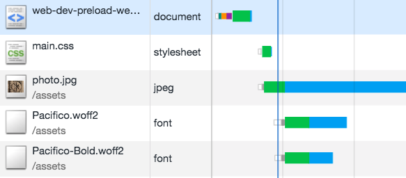
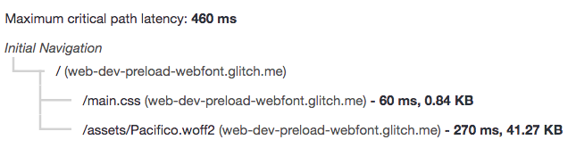
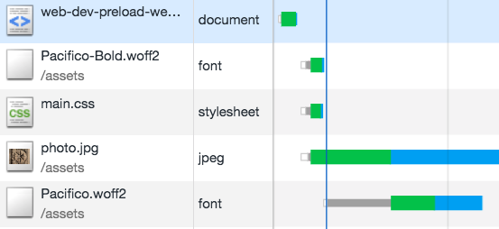



This codelab shows you how to preload web fonts using `rel="preload"` to remove
any flash of unstyled text (FOUT).

## Measure

First measure how the website performs before adding any optimizations.



The Lighthouse report that is generated will show you the fetching sequence of resources under **Maximum critical path latency**.



In the above audit the web fonts are part of the critical request chain and fetched last. The [**critical request chain**](/critical-request-chains) represents the order of resources that are prioritized and fetched by the browser. In this application, the web fonts (Pacfico and Pacifico-Bold) are defined using the [@font-face](https://developers.google.com/web/fundamentals/performance/optimizing-content-efficiency/webfont-optimization#defining_a_font_family_with_font-face) rule and are the last resource fetched by the browser in the critical request chain. Typically, webfonts are lazy loaded which means that they are not loaded until the critical resources are downloaded (CSS, JS).

Here is the sequence of the resources fetched in the application:



## Preloading Web fonts
In order to avoid FOUT, you can preload web fonts that are required immediately. Add the `Link` element for this application at the head of the document:

```html
<head>
 <!-- ... -->
 <link rel="preload" href="/assets/Pacifico-Bold.woff2" as="font" type="font/woff2" crossorigin>
</head>
```

The `as="font" type="font/woff2"` attributes tell the browser to download this resource as a font and helps in prioritization of the re­source queue.

The `crossorigin` attribute indicates whether the resource should be fetched with a CORS request as the font may come from a different domain. Without this attribute, the preloaded font is ignored by the browser.

Since Pacifico-Bold is used in the page header, we added a preload tag to fetch it even sooner. It isn't important to preload the Pacifico.woff2 font because it styles the text that is below the fold.

Reload the application and run lighthouse again. Check the **Maximum critical path latency** section.



Notice how the `Pacifico-Bold.woff2` is removed from the critical request chain. It is fetched earlier in the application.



 With preload, the browser knows that it needs to download this file earlier. It is important to note that if not used correctly, preload can harm performance by making unnecessary requests for resources that are not used.
