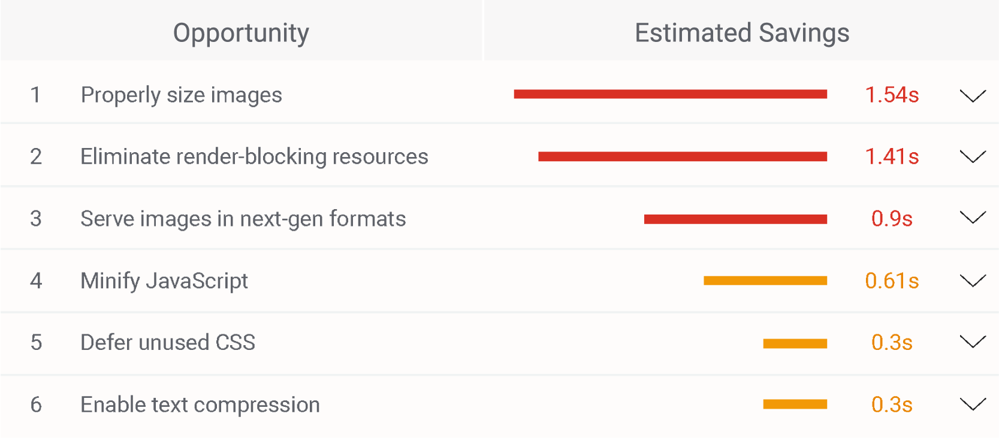

## Speed Optimizations

Hopefully you’ve now made it your mission to improve your page speed - but how do you go about speeding up?

The metrics we want to move are influenced by multiple factors, many of which can be improved by implementing best practices. Tools like Lighthouse are a good starting point: along with a score for each metric, they also provide a list of potential speed-enhancement opportunities, such as optimizing images or JavaScript.

## AMP

Another way to speed up and stay fast is [AMP](https://amp.dev/). AMP is an open-source library that provides a straightforward way to create web pages that load near-instantaneously for users. 

AMP by itself is very fast, but it can also speed up your website on additional levels through caching in the AMP Caches and by pre-rendering. You can find more details about this and a method that could be used to measure AMP performance [here](https://blog.amp.dev/2018/01/17/measuring-amp-performance/). 

You can also use AMP with Google Ads. Combining speed and smoother loading, AMP landing pages can provide a better landing page experience, which is an important factor in your Quality Score. Two different ways of A/B testing AMP campaigns are described [here](https://support.google.com/google-ads/answer/9124739?hl=en-GB). 

If you’re ready to start building an AMP page, the [AMP documentation contains](https://amp.dev/documentation/guides-and-tutorials/start/create/?referrer=ampproject.org) a step-by-step guide, or you can visit the [AMP conversion documentation](https://amp.dev/documentation/guides-and-tutorials/start/converting/?referrer=ampproject.org), where you’ll find information on key concepts and how AMP documents differ from traditional HTML. AMP supports integration with many third-party publishing platforms, with individual details on the [AMP CMS compatibility list](https://amp.dev/community/platform-and-vendor-partners).

