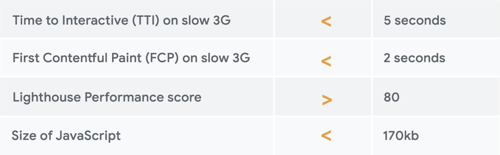

Brands that optimize speed will often find they regress quickly. This is because website performance is a lot like getting fit: it's not enough to make a one time effort; you have to change your lifestyle.


  [Internal Google study](https://www.youtube.com/watch?v=YJGCZCaIZkQ) has found that 40% of brands regress on web performance after 6 months.


Performance budgets are one way to address this. A performance budget is a set of limits on metrics that affect site performance. The concept is similar to a financial budget: you set a limit and make sure you stay within it. In general, a good performance budget combines different types of metrics; so, for example, the performance budget for a product page might look as follows:

<figure class="w-figure w-figure--center">
  
  <figcaption class="w-figcaption">
    Example performance budget
  </figcaption>
</figure>

Once set, a performance budget has to be enforced, which means for example incorporating the budget into your build process and reporting. Tools like Lighthouse can be included in your continuous integration, and you can write tests that fail a build if key metrics drop below a set threshold. Additionally, regular reporting through dashboards or summary reports can help with visibility and accountability. [Pinterest](https://www.youtube.com/watch?v=Xryhxi45Q5M) are one example of a business that have implemented performance budgets to make sure their fast experience stays fast, while brands like [Experian](https://www.thinkwithgoogle.com/intl/en-gb/success-stories/uk-success-stories/how-mobile-first-mindset-helped-experian-slash-page-load-times/) are now using site speed as a key metric in their monthly executive KPI reports.

You can find more details on performance budgets [here](https://web.dev/performance-budgets-101). A guide that describes how to further instil performance culture and make speed metrics visible and tangible for all stakeholders can be found [here](/how-to-report-metrics/).
