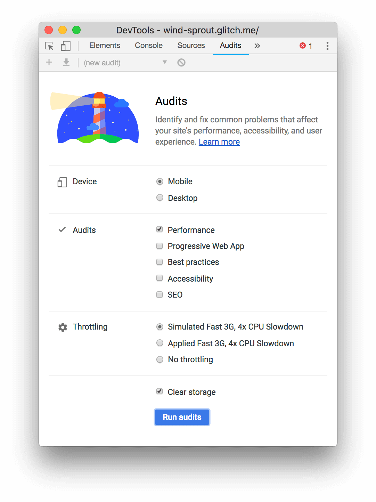
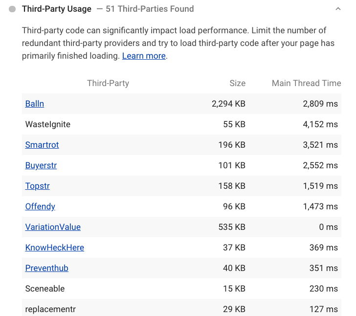
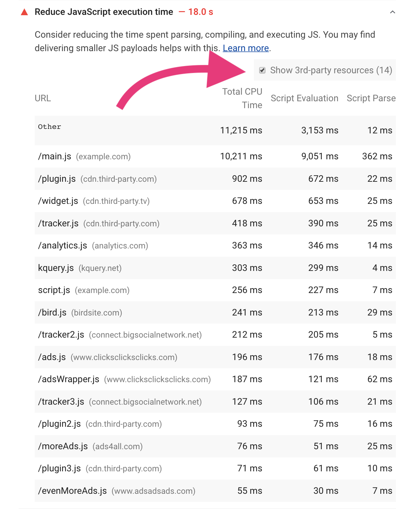
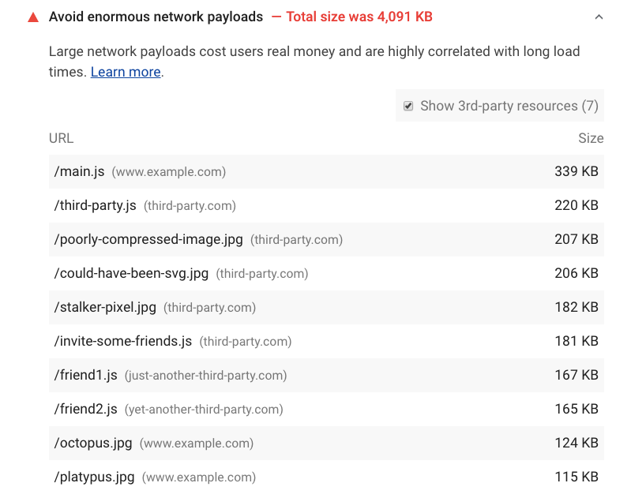
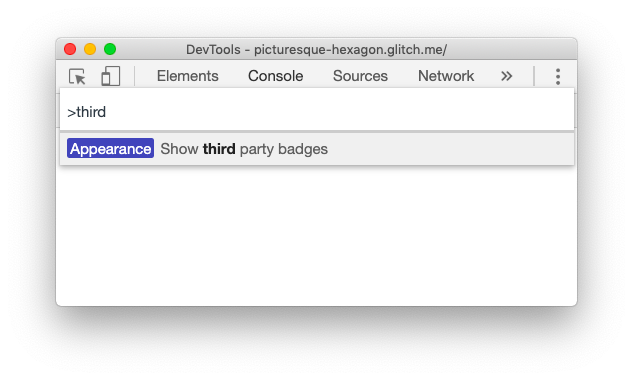
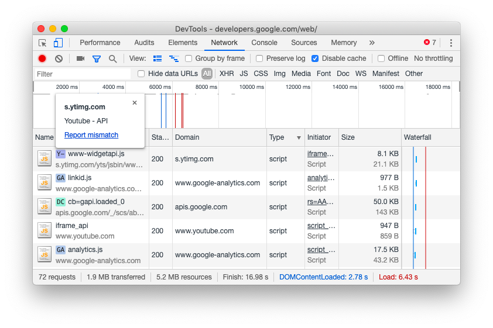
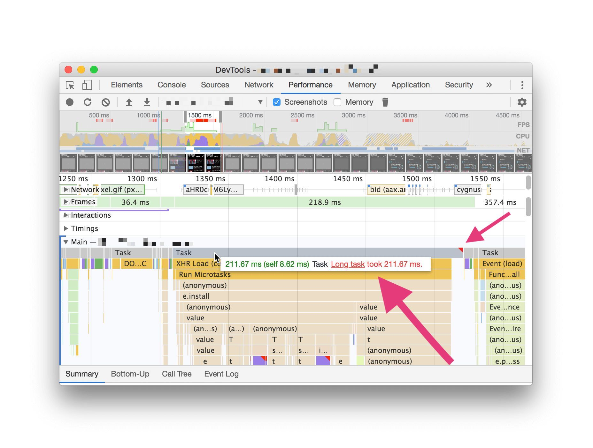
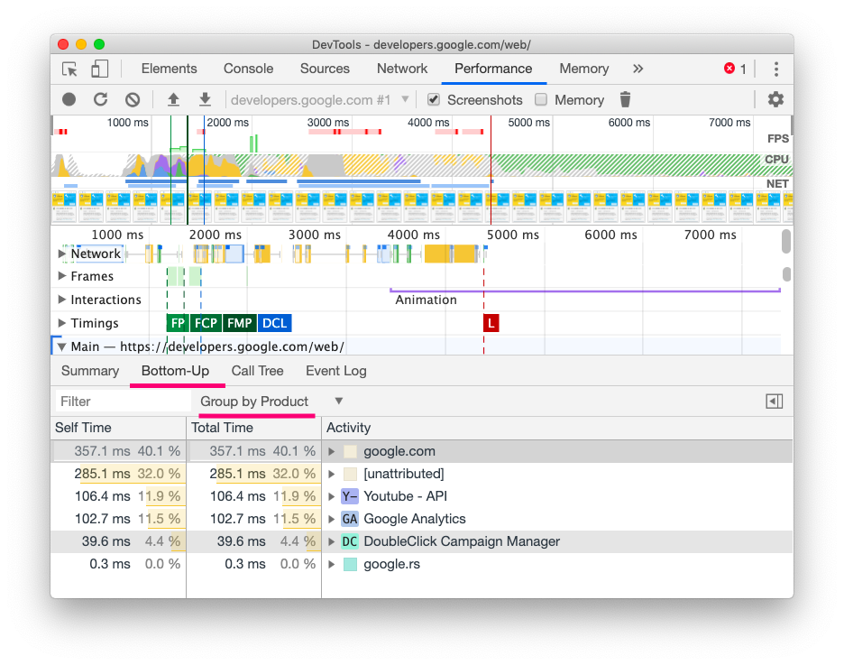
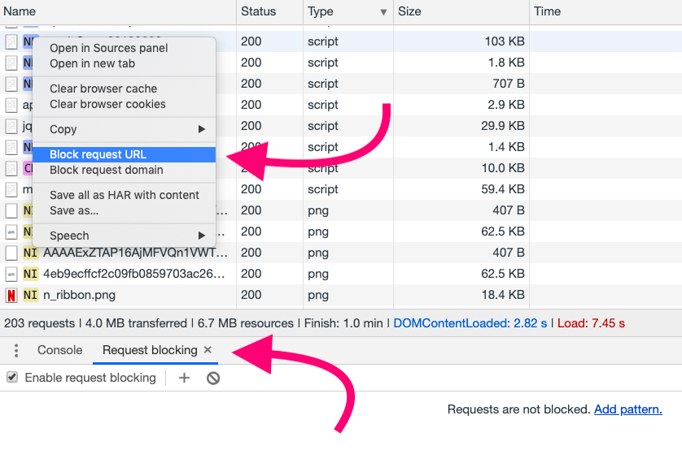

As a developer, you often don't have control over [which third-party scripts](/third-party-javascript/#network) your site loads. Before you can optimize third-party content you have to do some detective work to find out what's making your site slow. 🕵️

In this post, you'll learn how to use [Lighthouse](https://developers.google.com/web/tools/lighthouse/) and [Chrome DevTools](https://developers.google.com/web/tools/chrome-devtools/) to identify slow third-party resources. The post walks through increasingly robust techniques which are best used in combination.

## If you only have 5 minutes

The Lighthouse [Performance audit](/lighthouse-performance) helps you discover opportunities to speed up page loads. Slow third-party scripts are likely to appear in the **Diagnostics** section under the **Reduce JavaScript execution time** and **Avoid enormous network payloads** audits.

To run an audit:


1. Click **Mobile**.
1. Select the **Performance** checkbox. (You can clear the rest of the checkboxes in the Audits section.)
1. Click **Simulated Fast 3G, 4x CPU Slowdown**.
1. Select the **Clear Storage** checkbox.
1. Click **Run audits**.

### Third-party usage

The Lighthouse **Third-party usage** audit shows a list of the third-party providers a page uses. This overview can help you better understand the big picture and identify redundant third-party code. The audit is available in the [Lighthouse extension](https://chrome.google.com/webstore/detail/lighthouse/blipmdconlkpinefehnmjammfjpmpbjk?hl=en) and will soon be added to DevTools in Chrome 77.

<figure class="w-figure">
  
  <figcaption class="w-figcaption">
  Third-party provider names generated with <a href="http://tiffzhang.com/startup/?s=641553836036">Startup generator</a>. Any similarity to actual startups, living or dead, is purely coincidental.
  </figcaption>
</figure>

### Reduce JavaScript execution time
The Lighthouse [Reduce JavaScript execution time](/bootup-time) audit highlights scripts that take a long time to parse, compile, or evaluate. Select the **Show 3rd-party resources** checkbox to discover CPU-intensive third-party scripts.

### Avoid enormous network payloads
The Lighthouse [Avoid enormous network payloads](/total-byte-weight) audit identifies network requests—including those from third-parties—that may slow down page load time. The audit fails when your network payload exceeds 4,000 KB.

## If you only have 15 minutes
Lighthouse audits call out only the worst speed offenders, so you might have room for improvement even if your site passes all audits. Chrome DevTools **Network** and **Performance** panels can help you identify slow third-party scripts.

### Chrome DevTools third-party script badging
DevTools can highlight third-party scripts by their product name in the **Network** panel. This feature can help you identify which third-party scripts are making requests on a page and understand what they do.

To enable third-party badges:


1. Press `Control+Shift+P` (or `Command+Shift+P` on Mac) to bring up the **Command** menu.
1. Enter `Show third party badges` in the box.

Now you can see third-party badges on any site you visit. To test this, navigate to [https://developers.google.com/web/](https://developers.google.com/web/).



1. Reload the page.

You should now see a badge next to each third-party script. Click on a badge to display more information about that script.


For more info about the impact of third-party JavaScript on performance, check out [https://www.thirdpartyweb.today](https://www.thirdpartyweb.today/). It uses [HTTP Archive](https://httparchive.org/) data to give an overview of third-party vendors and their impact on the web.


### Chrome DevTools Performance panel
Once enabled, third-party badges also appear in the DevTools **Performance** panel. The **Performance** panel records a waterfall representing where your site is spending time and helps you inspect performance in detail.

To record a page load:




To view activity that occurred on the page's main thread, check out the **Main** section. **Long tasks** are labeled with red flags, and hovering them gives more detail about their execution time.


A [**Long Task**](/long-tasks-devtools) is JavaScript code that monopolizes the main thread for 50 ms or longer, causing the UI to freeze.


You can also sort JavaScript tasks by execution time to identify which third-party resources are the slowest:
1. At the bottom of the **Performance** panel, click the **Bottom-Up** tab.
1. In the **Grouping** drop-down list, select **Group by Product**.

## If you only have 30 minutes

Chrome DevTools [network request blocking](https://developers.google.com/web/updates/2017/04/devtools-release-notes#block-requests) allows you to see how your page behaves when a particular script, stylesheet, or other resource isn't available. After you identify third-party scripts that you suspect affect performance, measure how your load time changes by blocking the requests to those scripts.

To enable request blocking:

1. Right-click any request in the **Network** panel.
1. Select **Block request URL**.

A **Request blocking** tab will appear in the DevTools drawer. You can manage which requests have been blocked there.

To measure the impact of third-party scripts:
1. Measure how long your page takes to load using the **Network** panel. To emulate real-world conditions, turn on [network throttling](https://developers.google.com/web/tools/chrome-devtools/network-performance/#emulate) and [CPU throttling](https://developers.google.com/web/updates/2017/07/devtools-release-notes#throttling). (On faster connections and desktop hardware, the impact of expensive scripts may not be as representative as it would be on a mobile phone.)
1. Block the URLs or domains responsible for third-party scripts you believe are an issue.
1. Reload the page and re-measure how long it takes to load without the blocked third-party scripts.

You should hopefully see a speed improvement, but occasionally blocking third-party scripts might not have the effect you expect. If that's the case, reduce the list of blocked URLs until you isolate the one that's causing slowness.

Note that doing three or more runs of measurement and looking at the median values will likely produce more stable results. As third-party content can occasionally pull in different resources per page load, this approach can give you a more realistic estimate. [DevTools now supports multiple recordings](https://twitter.com/ChromeDevTools/status/963820146388221952) in the **Performance** panel, making this a little easier.
