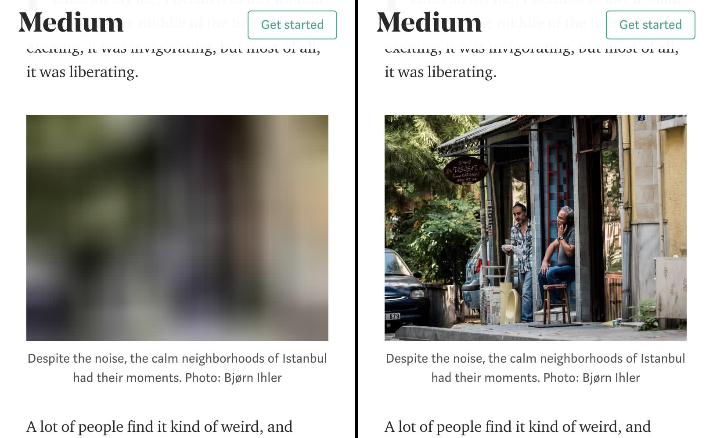

- [What is lazy-loading](#what)
- [Why lazy-load images or video?](#why)
- [Implementing lazy-loading](#implementing)
- [Libraries](#libraries)
- [What could go wrong](#wrong)

The portion of
[images](http://beta.httparchive.org/reports/state-of-images?start=earliest&end=latest)
and [video](http://beta.httparchive.org/reports/page-weight#bytesVideo) in the
typical payload of a website can be significant.
Unfortunately, project stakeholders may be unwilling to cut any media resources from their existing
applications.
Such impasses are frustrating,
especially when all parties involved want to improve site performance,
but can't agree on how to get there.
Fortunately, lazy-loading is a solution that lowers initial page payload _and_
load time, but doesn't skimp on content.

## What is lazy-loading? {: #what }

lazy-loading is a technique that defers loading of non-critical resources at page
load time. Instead, these non-critical resources are loaded at the moment of
need. Where images are concerned, "non-critical" is often synonymous with
"off-screen". If you've used Lighthouse and examined some opportunities for
improvement, you may have seen some guidance in this realm in the form of the
[Offscreen Images
audit](/web/tools/lighthouse/audits/offscreen-images):

<figure class="w-figure">
  
  <figcaption class="w-figcaption">One of Lighthouse's performance audits is to
identify off screen images, which are candidates for lazy-loading.</figcaption>
</figure>

You've probably already seen lazy-loading in action, and it goes something like
this:

- You arrive at a page, and begin to scroll as you read content.
- At some point, you scroll a placeholder image into the viewport.
- The placeholder image is suddenly replaced by the final image.

An example of image lazy-loading can be found on the popular publishing platform
[Medium](https://medium.com/), which loads lightweight placeholder images at
page load, and replaces them with lazily-loaded images as they're scrolled into
the viewport.

<figure class="w-figure">
  
  <figcaption class="w-figcaption">An example of image lazy-loading in action. A
placeholder image is loaded at page load (left), and when scrolled into the
viewport, the final image loads at the time of need.</figcaption>
</figure>

If you're unfamiliar with lazy-loading, you might be wondering just how useful
the technique is, and what its benefits are. Read on to find out!

## Why lazy-load images or video instead of just _loading_ them? {: #why }

Because it's possible you're loading stuff the user may never see. This is
problematic for a couple reasons:

- It wastes data. On unmetered connections, this isn't the worst thing that could
happen (although you could be using that precious bandwidth for downloading
other resources that are indeed going to be seen by the user). On limited data
plans, however, loading stuff the user never sees could effectively be a waste
of their money.
- It wastes processing time, battery, and other system resources. After a media
resource is downloaded, the browser must decode it and render its content in the
viewport.

When we lazy-load images and video, we reduce initial page load time, initial
page weight, and system resource usage, all of which have positive impacts on
performance.

## Implementing lazy-loading {: #implementing }

There are a number of ways to implement lazy-loading.
Your choice of solution must take into account the browsers you support,
and also what you are trying to lazy-load.
See the guides on this site, which cover different scenarios in depth.

- [Lazy-loading images](/lazy-loading-images/)
- [Lazy-loading-video](/lazy-loading-video/)

## lazy-loading libraries {: #libraries }

If you're not so concerned about _how_ lazy-loading works under the hood and just
want to pick a library and go (and there's no shame in that!), there's plenty of
options to choose from. Here are some lazy-loading libraries you may find
useful:

- [lazysizes](https://github.com/aFarkas/lazysizes) is a full-featured lazy
loading library that lazy-loads images and iframes. The pattern it uses is quite
similar to the code examples shown here in that it automatically binds to a
`lazyload` class on `` elements, and requires you to specify image URLs in
`data-src` and/or `data-srcset` attributes, the contents of which are swapped
into `src` and/or `srcset` attributes, respectively. It uses intersection
observer (which you can polyfill), and can be extended with [a number of
plugins](https://github.com/aFarkas/lazysizes#available-plugins-in-this-repo) to
do things like lazy-load video. [Find out more about using lazysizes](/use-lazysizes-to-lazyload-images/).
- [lozad.js](https://github.com/ApoorvSaxena/lozad.js) is a super lightweight
option that uses intersection observer only. As such, it's highly performant,
but will need to be polyfilled before you can use it on older browsers.
- [yall.js](https://github.com/malchata/yall.js) is a library I wrote that uses
IntersectionObserver and falls back to event handlers. It's compatible with IE11
and major browsers.
- If you're seeking a React-specific lazy-loading library, you might consider
[react-lazyload](https://github.com/jasonslyvia/react-lazyload). While it
doesn't use intersection observer, it _does_ provide a familiar method of lazy
loading images for those accustomed to developing applications with React.

Each of these lazy-loading libraries is well documented, with plenty of markup
patterns for your various lazy-loading endeavors. If you're not one to tinker,
grab a library and go. It will take the least amount of effort.

## What can go wrong {: #wrong }

While lazy-loading images and video have positive and measurable performance
benefits, it's not a task to be taken lightly. If you get it wrong, there could
be unintended consequences. As such, it's important to keep the following
concerns in mind:

### Mind the fold {: #wrong-fold }

It may be tempting to lazy-load every single media resource on the page with
JavaScript, but you need to resist this temptation. Anything resting above the
fold shouldn't be lazy-loaded. Such resources should be considered critical
assets, and thus should be loaded normally.

The primary argument for loading critical media resources the usual way in lieu
of lazy-loading is that lazy-loading delays the loading of those resources until
after the DOM is interactive when scripts have finished loading and begin
execution. For images below the fold, this is fine, but it would be faster to
load critical resources above the fold with a standard `` element.

Of course, where the fold lies is not so clear these days when websites are
viewed on so many screens of varying sizes. What lies above the fold on a laptop
may well lie _below_ it on mobile devices. There's no bulletproof advice for
addressing this optimally in every situation. You'll need to conduct an
inventory of your page's critical assets, and load those images in typical
fashion.

Additionally, you may not want to be so strict about the fold line as the
threshold for triggering lazy-loading. It may be more ideal for your purposes to
establish a buffer zone some distance below the fold so that images begin
loading well before the user scrolls them into the viewport. For example, The
intersection observer API allows you to specify a `rootMargin` property in an
options object when you create a new `IntersectionObserver` instance. This
effectively gives elements a buffer, which triggers lazy-loading behavior before
the element is in the viewport:

```javascript
let lazyImageObserver = new IntersectionObserver(function(entries, observer) {
  // lazy-loading image code goes here
}, {
  rootMargin: "0px 0px 256px 0px"
});
```

If the value for `rootMargin` looks similar to values you'd specify for a CSS
`margin` property, that's because it is! In this case, we're broadening the
bottom margin of the observing element (the browser viewport by default, but
this can be changed to a specific element using the `root` property) by 256
pixels. That means the callback function will execute when an image element is
within 256 pixels of the viewport, meaning that the image will begin to load
before the user actually sees it.

To achieve this same effect using scroll event handling code, simply adjust your
`getBoundingClientRect` check to include a buffer, and you'll get the same
effect in browsers that don't support intersection observer.

### Layout shifting and placeholders {: #wrong-layout-shifting }

lazy-loading media can cause shifting in the layout if placeholders aren't used.
These changes can be disorienting for users and trigger expensive DOM layout
operations that consume system resources and contribute to jank. At a minimum,
consider using a solid color placeholder occupying the same dimensions as the
target image, or techniques such as
[LQIP](http://www.guypo.com/introducing-lqip-low-quality-image-placeholders) or
[SQIP](https://github.com/technopagan/sqip) that hint at the content of a media
item before it loads.

For `` tags, `src` should initially point to a placeholder until that
attribute is updated with the final image URL. Use the `poster` attribute in a
`<video>` element to point to a placeholder image. Additionally, use `width` and
`height` attributes on both `` and `<video>` tags. This ensures that
transitioning from placeholders to final images won't change the rendered size
of the element as media loads.

### Image decoding delays {: #wrong-decoding-delays }

Loading large images in JavaScript and dropping them into the DOM can tie up the
main thread, causing the user interface to be unresponsive for a short period of
time while decoding occurs. [Asynchronously decoding images using the `decode`
method](https://medium.com/dailyjs/image-loading-with-image-decode-b03652e7d2d2)
prior to inserting them into the DOM can cut down on this sort of jank, but
beware: It's not available everywhere yet, and it adds complexity to lazy
loading logic. If you want to use it, you'll need to check for it. Below shows
how you might use `Image.decode()` with a fallback:

```javascript
var newImage = new Image();
newImage.src = "my-awesome-image.jpg";

if ("decode" in newImage) {
  // Fancy decoding logic
  newImage.decode().then(function() {
    imageContainer.appendChild(newImage);
  });
} else {
  // Regular image load
  imageContainer.appendChild(newImage);
}
```

Check out [this CodePen link](https://codepen.io/malchata/pen/WzeZGW) to see
code similar to this example in action. If most of your images are fairly small,
this may not do much for you, but it can certainly help cut down on jank when
lazy-loading large images and inserting them into the DOM.

### When stuff doesn't load {: #wrong-loading-failure }

Sometimes media resources will fail to load for one reason or another and errors
occur. When might this happen? It depends, but here's one hypothetical scenario
for you: You have an HTML caching policy for a short period of time (e.g., five
minutes), and the user visits the site _or_ a user has a left a stale tab open for
a long period of time (e.g., several hours) and comes back to read your content.
At some point in this process, a redeployment occurs. During this deployment, an
image resource's name changes due to hash-based versioning, or is removed
altogether. By the time the user lazy-loads the image, the resource is
unavailable, and thus fails.

While these are relatively rare occurrences, it may behoove you to have a backup
plan if lazy-loading fails. For images, such a solution may look something like
this:

```javascript
var newImage = new Image();
newImage.src = "my-awesome-image.jpg";

newImage.onerror = function(){
  // Decide what to do on error
};
newImage.onload = function(){
  // Load the image
};
```

What you decide to do in the event of an error depends on your application. For
example, you could replace the image placeholder area with a button that allows
the user to attempt to load the image again, or simply display an error message
in the image placeholder area.

Other scenarios could arise as well. Whatever you do, it's never a bad idea to
signal to the user when an error has occurred, and possibly give them an action
to take if something goes awry.

### JavaScript availability {: #wrong-no-js }

It shouldn't be assumed that JavaScript is always available. If you're going to
lazy-load images, consider offering `<noscript>` markup that will show images in
case JavaScript is unavailable. The simplest possible fallback example involves
using `<noscript>` elements to serve images if JavaScript is turned off:

```html
<!-- An image that eventually gets lazy-loaded by JavaScript -->

<!-- An image that is shown if JavaScript is turned off -->
<noscript>
  
</noscript>
```

If JavaScript is turned off, users will see _both_ the placeholder image and the
image contained with the `<noscript>` elements. To get around this, place
a class of `no-js` on the `<html>` tag like so:

```html
<html class="no-js">
```

Then place one line of inline script in the `<head>` before any style sheets
are requested via `<link>` tags that removes the `no-js` class from the `<html>`
element if JavaScript is on:

```html
<script>document.documentElement.classList.remove("no-js");</script>
```

Finally, use some CSS to hide elements with a class of lazy when
JavaScript is unavailable:

```css
.no-js .lazy {
  display: none;
}
```

This doesn't prevent placeholder images from loading, but the outcome is more
desirable. People with JavaScript turned off get something more than placeholder
images, which is better than placeholders and no meaningful image content at
all.

## Conclusion

Used with care, lazy-loading images and video can seriously lower the initial
load time and page payloads on your site. Users won't incur unnecessary network
activity and processing costs of media resources they may never see, but they
can still view those resources if they want.

As far as performance improvement techniques go, lazy-loading is reasonably
uncontroversial. If you have a lot of inline imagery in your site, it's a
perfectly fine way to cut down on unnecessary downloads. Your site's users and
project stakeholders will appreciate it!

_Special thanks to [François
Beaufort](/web/resources/contributors/beaufortfrancois), Dean Hume, [Ilya
Grigork](/web/resources/contributors/ilyagrigorik), [Paul
Irish](/web/resources/contributors/paulirish), [Addy
Osmani](/web/resources/contributors/addyosmani), [Jeff
Posnick](/web/resources/contributors/jeffposnick), and Martin Schierle for their
valuable feedback, which significantly improved the quality of this article._
