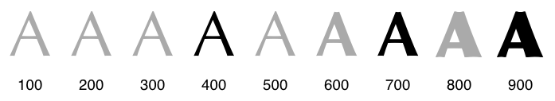

*This article contains contributions from [Monica Dinculescu](https://meowni.ca/posts/web-fonts/),
[Rob Dodson](/web/updates/2016/02/font-display), and Jeff Posnick.*

Typography is fundamental to good design, branding, readability, and accessibility.
Webfonts enable all of the above and more:
the text is selectable, searchable, zoomable, and high-DPI friendly,
providing consistent and sharp text rendering regardless of the screen size and resolution.
Webfonts are critical to good design, UX, and performance.

Webfont optimization is a critical piece of the overall performance strategy.
Each font is an additional resource, and some fonts may block rendering of the text,
but just because the page is using webfonts doesn't mean that it has to render slower.
On the contrary, optimized fonts,
combined with a judicious strategy for how they are loaded and applied on the page,
can help reduce the total page size and improve page rendering times.

## Anatomy of a webfont

A *webfont* is a collection of glyphs,
and each glyph is a vector shape that describes a letter or symbol.
As a result, two simple variables determine the size of a particular font file:
the complexity of the vector paths of each glyph and the number of glyphs in a particular font.
For example, Open Sans, which is one of the most popular webfonts,
contains 897 glyphs, which include Latin, Greek, and Cyrillic characters.


When picking a font, it's important to consider which character sets are supported.
If you need to localize your page content to multiple languages,
you should use a font that can deliver a consistent look and experience to your users.
For example, [Google's Noto font family](https://www.google.com/get/noto/) aims to support all the world's languages.
Note, however, that the total size of Noto, with all languages included, results in a 1.1GB+ ZIP download.

Clearly, using fonts on the web requires careful engineering to ensure that the typography doesn't impede performance.
Thankfully, the web platform can help,
and the rest of this guide provides a hands-on look at how to get the best of both worlds.

### Webfont formats

Today there are four font container formats in use on the web:

* [EOT](https://en.wikipedia.org/wiki/Embedded_OpenType)
* [TTF](https://en.wikipedia.org/wiki/TrueType)
* [WOFF](https://en.wikipedia.org/wiki/Web_Open_Font_Format)
* [WOFF2](https://www.w3.org/TR/WOFF2/).

[WOFF](http://caniuse.com/#feat=woff) and [Woff 2.0](http://caniuse.com/#feat=woff2) enjoy the widest support,
however for compatibility with older browsers you may need to include other formats:

* Serve WOFF 2.0 variant to browsers that support it.
* Serve WOFF variant to the majority of browsers.
* Serve TTF variant to old Android (below 4.4) browsers.
* Serve EOT variant to old IE (below IE9) browsers.


There's technically another container format, the [SVG
font container](http://caniuse.com/svg-fonts), but IE and Firefox never supported it, and it is now deprecated in Chrome. As
such, it's of limited use and it's intentionally omitted it in this guide.


### Reducing font size with compression

A font is a collection of glyphs, each of which is a set of paths describing the letter form.
The individual glyphs are different,
but they contain a lot of similar information that can be compressed with GZIP or a compatible compressor:

* EOT and TTF formats are not compressed by default. Ensure that your servers are configured to
apply [GZIP compression](/web/fundamentals/performance/optimizing-content-efficiency/optimize-encoding-and-transfer#text-compression-with-gzip)
when delivering these formats.
* WOFF has built-in compression.
Ensure that your WOFF compressor is using optimal compression settings.
* WOFF2 uses custom preprocessing and compression algorithms to deliver ~30% file-size reduction over other formats.
For more information, see [the WOFF 2.0 evaluation report](http://www.w3.org/TR/WOFF20ER/).

Finally, it's worth noting that some font formats contain additional metadata,
such as [font hinting](https://en.wikipedia.org/wiki/Font_hinting) and [kerning](https://en.wikipedia.org/wiki/Kerning)
information that may not be necessary on some platforms,
which allows for further file-size optimization.
Consult your font compressor for available optimization options,
and if you take this route, ensure that you have the appropriate infrastructure to test and deliver these optimized fonts to each browser.
For example, [Google Fonts](https://fonts.google.com/)
maintains 30+ optimized variants for each font and automatically detects and delivers the optimal variant for each platform and browser.


Consider using [Zopfli compression](http://en.wikipedia.org/wiki/Zopfli) for the EOT, TTF, and WOFF formats.
Zopfli is a zlib compatible compressor that delivers ~5% file-size reduction over gzip.


## Defining a font family with @font-face

The `@font-face` CSS at-rule allows you to define the location of a particular font resource, its
style characteristics, and the Unicode codepoints for which it should be used. A combination of such
`@font-face declarations can be used to construct a "font family," which the browser will use to
evaluate which font resources need to be downloaded and applied to the current page.

### Consider a variable font

Variable fonts can significantly reduce the filesize of your fonts in cases where you need multiple variants of a font.
Instead of needing to load the regular and bold styles plus their italic versions,
you can load a single file that contains all of the information.

Variable fonts are now supported by all modern browsers,
find out more in the [Introduction to variable fonts on the web](https://web.dev/variable-fonts/).

### Format selection

Each `@font-face` declaration provides the name of the font family, which acts as a logical group of
multiple declarations, [font properties](http://www.w3.org/TR/css3-fonts/#font-prop-desc) such as
style, weight, and stretch, and the [src descriptor](http://www.w3.org/TR/css3-fonts/#src-desc),
which specifies a prioritized list of locations for the font resource.

```css
@font-face {
  font-family: 'Awesome Font';
  font-style: normal;
  font-weight: 400;
  src: local('Awesome Font'),
        url('/fonts/awesome.woff2') format('woff2'),
        url('/fonts/awesome.woff') format('woff'),
        url('/fonts/awesome.ttf') format('truetype'),
        url('/fonts/awesome.eot') format('embedded-opentype');
}

@font-face {
  font-family: 'Awesome Font';
  font-style: italic;
  font-weight: 400;
  src: local('Awesome Font Italic'),
        url('/fonts/awesome-i.woff2') format('woff2'),
        url('/fonts/awesome-i.woff') format('woff'),
        url('/fonts/awesome-i.ttf') format('truetype'),
        url('/fonts/awesome-i.eot') format('embedded-opentype');
}
```

First, note that the above examples define a single _Awesome Font_ family with two styles
(normal and _italic_), each of which points to a different set of font resources.
In turn, each `src` descriptor contains a prioritized, comma-separated list of resource variants:

* The `local()` directive allows you to reference, load, and use locally installed fonts.
* The `url()` directive allows you to load external fonts, and are allowed to contain an optional
`format()` hint indicating the format of the font referenced by the provided URL.


Unless you're referencing one of the default system fonts,
it is rare for the user to have it locally installed,
especially on mobile devices,
where it is effectively impossible to "install" additional fonts.
You should always start with a `local()` entry "just in case," and then provide a list of `url()` entries.


When the browser determines that the font is needed,
it iterates through the provided resource list in the specified order and tries to load the appropriate resource.
For example, following the example above:

1. The browser performs page layout and determines which font variants are required to render the
specified text on the page.
1. For each required font, the browser checks if the font is available locally.
1. If the font is not available locally, the browser iterates over external definitions:
    * If a format hint is present, the browser checks if it supports the hint before initiating the
      download. If the browser doesn't support the hint, the browser advances to the next one.
    * If no format hint is present, the browser downloads the resource.

The combination of local and external directives with appropriate format hints allows you to specify
all of the available font formats and let the browser handle the rest. The browser determines which
resources are required and selects the optimal format.


The order in which the font variants are specified matters.
The browser picks the first format it supports.
Therefore, if you want the newer browsers to use WOFF2,
then you should place the WOFF2 declaration above WOFF, and so on.


### Unicode-range subsetting

In addition to font properties such as style, weight, and stretch,
the `@font-face` rule allows you to define a set of Unicode codepoints supported by each resource.
This enables you to split a large Unicode font into smaller subsets
(for example, Latin, Cyrillic, and Greek subsets)
 and only download the glyphs required to render the text on a particular page.

The [unicode-range descriptor](http://www.w3.org/TR/css3-fonts/#descdef-unicode-range) allows you to
specify a comma-delimited list of range values, each of which can be in one of three different
forms:

* Single codepoint (for example, `U+416`)
* Interval range (for example, `U+400-4ff`): indicates the start and end codepoints of a range
* Wildcard range (for example, `U+4??`): `?` characters indicate any hexadecimal digit

For example, you can split your _Awesome Font_ family into Latin and Japanese
subsets, each of which the browser downloads on an as-needed basis:

```css
@font-face {
  font-family: 'Awesome Font';
  font-style: normal;
  font-weight: 400;
  src: local('Awesome Font'),
        url('/fonts/awesome-l.woff2') format('woff2'),
        url('/fonts/awesome-l.woff') format('woff'),
        url('/fonts/awesome-l.ttf') format('truetype'),
        url('/fonts/awesome-l.eot') format('embedded-opentype');
  unicode-range: U+000-5FF; /* Latin glyphs */
}

@font-face {
  font-family: 'Awesome Font';
  font-style: normal;
  font-weight: 400;
  src: local('Awesome Font'),
        url('/fonts/awesome-jp.woff2') format('woff2'),
        url('/fonts/awesome-jp.woff') format('woff'),
        url('/fonts/awesome-jp.ttf') format('truetype'),
        url('/fonts/awesome-jp.eot') format('embedded-opentype');
  unicode-range: U+3000-9FFF, U+ff??; /* Japanese glyphs */
}
```


Unicode-range subsetting is particularly important for Asian languages, where the number of
glyphs is much larger than in Western languages and a typical "full" font is often measured in
megabytes instead of tens of kilobytes.


The use of Unicode range subsets and separate files for each stylistic variant of the font allows
you to define a composite font family that is both faster and more efficient to download. Visitors
only download the variants and subsets they need, and they aren't forced to download subsets that
they may never see or use on the page.

Most browsers [now support unicode-range](http://caniuse.com/#feat=font-unicode-range).
For compatibility with older browsers you may need to fall back to "manual subsetting".
In this case you have to fall back to providing a single font resource
that contains all the necessary subsets and hide the rest from the browser.
For example, if the page is only using Latin characters,
then you can strip other glyphs and serve that particular subset as a standalone resource.

1. **How do you determine which subsets are needed?**
    * If the browser supports unicode-range subsetting,
    then it will automatically select the right subset.
    The page just needs to provide the subset files and specify appropriate unicode-ranges in the `@font-face` rules.
    * If the browser doesn't support unicode-range subsetting,
      then the page needs to hide all unnecessary subsets;
      that is, the developer must specify the required subsets.
1. **How do you generate font subsets?**
    - Use the open-source [pyftsubset tool](https://github.com/behdad/fonttools/) to subset and optimize your fonts.
    - Some font services allow manual subsetting via custom query parameters,
    which you can use to manually specify the required subset for your page.
    Consult the documentation from your font provider.

### Font selection and synthesis

Each font family is composed of multiple stylistic variants
(regular, bold, italic) and multiple weights for each style,
each of which, in turn, may contain very different glyph shapes—for example,
different spacing, sizing, or a different shape altogether.



For example, the above diagram illustrates a font family that offers three different bold weights:
400 (regular), 700 (bold), and 900 (extra bold).
All other in-between variants (indicated in gray) are automatically mapped to the closest variant by the browser.

<blockquote>
  <p>When a weight is specified for which no face exists,
a face with a nearby weight is used.
In general, bold weights map to faces with heavier weights and light weights map to faces with lighter weights.</p>
<cite><a href="http://www.w3.org/TR/css3-fonts/#font-matching-algorithm">CSS font matching algorithm</a></cite>
</blockquote>

Similar logic applies to _italic_ variants.
The font designer controls which variants they will produce,
and you control which variants you'll use on the page.
Because each variant is a separate download, it's a good idea to keep the number of variants small.
For example, you can define two bold variants for the _Awesome Font_ family:

```css
@font-face {
  font-family: 'Awesome Font';
  font-style: normal;
  font-weight: 400;
  src: local('Awesome Font'),
        url('/fonts/awesome-l.woff2') format('woff2'),
        url('/fonts/awesome-l.woff') format('woff'),
        url('/fonts/awesome-l.ttf') format('truetype'),
        url('/fonts/awesome-l.eot') format('embedded-opentype');
  unicode-range: U+000-5FF; /* Latin glyphs */
}

@font-face {
  font-family: 'Awesome Font';
  font-style: normal;
  font-weight: 700;
  src: local('Awesome Font'),
        url('/fonts/awesome-l-700.woff2') format('woff2'),
        url('/fonts/awesome-l-700.woff') format('woff'),
        url('/fonts/awesome-l-700.ttf') format('truetype'),
        url('/fonts/awesome-l-700.eot') format('embedded-opentype');
  unicode-range: U+000-5FF; /* Latin glyphs */
}
```

The above example declares the _Awesome Font_ family
that is composed of two resources that cover the same set of Latin glyphs (`U+000-5FF`)
but offer two different "weights": normal (400) and bold (700).
However, what happens if one of your CSS rules specifies a different font weight,
or sets the font-style property to italic?

- If an exact font match isn't available, the browser substitutes the closest match.
- If no stylistic match is found (for example, no italic variants were declared in the example above),
then the browser synthesizes its own font variant.



Be aware that synthesized approaches may not be suitable for scripts like Cyrillic,
where italic forms are very different in shape.
For proper fidelity in those scripts, use an actual italic font.


The example above illustrates the difference between the actual vs. synthesized font results for Open Sans.
All synthesized variants are generated from a single 400-weight font.
As you can see, there's a noticeable difference in the results.
The details of how to generate the bold and oblique variants are not specified.
Therefore, the results vary from browser to browser, and are highly dependent on the font.


For best consistency and visual results, don't rely on font synthesis.
Instead, minimize the number of used font variants and specify their locations,
such that the browser can download them when they are used on the page.
Or, choose to use a variable font.
That said, in some cases a synthesized variant [may be a viable option](https://www.igvita.com/2014/09/16/optimizing-webfont-selection-and-synthesis/),
but be cautious in using synthesized variants.


## Optimizing loading and rendering

A "full" webfont that includes all stylistic variants,
which you may not need, plus all the glyphs, which may go unused,
can easily result in a multi-megabyte download.
To address this, the `@font-face` CSS rule is specifically designed
to allow you to split the font family into a collection of resources:
unicode subsets, distinct style variants, and so on.

Given these declarations,
the browser figures out the required subsets and variants and downloads the minimal set required to render the text, which is very convenient.
However, if you're not careful,
it can also create a performance bottleneck in the critical rendering path and delay text rendering.

### The default behavior

Lazy loading of fonts carries an important hidden implication that may delay text rendering:
the browser must [construct the render tree](https://developers.google.com/web/fundamentals/performance/critical-rendering-path/render-tree-construction),
which is dependent on the DOM and CSSOM trees,
before it knows which font resources it needs in order to render the text.
As a result, font requests are delayed well after other critical resources,
and the browser may be blocked from rendering text until the resource is fetched.


1. The browser requests the HTML document.
1. The browser begins parsing the HTML response and constructing the DOM.
1. The browser discovers CSS, JS, and other resources and dispatches requests.
1. The browser constructs the CSSOM after all of the CSS content is received and combines it with
the DOM tree to construct the render tree.
    - Font requests are dispatched after the render tree indicates which font variants are needed to
    render the specified text on the page.
1. The browser performs layout and paints content to the screen.
    - If the font is not yet available, the browser may not render any text pixels.
    - After the font is available, the browser paints the text pixels.

The "race" between the first paint of page content,
which can be done shortly after the render tree is built,
and the request for the font resource is what creates the "blank text problem"
where the browser might render page layout but omits any text.

There are a number of options for customizing this default behavior.

### Preload your Webfont resources

If there's a high probability that your page will need a specific Webfont hosted at a URL you know in advance,
you can take advantage of a new web platform feature: [`<link rel="preload">`](https://developers.google.com/web/fundamentals/performance/resource-prioritization).

It allows you to include an element in your HTML,
usually as part of the `<head>`,
that will trigger a request for the Webfont early in the critical rendering path,
without having to wait for the CSSOM to be created.

`<link rel="preload">` serves as a "hint" to the browser that a given resource is going to be needed soon,
but it doesn't tell the browser *how* to use it.
You need to use preload in conjunction with an appropriate CSS `@font-face` definition in order to instruct the browser what do to with a given Webfont URL.

```html
<head>
  <!-- Other tags... -->
  <link rel="preload" href="/fonts/awesome-l.woff2" as="font">
</head>
```

```css
@font-face {
  font-family: 'Awesome Font';
  font-style: normal;
  font-weight: 400;
  src: local('Awesome Font'),
       url('/fonts/awesome-l.woff2') format('woff2'), /* will be preloaded */
       url('/fonts/awesome-l.woff') format('woff'),
       url('/fonts/awesome-l.ttf') format('truetype'),
       url('/fonts/awesome-l.eot') format('embedded-opentype');
  unicode-range: U+000-5FF; /* Latin glyphs */
}
```

### Customize the text rendering delay

While preloading makes it more likely that a Webfont will be available when a page's content is rendered,
it offers no guarantees.
You still need to consider how browsers behave when rendering text that uses a `font-family` which is not yet available.

The "race" between the first paint of page content,
which can be done shortly after the render tree is built,
and the request for the font resource is what creates the "blank text problem" where the browser might render page layout but omits any text.
Most browsers implement a maximum timeout that they'll wait for a Webfont to download,
after which a fallback font will be used. Unfortunately, browsers differ on implementation:

<div class="w-table-wrapper">
  <table>
    <thead>
      <tr>
        <th data-th="Browser">Browser</th>
        <th data-th="Timeout">Timeout</th>
        <th data-th="Fallback">Fallback</th>
        <th data-th="Swap">Swap</th>
      </tr>
    </thead>
    <tbody>
      <tr>
        <td data-th="Browser">
          <strong>Chrome 35+</strong>
        </td>
        <td data-th="Timeout">
          3 seconds
        </td>
        <td data-th="Fallback">
          Yes
        </td>
        <td data-th="Swap">
          Yes
        </td>
      </tr>
      <tr>
        <td data-th="Browser">
          <strong>Opera</strong>
        </td>
        <td data-th="Timeout">
          3 seconds
        </td>
        <td data-th="Fallback">
          Yes
        </td>
        <td data-th="Swap">
          Yes
        </td>
      </tr>
      <tr>
        <td data-th="Browser">
          <strong>Firefox</strong>
        </td>
        <td data-th="Timeout">
          3 seconds
        </td>
        <td data-th="Fallback">
          Yes
        </td>
        <td data-th="Swap">
          Yes
        </td>
      </tr>
      <tr>
        <td data-th="Browser">
          <strong>Internet Explorer</strong>
        </td>
        <td data-th="Timeout">
          0 seconds
        </td>
        <td data-th="Fallback">
          Yes
        </td>
        <td data-th="Swap">
          Yes
        </td>
      </tr>
      <tr>
        <td data-th="Browser">
          <strong>Safari</strong>
        </td>
        <td data-th="Timeout">
          No timeout
        </td>
        <td data-th="Fallback">
          N/A
        </td>
        <td data-th="Swap">
          N/A
        </td>
      </tr>
    </tbody>
  </table>
</div>

- Chrome and Firefox have a three second timeout after which the text is shown with the fallback font.
If the font manages to download, then eventually a swap occurs and the text is re-rendered with the intended font.
- Internet Explorer has a zero second timeout which results in immediate text rendering.
If the requested font is not yet available, a fallback is used, and text is re-rendered later once the requested font becomes available.
- Safari has no timeout behavior (or at least nothing beyond a baseline network timeout).

#### Using `font-display` to control this behavior

You can use the `@font-face` descriptor,
[`font-display`](https://developer.mozilla.org/en-US/docs/Web/CSS/@font-face/font-display),
and a corresponding property for controlling how a downloadable font renders before it is loaded.

Similar to the existing font timeout behaviors that some browsers implement,
`font-display` segments the lifetime of a font download into three major periods:

1. The first period is the **font block period**.
During this period, if the font face is not loaded,
any element attempting to use it must instead render with an invisible fallback font face.
If the font face successfully loads during the block period, the font face is then used normally.
2. The **font swap period** occurs immediately after the font block period.
During this period, if the font face is not loaded,
any element attempting to use it must instead render with a fallback font face.
If the font face successfully loads during the swap period, the font face is then used normally.
3. The **font failure period** occurs immediately after the font swap period.
If the font face is not yet loaded when this period starts,
it’s marked as a failed load, causing normal font fallback.
Otherwise, the font face is used normally.

Understanding these periods means you can use `font-display` to decide how your
font should render depending on whether or when it was downloaded.

To work with the `font-display` property, add it your `@font-face` rules:

```css
@font-face {
  font-family: 'Awesome Font';
  font-style: normal;
  font-weight: 400;
  font-display: auto; /* or block, swap, fallback, optional */
  src: local('Awesome Font'),
       url('/fonts/awesome-l.woff2') format('woff2'), /* will be preloaded */
       url('/fonts/awesome-l.woff') format('woff'),
       url('/fonts/awesome-l.ttf') format('truetype'),
       url('/fonts/awesome-l.eot') format('embedded-opentype');
  unicode-range: U+000-5FF; /* Latin glyphs */
}
```

`font-display` currently supports the following range of values:
`auto | block | swap | fallback | optional`.

For more information on preloading fonts, and the `font-display` property, see the following posts:

- [Avoid invisible text during font loading](https://web.dev/avoid-invisible-text/)
- [Controlling font performance using font-display](https://developers.google.com/web/updates/2016/02/font-display)
- [Prevent layout shifting and flashes of invisibile text (FOIT) by preloading optional fonts](https://web.dev/preload-optional-fonts/)

### The Font Loading API

Used together, `<link rel="preload">` and the CSS `font-display` give you a great deal of control over font loading and rendering,
without adding in much overhead.
But if you need additional customizations,
and are willing to incur with the overhead introduced by running JavaScript, there is another option.

The [Font Loading API](https://www.w3.org/TR/css-font-loading/) provides a scripting interface to define and manipulate CSS font faces,
track their download progress, and override their default lazyload behavior.
For example, if you're sure that a particular font variant is required,
you can define it and tell the browser to initiate an immediate fetch of the font resource:

```javascript
var font = new FontFace("Awesome Font", "url(/fonts/awesome.woff2)", {
  style: 'normal', unicodeRange: 'U+000-5FF', weight: '400'
});

// don't wait for the render tree, initiate an immediate fetch!
font.load().then(function() {
  // apply the font (which may re-render text and cause a page reflow)
  // after the font has finished downloading
  document.fonts.add(font);
  document.body.style.fontFamily = "Awesome Font, serif";

  // OR... by default the content is hidden,
  // and it's rendered after the font is available
  var content = document.getElementById("content");
  content.style.visibility = "visible";

  // OR... apply your own render strategy here...
});
```

Further, because you can check the font status
(via the [check()](https://www.w3.org/TR/css-font-loading/#font-face-set-check)) method
and track its download progress,
you can also define a custom strategy for rendering text on your pages:

- You can hold all text rendering until the font is available.
- You can implement a custom timeout for each font.
- You can use the fallback font to unblock rendering and inject a new style that uses the desired
font after the font is available.

Best of all, you can also mix and match the above strategies for different content on the page.
For example, you can delay text rendering on some sections until the font is available,
use a fallback font, and then re-render after the font download has finished,
specify different timeouts, and so on.


The Font Loading API is [not available in older browsers](http://caniuse.com/#feat=font-loading).
Consider using the [FontLoader polyfill](https://github.com/bramstein/fontloader) or the
[webfontloader library](https://github.com/typekit/webfontloader) to deliver similar functionality,
albeit with even more overhead from an additional JavaScript dependency.


### Proper caching is a must

Font resources are, typically, static resources that don't see frequent updates.
As a result, they are ideally suited for a long max-age expiry&mdash;
ensure that you specify both a [conditional ETag header](https://developers.google.com/web/fundamentals/performance/optimizing-content-efficiency/http-caching#validating-cached-responses-with-etags),
and an [optimal Cache-Control policy](https://developers.google.com/web/fundamentals/performance/optimizing-content-efficiency/http-caching#cache-control) for all font resources.

If your web application uses a [service worker](https://developers.google.com/web/fundamentals/primers/service-workers/),
serving font resources with a [cache-first strategy](/web/fundamentals/instant-and-offline/offline-cookbook/#cache-then-network) is appropriate for most use cases.

You should not store fonts using [`localStorage`](https://developer.mozilla.org/en-US/docs/Web/API/Window/localStorage)
or [IndexedDB](https://developer.mozilla.org/en-US/docs/Web/API/IndexedDB_API);
each of those has its own set of performance issues.
The browser's HTTP cache provides the best and most robust mechanism to deliver font resources to the browser.

## Optimization checklist

Contrary to popular belief,
the use of webfonts doesn't need to delay page rendering or have a negative impact on other performance metrics.
The well-optimized use of fonts can deliver a much better overall user experience:
great branding, improved readability, usability, and searchability,
all while delivering a scalable multi-resolution solution that adapts well to all screen formats and resolutions.
Don't be afraid to use webfonts.

That said, a naive implementation may incur large downloads and unnecessary delays.
You need to help the browser by optimizing the font assets themselves and how they are fetched and used on your pages.

- **Audit and monitor your font use:** don't use too many fonts on your pages, and, for each font,
minimize the number of used variants. This helps produce a more consistent and a faster experience
for your users.
- **Subset your font resources:** many fonts can be subset, or split into multiple unicode-ranges to
deliver just the glyphs that a particular page requires. This reduces the file size and improves the
download speed of the resource. However, when defining the subsets, be careful to optimize for font
re-use. For example, don't download a different but overlapping set of characters on each page. A
good practice is to subset based on script: for example, Latin, Cyrillic, and so on.
- **Deliver optimized font formats to each browser:** provide each font in WOFF2, WOFF, EOT, and TTF
formats. Make sure to apply GZIP compression to the EOT and TTF formats, because they are not
compressed by default.
- **Give precedence to `local()` in your `src` list:** listing `local('Font Name')` first in your
`src` list ensures that HTTP requests aren't made for fonts that are already installed.
- **Customize font loading and rendering using `<link rel="preload">`, `font-display`, or the Font
Loading API:** default lazyloading behavior may result in delayed text rendering. These web platform
features allow you to override this behavior for particular fonts, and to specify custom rendering
and timeout strategies for different content on the page.
- **Specify revalidation and optimal caching policies:** fonts are static resources that are
infrequently updated. Make sure that your servers provide a long-lived max-age timestamp and a
revalidation token to allow for efficient font reuse between different pages. If using a service
worker, a cache-first strategy is appropriate.

## Automated testing for web font optimization with Lighthouse

[Lighthouse](https://developers.google.com/web/tools/lighthouse)
can help automate the process of making sure that you're following web font optimization best practices.

The following audits can help you make sure that your pages are continuing to follow web font optimization best practices over time:

* [Enable text compression](https://web.dev/uses-text-compression/)
* [Preload key requests](https://web.dev/uses-rel-preload/)
* [Uses inefficient cache policy on static assets](https://web.dev/uses-long-cache-ttl/)
* [All text remains visible during webfont loads](https://web.dev/font-display/)

