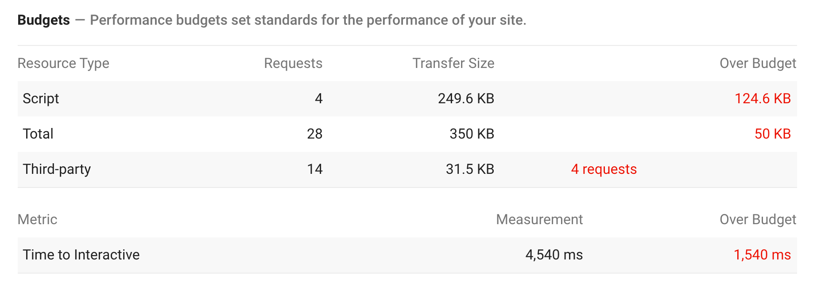

[Lighthouse](https://github.com/GoogleChrome/lighthouse) now supports performance budgets. This feature, [LightWallet](https://developers.google.com/web/tools/lighthouse/audits/budgets), can be set up in under five minutes and provides feedback on the size and quantity of page resources.

## Install Lighthouse

LightWallet is available in the command line version of Lighthouse v5+.

To get started, install Lighthouse:

```bash
npm install -g lighthouse
```

## Create a Budget

Create a file named `budget.json`. In this file add the following JSON:

```json
[
  {
    "resourceSizes": [
      {
        "resourceType": "script",
        "budget": 125
      },
      {
        "resourceType": "total",
        "budget": 300
      }
    ],
    "resourceCounts": [
      {
        "resourceType": "third-party",
        "budget": 10
      }
    ]
  }
]
```

This example `budget.json` file sets three separate budgets:

* A budget of 125 KB for the total amount of JavaScript on the page.
* A budget of 300 KB for the overall size of the page.
* A budget of 10 requests for the numer of requests made to third-party origins.

You can set budgets for any of the following resource types: `document`, `font`, `image`, `media`, `other`,`script`, `stylesheet`, `third-party`, and `total`.


## Run Lighthouse

Run Lighthouse using the `--budget-path` flag. This flag tells Lighthouse the location of your budget file.

```bash
lighthouse https://example.com --budget-path=./budget.json
```


**Note**: A budget file does not have to be named `budget.json`.


## View the Results

If LightWallet has been configured correctly, the Lighthouse report will contain a **Budgets** section within the **Performance** category.



In the JSON version of the Lighthouse report, Lightwallet results can be found within the audit findings for the `performance-budget` audit.
