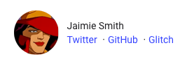

## Add yourself to the contributors list
1. Add a new object to [`contributors.json`](https://github.com/GoogleChrome/web.dev/blob/master/src/site/_data/contributors.json) with the following structure. Make sure to choose a unique contributor slug.

    ```json
    "contributorslug": {
      "name": {
        "given": "Jaimie",
        "family": "Smith"
      }
    },
    ```

1. If you want links to your online accounts to appear in your contributor lockup, add any of these members to your contributor object.

    ```json/5-7
    "jaimiesmith": {
      "name": {
        "given": "Jaimie",
        "family": "Smith"
      },
      "twitter": "jaimiesmith",
      "github": "jaimiesmith",
      "glitch": "jaimiesmith"
    },
    ```

    <figure class="w-figure">
      
    </figure>

1. You can also add supplemental info, but it's not currently displayed on web.dev.

    ```json/8-16
    "jaimiesmith": {
      "name": {
        "given": "Jaimie",
        "family": "Smith"
      },
      "twitter": "jaimiesmith",
      "github": "jaimiesmith",
      "glitch": "jaimiesmith",
      "org": {
        "name": "Google",
        "unit": "Developer Relations"
      },
      "country": "US",
      "homepage": "https://jaimiesmithis.cool/",
      "description": {
        "en": "Jaimie is more than meets the eye"
      }
    },
    ```

## Create a profile image
1. Select a photo of yourself that clearly shows your face and upper shoulders.
1. Save two versions of the photo in `/images/authors`:
    * yourauthorslug.jpg (96 px x 96 px)
    * yourauthorslug@2x.jpg (192 px x 192 px)
