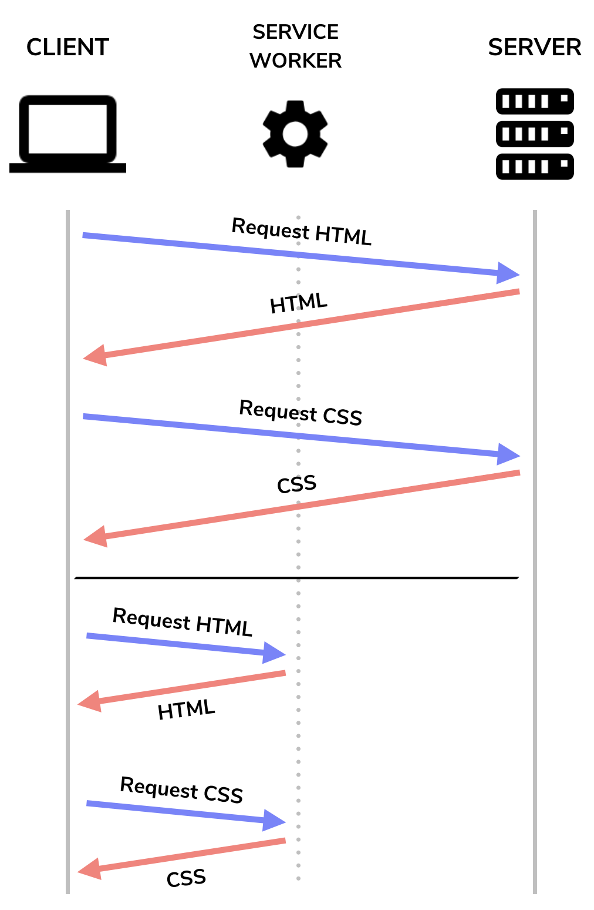
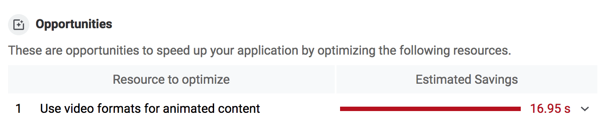
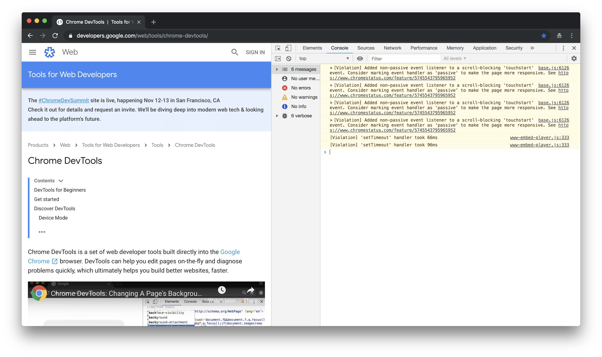

This post is about how to format and store images on web.dev. For guidance about how to select or create images to support your writing goals, see the [Use images and video effectively](/handbook/use-media) post.

## All images
Images that appear in a post should live in the same directory as the post's `index.md` file.

Use lossless images whenever possible. They'll be optimized automatically at build time.

Make sure images are [accessible](/handbook/inclusion-and-accessibility#use-inclusive-images).

## Hero images
Hero images should be 1600 px x 800 px.

Adjust hero image positioning using the [`hero_position`](/handbook/markup-post-codelab/#set-up-the-yaml) field in the YAML at the start of the post's Markdown file.

## Thumbnail images
When a post is displayed on the home page or the blog it can contain a thumbnail.

Thumbnails should be 376 px x 240 px.

If you don't provide a thumbnail, the post will attempt to reuse the hero image.
If there is no hero image, the post will omit the thumbnail entirely.

## Body images
Images intended to fill the full width of the content column should be at least 800 px wide.

Use Markdown syntax for standard standalone images:

```markdown

```

Use a `<figure>` tag when you need a caption or you need special presentation (e.g., for screenshots):

```html
<figure class="w-figure">
  
  <figcaption class="w-figcaption">A standard image.</figcaption>
</figure>
```

<figure class="w-figure">
  
  <figcaption class="w-figcaption">A standard image.</figcaption>
</figure>

### Styling body images
To make an image extend slightly beyond the width of the content column (for emphasis), add the `w-figure--fullbleed` class to the `figure` element and the `w-figcaption--fullbleed` class to the `figcaption` element:

<figure class="w-figure w-figure--fullbleed">
  
  <figcaption class="w-figcaption w-figcaption--fullbleed">
    A full-bleed image.
  </figcaption>
</figure>

To keep an image from growing beyond a specified size, add the `w-figure--center` class to the `figure` element and add an inline `max-width` style to the `img` element:

<figure class="w-figure w-figure--center">
  
  <figcaption class="w-figcaption">
    A small, centered image.
    </figcaption>
</figure>

To place an image inline with text, add the `w-figure--inline-left` or `w-figure--inline-right` class to the `figure` element, depending on what alignment you want:

<blockquote>
  <figure class="w-figure w-figure--inline-left">
    
    <figcaption class="w-figcaption">
      A left-aligned inline image.
    </figcaption>
  </figure>
  <p>
    Lorem ipsum dolor sit amet, consectetur adipiscing elit. Proin dictum a massa sit amet ullamcorper. Suspendisse auctor ultrices ante, nec tempus nibh varius at. Cras ligula lacus, porta vitae maximus a, ultrices a mauris. Vestibulum porta dolor erat, vel molestie dolor posuere in. Nam vel elementum augue. Nam quis enim blandit, posuere justo dignissim, scelerisque diam. Fusce aliquet urna ac blandit ullamcorper. Proin et semper nibh, sit amet imperdiet velit. Morbi at quam sem. Lorem ipsum dolor sit amet, consectetur adipiscing elit. Proin dictum a massa sit amet ullamcorper. Suspendisse auctor ultrices ante, nec tempus nibh varius at. Cras ligula lacus, porta vitae maximus a, ultrices a mauris. Vestibulum porta dolor erat, vel molestie dolor posuere in. Nam vel elementum augue. Nam quis enim blandit, posuere justo dignissim, scelerisque diam. Fusce aliquet urna ac blandit ullamcorper. Proin et semper nibh, sit amet imperdiet velit. Morbi at quam sem.
  </p>
</blockquote>

To include a part of a screenshot, add the `w-screenshot` class to the `img` element:

<figure class="w-figure">
  
  <figcaption class="w-figcaption">
    A partial screenshot.
  </figcaption>
</figure>

To include an entire screenshot, add the `w-screenshot-filled` class to the `img` element:

<figure class="w-figure">
  
  <figcaption class="w-figcaption">
    A full screenshot.
  </figcaption>
</figure>


## Screenshots
To take a screenshot on Windows:
1. Check out Microsoft's [Use Snipping Tool to capture screenshots](https://support.microsoft.com/en-us/help/13776/windows-use-snipping-tool-to-capture-screenshots) page.
1. In the Snipping Tool, use the pen to add a red box around any highlighted areas.
1. Click **Save Snip** and choose the desired options.

To take a screenshot on Mac:
1. Check out Apple's [How to take a screenshot on your Mac](https://support.apple.com/en-us/HT201361) page.
1. In Mac Preview, indicate any highlighted areas by adding a red box with borders set to the medium thickness.
1. Close Mac Preview. The screenshot image will appear on your desktop.

## Video

### Video hosted on YouTube
To embed a YouTube video, use the web.dev `YouTube` [component](/handbook/web-dev-components).

### Video hosted on web.dev
Always use video, not animated GIFs. (Check out the [Replace animated GIFs with video for faster page loads](/replace-gifs-with-videos/) post to learn how to use [FFmpeg](https://www.ffmpeg.org/) to convert GIFs to video.)

Once you have a video ready, message your content reviewer, and they'll help you upload it to the web.dev Google Cloud Storage bucket.

Embed the video in your post or codelab by following this example:
```html
  <figure class="w-figure">
    <video controls autoplay loop muted class="w-screenshot">
      <source src="https://storage.googleapis.com/web-dev-assets/portals_vp9.webm" type="video/webm; codecs=vp8">
      <source src="https://storage.googleapis.com/web-dev-assets/portals_h264.mp4" type="video/mp4; codecs=h264">
    </video>
   <figcaption class="w-figcaption">
      Seamless embeds and navigation with Portals. Created by <a href="https://twitter.com/argyleink">Adam Argyle</a>.
    </figcaption>
  </figure>
```
<figure class="w-figure">
  <video controls autoplay loop muted class="w-screenshot">
    <source src="https://storage.googleapis.com/web-dev-assets/portals_vp9.webm" type="video/webm; codecs=vp8">
    <source src="https://storage.googleapis.com/web-dev-assets/portals_h264.mp4" type="video/mp4; codecs=h264">
  </video>
 <figcaption class="w-figcaption">
    Seamless embeds and navigation with Portals. Created by <a href="https://twitter.com/argyleink">Adam Argyle</a>.
  </figcaption>
</figure>

### Full-bleed video
If you want any video to be full-bleed, put it in a `figure` element with the `w-figure--fullbleed` class. (Make sure to add the `w-figcaption--fullbleed` class to the `figcaption` element if you have one.)
