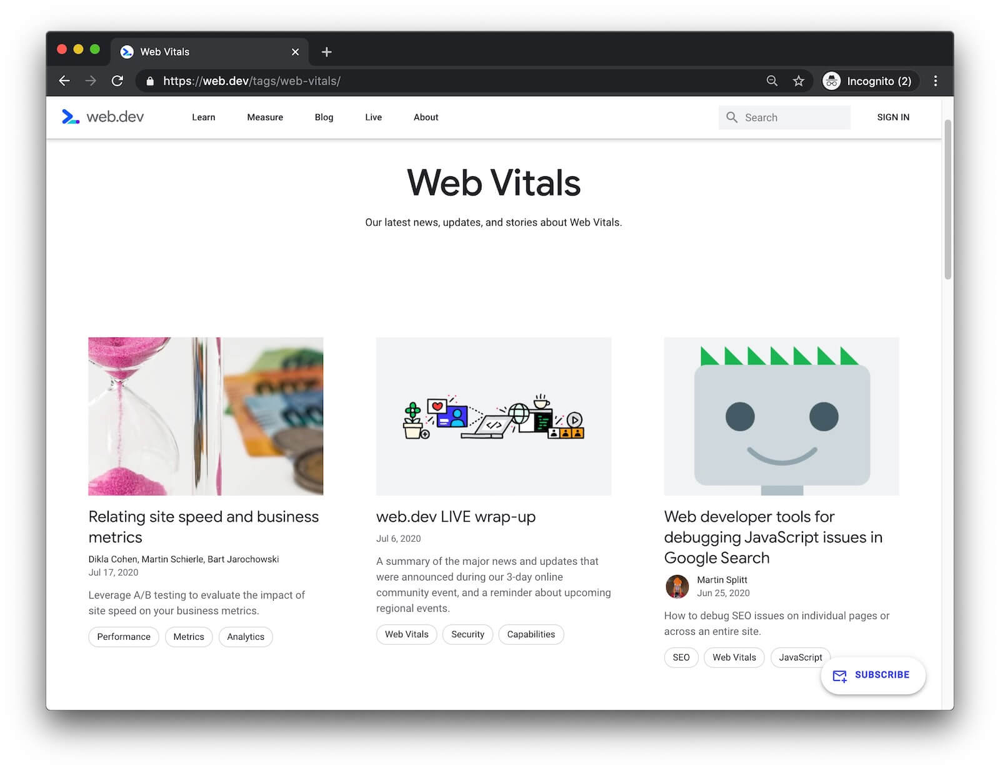
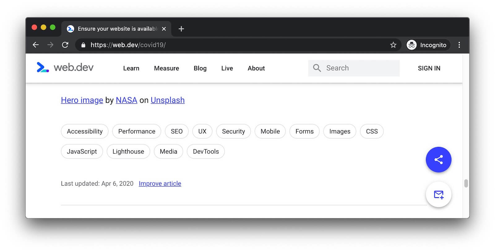

Tags help web.dev users find all of our content related to a topic.
For example, all of our Web Vitals content is available under
the [Web Vitals tags page](/tags/web-vitals/):

<figure class="w-figure">
  
</figure>

Tags show up in a few places across the site.
The first three tags of a page are shown on the [blog homepage](/blog):

<figure class="w-figure">
  
  <figcaption class="w-figcaption">
    The human interface devices page is tagged with <code>Capabilities</code> and
    <code>Games</code>, the streaming requests page is tagged with <code>Network</code>
    and <code>Service Worker</code>, and so on.
  </figcaption>
</figure>

A page's full list of tags is shown at the bottom of its main content:

<figure class="w-figure">
  
</figure>

## Add tags to a page {: #add-tags }

Add a `tags` sequence to your YAML front matter.

```yaml/11-13
---
layout: post
title: Use lazy-loading to improve loading speed
authors:
  - jeremywagner
  - rachelandrew
date: 2019-08-16
updated: 2020-06-09
description: |
  This post explains lazy-loading and why you might want to
  lazy-load elements on your site.
tags:
  - performance
  - images
---
```

## Supported keywords {: #supported-keywords }

Make sure tags added to the page are listed in 
[`tagsData.json`](https://github.com/GoogleChrome/web.dev/blob/master/src/site/_data/tagsData.json).
