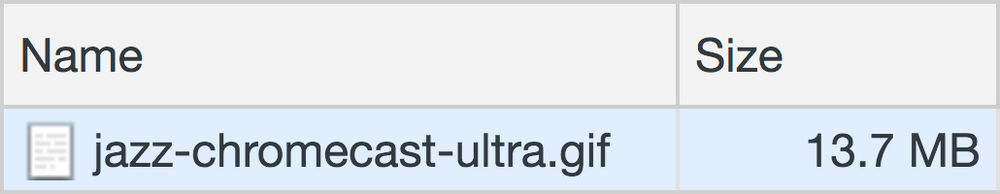

The web.dev platform includes various components to make it easy for content
contributors to include common content features, like videos, side-by-side
comparisons, and asides.

This post shows sample markup for each of web.dev's content components and provides
guidance about how to use them effectively.

## Component types

1. [Asides](#asides)
1. [Banners](#banners)
1. [Block quotes](#blockquotes)
1. [Buttons](#buttons)
1. [Callouts](#callouts)
1. [Checkbox](#checkbox)
1. [Codepen](#codepen)
1. [Columns](#columns)
1. [Code](#code)
1. [Compare](#compare)
1. [Definition lists](#definition-lists)
1. [Details](#details)
1. [Glitches](#glitches)
1. [Images](#images)
1. [Instructions](#instructions)
1. [Labels](#labels)
1. [Lists](#lists)
1. [Stats](#stats)
1. [Tables](#tables)
1. [Tooltips](#tooltips)
1. [Video](#video)

## Asides
Use asides to provide information that's related to but distinct from the
content in the body of the post or codelab. Asides should generally be short—no
more than 2–3 lines.

Asides can contain links and formatted text, including code.

There are several kinds of asides, each for a different purpose.

### Note asides

```text
&#123;% Aside %&#125;
Use the note aside to provide supplemental information.
&#123;% endAside %&#125;
```


Use the note aside to provide supplemental information.


### Caution asides

```text
&#123;% Aside 'caution' %&#125;
Use the caution aside to indicate a potential pitfall or complication.
&#123;% endAside %&#125;
```


Use the caution aside to indicate a potential pitfall or complication.


### Warning asides

```text
&#123;% Aside 'warning' %&#125;
The warning aside is stronger than a caution aside; use it to tell the reader
not to do something.
&#123;% endAside %&#125;
```


The warning aside is stronger than a caution aside; use it to tell the reader
not to do something.


### Success asides

```text
&#123;% Aside 'success' %&#125;
Use the success aside to describe a successful action or an error-free status.
&#123;% endAside %&#125;
```


Use the success aside to describe a successful action or an error-free status.


### Objective asides

```text
&#123;% Aside 'objective' %&#125;
Use the objective aside to define the goal of a process described in the body
copy.
&#123;% endAside %&#125;
```


Use the objective aside to define the goal of a process described in the body
copy.


### Gotcha asides

```text
&#123;% Aside 'gotchas' %&#125;
Use the gotcha aside to indicate a common problem that the reader wouldn't know
without specialized knowledge of the topic.
&#123;% endAside %&#125;
```


Use the gotcha aside to indicate a common problem that the reader wouldn't know
without specialized knowledge of the topic.


### Key-term asides

```text
&#123;% Aside 'key-term' %&#125;
Use the key-term aside to define a term that's essential to understanding an
idea in the body copy. Key-term asides should be a single sentence that
includes the term in italics. For example, "A _portal_ is…"
&#123;% endAside %&#125;
```


Use the key-term aside to define a term that's essential to understanding an
idea in the body copy. Key-term asides should be a single sentence that
includes the term in italics. For example, "A _portal_ is…"


### Codelab asides

```text
&#123;% Aside 'codelab' %&#125;
Use the codelab aside to link to an associated codelab.
&#123;% endAside %&#125;
```


  [Using Imagemin with Grunt](#)


## Banners

### Default banners

Default banners can be added to site templates (for example, landing pages)
to provide timely information to users (for example, an alert about an
upcoming conference).
Don't use default banners in the body of a post;
instead, use the body variant, below.

```text
This is an info banner. It supports Markdown.
```

This is an info banner. It supports Markdown.

```text
This is a caution banner. It supports Markdown.
```

This is a caution banner. It supports Markdown.

```text
This is a warning banner. It supports Markdown.
```

This is a warning banner. It supports Markdown.

```text
This is a neutral banner, used to display a discreet suggestion for the user. It supports Markdown.
```

This is a neutral banner. It supports Markdown.

### Body banners

```text
This is an info banner that's used in the body of a post. It has less padding and larger text.
```

This is an info banner that's used in the body of a post. It has less padding and larger text.

## Block quotes
Use block quotes to emphasize a quotation that's important to
the main idea of a post. (For example, in a case study you might include
a quotation from someone on the partner organization's management team.)

Always include a `<cite>` element indicating the quote's source
at the end of a block quote:

```html
<blockquote>
  <p>
    Lorem ipsum dolor sit amet, consectetur adipiscing elit.
    Proin dictum a massa sit amet ullamcorper.
  </p>
  <cite>
    Jon Doe
  </cite>
</blockquote>
```

```html

[Lorem ipsum](#) dolor sit amet, consectetur adipiscing elit. Proin dictum
a massa sit amet ullamcorper.

```


[Lorem ipsum](#) dolor sit amet, consectetur adipiscing elit. Proin dictum
a massa sit amet ullamcorper.


## Buttons

In general, you shouldn't need to add buttons to your posts.
These buttons are shown for reference.

### Text buttons

<div>
  <button class="w-button">
    Text button
  </button>
  <button class="w-button w-button--with-icon" data-icon="file_download">
    Text button with icon
  </button>
</div>
<br>

<div>
  <button class="w-button w-button--primary">
    Primary button
  </button>
  <button class="w-button w-button--primary w-button--with-icon" data-icon="file_download">
    Primary button with icon
  </button>
</div>
<br>

<div>
  <button class="w-button w-button--secondary">
    Secondary button
  </button>
  <button class="w-button w-button--secondary w-button--with-icon" data-icon="file_download">
    Secondary button with icon
  </button>
</div>

### Icon buttons

A default icon button:

<div>
  <button class="w-button--icon" data-icon="format_align_justify">
    <span role="tooltip" class="w-tooltip">
      Justify
    </span>
  </button>
</div>

A round icon button:

<div>
  <button class="w-button--icon w-button--round" data-icon="close">
    <span role="tooltip" class="w-tooltip">
      Close
    </span>
  </button>
</div>

## Callouts

### Codelab callouts

In general, you shouldn't need to manually add a codelab callout to your page;
instead, use the `codelabs` field in
[the post's YAML](/handbook/markup-post-codelab/#set-up-the-yaml),
which will automatically append a codelab callout to the end of the post.



### Self-assessment callouts

See the [Self-assessments](/handbook/self-assessment-components) post.

## Checkbox

The [Newsletter](/newsletter) page uses a new material styled checkbox.
You can use it simply and easily by just adding the class `w-chechbox`
to an `input[type=checkbox]` element. However to align a label to to the
checkbox you'll want to wrap the label and checkbox in a `div.w-display--inline-flex`
element, and add the `w-ml--l` class to the label. See below:

<div class="w-display--inline-flex">
  <input id="sub-newsletter" name="WebDevNewsletter" required value="Unconfirmed" class="w-checkbox" type="checkbox" />
  <label for="sub-newsletter" class="w-ml--l">Add me to the web.dev mailing list.</label>
</div>

```html
<div class="w-display--inline-flex">
  <input id="sub-newsletter" name="WebDevNewsletter" required value="Unconfirmed" class="w-checkbox" type="checkbox" />
  <label for="sub-newsletter" class="w-ml--l">Add me to the web.dev mailing list.</label>
</div>
```

## Codepen {: #codepen }

If you don't want to use your personal account, you can use the
**web-dev-codepen-external** account to create a Codepen. Speak to a member of
the tech writing team to get access to the login and password.

```md

```



```typescript

```

## Columns

Any elements can be placed in a two-column layout
by wrapping them in a `<div class="w-columns">` element:

```html
<div class="w-columns">
  <figure class="w-figure">
    
    <figcaption class="w-figcaption">
      Small image.
    </figcaption>
  </figure>
  <figure class="w-figure">
    
    <figcaption class="w-figcaption">
      Small image.
    </figcaption>
  </figure>
</div>
```

<div class="w-columns">
  <figure class="w-figure">
    
    <figcaption class="w-figcaption">
      Small image.
    </figcaption>
  </figure>
  <figure class="w-figure">
    
    <figcaption class="w-figcaption">
      Small image.
    </figcaption>
  </figure>
</div>

At smaller viewport sizes,
elements in a two-column layout will shift to a stacked arrangement.

## Code

See the [Code](/handbook/markup-code) post.

## Compare

```text
&#123;% Compare 'worse' %&#125;
&#96;&#96;&#96;text
Bad code example
&#96;&#96;&#96;
&#123;% endCompare %&#125;

&#123;% Compare 'better' %&#125;
&#96;&#96;&#96;text
Good code example
&#96;&#96;&#96;
&#123;% endCompare %&#125;
```


```text
Bad code example
```



```text
Good code example
```


### Compare with caption

````text

```text
Bad code example
```


Explanation of why `example` is bad.





```text
Good code example
```


Explanation of why `example` is good.



````


```text
Bad code example
```


Explanation of why `example` is bad.





```text
Good code example
```


Explanation of why `example` is good.




### Compare with custom labels

```text
&#123;% Compare 'worse', 'Unhelpful' %&#125;
Lorem ipsum [dolor sit amet](#), consectetur adipiscing elit. Proin dictum a
massa sit amet ullamcorper. `Suspendisse` auctor ultrices ante, nec tempus
nibh varius at.
&#123;% endCompare %&#125;

&#123;% Compare 'better', 'Helpful' %&#125;
Lorem ipsum [dolor sit amet](#), consectetur adipiscing elit. Proin dictum a
massa sit amet ullamcorper. `Suspendisse` auctor ultrices ante, nec tempus
nibh varius at.
&#123;% endCompare %&#125;
```


Lorem ipsum [dolor sit amet](#), consectetur adipiscing elit. Proin dictum a massa
sit amet ullamcorper. `Suspendisse` auctor ultrices ante, nec tempus nibh varius
at.



Lorem ipsum [dolor sit amet](#), consectetur adipiscing elit. Proin dictum a massa
sit amet ullamcorper. `Suspendisse` auctor ultrices ante, nec tempus nibh varius
at.


### Compare in columns

````html
<div class="w-columns">

```text
Bad code example
```


Explanation of why `example` is bad.





```text
Good code example
```


Explanation of why `example` is good.



</div>
````

<div class="w-columns">

```text
Bad code example
```


Explanation of why `example` is bad.





```text
Good code example
```


Explanation of why `example` is good.



</div>

Lorem ipsum dolor sit amet consectetur, adipisicing elit. Enim necessitatibus
incidunt harum reprehenderit laboriosam labore consequuntur quod. Doloribus,
deleniti! Atque aliquam facilis labore odio similique provident illo culpa
assumenda perspiciatis.

## Definition lists

```md
First Term
: This is the definition of the first term.

Second Term
: This is one definition of the second term.
: This is another definition of the second term.
```

First Term
: This is the definition of the first term.

Second Term
: This is one definition of the second term.
: This is another definition of the second term.

## Details

### Basic details component
```text
&#123;% Details %&#125;

&#123;% DetailsSummary %&#125;
Details _summary_
&#123;% endDetailsSummary %&#125;

Lorem ipsum [dolor sit amet](#), consectetur adipiscing elit. Proin dictum a massa
sit amet ullamcorper. `Suspendisse` auctor ultrices ante, nec tempus nibh varius
at.
&#123;% endDetails %&#125;
```




Details _summary_


Lorem ipsum [dolor sit amet](#), consectetur adipiscing elit. Proin dictum a massa
sit amet ullamcorper. `Suspendisse` auctor ultrices ante, nec tempus nibh varius
at.



### Details component with preview
```text/4-5
&#123;% Details %&#125;

&#123;% DetailsSummary %&#125;
Details _summary_
This is an optional preview. Make your preview text match the first paragraph
of your panel text.
&#123;% endDetailsSummary %&#125;

Lorem ipsum [dolor sit amet](#), consectetur adipiscing elit. Proin dictum a massa
sit amet ullamcorper. `Suspendisse` auctor ultrices ante, nec tempus nibh varius
at.
&#123;% endDetails %&#125;
```




Details _summary_
This is an optional preview. Make your preview text match the first paragraph
of your panel text.


This is an optional preview. Make your preview text match the first paragraph
of your panel text.

Lorem ipsum [dolor sit amet](#), consectetur adipiscing elit. Proin dictum a massa
sit amet ullamcorper. `Suspendisse` auctor ultrices ante, nec tempus nibh varius
at.



### Details component with custom heading level
The default heading level is `h2`.
To ensure the `Details` component is in the correct place in the page hierarchy,
add a custom heading argument to the `DetailsSummary` shortcode.
For example, if the component is in an `h2` section,
use an `h3` heading.

```text/2
&#123;% Details %&#125;

&#123;% DetailsSummary 'h3' %&#125;
Details _summary_
&#123;% endDetailsSummary %&#125;

Lorem ipsum [dolor sit amet](#), consectetur adipiscing elit. Proin dictum a massa
sit amet ullamcorper. `Suspendisse` auctor ultrices ante, nec tempus nibh varius
at.
&#123;% endDetails %&#125;
```




Details _summary_


Lorem ipsum [dolor sit amet](#), consectetur adipiscing elit. Proin dictum a massa
sit amet ullamcorper. `Suspendisse` auctor ultrices ante, nec tempus nibh varius
at.



### Details component in open state
The `Details` component is closed by default.
If for some reason you want it open,
add the `open` argument to the `Details` shortcode.

```text/0
&#123;% Details 'open' %&#125;

&#123;% DetailsSummary %&#125;
Details _summary_
&#123;% endDetailsSummary %&#125;

Lorem ipsum [dolor sit amet](#), consectetur adipiscing elit. Proin dictum a massa
sit amet ullamcorper. `Suspendisse` auctor ultrices ante, nec tempus nibh varius
at.
&#123;% endDetails %&#125;
```




Details _summary_


Lorem ipsum [dolor sit amet](#), consectetur adipiscing elit. Proin dictum a massa
sit amet ullamcorper. `Suspendisse` auctor ultrices ante, nec tempus nibh varius
at.



## Glitches {: #glitches }

### Create a Glitch

* Remix the [web-dev-hello-webpage](https://glitch.com/~web-dev-hello-webpage) or
  [web-dev-hello-express](https://glitch.com/~web-dev-hello-express) template.
* Click **Project options** and update the description of the Glitch.
* Update `README.md`.
* Update `package.json` (if it exists).
* Add the project to [the web.dev team on Glitch](https://glitch.com/@webdev).
* Set the avatar of the project to the [web.dev logo](https://cdn.glitch.com/9b775a52-d700-4208-84e9-18578ee75266%2Ficon.jpeg?v=1585082912878).

### Embed a Glitch



```html


<!-- Or just the Glitch ID -->


```



It's OK to adjust the `height` of the Glitch wrapper element
if you need more or less space.

Shortcode object fields allow for modifying how the embed is presented:

* {`string | string[]`} `allow?` List of feature policies of an IFrame either as an array of strings, or as a `;` separated list. By default the following policies are enabled:
  * `'camera', 'clipboard-read', 'clipboard-write', 'encrypted-media', 'geolocation', 'microphone', 'midi'`
* {`string`} `id` ID of Glitch project.
* {`string`} `path?` Lets you specify which source code file to show.
* {`number`} `previewSize?` Defines what percentage of the embed should be dedicated to the preview, default is 100.
* {`number`} `height?` Height, in pixels, of the Glitch wrapper element.

<!-- https://support.glitch.com/t/more-flexible-embeds/2925 -->

<!-- Don't attempt to load Glitch if we're screenshot testing. -->

<div style="background: aquamarine; width: 400px; height: 400px;">
  Glitch iframe placeholder
</div>




## Images

See the [Images and video](/handbook/markup-media) post.

## Instructions

The Instruction component provides commonly used instructions for
Glitch and Chrome DevTools.
Use the Instruction component whenever possible to help ensure
content consistency and make cross-site maintenance easier.

By default, each instruction is placed in an unordered list item.
To use an ordered list, add an `ol` argument to the shortcode.
To use a paragraph, add a `none` argument.
See the [Lists section of the Grammar, mechanics, and usage post](/handbook/grammar/#lists)
for information about when to use each list type.

Instructions can be strung together to create multi-step processes.

### Glitch instructions

The most common Glitch instructions explain how to preview a Glitch sample app
by using the `remix` and `preview` arguments in two consecutive `Instruction` shortcodes:

```html


```




To explain how to open the Glitch console, use the `console` argument:



To explain how to create a new file in a Glitch, use the `create` argument:



To explain how to view a Glitch's source code, use the `source` argument:



### Reloading the page

There are three ways to instruct users to reload the page.

If users are reloading an app, use the `reload-app` argument:



If users are reloading a traditional web page, use the `reload-page` argument:



If users are reloading a page for the purpose of profiling,
use the `start-profiling` argument:



### DevTools instructions

Instruct users how to access any tab in DevTools
by using the `devtools-tabName` argument in the Instruction shortcode.
For example, here are the instructions for the **Performance** tab:



If you just need users to open DevTools, use the `devtools` argument:



To tell users how to open the DevTools **Command** menu,
use the `devtools-command` argument:



To tell users how to disable the cache, use this sequence:

```html


```




Instruct users how to run an audit in Lighthouse
by using the `audit-auditName` argument in the Instruction shortcode.
For example, here are the instructions for the **Performance** audit:



## Labels

Labels can be used to display a filename associated with a [code](/handbook/markup-code) snippet.

````text
filename.js:

```js
console.log('hello');
```
````

filename.js:

```js
console.log('hello');
```

## Lists
See the [Lists section of the Grammar, mechanics, and usage post](/handbook/grammar/#lists)
for information about when to use each list type.

Use standard Markdown syntax for lists: `1.` for ordered lists and `- `
for unordered lists.

### Ordered list

1. Lorem ipsum dolor sit amet, consectetur adipiscing elit. Proin dictum a massa
   sit amet ullamcorper.
1. Lorem ipsum dolor sit amet, consectetur adipiscing elit. Proin dictum a massa
   sit amet ullamcorper.

   <figure class="w-figure">
     
     <figcaption class="w-figcaption">
       Filled screenshot.
     </figcaption>
   </figure>

1. Lorem ipsum dolor sit amet, consectetur adipiscing elit. Proin dictum a massa
   sit amet ullamcorper.

### Unordered list

- Lorem ipsum dolor sit amet, consectetur adipiscing elit. Proin dictum a massa
  sit amet ullamcorper.
- Lorem ipsum dolor sit amet, consectetur adipiscing elit. Proin dictum a massa
  sit amet ullamcorper.

## Stats
Use the Stats component to call out important statistics
about a product or service discussed in a post.
(Stats are primarily used in case studies.)

Include no more than four statistics in a single Stats component
to avoid layout issues.

```html
<div class="w-stats">
  <div class="w-stat">
    <p class="w-stat__figure">30<sub class="w-stat__sub">%</sub></p>
    <p class="w-stat__desc">Lower cost per conversion</p>
  </div>
  <div class="w-stat">
    <p class="w-stat__figure">13<sub class="w-stat__sub">%</sub></p>
    <p class="w-stat__desc">Higher CTR</p>
  </div>
  <div class="w-stat">
    <p class="w-stat__figure">4<sub class="w-stat__sub">×</sub></p>
    <p class="w-stat__desc">Faster load times</p>
  </div>
</div>
```

<div class="w-stats">
  <div class="w-stat">
    <p class="w-stat__figure">30<sub class="w-stat__sub">%</sub></p>
    <p class="w-stat__desc">Lower cost per conversion</p>
  </div>
  <div class="w-stat">
    <p class="w-stat__figure">13<sub class="w-stat__sub">%</sub></p>
    <p class="w-stat__desc">Higher CTR</p>
  </div>
  <div class="w-stat">
    <p class="w-stat__figure">4<sub class="w-stat__sub">×</sub></p>
    <p class="w-stat__desc">Faster load times</p>
  </div>
</div>


Lorem ipsum dolor, sit amet consectetur adipisicing elit. Sunt, numquam
laboriosam reprehenderit aliquam possimus natus magnam nulla illo blanditiis
corporis nam sed, velit fugiat dolorum placeat. Odio, aut nisi. Fuga!

<div class="w-stats">
  <div class="w-stat">
    <p class="w-stat__figure">30<sub class="w-stat__sub">%</sub></p>
    <p class="w-stat__desc">Lower cost per conversion</p>
  </div>
  <div class="w-stat">
    <p class="w-stat__figure">13<sub class="w-stat__sub">%</sub></p>
    <p class="w-stat__desc">Higher CTR</p>
  </div>
</div>


Lorem ipsum dolor, sit amet consectetur adipisicing elit. Sunt, numquam
laboriosam reprehenderit aliquam possimus natus magnam nulla illo blanditiis
corporis nam sed, velit fugiat dolorum placeat. Odio, aut nisi. Fuga!

<div class="w-stats">
  <div class="w-stat">
    <p class="w-stat__figure">30<sub class="w-stat__sub">%</sub></p>
    <p class="w-stat__desc">Lower cost per conversion</p>
  </div>
</div>

## Tables

Use the markup below to create a table.
Do _not_ use Markdown synatx;
it doesn't include the wrapper element needed
to ensure correct whitespace around the table.

```html
<div class="w-table-wrapper">
  <table>
    <thead>
      <tr>
        <th>Image Format</th>
        <th>Lossy Plugin(s)</th>
        <th>Lossless Plugin(s)</th>
      </tr>
    </thead>
    <tbody>
      <tr>
        <td>JPEG</td>
        <td><a href="#">imagemin-mozjpeg</a></td>
        <td><a href="#">imagemin-jpegtran</a></td>
      </tr>
      …
    </tbody>
    <caption>Imagemin plugins for filetypes.</caption>
  </table>
</div>
```

<div class="w-table-wrapper">
  <table>
    <thead>
      <tr>
        <th>Image Format</th>
        <th>Lossy Plugin(s)</th>
        <th>Lossless Plugin(s)</th>
      </tr>
    </thead>
    <tbody>
      <tr>
        <td>JPEG</td>
        <td><a href="#">imagemin-mozjpeg</a></td>
        <td><a href="#">imagemin-jpegtran</a></td>
      </tr>
      <tr>
        <td>PNG</td>
        <td><a href="#">imagemin-pngquant</a></td>
        <td><a href="#">imagemin-optipng</a></td>
      </tr>
      <tr>
        <td>GIF</td>
        <td><a href="#">imagemin-giflossy</a></td>
        <td><a href="#">imagemin-gifsicle</a></td>
      </tr>
      <tr>
        <td>SVG</td>
        <td><a href="#">Imagemin-svgo</a></td>
        <td></td>
      </tr>
      <tr>
        <td>WebP</td>
        <td><a href="#">imagemin-webp</a></td>
        <td></td>
      </tr>
    </tbody>
    <caption>Imagemin plugins for filetypes.</caption>
  </table>
</div>

If you want content in `<td>` elements to be vertically aligned
to the top of the cell, add the `w-table--top-align` class
to the `<table>` element:

<div class="w-table-wrapper">
  <table class="w-table--top-align">
    <thead>
      <tr>
        <th>Tool</th>
        <th>CLI</th>
        <th>CI</th>
        <th>Summary</th>
      </tr>
    </thead>
    <tbody>
      <tr>
        <td>Lighthouse</td>
        <td>✔</td>
        <td>✘</td>
        <td>
          <ul>
            <li>Budgets for different types of resources based on their size or count</li>
          </ul>
        </td>
      </tr>
      <tr>
        <td>webpack</td>
        <td>✔</td>
        <td>✘</td>
        <td>
          <ul>
            <li>Budgets based on sizes of assets generated by webpack</li>
            <li>Checks uncompressed sizes</li>
          </ul>
        </td>
      </tr>
      <tr>
        <td>bundlesize</td>
        <td>✔</td>
        <td>✔</td>
        <td>
          <ul>
            <li>Budgets based on sizes of specific resources</li>
            <li>Checks compressed or uncompressed sizes</li>
          </ul>
        </td>
      </tr>
    </tbody>
  </table>
</div>

Include code in tables using a `<code>` element:

<div class="w-table-wrapper">
  <table>
    <thead>
      <tr>
        <th>Before</th>
        <th>After</th>
      </tr>
    </thead>
    <tbody>
      <tr>
        <td><code>@font-face {
  font-family: Helvetica;
}
</code>
        </td>
        <td><code>@font-face {
  font-family: Helvetica;
  <strong>font-display: swap;</strong>
}
</code>
        </td>
      </tr>
    </tbody>
  </table>
</div>

Tables scroll when their width is larger than that of the content column:

<div class="w-table-wrapper">
  <table>
    <tbody>
      <tr>
        <th>Network</th>
        <th>Device</th>
        <th>JS</th>
        <th>Images</th>
        <th>CSS</th>
        <th>HTML</th>
        <th>Fonts</th>
        <th>Total</th>
        <th>Time to Interactive budget</th>
      </tr>
      <tr>
        <td>Slow 3G</td>
        <td>Moto G4</td>
        <td>100</td>
        <td>30</td>
        <td>10</td>
        <td>10</td>
        <td>20</td>
        <td>~170 KB</td>
        <td>5s</td>
      </tr>
      <tr>
        <td>Slow 4G</td>
        <td>Moto G4</td>
        <td>200</td>
        <td>50</td>
        <td>35</td>
        <td>30</td>
        <td>30</td>
        <td>~345 KB</td>
        <td>3s</td>
      </tr>
      <tr>
        <td>WiFi</td>
        <td>Desktop</td>
        <td>300</td>
        <td>250</td>
        <td>50</td>
        <td>50</td>
        <td>100</td>
        <td>~750 KB</td>
        <td>2s</td>
      </tr>
    </tbody>
  </table>
</div>

<p>
Lorem ipsum dolor sit amet consectetur, adipisicing elit. Enim necessitatibus
incidunt harum reprehenderit laboriosam labore consequuntur quod. Doloribus,
deleniti! Atque aliquam facilis labore odio similique provident illo culpa
assumenda perspiciatis.
</p>

<div class="w-table-wrapper">
  <table>
    <thead>
      <tr>
        <th><strong>Property</strong></th>
        <th><strong>Use</strong></th>
      </tr>
    </thead>
    <tbody>
      <tr>
        <td>
        <code><strong>short_name</strong></code> (required)
        </td>
        <td>
          Short human-readable name for the application. This is intended for when
          there is insufficient space to display the full name of the web
          application, like device home screens.
        </td>
      </tr>
      <tr>
        <td><code><strong>name</strong></code> (required)</td>
        <td>Human-readable name for the site when displayed to the user.</td>
      </tr>
      <tr>
        <td><code><strong>description</strong></code> (recommended)</td>
        <td>General description of what the PWA does.</td>
      </tr>
      <tr>
        <td><code><strong>icons</strong></code> (required)</td>
        <td>
          An array of image files that can serve as application icons. Chrome
          requires a 192x192px and a 512x512px icon. Additional sizes are
          optional, and recommended for those who want to ensure pixel perfect
          icons.
        </td>
      </tr>
      <tr>
        <td><code><strong>start_url</strong></code> (required)</td>
        <td>
          The URL that loads when a user launches the application. This has to be
          a relative URL, relative to the manifest url.
        </td>
      </tr>
      <tr>
        <td><code><strong>background_color</strong></code> (recommended)</td>
        <td>
          The background color used on the auto-generated splash screen when the
          PWA is launched.
        </td>
      </tr>
      <tr>
        <td><code><strong>display</strong></code> (required)</td>
        <td>The developers' preferred display mode for the PWA.</td>
      </tr>
      <tr>
        <td><code><strong>scope</strong></code> (recommended)</td>
        <td>
          The navigation scope of this website's context. This restricts what web
          pages can be viewed while the manifest is applied. If the user navigates
          outside the scope, it returns to a normal web page inside a browser
          tab/window.
        </td>
      </tr>
      <tr>
        <td><code><strong>theme_color</strong></code> (recommended)</td>
        <td>
          The default theme color for an application. This affects how the OS
          displays the site. <br>
          <ol>
            <li>
              On Android's task switcher, the theme color surrounds the site.
            </li>
            <li>On desktop, the theme color is used to style the title bar.</li>
          </ol>
          Lorem ipsum dolor sit, amet consectetur adipisicing elit.
          Dicta nam possimus doloribus minima repellendus!
          <ul>
            <li>
              On Android's task switcher, the theme color surrounds the site.
            </li>
            <li>On desktop, the theme color is used to style the title bar.</li>
          </ul>
        </td>
      </tr>
    </tbody>
  </table>
</div>

## Tooltips

Use tooltips to provide information about UI controls
that are too small to have a label:

```html
<button class="w-button--icon" data-icon="format_align_left">
  
</button>
```

<div>
  <button class="w-button--icon" data-icon="format_align_left">
    
  </button>
  <button class="w-button--icon" data-icon="format_align_center">
    
  </button>
  <button class="w-button--icon" data-icon="format_align_right">
    
  </button>
  <button class="w-button--icon" data-icon="format_align_justify">
    
  </button>
</div>

You can left- or right-align a tooltip to its parent
by adding a `left` or `right` argument to the shortcode:

```html
<button class="w-button--icon" data-icon="unfold_less">
  
</button>
<button class="w-button--icon" data-icon="unfold_less">
  
</button>
<button class="w-button--icon" data-icon="unfold_less">
  
</button>
```

<button class="w-button--icon" data-icon="unfold_less">
  
</button>
<button class="w-button--icon" data-icon="unfold_less">
  
</button>
<button class="w-button--icon" data-icon="unfold_less">
  
</button>

## Video / YouTube {: #video }
See the [Images and video](/handbook/markup-media#video) post.
