## `alt`: describe the hero image for screen readers {: #alt }

```yaml
---
…
alt: An old-fashioned storage container.
…
```

The [alt text](/image-alt) for the [hero image](#hero).
Required if the `hero` YAML property is present.

## `authors`: give credit to content creators {: #authors }

```yaml
---
…
authors:
  - petelepage
  - kaycebasques
…
```

Author avatars appear underneath the page title.
Clicking an author's avatar takes you to a page where you can see all of that author's
content. See [Pete LePage](https://web.dev/authors/petelepage/) for an example.

See [Author profile](/handbook/author-profile/) to learn how to add a new author.

<figure class="w-figure">
  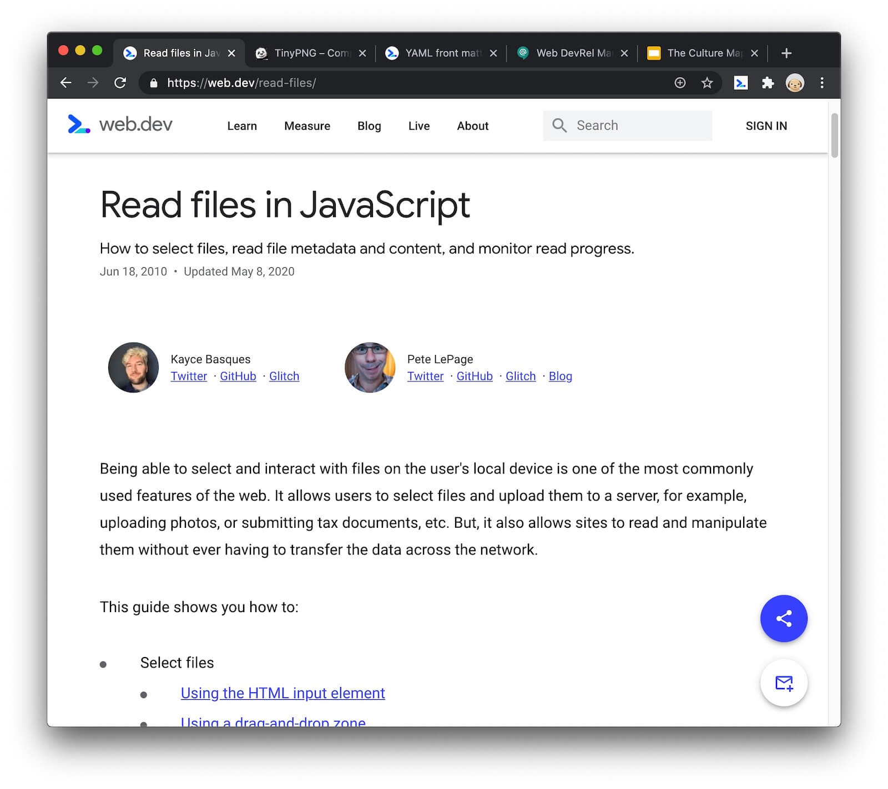
  <figcaption>
    The authors of this page were Kayce and Pete.
  </figcaption>
</figure>

## `codelabs`: promote related codelabs {: #codelabs }

```yaml
---
…
codelabs:
  - codelab-code-splitting
…
```

A list of codelabs that are related to the post. All indicated codelabs
appear in callouts at the end of the post.

<figure class="w-figure">
  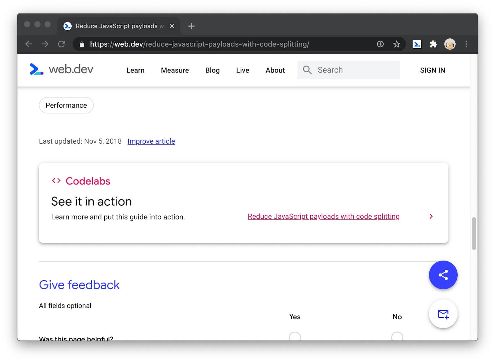
</figure>

## `date`: indicate when the content was originally created {: #date }

```yaml
---
…
date: 2010-06-18
…
---
```

The `date` value should be in `YYYY-MM-DD` format.
This value should never change once the content is published.
Use the [`updated`](#updated) field to indicate content updates.

The `date` value is presented in human-readable format beneath the page title.

<figure class="w-figure">
  
  <figcaption>
    This page was originally published on <code>Jun 18, 2010</code>.
  </figcaption>
</figure>

## `description`: summarize the page for search engines {: #description }

```yaml
---
…
description: How to debug SEO issues on individual pages or across an entire site.
…
---
```

<figure class="w-figure">
  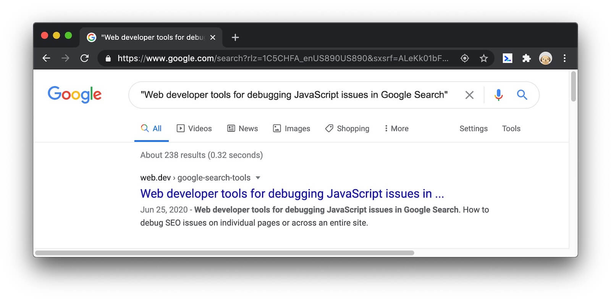
  <figcaption>
    An example of a description showing up in a search engine result page.
  </figcaption>
</figure>

<!-- 160 characters https://moz.com/learn/seo/meta-description -->

## `draft`: mark a page as not ready to publish {: #draft }

```yaml
---
…
draft: true
…
---
```

When a page is in draft mode, it is hidden from homepages (i.e. `web.dev` and `web.dev/blog`)
and the sitemap. However, **the page is still publicly accessible**. I.e. anyone who knows
the link to the page will be able to see it.

<figure class="w-figure">
  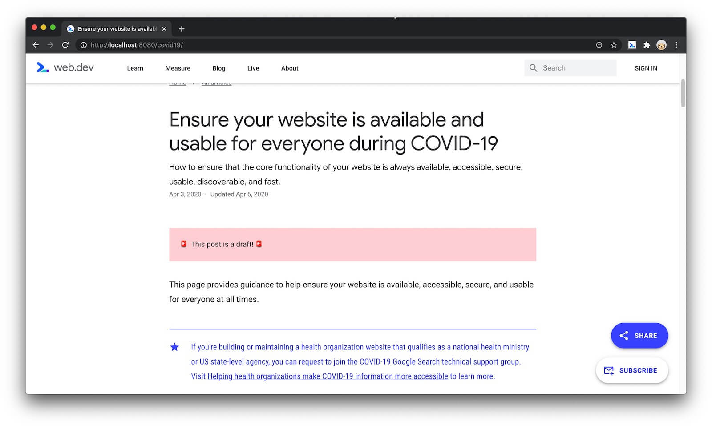
  <figcaption>
    An example of a page in draft mode.
  </figcaption>
</figure>

## `glitch`: indicate which Glitch should be presented next to codelab content {: #glitch }

```yaml
---
…
glitch: gif-to-video
…
---
```

<figure class="w-figure">
  
  <figcaption>
    The <code>gif-to-video</code> Glitch is presented on the right because of the
    <code>glitch: gif-to-video</code> YAML property in the page's front matter.
  </figcaption>
</figure>

## `hero`: present a large image before post content {: #hero }

```yaml
---
…
hero: image/admin/tyBs8QP5pbMVpY3yp1dM.jpg
…
---
```

See [Hero images](/handbook/markup-media/#hero).

<figure class="w-figure">
  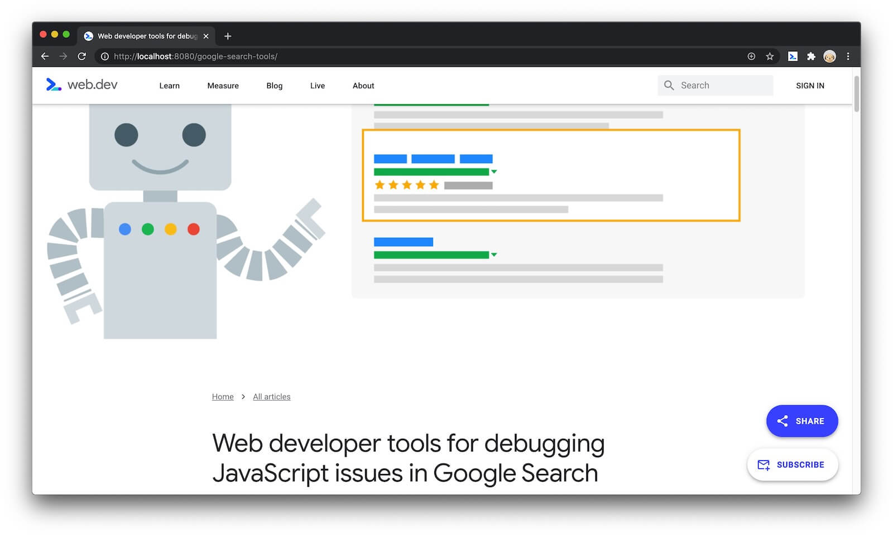
</figure>

## `layout`: change the overall layout of your content {: #layout }

```yaml/11-13
---
…
layout: post|codelab
…
---
```

<figure class="w-figure">
  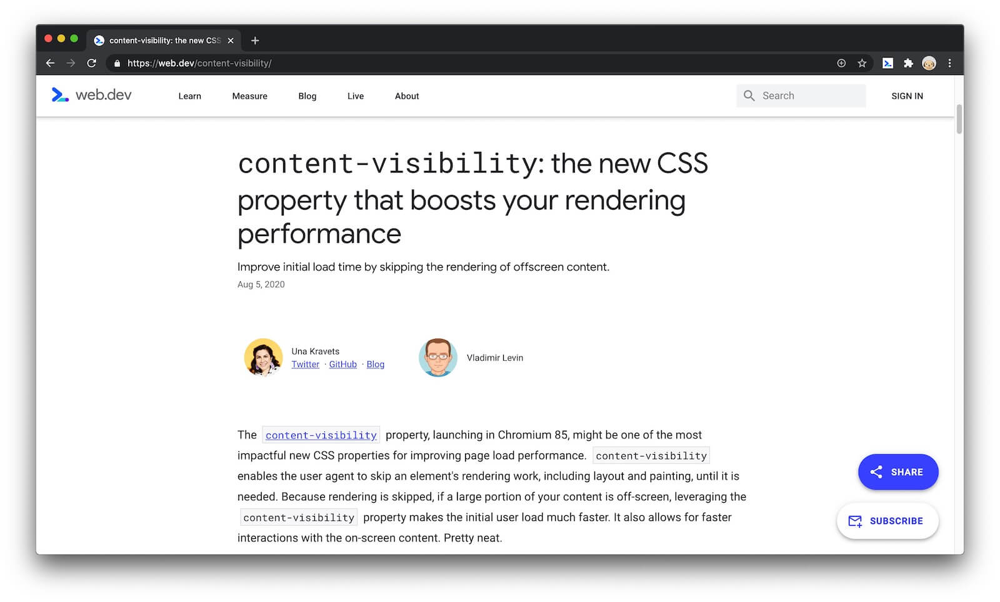
  <figcaption>An example of <code>layout: post</code>.</figcaption>
</figure>

<figure class="w-figure">
  
  <figcaption>An example of <code>layout: codelab</code>.</figcaption>
</figure>

## `related_post`: specify which post is related to a codelab {: #related-post }

```yaml/11-13
---
…
related_post: replace-gifs-with-video
…
---
```

Controls the **Return to article** link at the bottom of codelabs.
See [Replace GIFs with video](/codelab-replace-gifs-with-video/) for an
example.

<figure class="w-figure">
  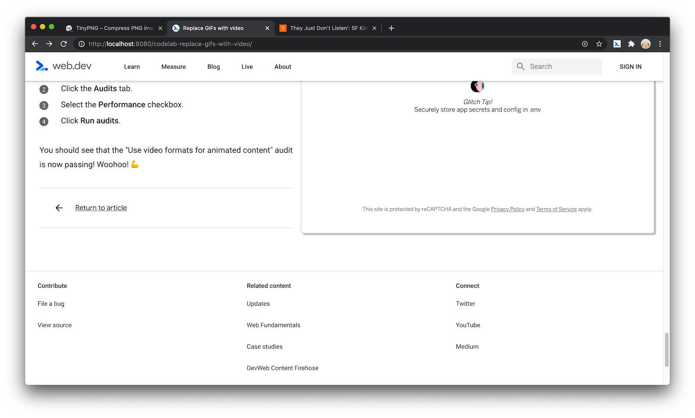
</figure>

## `subhead`: add an enticing subtitle {: #subhead }

```yaml
---
…
subhead: Improve initial load time by skipping the rendering of offscreen content.
…
---
```

Sometimes a title can't fully describe a page's contents. Use the subheading (i.e. subtitle)
to provide readers more information so that they can quickly decide whether your content is
relevant to them.

The subtitle also shows up on `web.dev/blog`.

<figure class="w-figure">
  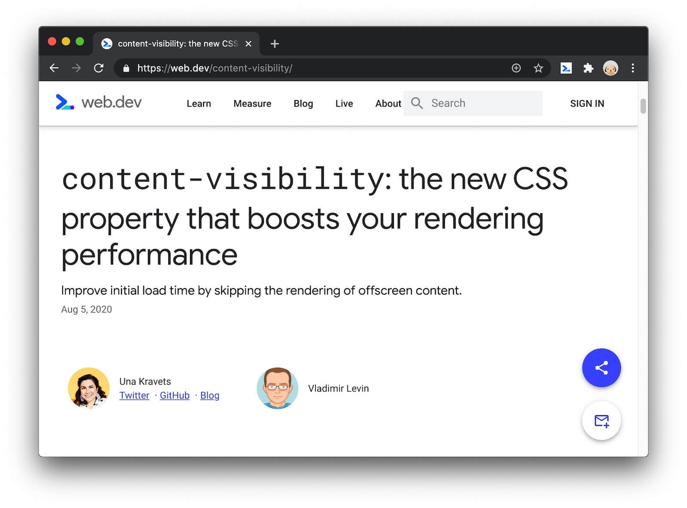
</figure>

<figure class="w-figure">
  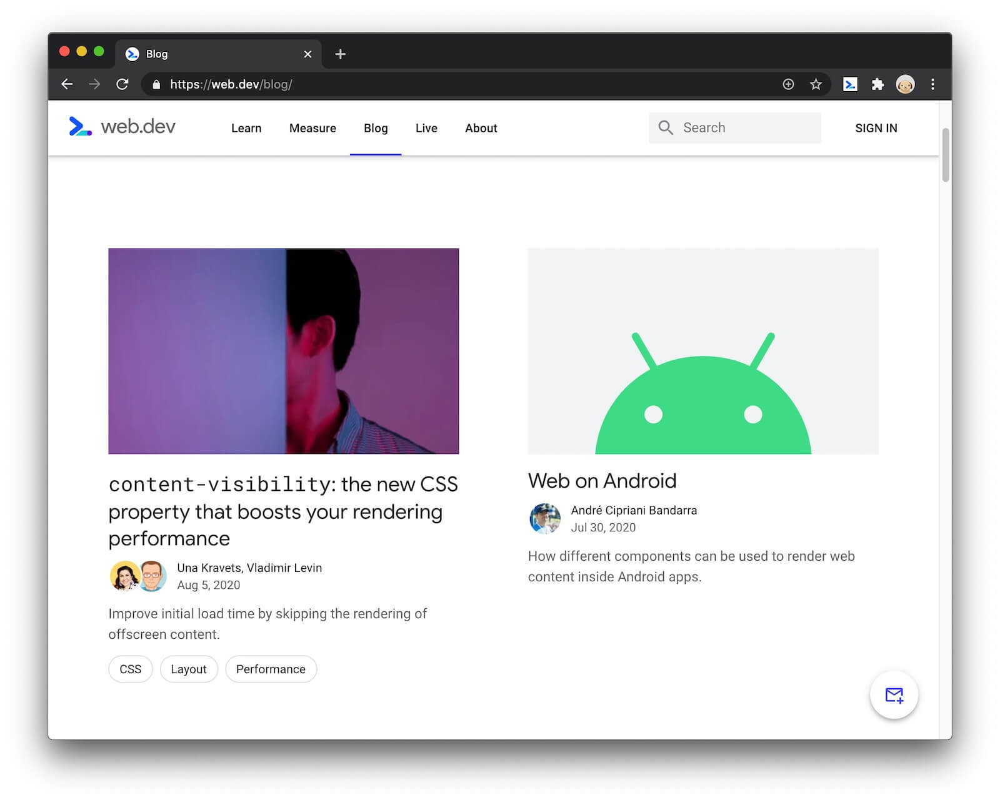
</figure>

## `tags`: increase awareness of related content {: #tags }

```yaml
---
…
tags:
  - performance
  - images
…
---
```

Tags help web.dev users find all of our content related to a topic.
For example, all of our Web Vitals content is available under
the [Web Vitals tags page](/tags/web-vitals/):

<figure class="w-figure">
  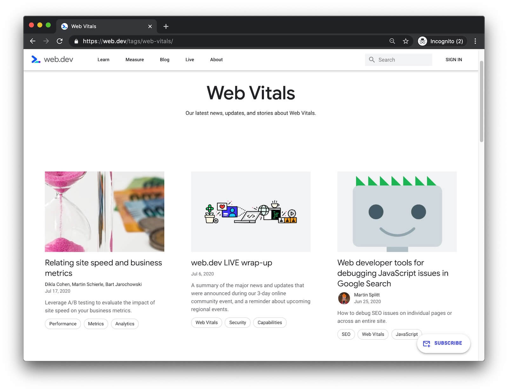
</figure>

Tags show up in a few places across the site.
The first three tags of a page are shown on the [blog homepage](/blog):

<figure class="w-figure">
  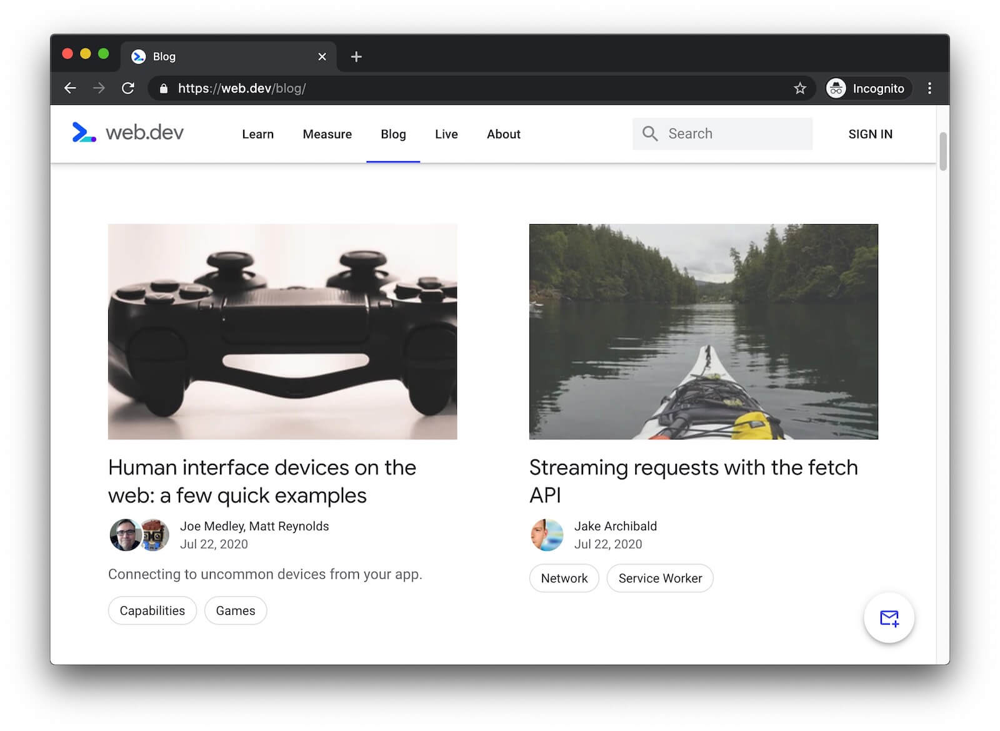
  <figcaption class="w-figcaption">
    The human interface devices page is tagged with <code>Capabilities</code> and
    <code>Games</code>, the streaming requests page is tagged with <code>Network</code>
    and <code>Service Worker</code>, and so on.
  </figcaption>
</figure>

A page's full list of tags is shown at the bottom of its main content:

<figure class="w-figure">
  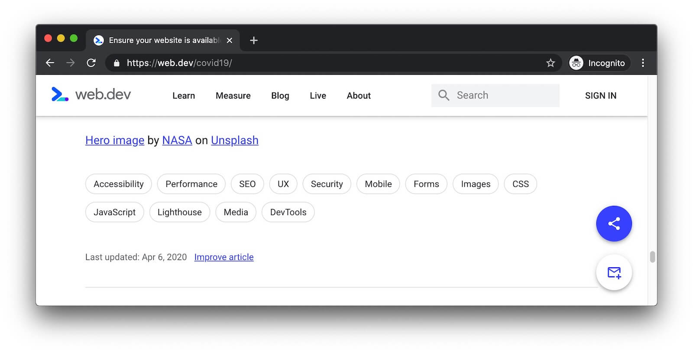
</figure>

### Supported keywords {: #supported-keywords }

Make sure tags added to the page are listed in 
[`tagsData.json`](https://github.com/GoogleChrome/web.dev/blob/master/src/site/_data/tagsData.json).

## `thumbnail`: present a slightly different version of the hero on the homepages {: #thumbnail }

```yaml
---
…
thumbnail: image/admin/mYe7bng2PtwB9ohv8vYa.jpg
…
---
```

A modified version of the hero image that is displayed on the
[homepage](/) or the [blog homepage](/blog). The thumbnail image
must be substantially similar to the hero image. Changing the proportions,
cropping, or rearranging the hero image's content is OK. Using a completely
different image is not OK.

<figure class="w-figure">
  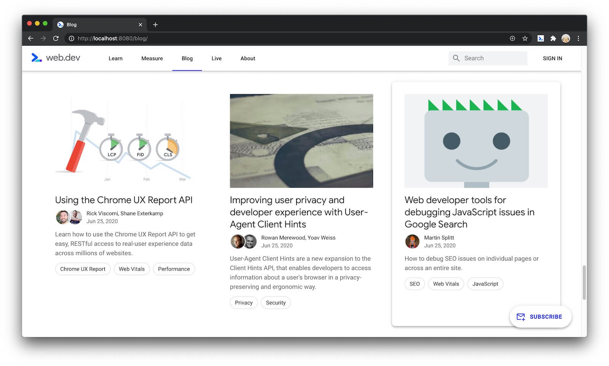
  <figcaption>
    A page with a thumbnail that's different from its hero.
  </figcaption>
</figure>

<figure class="w-figure">
  
</figure>

## `title`: increase SEO with a keyword-rich title {: #title }

```yaml
---
…
title: Web developer tools for debugging JavaScript issues in Google Search
…
---
```

<figure class="w-figure">
  
</figure>

## `translation`: specify how the page was translated {: #translation }

```yaml
---
…
updated: none|machine|manual
…
```

This property should only be set if the post is a translation.

## `updated`: indicate when technical information changed {: #updated }

```yaml
---
…
updated: 2020-05-08
…
```

The date when technical information on the page was last changed. This field should not be
changed for minor updates, like typo fixes.

The `updated` value is presented in human-readable format beneath the page title.

<figure class="w-figure">
  
  <figcaption>
    This page was updated on <code>May 8, 2020</code>.
  </figcaption>
</figure>

## `web_lighthouse`: help web.dev/measure link back to a guide {: #web_lighthouse }

This property is only relevant for Lighthouse guides.

When creating a Lighthouse guide, add the `web_lighthouse` property to help
web.dev/measure link back to your guide. The value of the property should be
the ID of the audit in Lighthouse's source code. For example, the ID for the Lighthouse
audit associated to the [cross-origin links](/external-anchors-use-rel-noopener/) guide
is `external-anchors-use-rel-noopener`, which is the [filename of the audit source code][noopener].

[noopener]: https://github.com/GoogleChrome/lighthouse/blob/master/lighthouse-core/audits/dobetterweb/external-anchors-use-rel-noopener.js
