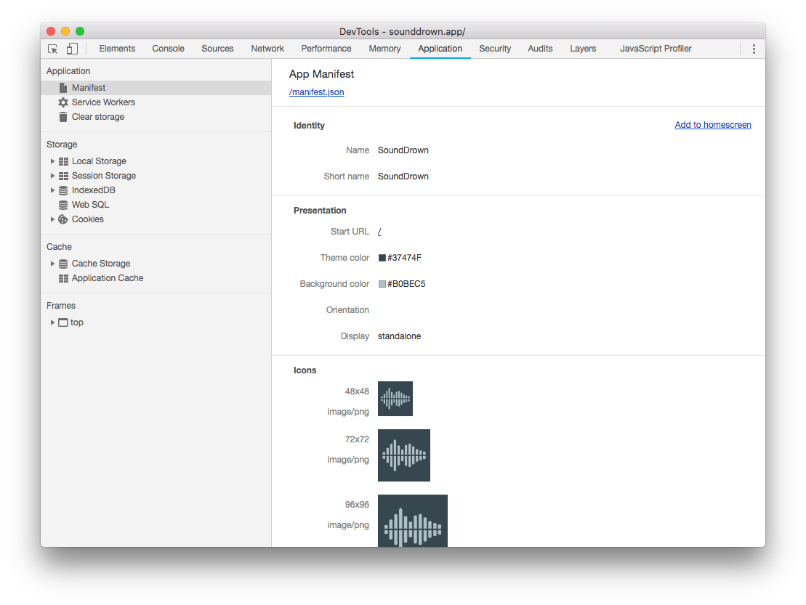

The web app manifest is a simple JSON file that tells the browser about your web
application and how it should behave when 'installed' on the user's mobile
device or desktop. A typical manifest file includes information about the app
name, icons it should use, and the URL that should be opened when the app is
launched.

Manifest files are supported in Chrome, Edge, Firefox, UC Browser, Opera and the
Samsung browser, and Safari is currently working on adding support.

## Create the manifest.json file

The manifest file can have any name, but is commonly named `manifest.json` and
served from the root (your website's top level directory).  

```json
{
  "short_name": "Weather",
  "name": "Weather - Do I need an umbrella?",
  "description": "Weather forecast information",
  "icons": [
    {
      "src": "/images/icons-192.png",
      "type": "image/png",
      "sizes": "192x192"
    },
    {
      "src": "/images/icons-512.png",
      "type": "image/png",
      "sizes": "512x512"
    }
  ],
  "start_url": "/?source=pwa",
  "background_color": "#3367D6",
  "display": "standalone",
  "scope": "/",
  "theme_color": "#3367D6"
}
```

<div class="w-table-wrapper">
  <table>
    <thead>
      <tr>
        <th><strong>Property</strong></th>
        <th><strong>Use</strong></th>
      </tr>
    </thead>
    <tbody>
      <tr>
        <td>
        <code><strong>short_name</strong></code> (required)
        </td>
        <td>
          Short human-readable name for the application. This is intended for when
          there is insufficient space to display the full name of the web
          application, like device homescreens.
        </td>
      </tr>
      <tr>
        <td><code><strong>name</strong></code> (required)</td>
        <td>Human-readable name for the site when displayed to the user.</td>
      </tr>
      <tr>
        <td><code><strong>description</strong></code> (recommended)</td>
        <td>General description of what the PWA does.</td>
      </tr>
      <tr>
        <td><code><strong>icons</strong></code> (required)</td>
        <td>
          An array of image files that can serve as application icons. Chrome
          requires a 192x192px and a 512x512px icon. Additional sizes are
          optional, and recommended for those who want to ensure pixel perfect
          icons.
        </td>
      </tr>
      <tr>
        <td><code><strong>start_url</strong></code> (required)</td>
        <td>
          The URL that loads when a user launches the application. This has to be
          a relative URL, relative to the manifest url.
        </td>
      </tr>
      <tr>
        <td><code><strong>background_color</strong></code> (recommended)</td>
        <td>
          The background color used on the auto-generated splash screen when the
          PWA is launched.
        </td>
      </tr>
      <tr>
        <td><code><strong>display</strong></code> (required)</td>
        <td>The developers' preferred display mode for the PWA.</td>
      </tr>
      <tr>
        <td><code><strong>scope</strong></code> (recommended)</td>
        <td>
          The navigation scope of this website's context. This restricts what web
          pages can be viewed while the manifest is applied. If the user navigates
          outside the scope, it returns to a normal web page inside a browser
          tab/window.
        </td>
      </tr>
      <tr>
        <td><code><strong>theme_color</strong></code> (recommended)</td>
        <td>
          The default theme color for an application. This affects how the OS
          displays the site. <br>
          <ul>
            <li>
              On Android's task switcher, the theme color surrounds the site.
            </li>
            <li>On desktop, the theme color is used to style the title bar.</li>
          </ul>
        </td>
      </tr>
    </tbody>
  </table>
</div>


## Add the web app manifest to your pages

When you have created the manifest, add a `<link>` tag to all the pages of your
Progressive Web App.

For example:

```html
<link rel="manifest" href="/manifest.json">
```

## Test your manifest

To verify your manifest is setup correctly, use the **Manifest** tab on the 
**Application** panel of Chrome DevTools.

<figure class="w-figure">
  
</figure>

This tab provides a human-readable version of many of your manifest's
properties, and makes it easy to verify that all of the images are loading
properly.

### Try it

1. Open a new tab to
    [manifest-good.glitch.me](https://manifest-good.glitch.me/).
1. Open Chrome DevTools and switch to the Application panel, then the
   Manifest tab

## Further reading

There are several additional properties that can be added to the web app
manifest, refer to the [MDN Web App Manifest
documentation](https://developer.mozilla.org/en-US/docs/Web/Manifest) for full
details.
