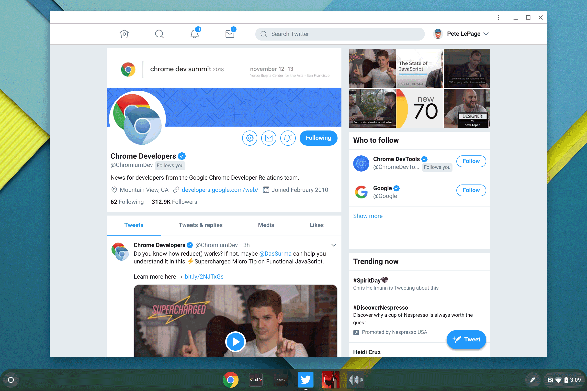
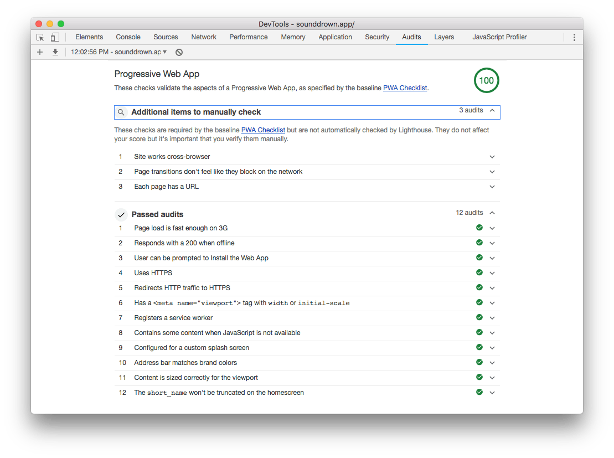

A Progressive Web App can run in a browser tab or it can be installed on the
users device and run like other installed apps. Once installed, it's launched
from the Start menu or app launcher, and run in an app window, without an
address bar or tabs. App windows make it really easy to switch between apps
using an app switcher or a keyboard shortcut such as `ALT` + `TAB`.

## The criteria

Each browser has slightly different criteria in order to consider a Progressive
Web App installable. In general, the technical criteria are:

+  A user engagement check
+  A web app manifest
+  A service worker

### It meets a user engagement heuristic

Users hate being prompted on page load, especially if they don't understand what
they're being asked. For example: when sites ask permission to use your location
or send you notifications on page load, how often do you click allow?

Before a user is prompted to install a Progressive Web App, there needs to be
some kind of interaction with the page. In Chrome, that means the user must have
interacted with the domain for at least 30 seconds.

### It has a web app manifest

The [web app manifest](https://developer.mozilla.org/en-US/docs/Web/Manifest) is
a simple JSON file that tells the browser about your web application and how it
should behave when 'installed' on the user's mobile device or desktop.

Chrome requires that the web app manifest includes:

+  The name of the app (`short_name` or `name`)
+  A set of icons (`icons`)
+  The URL that should be opened when the app is started (`start_url`)
+  The window style used to open the app (`display`)


The `display` property must be one of: `fullscreen`, `standalone`, or
`minimal-ui`.


### It has a service worker & is served over HTTPS

Users expect installed apps to work reliably, and load at the same speed every
time, regardless of network conditions. Imagine if your favorite game took
forever to load because you were on a slow network connection, it wouldn't be
your favorite game for very long.

In order to ensure reliable performance, installable Progressive Web Apps must
include a service worker with a fetch handler. A page must be served over HTTPS
to register a service worker. Learn more in Introduction to service workers and
the Cache Storage API.

## Using Lighthouse to test to see if it's installable

Lighthouse is the easiest way to test to see if your Progressive Web App meets
Chrome's installability criteria.

Run Lighthouse by opening the PWA you want to test in Chrome. Next, open
DevTools and switch to the Audits panel. Check to ensure the **Progressive Web
App** audit is checked, then run the audit.

<figure class="w-figure">
  
</figure>

In the results panel, scroll down to the Progressive Web App section, and review
the audits. The key audits to check are:

+  User can be prompted to Install the Web App
+  Uses HTTPS
+  Responds with a 200 when offline


[Make a site installable using the beforeinstallprompt event](/codelab-make-installable).


## Further reading

To learn what other browsers require for a PWA to be considered installable,
check out the [Add to
Homescreen](https://developers.google.com/web/fundamentals/app-install-banners/)
section on WebFundamentals.
