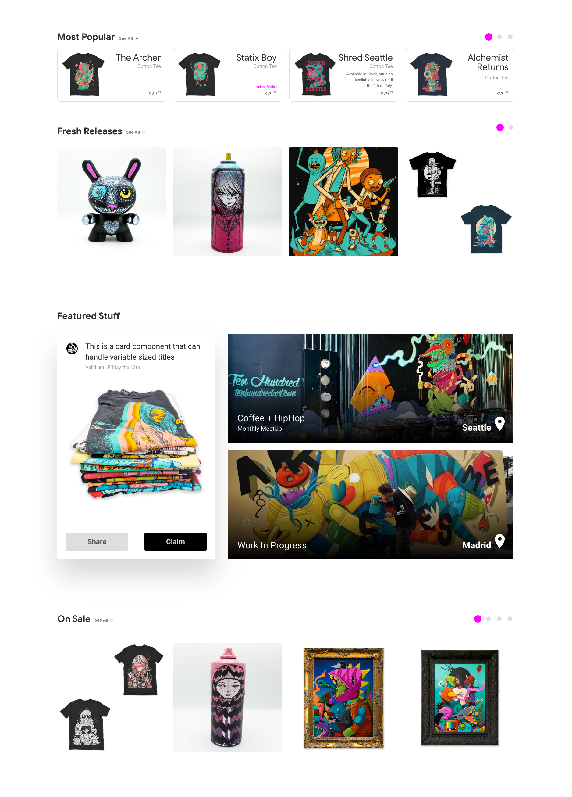
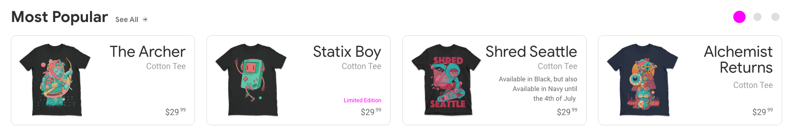

# Grouped ListView Layout

<figure style="text-align:center; margin: 4rem 0;">
  
</figure>

I call this a grouped listview because **it's a list of lists**. The first list is a vertical list, then each item in that list has a horizontal list! **2-dimensional array UI!**


<div style="text-align:center; font-size: 6rem; margin: 10rem 0;">
  🤯
</div>

Here's a **less noisy visual** of a list of lists:

<figure style="text-align:center; margin: 2rem 0;">
  
</figure>

**in JavaScript**
```js
const multidimensional = [
  [1,2,3,4],
  [1,2],
  [1],
  [1,2,3,4,5],
  [1,2,3],
]
```

<div class="note">a list of lists, a collection of collections!</div>

<br><br><br>


##### We got this!
# The Vertical List

<figure style="text-align:center; margin: 4rem 0;">
  
</figure>

What are we lookin at **in terms of layout**?
- Rows with **variable height**
- Big **healthy gaps**
- We **didn't** put the section **title in a separate row**
- Let's use `<section>` elements for these list items

<br><br>

**HTML**
```html
<article>
  <section>...</section>
  <section>...</section>
  <section>...</section>
  <section>...</section>
</article>
```

<div class="note">
  <b>Note:</b> This grouped listview is inside of an <code>article</code> tag, it's semantically nice to have <code>main > article > section(s)</code> in our HTML
</div>

<br><br>

**CSS**
```css
article {
  display: grid;
  gap: 5rem;
}
```

<div class="note">
  <b>Plain Speak:</b> We're <b>leaning into grid defaults and it's intrinsic layout behavior</b> here and just specifying the gaps.
</div>

<br><br>

**Glitch**
<div class="glitch-embed-wrap" style="height: 346px; width: 100%;">
  <iframe
    src="https://glitch.com/embed/#!/embed/logical-tab-order?path=index.html&previewSize=100&attributionHidden=true"
    alt="logical-tab-order on Glitch"
    style="height: 100%; width: 100%; border: 0;">
  </iframe>
</div>

<br><br><br><br>


##### Let's move on to
# The Horizontal List(s)

<figure style="text-align:center; margin: 4rem 0;">
  
</figure>

<br>

What are we lookin at **in terms of layout**?
1. **3 new grids** to make (fresh releases and on sale lists are the same)
1. 2/3 go off screen and **overflow scroll** (featured shouldn't scroll)
1. Column widths look **explicit**
1. **No wrapping**

<br><br>


## 1) "Most Popular" Layout

<figure style="text-align:center; margin: 4rem 0;">
  
</figure>

This grid is pretty forceful. I mean that like it's **not intrinsic**, it's **very explicit** about how things need to fit. **BUT**, it's **not forceful about the height**, which is critical.

<br>

**HTML**
```html
<chips>
  <figure>...</figure>
  <figure>...</figure>
  <figure>...</figure>
  ...
</chips>
```

<br>

**CSS**
```css
chips {
  display: grid;
  grid-auto-columns: 20rem;
  grid-auto-flow: column;
  gap: 1rem;
}
```

<div class="note">
  <b>Plain Speak:</b> Always a horizontal list of 20rem equal width columns
</div>

<figure style="text-align:center; margin: 4rem 0;">
  
</figure>

**Glitch**
<div class="glitch-embed-wrap" style="height: 346px; width: 100%;">
  <iframe
    src="https://glitch.com/embed/#!/embed/logical-tab-order?path=index.html&previewSize=100&attributionHidden=true"
    alt="logical-tab-order on Glitch"
    style="height: 100%; width: 100%; border: 0;">
  </iframe>
</div>

<br>

> Grid, you're so succinct and beautiful so often. (pardon while I oogle)...

<br>

#### This grid describes:
1. `auto-columns`: will **repeat** the template you supply **forever**, so here we create `20rem` wide columns forever **as long as there's a child** to inhabit the column. So it's not forever… but kinda!
1. `auto-flow` here is saying "specifically be a grid of columns"
1. **Critical:** we didn't specify row height

<br>

And that get's us a **long list of equally spaced columns** that will layout in a single row until the last element.

<figure style="text-align:center; margin: 4rem 0;">
  
</figure>

<div class="note">
  If you're curious how I handle the overflow so it scrolled properly, checkout that glitch, it's got the goods. You'll also hopefully be pleasantly surprised to see <b>scroll snapping</b> in there, I'm a big fan.
</div>

<br><br>

### Responsive Final Touches

**None!** Big screen or little screen, this layout doesn't change 😎


<br><br><br><br>

##### Next up
## 2) "Fresh Releases" & "On Sale" Layouts

<figure style="text-align:center; margin: 4rem 0;">
  
</figure>

While **looking at this layout**
1. I see **squares** (our content isn't square)
1. **equal spacing**
1. **a nested grid** (the 2 shirts in 2 adjascent corners of a 4 up split)
1. **explicit grid**, we're not letting our content tell us their shape, we're telling the content what shape to be

<br>

**HTML**
```html
<hero-products-list>
  
  
  
  <figure>...</figure>
  
  ...
</hero-products-list>
```

<br>

**CSS**
```css
hero-products-list {
  display: grid;
  gap: 1rem;
  grid-auto-flow: column;
  grid-auto-columns: 20rem;
  grid-template-rows: 20rem;
}
```

<div class="note">
  <b>Plain Speak:</b> A grid that's <b>always a horizontal list of 20rem x 20rem squares</b>
</div>

<br>

**Glitch**
<div class="glitch-embed-wrap" style="height: 346px; width: 100%;">
  <iframe
    src="https://glitch.com/embed/#!/embed/logical-tab-order?path=index.html&previewSize=100&attributionHidden=true"
    alt="logical-tab-order on Glitch"
    style="height: 100%; width: 100%; border: 0;">
  </iframe>
</div>

<figure style="text-align:center; margin: 4rem 0;">
  
  <figcaption>The Fresh Releases grid as viewed from the devtools</figcaption>
</figure>

<br><br>

### Responsive Final Touches

**None!** Big screen or little screen, this layout doesn't change 😎


<br><br><br><br>


##### Next Up
## 3) "Featured Stuff" Layout

<figure style="text-align:center; margin: 4rem 0;">
  
</figure>

**What I see:**
1. Cards with **dynamic content**
1. **Equal heights**
1. A card that needs to **flex vertically** and **still layout**
1. **Layering**: overlayed text & svg on top of an image
1. **1/3** relationship

<br><br>

**HTML**
```html
<hero-featured>
  <deal-card>...</deal-card>
  <figure class="mural-card">...</figure>
  <figure class="mural-card">...</figure>
</hero-featured>
```

<br>

**CSS**
```css
hero-featured {
  display: grid;
  gap: 1rem;
  grid-template-columns: 1fr 2fr;
  grid-template-rows: 1fr 1fr;
  grid-template-areas:
    "card mural1"
    "card mural2";

  & > .mural-card:first-of-type { grid-area: mural1; }
  & > .mural-card:last-of-type  { grid-area: mural2; }
}
```

<div class="note">
  <b>Plain Speak:</b> 2 columns where the 2nd is twice as large as the first, with equal height rows. This is a special grid with named slots, and there's 2 nodes in that grid that need to always be in these specific areas.
</div>

<br>

**Glitch**
<div class="glitch-embed-wrap" style="height: 346px; width: 100%;">
  <iframe
    src="https://glitch.com/embed/#!/embed/logical-tab-order?path=index.html&previewSize=100&attributionHidden=true"
    alt="logical-tab-order on Glitch"
    style="height: 100%; width: 100%; border: 0;">
  </iframe>
</div>

<br><br>

##### It's time for a..
# Chaos Test!
This is where we get to act like content demons. We'll be simulating missing content, really long content, etc. The type of stuff that comes from a CMS or app where user's get to generate content. It's very important that our layouts are able to handle content variance or we'll end up with bugs.

<figure style="text-align:center; margin: 4rem 0;">
  
  <figcaption><a href="https://github.com/GoogleChromeLabs/ProjectVisBug" target="_blank">VisBug<a> is used to edit the text, visualize the spacing, delete stuff, etc in the above gif</figcaption>
</figure>

The layout here is pretty rock solid. The constraint **relationship between the mural cards and the deal card** is performing **great**!

I think this layout is interesting too from an **intrinsic** point of view. It's created spaces for elements, but hasnt told the elements how tall to be. This **lets the content be variable** and **not break the constraints between space**. Things can grow or shrink and our layout goes on.

<br><br>

### Responsive Final Touches

We're looking to take this grid and convert it to a single column stack on mobile / portrait tablet. Content got too squishy and nothing felt featured anymore. We kinda need to **write a whole new grid** for this, there's not really much we get for free except that the 3 feature items will still stick to their named grid areas.

<br>


```css
hero-featured {
  ...

  @media (width < 768px) {
    grid-template-columns: 1fr;
    grid-template-rows: auto;
    grid-template-areas:
      'card'
      'mural1'
      'mural2';

    padding-right: 1rem;
  }
}
```

<figure style="text-align:center; margin: 4rem 0;">
  
</figure>

**Final Glitch**
<div class="glitch-embed-wrap" style="height: 346px; width: 100%;">
  <iframe
    src="https://glitch.com/embed/#!/embed/logical-tab-order?path=index.html&previewSize=100&attributionHidden=true"
    alt="logical-tab-order on Glitch"
    style="height: 100%; width: 100%; border: 0;">
  </iframe>
</div>

<br>

There's the final glitch for our grouped listview, have fun and **check things out**.

<br><br><br><br>

# Conclusion

We just built **3 new grid layouts for 4 lists**! 1 of the lists was **multi-dimensional**, and we crushed it.

Our layout for the first list was intrinsic, and just described spacing and flow. While our inner lists were extrinsic as to create uniform content areas for our eyes to track across easily.

The list of chips and the featured stuff layouts made sure to **not specify any height values**. By leaving height up to grid, we're going to have an **easier time handling the chaos of the variable content** that will be inside those layouts.

The next guide goes through building a chip and ensuring it survives chaos.
