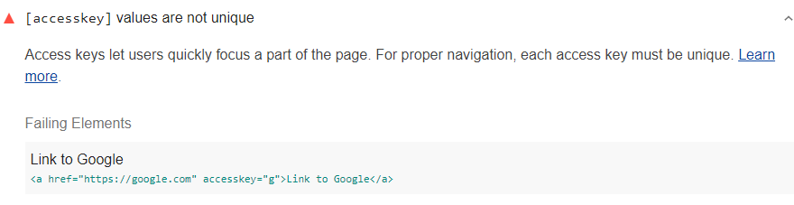

Access keys let users quickly focus a part of the page.
For proper navigation, each access key must be unique.
Lighthouse reports any duplicate access keys found in a page:

<figure class="w-figure">
  
  <figcaption class="w-figcaption">
    Access keys are not unique.
  </figcaption>
</figure>

## How to fix this problem

To fix this problem,
first identify duplicate `accesskey` values
using the Lighthouse report,
as shown in image above.
Then change the value of the duplicate
access keys so that each access key is unique.

For each defined `accesskey`,
ensure the value is unique and does not conflict with any default browser and screen reader shortcut keys.
Access keys allow users to quickly active or move the focus to a specific element
by pressing the specified key (usually in combination with the `<kbd>alt></kbd>` key).

Duplicating `accesskey` values creates unexpected effects
for users navigating with keys.
Learn more in
[accesskey attribute value must be unique](https://dequeuniversity.com/rules/axe/3.3/accesskeys).

<!--
## How this audit impacts overall Lighthouse score

Todo. I have no idea how accessibility scoring is working!
-->
## More information

- [Access key values are unique audit source](https://github.com/GoogleChrome/lighthouse/blob/master/lighthouse-core/audits/accessibility/accesskeys.js)
- [axe-core rule descriptions](https://github.com/dequelabs/axe-core/blob/develop/doc/rule-descriptions.md)
