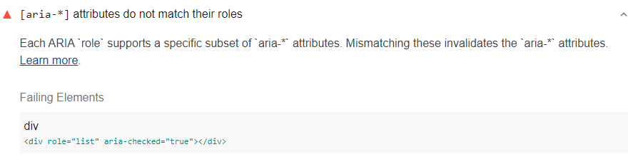

[ARIA](https://www.w3.org/TR/wai-aria-1.1/#role_definitions)
roles and attributes help screen readers
provide missing information about an element.
For these roles and attributes to make sense,
each ARIA `role` supports a specific subset of `aria-*` attributes
(see [ARIA roles definitions](https://www.w3.org/TR/wai-aria-1.1/#role_definitions)).
Lighthouse reports any mismatches between roles and `aria-*` attributes:

<figure class="w-figure">
  
  <figcaption class="w-figcaption">
    ARIA attributes do not match their roles.
  </figcaption>
</figure>



## How Lighthouse finds ARIA mismatches

Lighthouse uses the
[WAI ARIA specification: Definition of Roles](https://www.w3.org/TR/wai-aria-1.1/#role_definitions)
to check for mismatches between ARIA roles and attributes.
Each role has a subset of "supported states and properties" and
"inherited states and properties".
Any element with that role
can only use the attributes in the role's definition.

Lighthouse fails this audit
when it finds an attribute that isn't allowed for a role on an element.
In the example Lighthouse audit above,
the `aria-checked` attribute is not allowed on the `role=list`,
so the audit fails.
This makes sense—as list elements wouldn't have a state of checked,
so applying a checked state would be confusing to screen reader users.

## How this audit impacts overall Lighthouse score

Lighthouse flags this as a low severity issue.
It is important to fix,
and probably indicates a mistaken assumption in your code,
but a disallowed attribute won't break the element's role.
In the example above, the element is still announced as a list and
the `aria-checked` attribute would be ignored.

## How to avoid ARIA mismatches

To avoid ARIA mismatches,
refer to the [WAI ARIA Definition of roles](https://www.w3.org/TR/wai-aria-1.1/#role_definitions).
ARIA explicitly defines which attributes are allowed for any given role and for every attribute.
Link to the role from the specification,
and check the attributes allowed.
So long as an attribute is listed for that role,
you can use it.

For more information on this audit,
see [Elements must only use allowed ARIA attributes](https://dequeuniversity.com/rules/axe/3.1/aria-allowed-attr?application=lighthouse).

## More information

- [ARIA attributes match their roles audit source](https://github.com/GoogleChrome/lighthouse/blob/master/lighthouse-core/audits/accessibility/aria-allowed-attr.js)
- [axe-core rule descriptions](https://github.com/dequelabs/axe-core/blob/develop/doc/rule-descriptions.md)
