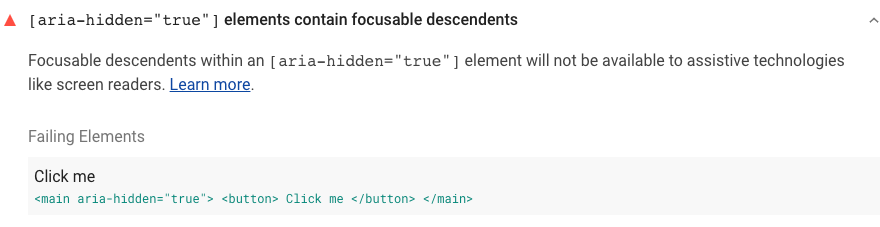



Using the `aria-hidden="true"` attribute on an element hides the element
and all its children from screen readers and other assistive technologies.
If the hidden element contains a **focusable** element,
screen readers won't read the focusable element,
but keyboard users will still be able to navigate to it,
which can cause confusion.

## How Lighthouse identifies partially hidden focusable elements

[Lighthouse](https://developers.google.com/web/tools/lighthouse)
flags focusable elements that have parents with the `aria-hidden="true"` attribute:

<figure class="w-figure">
  
</figure>

An element is _focusable_ when keyboard users can navigate to it
using the `Tab` key.
Focusability differs somewhat across browsers, but in general,
the following elements are focusable:
- `<a>`
- `<area>`
- `<audio controls>`
- `<button>`
- `<iframe>`
- `<input>`
- `<select>`
- `
`
- `<textarea>`
- `<video controls>`
- Any element with the `contentEditable` attribute
- Any element with a `tabindex` set to a numeric value other than `-1`

For a complete breakdown of cross-browser focus behavior, see ally.js's
<a href="https://allyjs.io/data-tables/focusable.html" rel="noopener">Focusable Elements - Browser Compatibility Table</a>.



## How to fix partially hidden focusable elements

If you're hiding a container element on your page using `aria-hidden`,
you also need to prevent users from navigating to any focusable elements
inside that container.

One way to do that is to use JavaScript to apply a `tabindex="-1"` attribute
to all focusable elements in the container.
However, as implied by the list above,
a query that captures all focusable elements can get complicated quickly.

If you're hiding the container element from sighted users,
consider using one of the following strategies instead:
- Add a `hidden` attribute to the container element.
- Apply the `display: none` or the `visibility: hidden` CSS property
  to the container element.

If you can't visually hide the container element—for example,
if it's behind a modal dialog with a translucent background—consider
using <a href="https://github.com/WICG/inert" rel="noopener">the WICG's <code>inert</code> polyfill</a>.
The polyfill emulates the behavior of a proposed `inert` attribute,
which prevents elements from being read or selected.


The `inert` polyfill is experimental and may not work as expected in all cases.
Test carefully before using in production.


## Resources

- <a href="https://github.com/GoogleChrome/lighthouse/blob/master/lighthouse-core/audits/accessibility/aria-hidden-focus.js" rel="noopener">Source code for <strong><code>[aria-hidden="true"]</code> elements contain focusable descendants</strong> audit</a>
- <a href="https://github.com/WICG/inert" rel="noopener">WICG <code>inert</code> polyfill</a>
