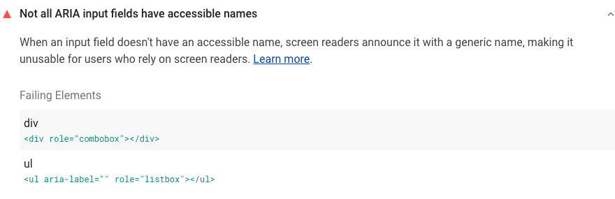





## How Lighthouse identifies ARIA inputs without accessible names

<a href="https://developers.google.com/web/tools/lighthouse" rel="noopener">Lighthouse</a>
flags custom ARIA input fields whose names
aren't accessible to assistive technologies:

<figure class="w-figure">
  
</figure>

Elements that have any of the following ARIA roles
but don't have accessible names will cause this audit to fail:
- <a href="https://www.w3.org/TR/wai-aria-practices-1.1/#combobox" rel="noopener">combobox</a>
- <a href="https://www.w3.org/TR/wai-aria-practices-1.1/#Listbox" rel="noopener">listbox</a>
- <a href="https://www.w3.org/TR/wai-aria-1.1/#searchbox" rel="noopener">searchbox</a>
- <a href="https://www.w3.org/TR/wai-aria-practices-1.1/#slider" rel="noopener">slider</a>
- <a href="https://www.w3.org/TR/wai-aria-practices-1.1/#spinbutton" rel="noopener">spinbutton</a>
- <a href="https://www.w3.org/TR/wai-aria-1.1/#textbox" rel="noopener">textbox</a>

This audit is similar to the
[**Not all ARIA toggle fields have accessible names** audit](/aria-toggle-field-name)
but checks a different set of ARIA roles.





## How to add accessible names to your custom ARIA input fields

The easiest way to provide an accessible name for most elements
is to include text content in the element.
However, custom input fields typically don't have inner text,
so you can use one of two strategies instead.

### Option 1: Add an `aria-label` attribute to the element

Use the `aria-label` attribute to define the name for the current element.

For example, this custom combobox will be announced as "country"
to assistive technology users:

```html
<div id="combo1" aria-label="country" role="combobox">England</div>
```

### Option 2: Refer to another element using `aria-labelledby`

Use the `aria-labelledby` attribute to identify another element, using its ID,
to serve as the name for the current element.

For example, this custom searchbox refers to the `searchLabel` paragraph
as its label and will be announced as "Search currency pairs":

```html
<p id="searchLabel">Search currency pairs:</p>
<div id="search"
    role="searchbox"
    contenteditable="true"
    aria-labelledby="searchLabel"></div>
```

## Resources

- <a href="https://github.com/GoogleChrome/lighthouse/blob/master/lighthouse-core/audits/accessibility/aria-input-field-name.js" rel="noopener">Source code for **Not all ARIA input fields have accessible names** audit</a>
- <a href="https://dequeuniversity.com/rules/axe/3.3/aria-input-field-name" rel="noopener">ARIA input fields have an accessible name (Deque University)</a>
- [Labels and text alternatives](/labels-and-text-alternatives)
- [Use semantic HTML for easy keyboard wins](/use-semantic-html)
